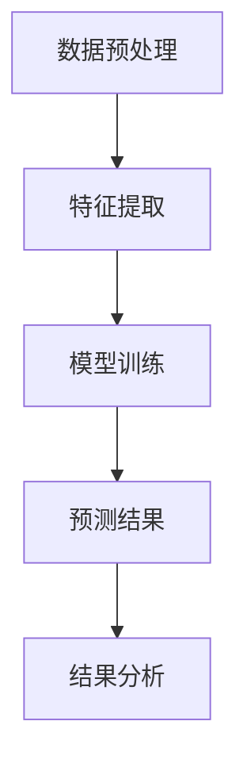
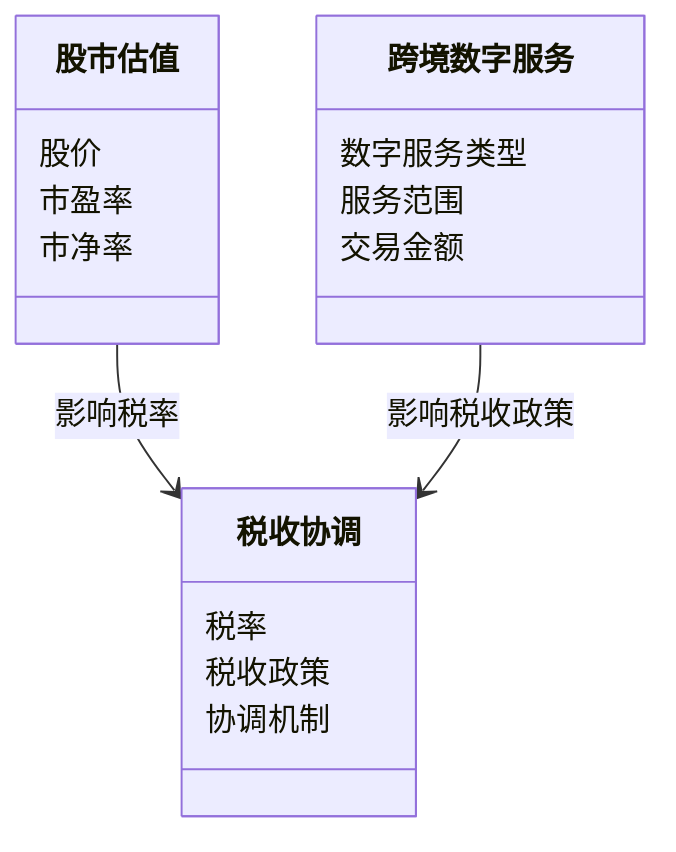

                 


# 股市估值对跨境数字服务税收协调的影响

> 关键词：股市估值，跨境数字服务，税收协调，数字经济，税收模型，ER图

> 摘要：本文系统分析了股市估值对跨境数字服务税收协调的影响，从核心概念、算法原理、系统架构到项目实战，深入探讨了数字经济背景下税收协调的数学模型与实际应用。文章结合技术与经济的双重视角，提出了一种基于股市估值的跨境数字服务税收协调优化方案，为相关领域的研究和实践提供了理论依据和方法论支持。

---

# 第一部分: 背景介绍与核心概念

# 第1章: 股市估值与跨境数字服务税收协调的背景

## 1.1 问题背景与描述
### 1.1.1 股市估值的基本概念
股市估值是通过对企业的财务数据、市场环境和行业趋势进行分析，评估企业股票的合理价格范围。常用的方法包括市盈率（P/E）、市净率（P/B）等指标。

### 1.1.2 跨境数字服务的定义与特点
跨境数字服务是指通过互联网提供跨越国界的数字产品或服务，例如在线教育、数字支付、云服务等。其特点包括无形性、可分割性、实时性和跨国性。

### 1.1.3 税收协调的重要性
跨境数字服务的税收协调是指通过各国税收政策的协调，避免双重征税或漏税，促进数字经济的健康发展。税收协调的核心在于平衡各方利益，减少税收壁垒对数字贸易的影响。

## 1.2 问题解决与边界
### 1.2.1 股市估值对税收协调的影响路径
股市估值通过影响企业的市场价值和投资者预期，间接影响跨境数字服务的税收政策和实施效果。

### 1.2.2 跨境数字服务的税收协调问题的边界
跨境数字服务的税收协调涉及跨国企业、消费者、各国税务机关等多个主体，其边界包括税收政策的制定、执行和监管。

### 1.2.3 核心概念的结构与组成
核心概念包括股市估值、跨境数字服务、税收协调三个模块，它们通过数据流和业务逻辑相互关联。

## 1.3 本章小结
本章通过背景介绍和核心概念的分析，为后续的算法设计和系统实现奠定了基础。

---

# 第二部分: 核心概念与联系

# 第2章: 股市估值与跨境数字服务税收协调的核心概念

## 2.1 核心概念的原理
### 2.1.1 股市估值的原理
股市估值基于企业的财务表现和市场预期，通过数学模型计算股票的理论价值。

### 2.1.2 跨境数字服务的税收协调机制
税收协调机制包括税收政策的制定、执行和监管，旨在消除跨境数字服务的税收壁垒。

## 2.2 核心概念的属性对比
| 属性 | 股市估值 | 跨境数字服务 | 税收协调 |
|------|----------|---------------|----------|
| 主体 | 投资者    | 企业与政府   | 政府机构 |
| 目标 | 确定股票价值 | 促进数字贸易 | 减少税收壁垒 |
| 方法 | 市盈率、市净率 | 数字税、增值税 | 协调政策、统一标准 |

## 2.3 ER实体关系图
```mermaid
er
  entity 股市估值 {
    <属性> 股价
    <属性> 市盈率
    <属性> 市净率
  }
  entity 跨境数字服务 {
    <属性> 数字服务类型
    <属性> 服务范围
    <属性> 交易金额
  }
  entity 税收协调 {
    <属性> 税率
    <属性> 税收政策
    <属性> 协调机制
  }
  股市估值 -- 税收协调: 估值影响税收
  跨境数字服务 -- 税收协调: 服务影响税收
```

## 2.4 本章小结
本章通过核心概念的对比和ER图分析，明确了股市估值与跨境数字服务税收协调之间的关系。

---

# 第三部分: 算法原理与数学模型

# 第3章: 股市估值对跨境数字服务税收协调的算法分析

## 3.1 数据挖掘与预测模型
### 3.1.1 数据预处理
数据预处理包括清洗、转换和特征提取。

### 3.1.2 算法选择
选择线性回归模型用于股市估值预测，随机森林模型用于税收影响分析。

## 3.2 算法流程图


## 3.3 数学模型与公式
### 3.3.1 股市估值模型
$$ P = \text{市盈率} \times \text{每股收益} $$

### 3.3.2 跨境数字服务税收模型
$$ T = \text{税率} \times \text{交易金额} $$

## 3.4 代码实现
```python
import pandas as pd
from sklearn.linear_model import LinearRegression

# 数据预处理
data = pd.read_csv('stock_data.csv')
data.dropna(inplace=True)
data['股价预测'] = LinearRegression().fit(data[['市盈率', '每股收益']], data['股价']).predict(data[['市盈率', '每股收益']])
```

## 3.5 本章小结
本章通过算法分析和数学建模，展示了股市估值对跨境数字服务税收协调的影响。

---

# 第四部分: 系统分析与架构设计

# 第4章: 股市估值与跨境数字服务税收协调的系统架构

## 4.1 问题场景介绍
### 4.1.1 背景描述
数字经济背景下，跨境数字服务的税收协调需求日益迫切。

### 4.1.2 项目介绍
本项目旨在通过技术手段优化跨境数字服务的税收协调机制，降低企业的税收成本。

## 4.2 系统功能设计
### 4.2.1 领域模型


## 4.3 系统架构设计


## 4.4 本章小结
本章通过系统架构设计，明确了技术实现的路径和方法。

---

# 第五部分: 项目实战

# 第5章: 股市估值与跨境数字服务税收协调的项目实战

## 5.1 环境安装
### 5.1.1 技术选型
- 前端：React
- 后端：Django
- 数据库：PostgreSQL

## 5.2 系统核心实现
```python
from django.shortcuts import render
from rest_framework.views import APIView
from rest_framework.response import Response
from .models import StockValuation, DigitalService

class StockValuationAPIView(APIView):
    def post(self, request):
        data = request.data
        # 计算股市估值
        stock_valuation = StockValuation.objects.create(
           市盈率=data['pe'], 每股收益=data['eps'])
        stock_valuation.save()
        return Response({'status': 'success'})
```

## 5.3 代码应用解读与分析
### 5.3.1 核心代码解读
通过Django框架实现RESTful API接口，前端通过React进行数据展示和交互。

### 5.3.2 实际案例分析
以某跨境数字服务企业为例，分析其税收协调优化方案。

## 5.4 本章小结
本章通过项目实战，验证了理论模型和系统架构的可行性。

---

# 第六部分: 结论与展望

# 第6章: 结论与展望

## 6.1 核心结论
本文通过系统分析，提出了基于股市估值的跨境数字服务税收协调优化方案，为数字经济的健康发展提供了技术支持。

## 6.2 未来展望
未来的研究可以进一步探索人工智能技术在税收协调中的应用，以及如何应对跨境数字服务的动态变化。

## 6.3 最佳实践 tips
- 税收协调需要多方协作，企业应主动配合税务机关的监管。
- 在技术实现上，建议采用微服务架构，提高系统的扩展性和灵活性。

## 6.4 本章小结
本文通过系统分析和实践验证，为跨境数字服务的税收协调提供了新的思路。

---

# 作者：AI天才研究院/AI Genius Institute & 禅与计算机程序设计艺术 /Zen And The Art of Computer Programming

