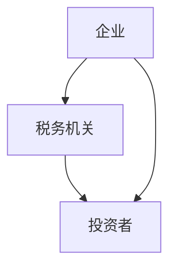
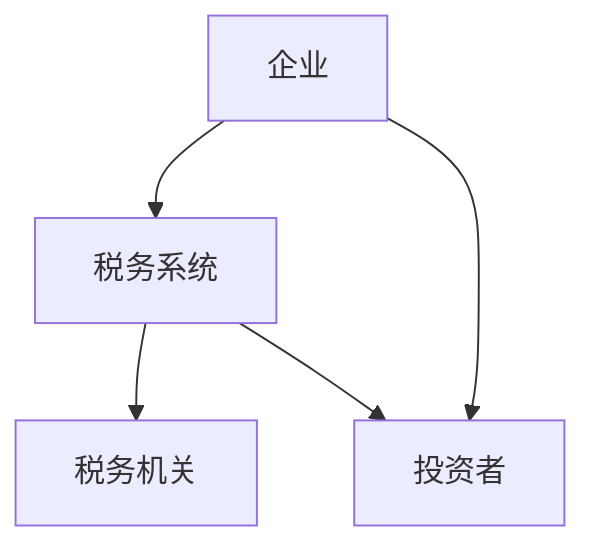
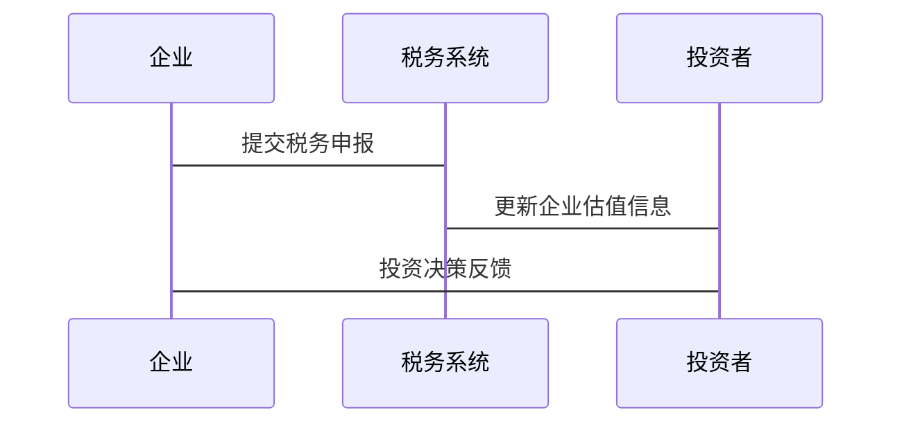

                 


```markdown
# 股市估值对跨境数字服务税收政策的影响

> 关键词：股市估值，跨境数字服务，税收政策，数字经济，企业税负

> 摘要：随着数字经济的快速发展，跨境数字服务已成为全球经济的重要组成部分。本文深入分析股市估值与跨境数字服务税收政策之间的相互影响，探讨税收政策变化如何影响企业估值，以及如何通过优化税收政策促进跨境数字服务的健康发展。

---

## 第一部分: 背景与核心概念

### 第1章: 股市估值与跨境数字服务税收政策的背景

#### 1.1 股市估值的基本概念
股市估值是通过对企业的财务指标和市场表现进行分析，评估其股票的合理价格。主要指标包括市盈率（P/E）、市净率（P/B）和现金流折现模型（DCF）。

- **市盈率（P/E）**：公式为 \( \text{P/E} = \frac{\text{股价}}{\text{每股净利润}} \)，衡量股票价格是否合理。
- **市净率（P/B）**：公式为 \( \text{P/B} = \frac{\text{股价}}{\text{每股净资产}} \)，适用于评估资产密集型企业。
- **现金流折现模型（DCF）**：通过将未来现金流折现，计算企业价值。

#### 1.2 跨境数字服务的基本概念
跨境数字服务指跨国提供数字产品或服务，如在线教育、跨境支付和云服务。

- **定义**：跨越国界的数字产品和服务。
- **形式**：包括在线教育、数字支付、SaaS（软件即服务）等。
- **市场现状**：全球市场规模庞大，增长迅速。

#### 1.3 税收政策的基本概念
税收政策是政府为调节经济而制定的规则，包括增值税、企业所得税和个人所得税。

- **增值税**：对商品和服务在流转过程中的价值增加部分征税。
- **企业所得税**：对企业的净利润征税，税率通常为20%-30%。
- **税收政策与经济活动**：影响企业利润和消费者价格，调节经济活动。

### 第2章: 股市估值对跨境数字服务税收政策的影响背景

#### 2.1 数字经济的发展趋势
- **定义与特征**：以数字技术为核心驱动力，数据和算法为关键生产要素。
- **对传统经济的冲击**：传统行业数字化转型，新兴数字产业崛起。
- **跨境贸易的数字化**：数字技术使跨境交易更加便捷，推动全球经济一体化。

#### 2.2 跨境数字服务的税收挑战
- **税收管辖问题**：数字服务的提供地和消费地不同，导致税收管辖权争议。
- **无形性与征管难度**：数字服务无实体形态，难以追踪和征税。
- **国际差异**：各国税收政策不统一，影响企业税务规划。

#### 2.3 股市估值与企业税负的关系
- **企业税负影响估值**：高税负会降低净利润，进而影响股价。
- **政策变化的直接影响**：税收政策调整会导致股价波动。
- **投资者敏感性**：投资者对税收政策变化敏感，影响投资决策。

---

## 第二部分: 核心概念与理论分析

### 第3章: 股市估值与税收政策的理论框架

#### 3.1 股市估值的核心模型

##### 3.1.1 市盈率模型（P/E 模型）
- **公式**：\( \text{P/E} = \frac{\text{股价}}{\text{每股净利润}} \)
- **应用**：评估股票的相对价值，判断是否被高估或低估。

##### 3.1.2 市净率模型（P/B 模型）
- **公式**：\( \text{P/B} = \frac{\text{股价}}{\text{每股净资产}} \)
- **应用**：适用于资产密集型企业，评估资产价值。

##### 3.1.3 现金流折现模型（DCF 模型）
- **步骤**：
  1. 预测未来现金流。
  2. 选择适当的贴现率。
  3. 折现计算现值。
  4. 计算企业价值。

- **公式**：\( \text{企业价值} = \sum_{t=1}^{n} \frac{\text{现金流}}{(1 + r)^t} \)

#### 3.2 税收政策对企业价值的影响

##### 3.2.1 税收对企业利润的影响
- **公式**：企业净利润 = 收入 - 成本 - 税费。

##### 3.2.2 税收对投资决策的影响
- 投资者会考虑税收负担，选择税负较低的地区投资。

##### 3.2.3 税收政策与企业估值
- 税收政策变化直接影响企业净利润，从而影响股价。

#### 3.3 跨境数字服务的税收政策框架

##### 3.3.1 跨境交易的税收协定
- 各国通过税收协定避免双重征税，明确征税权。

##### 3.3.2 数字服务的税收规则
- 对数字服务征税的挑战，如确定常设机构、判定 taxable nexus。

##### 3.3.3 不同国家的税收政策对比
- 欧盟、美国和中国的税收政策差异及对企业的影响。

### 第4章: 股市估值对跨境数字服务税收政策的影响分析

#### 4.1 股市估值与跨境数字服务的关系

##### 4.1.1 跨境数字服务的高增长性
- 数字技术推动服务创新，跨境交易增长迅速。

##### 4.1.2 股市对税收政策的敏感性
- 税收政策变化直接影响企业利润，进而影响股价。

#### 4.2 税收政策对股市估值的影响路径

##### 4.2.1 企业税负增加的影响
- 利润下降，股价可能下跌。

##### 4.2.2 税收优惠的激励作用
- 利润增加，股价可能上升。

##### 4.2.3 投资者预期的调整
- 税收政策预期影响投资者对未来的估值判断。

#### 4.3 数字经济下的税收政策创新

##### 4.3.1 数字税的征收
- 针对数字服务收入征收的税种，如欧盟的数字税。

##### 4.3.2 税收政策的数字化转型
- 利用大数据和人工智能优化税收征管。

##### 4.3.3 国际税收协调
- 通过 OECD 等国际组织推动全球税收政策协调。

---

## 第三部分: 系统分析与架构设计

### 第5章: 跨境数字服务税收政策的系统分析

#### 5.1 问题场景介绍
- 跨境数字服务企业的税务合规问题。
- 不同国家税收政策对企业估值的影响。

#### 5.2 系统功能设计
- **领域模型**：使用 Mermaid 绘制企业、税务机关和投资者的关系图。



- **系统架构设计**：使用 Mermaid 绘制系统架构图。



#### 5.3 系统接口设计
- 企业与税务系统的数据接口。
- 税务系统与投资者的信息接口。

#### 5.4 系统交互设计
- 使用 Mermaid 绘制序列图，展示企业、税务机关和投资者的交互流程。



### 第6章: 项目实战

#### 6.1 环境安装
- 安装 Python 和必要的数据处理库（Pandas、NumPy）。
- 安装数据可视化工具 Matplotlib 和 Seaborn。

#### 6.2 核心实现源代码
- 示例代码：计算市盈率和现金流折现。

```python
import pandas as pd
import numpy as np

# 示例数据
data = {
    '公司': ['A', 'B', 'C'],
    '股价': [100, 150, 200],
    '净利润': [50, 75, 100],
    '现金流': [100, 150, 200]
}

df = pd.DataFrame(data)

# 计算市盈率
df['P/E'] = df['股价'] / df['净利润']

# 计算现金流折现模型（简化）
discount_rate = 0.1
DCF = df['现金流'] / (1 + discount_rate)

print(df)
```

#### 6.3 案例分析
- 以亚马逊为例，分析其税务优化策略对股价的影响。

#### 6.4 总结
- 通过实际案例展示税收政策变化如何影响企业估值。

---

## 第四部分: 结论与展望

### 第7章: 结论

#### 7.1 核心观点总结
- 股市估值与跨境数字服务税收政策相互影响。
- 税收政策变化直接影响企业利润和股价。
- 数字经济下的税收政策需要创新和协调。

#### 7.2 政策建议
- 制定统一的国际税收规则。
- 加强税收政策的透明度和可预测性。
- 优化税收征管技术，适应数字化转型。

### 第8章: 展望

#### 8.1 未来研究方向
- 税收政策对数字经济的长期影响。
- 数字税的国际协调与实施。

#### 8.2 注意事项
- 税收政策变化对企业估值的影响需综合考虑。
- 数据隐私和税收征管的技术挑战。

#### 8.3 拓展阅读
- 推荐阅读 OECD 的数字经济税收报告和相关学术论文。

---

## 作者：AI天才研究院 & 禅与计算机程序设计艺术

---

通过以上结构，文章详细分析了股市估值与跨境数字服务税收政策的相互影响，结合理论模型和实际案例，为读者提供了全面的理解和深入的见解。
```

