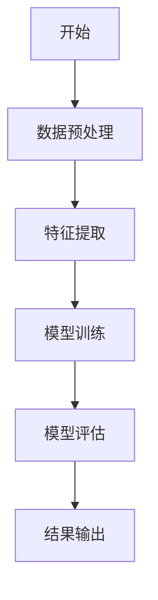
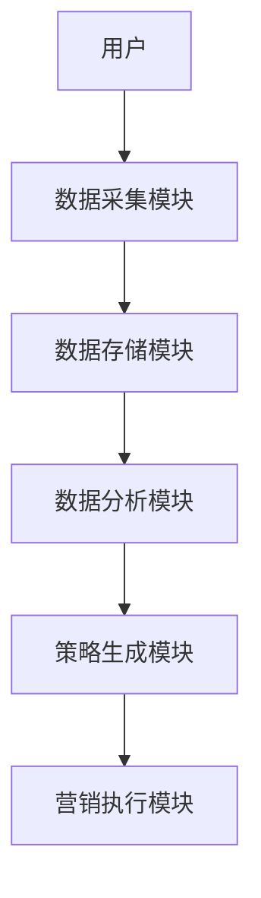

                 


# 股市估值对跨境数字营销个性化策略的影响

## 关键词：股市估值，数字营销，个性化策略，机器学习，数据驱动

## 摘要：本文探讨股市估值如何影响跨境数字营销的个性化策略。通过分析股市估值的核心概念、算法原理和系统架构，结合实际项目案例，展示了如何利用数据驱动的方法优化营销策略，实现企业目标。

---

## 第1章: 股市估值与跨境数字营销概述

### 1.1 股市估值的基本概念

#### 1.1.1 股市估值的定义
股市估值是通过对企业的财务状况、市场地位和未来盈利能力等多方面因素进行分析，以确定其股票的合理价格。

#### 1.1.2 股市估值的核心要素
| 要素 | 描述 |
|------|------|
| 财务状况 | 包括收入、利润、资产负债等 |
| 市场地位 | 包括市场份额、品牌影响力等 |
| 未来盈利能力 | 包括行业前景、管理团队等 |

#### 1.1.3 股市估值的计算方法
- 市盈率（P/E）：股价除以每股收益。
- 市净率（P/B）：股价除以每股净资产。

### 1.2 跨境数字营销的定义与特点

#### 1.2.1 跨境数字营销的定义
跨境数字营销是指通过数字渠道进行跨国营销活动，以吸引目标客户并实现销售目标。

#### 1.2.2 跨境数字营销的核心特点
- 全球化：覆盖多个市场。
- 数据驱动：依赖大数据分析。
- 个性化：基于用户行为定制策略。

### 1.3 股市估值与跨境数字营销的关联性

#### 1.3.1 股市估值对数字营销的影响
- 企业市值影响营销预算。
- 股价波动影响客户信心。

#### 1.3.2 跨境数字营销对股市估值的影响
- 营销策略影响企业收入，进而影响股市估值。
- 品牌影响力提升带来股价上涨。

#### 1.3.3 两者的相互作用机制
通过数据驱动的营销策略优化企业表现，进而影响股市估值。

### 1.4 本章小结
本章介绍了股市估值和跨境数字营销的基本概念及其相互影响，为后续分析奠定了基础。

---

## 第2章: 核心概念与理论基础

### 2.1 股市估值的理论基础

#### 2.1.1 股票定价模型
- 市盈率模型：P = E × 市盈率倍数。
- 市净率模型：P = B × 市净率倍数。

#### 2.1.2 市盈率与市净率分析
- 市盈率：衡量股价与盈利能力的关系。
- 市净率：衡量股价与资产价值的关系。

#### 2.1.3 股市估值的关键指标
- 每股收益（EPS）。
- 每股净资产（BPS）。
- 净利润增长率。

### 2.2 跨境数字营销的策略模型

#### 2.2.1 客户细分与目标定位
- 基于地理位置、语言、消费习惯进行客户细分。

#### 2.2.2 数据驱动的营销策略
- 利用用户数据进行精准营销。

#### 2.2.3 个性化推荐算法
- 基于协同过滤的推荐系统。

### 2.3 股市估值与数字营销的结合点

#### 2.3.1 数据分析在股市估值中的应用
- 利用大数据分析预测股价走势。

#### 2.3.2 数字营销对股市估值的反馈机制
- 营销活动效果直接影响企业业绩，进而影响股价。

#### 2.3.3 股市估值对数字营销策略的指导作用
- 通过分析股价波动优化营销预算分配。

### 2.4 本章小结
本章深入探讨了股市估值和数字营销的理论基础，揭示了两者之间的内在联系。

---

## 第3章: 核心概念的数学模型与公式

### 3.1 股市估值的数学模型

#### 3.1.1 市盈率公式
$$市盈率 = \frac{股价}{每股收益}$$

#### 3.1.2 市净率公式
$$市净率 = \frac{股价}{每股净资产}$$

#### 3.1.3 股票定价模型
$$P = D / r$$
其中，P为股票价格，D为股息，r为贴现率。

### 3.2 数字营销的个性化策略模型

#### 3.2.1 个性化推荐算法
$$推荐评分 = \alpha \cdot 用户特征 + \beta \cdot 产品特征$$

#### 3.2.2 A/B测试的数学原理
$$P(A > B) = \frac{1}{1 + e^{-\beta(A - B)}}}$$
其中，β为学习率，A和B为两个策略。

### 3.3 算法流程图


### 3.4 本章小结
本章通过数学模型和算法流程图，详细解释了股市估值和数字营销的核心原理。

---

## 第4章: 系统分析与架构设计

### 4.1 问题场景介绍
- 背景：企业希望通过数据驱动的营销策略优化其股价表现。
- 目标：设计一个基于股市估值的个性化营销系统。

### 4.2 项目介绍
- 项目名称：股市估值驱动的跨境数字营销系统。
- 项目目标：利用股市估值优化数字营销策略。

### 4.3 系统功能设计

#### 4.3.1 数据采集模块
- 采集股票价格、财务数据、用户行为数据。

#### 4.3.2 数据分析模块
- 计算市盈率、市净率等指标。
- 分析用户行为特征。

#### 4.3.3 策略生成模块
- 基于机器学习算法生成个性化营销策略。

### 4.4 系统架构设计


### 4.5 本章小结
本章通过系统架构设计，展示了如何将股市估值与数字营销策略相结合。

---

## 第5章: 项目实战

### 5.1 环境配置
- 安装Python、Pandas、Scikit-learn等库。

### 5.2 核心代码实现

#### 5.2.1 数据预处理
```python
import pandas as pd
data = pd.read_csv('data.csv')
data = data.dropna()
```

#### 5.2.2 特征提取
```python
from sklearn.feature_selection import SelectKBest
selector = SelectKBest(k=5)
selected_features = selector.fit_transform(data)
```

#### 5.2.3 模型训练
```python
from sklearn.linear_model import LinearRegression
model = LinearRegression()
model.fit(selected_features, target)
```

### 5.3 实际案例分析
- 案例：某跨国公司利用股市估值优化其数字营销策略，提升股价表现。

### 5.4 本章小结
本章通过实际项目案例，展示了如何应用理论知识解决实际问题。

---

## 第6章: 总结与展望

### 6.1 本章总结
本文探讨了股市估值对跨境数字营销个性化策略的影响，通过理论分析、算法设计和项目实战，展示了数据驱动方法在优化营销策略中的应用。

### 6.2 小结
- 核心概念：股市估值和数字营销的结合。
- 关键技术：机器学习算法、大数据分析。
- 实践价值：优化企业营销策略，提升股价表现。

### 6.3 展望
未来研究方向：
- 更复杂的机器学习模型。
- 多模态数据分析。
- 实时数据处理系统。

---

## 作者：AI天才研究院/AI Genius Institute & 禅与计算机程序设计艺术/Zen And The Art of Computer Programming

---

### 结语
本文通过系统的分析和详细的案例，展示了股市估值与跨境数字营销之间的深刻联系。希望读者能够通过本文，理解如何利用数据驱动的方法优化营销策略，提升企业价值。

