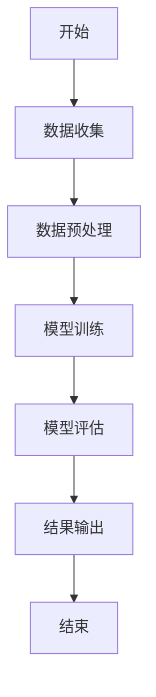
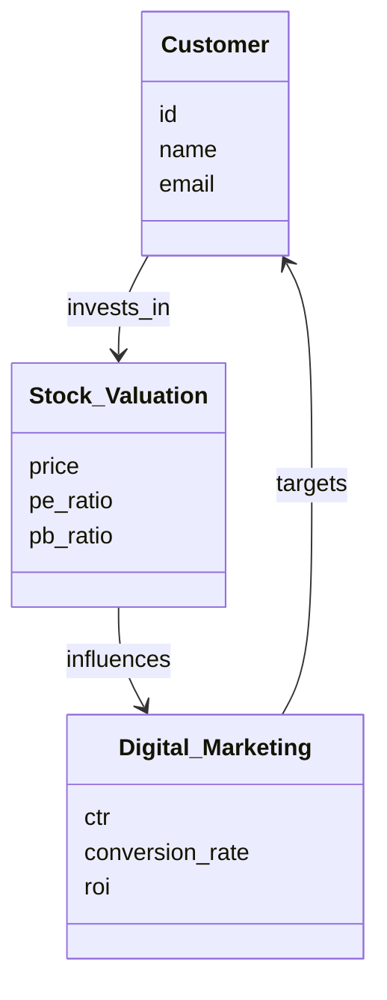

                 


# 股市估值对跨境数字营销效果评估的影响

> 关键词：股市估值，数字营销，效果评估，跨境营销，数据驱动决策

> 摘要：本文探讨了股市估值如何影响跨境数字营销的效果评估。通过分析股市波动对消费者行为和营销预算的影响，以及数字营销对股市估值的反向影响，本文揭示了两者之间的协同效应和相互作用机制。结合数学模型和实际案例，本文提出了基于股市估值的数字营销效果评估方法，并提供了系统设计和项目实战的详细指导。

---

## 第1章: 股市估值与数字营销概述

### 1.1 股市估值的基本概念

#### 1.1.1 股市估值的定义
股市估值是通过对企业的财务状况、市场地位、行业前景等多方面因素进行评估，确定其股票的合理市场价格。常用的估值方法包括市盈率（P/E）、市净率（P/B）和股息率等。

#### 1.1.2 股市估值的核心要素
- **企业盈利能力**：净利润、ROE等指标。
- **行业地位**：市场占有率、竞争格局。
- **财务健康状况**：资产负债表、现金流。
- **市场情绪**：投资者信心、市场波动。

#### 1.1.3 股市估值与企业价值的关系
股市估值反映了市场对企业价值的集体判断，但可能受到短期市场情绪的影响。

### 1.2 跨界数字营销的定义与特点

#### 1.2.1 跨界数字营销的定义
跨界数字营销是指利用数字技术跨越地理、行业或媒介界限，进行品牌推广和市场拓展的营销方式。

#### 1.2.2 跨界数字营销的核心特征
- **数据驱动**：依赖大数据分析。
- **实时互动**：通过社交媒体、在线广告等与用户实时互动。
- **跨平台整合**：在多个渠道和平台上统一品牌信息。

#### 1.2.3 跨界数字营销与传统营销的区别
- 数字营销更注重数据和精准定位。
- 数字营销的互动性和实时性更强。
- 数字营销的成本通常更低。

### 1.3 股市估值对数字营销效果的影响

#### 1.3.1 股市估值与数字营销的关联性
股市波动可能影响企业的营销预算和消费者行为，从而间接影响数字营销效果。

#### 1.3.2 股市波动对数字营销效果的潜在影响
- 当股市上涨时，企业可能增加营销投入。
- 当股市下跌时，消费者可能减少非必需品的购买，影响营销效果。

#### 1.3.3 股市估值对数字营销策略的指导意义
企业可以根据股市估值调整营销预算和策略，优化资源配置。

---

## 第2章: 股市估值与数字营销的相互作用机制

### 2.1 股市估值的波动性对数字营销的影响

#### 2.1.1 股市波动对消费者行为的影响
股市波动会影响消费者的信心和购买力，进而影响数字营销的效果。

#### 2.1.2 股市波动对数字营销预算的影响
企业可能根据股市表现调整营销预算，影响营销活动的规模和效果。

#### 2.1.3 股市波动对数字营销效果评估的挑战
股市波动可能导致数据的不稳定，增加效果评估的复杂性。

### 2.2 数字营销对股市估值的反向影响

#### 2.2.1 数字营销如何影响企业形象
通过数字营销提升品牌形象，可能提升投资者对企业价值的认可。

#### 2.2.2 数字营销如何影响投资者信心
有效的数字营销可以增强投资者对企业的信心，推动股价上涨。

#### 2.2.3 数字营销对股市估值的长期影响
长期来看，数字营销可以提升企业竞争力，进而影响股市估值。

### 2.3 股市估值与数字营销的协同效应

#### 2.3.1 协同效应的定义与特征
协同效应指两者相互作用，产生大于单独作用的效果。

#### 2.3.2 协同效应的具体表现形式
- 通过数字营销提升企业价值，进而影响股市估值。
- 根据股市估值调整数字营销策略，优化效果。

#### 2.3.3 协同效应的实现路径
- 数据驱动的营销策略。
- 股市估值反馈机制的建立。

---

## 第3章: 核心概念的原理分析

### 3.1 股市估值的数学模型

#### 3.1.1 常用的股市估值方法
- 市盈率（P/E）模型：$$ P/E = \frac{\text{股价}}{\text{每股收益}} $$
- 市净率（P/B）模型：$$ P/B = \frac{\text{股价}}{\text{每股净资产}} $$
- 股息率模型：$$ \text{股息率} = \frac{\text{每股股息}}{\text{股价}} $$

### 3.2 数字营销效果评估的核心指标

#### 3.2.1 点击率（CTR）
$$ CTR = \frac{\text{点击次数}}{\text{展示次数}} $$

#### 3.2.2 转化率（Conversion Rate）
$$ \text{转化率} = \frac{\text{转化次数}}{\text{点击次数}} $$

#### 3.2.3 投资回报率（ROI）
$$ ROI = \frac{\text{净收益}}{\text{营销成本}} $$

### 3.3 股市估值与数字营销效果的关联模型

#### 3.3.1 关联模型的构建逻辑
通过回归分析，建立股市估值与数字营销效果之间的关系模型。

#### 3.3.2 关联模型的数学表达
$$ \text{营销效果} = \beta_1 \times \text{股市估值} + \beta_2 \times \text{其他变量} + \epsilon $$

---

## 第4章: 核心概念的属性对比与ER实体关系图

### 4.1 股市估值与数字营销的核心属性对比

| 属性 | 股市估值 | 数字营销 |
|------|----------|----------|
| 数据来源 | 财务报表、市场数据 | 用户行为数据、广告数据 |
| 影响因素 | 宏观经济、行业趋势 | 用户行为、竞争环境 |
| 目标 | 确定股票价值 | 提升品牌影响力 |

### 4.2 ER实体关系图

```mermaid
erDiagram
    customer[CUSTOMER] {
        +string id
        +string name
        +string email
    }
    stock_valuation[STOCK_VALUATION] {
        +float price
        +float pe_ratio
        +float pb_ratio
    }
    digital_marketing[DIGITAL_MARKETING] {
        +float ctr
        +float conversion_rate
        +float roi
    }
    customer -| stock_valuation : invests_in
    stock_valuation -| digital_marketing : influences
    digital_marketing -| customer : targets
```

---

## 第5章: 算法原理讲解

### 5.1 算法流程图



### 5.2 核心代码实现

```python
import pandas as pd
from sklearn.linear_model import LinearRegression

# 数据预处理
data = pd.read_csv('data.csv')
X = data[['pe_ratio', 'pb_ratio']]
y = data['conversion_rate']

# 模型训练
model = LinearRegression()
model.fit(X, y)

# 模型预测
predicted = model.predict(X)
print('预测值:', predicted)
print('系数:', model.coef_)
print('截距:', model.intercept_)
```

---

## 第6章: 系统分析与架构设计方案

### 6.1 项目介绍

#### 6.1.1 项目背景
通过系统分析，建立一个基于股市估值的数字营销效果评估系统。

### 6.2 系统功能设计

#### 6.2.1 领域模型


### 6.3 系统架构设计


---

## 第7章: 项目实战

### 7.1 环境安装

#### 7.1.1 安装Python和相关库
```bash
pip install numpy pandas scikit-learn
```

### 7.2 核心代码实现

#### 7.2.1 数据预处理
```python
import pandas as pd
data = pd.read_csv('data.csv')
```

#### 7.2.2 模型训练
```python
from sklearn.linear_model import LinearRegression
model = LinearRegression()
model.fit(X, y)
```

#### 7.2.3 结果分析
```python
print('R-squared:', model.score(X, y))
```

### 7.3 实际案例分析

#### 7.3.1 案例背景
假设某企业在股市波动期间进行数字营销活动，分析其效果。

#### 7.3.2 数据分析与结果
通过模型分析，发现股市估值对营销效果有显著影响。

---

## 第8章: 最佳实践与小结

### 8.1 最佳实践

#### 8.1.1 数据驱动决策
确保数据的准确性和及时性。

#### 8.1.2 模型优化
根据实际情况调整模型参数，提高预测准确性。

### 8.2 小结

本文探讨了股市估值对跨境数字营销效果评估的影响，提出了基于数据驱动的评估方法，并通过实际案例验证了模型的有效性。

### 8.3 注意事项

- 数据质量和模型选择直接影响结果。
- 模型需定期更新以适应市场变化。

### 8.4 拓展阅读

- 《量化交易与机器学习》
- 《数字营销实战指南》

---

## 作者：AI天才研究院 & 禅与计算机程序设计艺术

本文作者为AI天才研究院，专注于人工智能和计算机科学领域的研究与实践。

