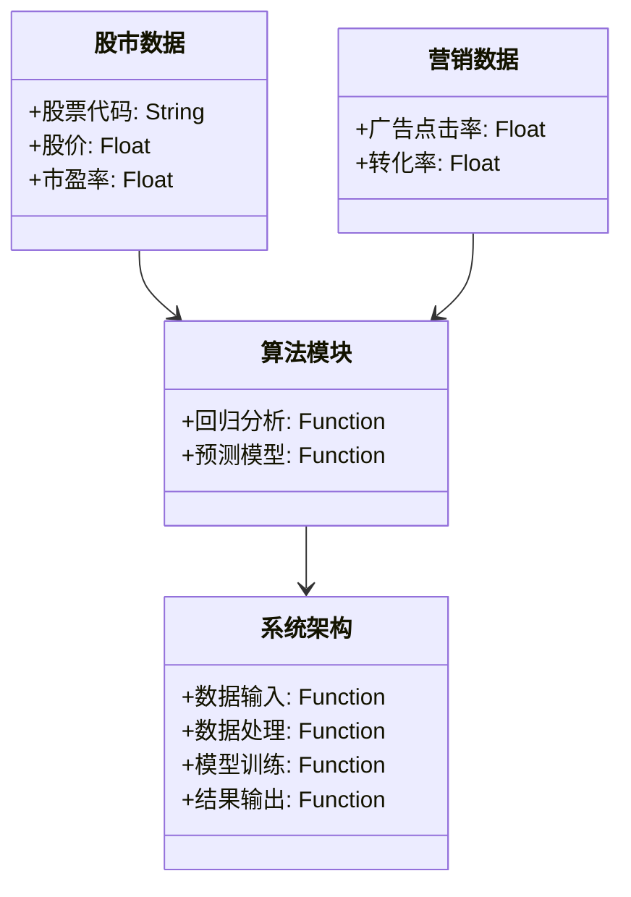
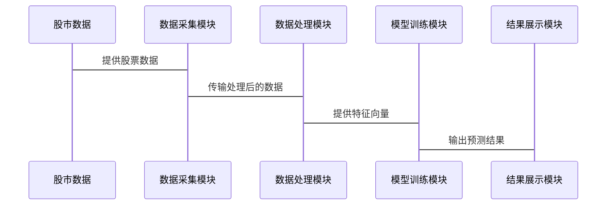

                 


# 股市估值对跨境数字营销策略的影响

## 关键词：
- 股市估值
- 跨境数字营销
- 数字营销策略
- 股票分析
- 股市数据
- 数字营销技术

## 摘要：
本文探讨了股市估值与跨境数字营销策略之间的相互影响。通过分析股市估值的核心概念、数学模型，以及数字营销策略的数据驱动方法，揭示了两者如何相互作用。结合实际案例，展示了如何利用股市数据优化营销策略，为数字营销和技术投资提供新的视角。

---

# 第一部分：股市估值与跨境数字营销策略的背景与核心概念

## 第1章：背景介绍

### 1.1 股市估值的基本概念

#### 1.1.1 股市估值的定义
股市估值是指通过对公司财务数据和市场因素的分析，估算其股票的合理价格。主要方法包括市盈率（P/E）、市净率（P/B）和现金流折现法（DCF）。

#### 1.1.2 股市估值的核心要素
- 公司盈利能力：净利润、ROE。
- 财务状况：资产、负债、现金流。
- 市场因素：行业趋势、宏观经济指标。
- 股东权益：每股收益（EPS）、股息率。

#### 1.1.3 股市估值的计算方法
- 市盈率（P/E）= 股价 / 每股收益。
- 市净率（P/B）= 股价 / 每股净资产。

### 1.2 跨境数字营销策略的定义与特点

#### 1.2.1 跨境数字营销的定义
跨境数字营销是通过数字渠道（如社交媒体、搜索引擎）向不同国家或地区的消费者推广产品或服务。

#### 1.2.2 跨境数字营销的核心要素
- 数据驱动：利用消费者数据进行精准营销。
- 多渠道整合：整合线上和线下渠道。
- 跨境特性：考虑不同地区的文化差异和法规。

#### 1.2.3 跨境数字营销与传统营销的区别
- 传统营销依赖地理位置，而数字营销突破地域限制。
- 数字营销更依赖数据和技术。

### 1.3 股市估值与跨境数字营销策略的关联性

#### 1.3.1 股市估值对数字营销的影响
股市估值反映了公司的市场表现，影响投资者信心，进而影响数字营销预算。

#### 1.3.2 跨境数字营销对股市估值的影响
成功的数字营销提升品牌知名度和销售额，改善公司财务表现，从而提升股价。

#### 1.3.3 两者的相互作用机制
股市估值为数字营销提供数据支持，数字营销优化公司业绩，进而影响股市估值。

## 第2章：核心概念与联系

### 2.1 股市估值的核心概念原理

#### 2.1.1 股票价格的决定因素
- 公司基本面：收入、利润。
- 市场情绪：投资者情绪影响股价波动。
- 宏观经济：利率、汇率、通货膨胀。

#### 2.1.2 市盈率与市净率的计算公式
- 市盈率（P/E）= 股价 / 每股收益。
- 市净率（P/B）= 股价 / 每股净资产。

#### 2.1.3 股市估值的数学模型
$$ 估值 = \alpha \times 收益 + \beta \times 市场指数 $$

### 2.2 跨境数字营销策略的核心概念

#### 2.2.1 数字营销的主要渠道
- 搜索引擎营销（SEM）。
- 社交媒体营销（SMM）。
- 电子邮件营销（EM）。

#### 2.2.2 跨境数字营销的挑战与机遇
- 挑战：文化差异、语言障碍、法规差异。
- 机遇：全球市场覆盖、数据驱动决策。

#### 2.2.3 数据驱动的营销策略
- 数据分析：消费者行为分析。
- 预测模型：预测营销效果。

### 2.3 股市估值与跨境数字营销的联系

#### 2.3.1 数据驱动的股市分析
- 利用大数据技术分析市场趋势。
- 通过机器学习预测股价波动。

#### 2.3.2 数字营销对上市公司价值的影响
- 提高品牌知名度，增加销售额。
- 改善客户关系，提升客户忠诚度。

#### 2.3.3 股市估值对数字营销策略的指导作用
- 通过分析股价波动，优化营销预算分配。
- 根据市场估值，选择最佳营销时机。

## 第3章：核心概念的属性对比与ER实体关系图

### 3.1 核心概念的属性对比

| 属性       | 股市估值                   | 跨境数字营销策略             |
|------------|--------------------------|-----------------------------|
| 核心指标     | 市盈率、市净率             | 点击率、转化率               |
| 数据来源     | 公司财报、市场数据         | 用户点击、购买数据           |
| 目标         | 评估公司价值               | 提升品牌知名度和销售额         |
| 方法         | 市场分析、财务分析         | 数据分析、预测模型             |
| 影响因素     | 宏观经济、行业趋势         | 消费者行为、技术工具           |

### 3.2 ER实体关系图
```mermaid
er
  entity 股市 (StockMarket) {
    key: 股票代码 (StockCode)
    fields: 股票名称 (StockName), 最新股价 (CurrentPrice), 市盈率 (P/E Ratio), 市净率 (P/B Ratio)
  }
  entity 数字营销策略 (
    key: 策略ID (StrategyID)
    fields: 策略名称 (StrategyName), 执行渠道 (Channels), 目标市场 (TargetMarket), 营销预算 (Budget), 预测 ROI (PredictedROI)
  )
  entity 消费者行为 (
    key: 消费者ID (ConsumerID)
    fields: 消费者地区 (ConsumerRegion), 消费者语言 (ConsumerLanguage), 消费者兴趣 (ConsumerInterests)
  )
  entity 数据分析 (
    key: 分析报告ID (AnalysisReportID)
    fields: 分析时间 (AnalysisTime), 分析结果 (AnalysisResults)
  )
  relation 股市与数字营销策略 (StockMarket关联数字营销策略) {
    股市 -> 数字营销策略: 通过股市数据优化营销策略
  }
  relation 消费者行为与数据分析 (消费者行为关联数据分析) {
    消费者行为 -> 数据分析: 提供消费者行为数据支持
  }
  relation 数字营销策略与策略执行 (数字营销策略关联策略执行) {
    数字营销策略 -> 策略执行: 指导具体的营销活动执行
  }
```

---

# 第二部分：算法原理与数学模型

## 第4章：算法原理与数学模型

### 4.1 股市估值预测的算法原理

#### 4.1.1 回归分析
回归分析是一种统计方法，用于建立变量之间的关系模型。例如，利用回归分析预测股价变化。

#### 4.1.2 机器学习模型
使用机器学习模型（如随机森林、神经网络）预测股价波动。

### 4.2 数字营销效果预测的算法原理

#### 4.2.1 贝叶斯分类器
贝叶斯分类器用于分类问题，如预测广告点击率。

#### 4.2.2 集成学习
集成学习（如梯度提升树）用于提高预测准确性。

### 4.3 数学模型与公式

#### 4.3.1 线性回归模型
$$ y = \beta_0 + \beta_1 x + \epsilon $$

#### 4.3.2 逻辑回归模型
$$ P(y=1|x) = \frac{1}{1 + e^{-(\beta_0 + \beta_1 x)}} $$

---

# 第三部分：系统分析与架构设计

## 第5章：系统分析与架构设计

### 5.1 问题场景介绍
本系统旨在通过分析股市数据和数字营销数据，优化营销策略，提升公司估值。

### 5.2 系统功能设计


### 5.3 系统架构设计


### 5.4 接口设计与交互序列图


---

# 第四部分：项目实战

## 第6章：项目实战

### 6.1 环境安装
安装Python和必要的库（如pandas、scikit-learn）。

### 6.2 核心代码实现
```python
import pandas as pd
from sklearn.linear_model import LinearRegression

# 加载数据
data = pd.read_csv('stock_data.csv')

# 定义特征和目标
X = data[['PE', 'PB']]
y = data['Price']

# 创建模型
model = LinearRegression()
model.fit(X, y)

# 预测
predicted_price = model.predict(X)
print(predicted_price)
```

### 6.3 案例分析与总结
分析实际案例，如利用模型预测股价波动，优化数字营销策略。

---

# 第五部分：总结与展望

## 第7章：总结与展望

### 7.1 最佳实践
- 数据清洗和特征选择至关重要。
- 模型评估和调优是关键。
- 结合实际情况，灵活调整策略。

### 7.2 未来研究方向
- 结合AI技术，提升预测精度。
- 研究更复杂模型，如深度学习。

### 7.3 小结
本文探讨了股市估值与数字营销策略的相互影响，展示了如何通过数据驱动的方法优化营销策略，提升公司价值。

---

作者：AI天才研究院 & 禅与计算机程序设计艺术

