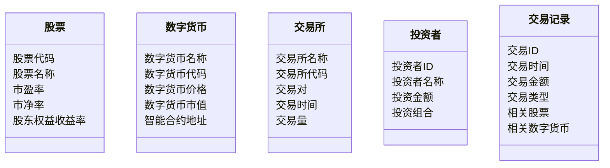

                 


# 股市估值对跨境数字货币交易规则的影响

## 关键词：股市估值, 跨境数字货币, 交易规则, 区块链技术, 经济影响

## 摘要

本文深入探讨股市估值与跨境数字货币交易规则之间的相互影响。通过分析股市估值的核心原理、数字货币的基本概念以及两者的相互作用，揭示股市波动如何影响数字货币市场，反之亦然。本文从技术角度出发，结合算法原理、数学模型和系统架构设计，提供全面的分析框架，并通过实际案例展示如何利用这些方法进行交易策略优化。

---

## 引言

随着全球化进程的加速，股市和数字货币市场的联系日益紧密。股市估值作为金融市场的核心指标，不仅影响着传统股票交易，也对跨境数字货币的交易规则产生了深远影响。本文将从技术角度探讨股市估值与跨境数字货币交易规则的相互作用，分析其背后的算法原理和数学模型，并通过实际案例展示如何利用这些知识优化交易策略。

---

## 第1章: 股市估值与跨境数字货币交易规则的背景

### 1.1 股市估值的基本概念

#### 1.1.1 股市估值的定义与作用

股市估值是通过对公司财务数据的分析，评估其股票的内在价值。常用的估值指标包括市盈率（P/E）、市净率（P/B）和股东权益收益率（ROE）。股市估值的作用在于帮助投资者判断股票是否被高估或低估，从而做出更合理的投资决策。

#### 1.1.2 股市估值的主要方法

- **相对估值法**：通过比较股票与行业平均水平的估值指标来判断其价值。
- **绝对估值法**：通过现金流折现模型（DCF）等方法计算股票的内在价值。
- **技术分析法**：通过价格走势和成交量等技术指标预测股价波动。

#### 1.1.3 股市估值与经济周期的关系

股市估值受经济周期影响显著。在经济繁荣期，投资者风险偏好较高，股市估值往往偏高；而在经济衰退期，投资者风险偏好下降，股市估值可能被低估。

---

### 1.2 跨境数字货币的基本概念

#### 1.2.1 跨境数字货币的定义与特点

跨境数字货币是指在不同国家或地区之间流通的数字货币，如比特币、以太坊等。其特点包括去中心化、交易透明、跨境支付便捷以及交易成本低。

#### 1.2.2 跨境数字货币的分类与应用场景

- **加密货币**：如比特币、以太坊，主要用于投资和跨境支付。
- **稳定币**：如USDT，与法定货币挂钩，用于稳定支付和交易。
- **央行数字货币（CBDC）**：由中央银行发行，用于提升金融体系效率。

#### 1.2.3 跨境数字货币与传统金融体系的对比

相比传统金融体系，跨境数字货币具有交易速度快、成本低、去中心化等特点，但也面临监管不完善、价格波动剧烈等问题。

---

### 1.3 股市估值与跨境数字货币的关联性

#### 1.3.1 股市估值对数字货币交易规则的影响

股市波动会影响投资者情绪，进而影响数字货币市场。例如，股市下跌可能导致投资者抛售数字货币以弥补亏损，从而压低数字货币价格。

#### 1.3.2 跨境数字货币对股市估值的反向影响

数字货币的大幅波动可能引发市场恐慌，进而影响股市估值。例如，比特币价格的剧烈波动可能引发投资者对风险的重新评估，影响其对传统股票的估值判断。

#### 1.3.3 两者的相互作用与协同效应

股市和数字货币市场的联动效应日益显著。投资者可能通过配置数字货币对冲股市风险，或者通过股市波动寻找数字货币交易机会。

---

## 第2章: 核心概念与联系

### 2.1 股市估值的核心原理

#### 2.1.1 市盈率（P/E）的计算与应用

市盈率 = 股票价格 / 每股净利润

市盈率反映了投资者对股票未来盈利的预期。低市盈率可能意味着股票被低估，高市盈率可能意味着股票被高估。

#### 2.1.2 市净率（P/B）的计算与应用

市净率 = 股票价格 / 每股净资产

市净率适用于评估资产密集型行业的股票价值，常用于判断银行、保险公司等行业的估值。

#### 2.1.3 股东权益收益率（ROE）的计算与应用

ROE = 净利润 / 股东权益

ROE反映了公司使用股东资金的效率。高ROE可能意味着公司盈利能力强，低ROE可能意味着公司盈利能力弱。

---

### 2.2 跨境数字货币的核心原理

#### 2.2.1 区块链技术的基本原理

区块链是一种分布式账本技术，通过去中心化和加密算法确保数据的安全性和不可篡改性。区块链技术为数字货币的交易和结算提供了技术支持。

#### 2.2.2 智能合约的定义与功能

智能合约是基于区块链的自动执行程序，用于自动执行合同条款。智能合约可以简化交易流程，降低交易成本。

#### 2.2.3 跨境支付的流程与特点

跨境支付通过区块链技术实现快速、低成本的全球支付。相比传统跨境支付，数字货币支付无需中间银行，交易时间大幅缩短。

---

### 2.3 股市估值与数字货币交易规则的联系

#### 2.3.1 股市波动对数字货币市场的影响

股市下跌可能导致投资者抛售数字货币，从而影响数字货币价格。这种联动效应可以通过相关性分析模型进行量化。

#### 2.3.2 数字货币价格对股市投资策略的影响

投资者可能通过配置数字货币对冲股市风险，或者利用数字货币市场的高波动性寻找套利机会。

#### 2.3.3 两者的相互影响与协同机制

股市和数字货币市场的相互影响主要通过投资者情绪和市场流动性渠道实现。例如，股市流动性充裕可能推动投资者进入数字货币市场，反之亦然。

---

## 第3章: 核心概念的对比与ER实体关系图

### 3.1 股市估值与数字货币交易规则的对比分析

| 对比维度 | 股市估值 | 数字货币交易规则 |
|----------|----------|------------------|
| 估值方法 | 市盈率、市净率等 | 智能合约、区块链技术 |
| 市场参与者 | 机构投资者、散户 | 数字货币持有者、矿工 |
| 风险因素 | 宏观经济、政策风险 | 技术风险、市场波动 |

### 3.2 ER实体关系图

```mermaid
erd
title 股市估值与数字货币交易规则的实体关系图

股票
  + 股票代码: string
  + 股票名称: string
  + 市盈率: float
  + 市净率: float
  + 股东权益收益率: float

数字货币
  + 数字货币名称: string
  + 数字货币代码: string
  + 数字货币价格: float
  + 数字货币市值: float
  + 智能合约地址: string

交易所
  + 交易所名称: string
  + 交易所代码: string
  + 交易对: string
  + 交易时间: datetime
  + 交易量: float

投资者
  + 投资者ID: integer
  + 投资者名称: string
  + 投资金额: float
  + 投资组合: string

交易记录
  + 交易ID: integer
  + 交易时间: datetime
  + 交易金额: float
  + 交易类型: string
  + 相关股票: 股票
  + 相关数字货币: 数字货币
```

---

## 第4章: 算法原理讲解

### 4.1 股市估值的算法原理

#### 4.1.1 基于技术分析的算法

技术分析算法通过分析股票价格和成交量数据，预测股票价格的未来走势。常用的技术指标包括移动平均线（MA）、相对强弱指数（RSI）和MACD指标。

#### 4.1.2 基于基本面分析的算法

基本面分析算法通过分析公司的财务数据，评估股票的内在价值。常用的模型包括现金流折现模型（DCF）和市盈率模型。

#### 4.1.3 基于机器学习的算法

机器学习算法通过训练历史数据，预测股票价格的波动。常用的算法包括支持向量机（SVM）、随机森林和神经网络。

---

### 4.2 数字货币交易规则的算法原理

#### 4.2.1 基于价格波动的交易算法

价格波动算法通过分析数字货币价格的短期波动，寻找套利机会。常用的技术指标包括布林带（Bollinger Bands）和波动率指标（VIX）。

#### 4.2.2 基于市场情绪的交易算法

市场情绪算法通过分析社交媒体和新闻数据，预测数字货币价格的波动。常用的方法包括情感分析和文本挖掘。

#### 4.2.3 基于区块链技术的智能合约算法

智能合约算法通过自动执行交易规则，简化交易流程。智能合约可以用于自动执行买卖订单、支付结算等。

---

## 第5章: 数学模型与公式

### 5.1 股市估值的数学模型

市盈率模型：
$$ P/E = \frac{\text{股票价格}}{\text{每股净利润}} $$

市净率模型：
$$ P/B = \frac{\text{股票价格}}{\text{每股净资产}} $$

现金流折现模型：
$$ \text{股票价值} = \sum_{t=1}^{n} \frac{\text{现金流}}{(1 + r)^t} $$

---

### 5.2 数字货币交易规则的数学模型

布林带模型：
$$ \text{布林带} = \text{移动平均线} \pm \text{标准差} \times \text{倍数} $$

相对强弱指数模型：
$$ RSI = \frac{\text{上涨幅度}}{\text{上涨幅度} + \text{下跌幅度}} $$

---

## 第6章: 系统分析与架构设计方案

### 6.1 系统功能设计

#### 6.1.1 领域模型



---

#### 6.1.2 系统架构设计


---

## 第7章: 项目实战

### 7.1 环境安装

- 安装Python和相关库（如Pandas、NumPy、Matplotlib、Scikit-learn）。
- 安装区块链开发框架（如Ethereum、Solidity）。

---

### 7.2 核心实现

#### 7.2.1 数据收集

- 收集股票数据（如Yahoo Finance API）。
- 收集数字货币数据（如CoinMarketCap API）。

#### 7.2.2 数据处理

- 清洗数据。
- 转换数据格式。
- 计算技术指标（如市盈率、市净率、布林带等）。

#### 7.2.3 分析模块实现

- 实现技术分析算法。
- 实现机器学习模型。
- 生成交易信号。

---

### 7.3 应用案例

#### 7.3.1 案例分析

分析比特币价格与纳斯达克指数的相关性，验证股市波动对数字货币价格的影响。

---

## 第8章: 最佳实践与小结

### 8.1 最佳实践

- 定期更新数据，保持模型的准确性。
- 结合技术分析和基本面分析，制定综合交易策略。
- 注意市场风险，合理配置资产。

---

### 8.2 小结

股市估值与跨境数字货币交易规则的相互影响日益显著。通过技术手段，如算法交易和智能合约，可以优化交易策略，降低交易成本。未来，随着技术的不断发展，股市估值与数字货币交易规则的结合将更加紧密。

---

## 参考文献

1. 葛兰维.《股票技术分析实战技巧》
2. 亚历克斯·怀特.《区块链入门与实践》
3. 弗兰克·扎姆.《智能合约与分布式应用开发》

---

## 作者

作者：AI天才研究院/AI Genius Institute & 禅与计算机程序设计艺术 /Zen And The Art of Computer Programming

