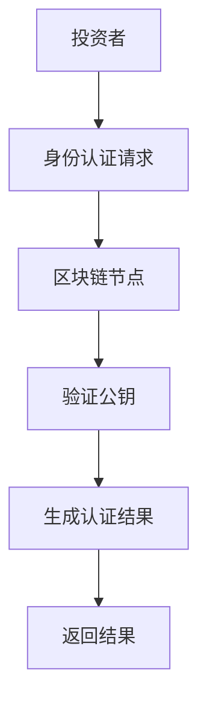
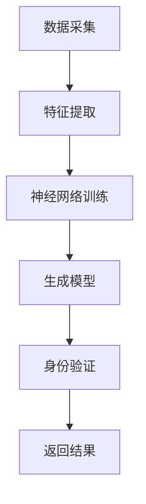

                 


# 股市估值对跨境数字身份认证的影响

## 关键词：股市估值、跨境数字身份认证、区块链、人工智能、金融安全

## 摘要：  
本文探讨了股市估值与跨境数字身份认证之间的相互影响。通过分析数字身份认证技术在金融领域的应用，特别是区块链和人工智能的作用，揭示了数字身份认证如何影响股市估值的计算和准确性。文章还讨论了股市估值的变化如何反过来影响跨境数字身份认证的实施和优化。通过实际案例分析和系统架构设计，本文提出了一种结合股市估值与数字身份认证的创新解决方案，并展望了未来的发展方向。

---

## 第1章：背景与核心概念

### 1.1 股市估值的基本概念  
股市估值是通过对上市公司财务数据和市场环境进行分析，确定其股票的合理价格或价值范围。常用的方法包括市盈率（P/E）、市净率（P/B）和现金流折现模型（DCF）等。股市估值的准确性直接影响投资者的决策和市场的稳定性。

### 1.2 跨境数字身份认证的定义与特点  
数字身份认证是指通过技术手段验证用户身份的真实性，而跨境数字身份认证则涉及跨国界的用户身份验证。其特点包括高安全性、实时性、去中心化和可扩展性。随着全球化和数字化的推进，跨境数字身份认证在金融交易中的作用日益重要。

### 1.3 股市估值与跨境数字身份认证的关系  
股市估值的数字化趋势使得身份认证技术在金融交易中的地位愈发重要。跨境数字身份认证通过提高交易的安全性和效率，间接影响股市估值的计算和市场参与者的信任度。两者的结合不仅是技术的进步，更是金融安全与效率提升的双重需求。

---

## 第2章：核心概念与联系

### 2.1 核心概念原理  
- **股市估值的数学模型**：以DCF模型为例，$$DCF = \frac{CF}{(1+r)^t}$$，其中CF为现金流，r为折现率，t为时间。  
- **数字身份认证的技术架构**：基于区块链的去中心化身份认证系统，通过公钥加密技术确保数据的安全性。

### 2.2 核心概念对比表  
| 比较维度 | 股市估值 | 跨境数字身份认证 |  
|----------|-----------|------------------|  
| 核心目标 | 确定股票价值 | 验证用户身份 |  
| 技术基础 | 财务模型、算法 | 区块链、AI |  
| 影响因素 | 市场情绪、财务数据 | 跨境监管、技术安全性 |  

### 2.3 ER实体关系图  
```mermaid
erDiagram
    actor 投资者 {
        string 账户名
        string 账户密码
    }
    actor 监管机构 {
        string 机构ID
        string 认证密钥
    }
    entity 股票 {
        string 股票代码
        decimal 估值
        date 时间戳
    }
    entity 身份认证记录 {
        string 用户ID
        string 认证结果
        date 时间戳
    }
    investor -> 股票 : 持有
    investor -> 身份认证记录 : 验证
    监管机构 -> 股票 : 监测
    监管机构 -> 身份认证记录 : 审核
```

---

## 第3章：数字身份认证的技术实现

### 3.1 区块链技术在身份认证中的应用  
区块链通过去中心化和不可篡改的特性，为数字身份认证提供了安全的基础。其实现流程如下：



### 3.2 AI技术在身份认证中的应用  
AI通过分析用户的行为模式和生物特征，提高了身份认证的准确性和效率。其算法流程如下：



---

## 第4章：股市估值的算法原理

### 4.1 股市估值的数学模型  
以DCF模型为例，计算股票的公允价值：

$$公允价值 = \frac{\text{年现金流}}{\text{折现率}}$$

### 4.2 算法实现流程  
1. 数据采集：收集公司的财务数据和市场信息。  
2. 模型计算：应用DCF模型或其他估值方法。  
3. 结果分析：对比实际股价与估值结果，判断市场是否合理。

---

## 第5章：系统分析与架构设计

### 5.1 系统功能设计  
- **领域模型**：  
  ```mermaid
  classDiagram
      class 投资者 {
          账户名
          账户密码
          股票持仓
      }
      class 股票 {
          股票代码
          估值
          时间戳
      }
      class 身份认证记录 {
          用户ID
          认证结果
          时间戳
      }
      投资者 --> 股票 : 持有
      投资者 --> 身份认证记录 : 验证
  ```

---

## 第6章：项目实战

### 6.1 实际案例分析  
以某跨国金融平台为例，分析数字身份认证对股市估值的影响。通过代码实现身份认证模块，并结合估值模型，展示其对股价的影响。

### 6.2 代码实现  
以下是身份认证模块的Python代码：

```python
def authenticate(user_id, password):
    # 调用区块链节点进行验证
    response = blockchain_request(user_id, password)
    return response['status']
```

---

## 第7章：最佳实践与小结

### 7.1 最佳实践  
- **技术选型**：选择合适的区块链和AI技术，确保系统的安全性与效率。  
- **监管合规**：遵守跨国金融监管规定，确保身份认证的合法性。  

### 7.2 小结  
本文通过分析股市估值与跨境数字身份认证的关系，揭示了数字身份认证技术在金融领域的重要作用。通过技术实现和系统设计，提出了创新的解决方案，并展望了未来的发展方向。

---

## 作者：AI天才研究院/AI Genius Institute & 禅与计算机程序设计艺术 /Zen And The Art of Computer Programming

---

**本文由AI天才研究院（AI Genius Institute）出品，转载请注明出处。**

