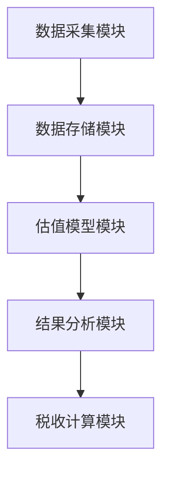
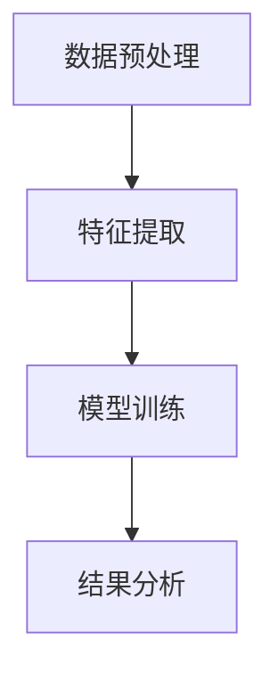

                 


# 股市估值对跨境电子商务税收的影响

> 关键词：股市估值、跨境电子商务、税收、算法模型、系统架构、案例分析

> 摘要：本文探讨了股市估值与跨境电子商务税收之间的复杂关系，分析了股市估值的核心概念、跨境电商税收政策的现状，以及两者相互影响的机制。通过构建数学模型和系统架构，本文详细阐述了如何利用算法模型量化股市估值对跨境电商税收的影响，并通过实际案例分析提供深度见解。文章最后提出了优化建议和未来研究方向，为相关领域的研究者和从业者提供参考。

---

# 第一部分：背景与概念

## 第1章：股市估值与跨境电子商务税收的背景介绍

### 1.1 股市估值的基本概念
#### 1.1.1 股市估值的定义
股市估值是通过对企业的财务数据和市场表现进行分析，评估其股票的内在价值。常用的方法包括市盈率（P/E）、市净率（P/B）和现金流折现法（DCF）等。

#### 1.1.2 股市估值的核心要素
- **企业盈利能力**：净利润是衡量企业盈利能力的关键指标。
- **企业成长性**：收入增长率和净利润增长率是衡量成长性的核心指标。
- **财务健康度**：资产负债率、流动比率等是衡量财务健康度的重要指标。

#### 1.1.3 股市估值的常见方法
- **相对估值法**：基于可比公司进行估值。
- **绝对估值法**：基于现金流折现模型（DCF）进行估值。
- **指数估值法**：基于市场整体表现进行估值。

### 1.2 跨境电子商务税收的基本概念
#### 1.2.1 跨境电子商务的定义
跨境电商是指跨过国境进行商品或服务交易的商业活动，涉及国际贸易和支付等多个环节。

#### 1.2.2 跨境电子商务税收的特点
- **复杂性**：涉及多个国家的税收政策。
- **多样性**：不同国家的税收政策差异较大。
- **实时性**：需要实时监控交易数据以确保税收合规。

#### 1.2.3 跨境电子商务税收的分类
- **增值税（VAT）**：适用于跨境电商商品和服务的主要税种。
- **消费税**：针对最终消费者的税种。
- **企业所得税**：针对跨境电商企业的利润征收。

### 1.3 股市估值与跨境电子商务税收的关系
#### 1.3.1 股市估值对跨境电商企业的影响
- 股市估值反映企业的市场价值，影响其融资成本和投资决策。
- 股市估值波动可能影响跨境电商企业的税务负担。

#### 1.3.2 跨境电子商务税收对股市的影响
- 税收政策的变化会影响企业的盈利能力和股价。
- 税收政策的不确定性会影响市场的整体估值。

#### 1.3.3 两者关系的理论框架
股市估值和跨境电商税收之间存在双向影响：股市估值影响税收政策的制定和实施，而税收政策又反过来影响股市估值。

---

## 第2章：股市估值的核心概念与原理

### 2.1 股市估值的主要方法
#### 2.1.1 市盈率法
市盈率（P/E）= 股价 / 每股净利润。

#### 2.1.2 市净率法
市净率（P/B）= 股价 / 每股净资产。

#### 2.1.3 现金流折现法
DCF模型通过将未来现金流折现，计算企业的内在价值。

### 2.2 股市估值的关键指标
#### 2.2.1 市盈率（P/E）
$$ P/E = \frac{\text{股价}}{\text{每股净利润}} $$

#### 2.2.2 市净率（P/B）
$$ P/B = \frac{\text{股价}}{\text{每股净资产}} $$

#### 2.2.3 股息率（Dividend Yield）
股息率 = 每股股息 / 股价。

### 2.3 股市估值与企业基本面分析
#### 2.3.1 企业盈利能力分析
- 净利润是衡量企业盈利能力的核心指标。

#### 2.3.2 企业成长性分析
- 收入增长率和净利润增长率是衡量企业成长性的关键指标。

#### 2.3.3 企业财务健康度分析
- 资产负债率、流动比率等是衡量企业财务健康度的重要指标。

---

## 第3章：跨境电子商务税收的核心概念与政策

### 3.1 跨境电子商务税收的基本政策
#### 3.1.1 跨境电子商务增值税政策
- 增值税是跨境电商的主要税种，税率因国家而异。

#### 3.1.2 跨境电子商务消费税政策
- 消费税是针对最终消费者的税种，税率通常低于增值税。

#### 3.1.3 跨境电子商务企业所得税政策
- 企业所得税是针对跨境电商企业利润征收的税种。

### 3.2 跨境电子商务税收的主要挑战
#### 3.2.1 税收政策的复杂性
- 不同国家的税收政策差异较大，增加了企业的合规成本。

#### 3.2.2 税收征管的难度
- 跨境交易的复杂性增加了税收征管的难度。

#### 3.2.3 税收政策的不统一性
- 缺乏统一的国际税收政策，导致企业难以制定一致的税务策略。

### 3.3 跨境电子商务税收的国际比较
#### 3.3.1 美国跨境电商税收政策
- 美国采用州级税收制度，税率差异较大。

#### 3.3.2 欧盟跨境电商税收政策
- 欧盟统一了跨境电商税收政策，简化了企业的合规流程。

#### 3.3.3 其他主要国家的跨境电商税收政策
- 例如，英国、日本等国家都有针对跨境电商的税收优惠政策。

---

## 第4章：股市估值对跨境电子商务税收的影响机制

### 4.1 股市估值与跨境电商企业价值的关系
#### 4.1.1 股市估值反映企业价值
- 股价是市场对企业价值的反映，影响企业的融资成本和投资决策。

#### 4.1.2 股市估值影响企业融资成本
- 股价越高，企业融资成本越低。

#### 4.1.3 股市估值影响企业投资决策
- 股价波动会影响企业高管的投资决策。

### 4.2 股市估值对跨境电商税收政策的反馈作用
#### 4.2.1 股市估值影响政策制定者的行为
- 政策制定者关注股市估值，以确保税收政策的公平性和合理性。

#### 4.2.2 股市估值影响政策的实施效果
- 股市估值波动可能影响税收政策的实施效果。

#### 4.2.3 股市估值对税收政策的调节作用
- 股市估值波动可能迫使政策制定者调整税收政策。

### 4.3 股市估值与跨境电商税收政策的互动关系
#### 4.3.1 政策互动的基本框架
- 股市估值影响税收政策，税收政策又反过来影响股市估值。

#### 4.3.2 政策互动的典型案例
- 美国通过税收优惠政策吸引跨境电商企业，进而影响股市估值。

#### 4.3.3 政策互动的未来趋势
- 随着跨境电商的快速发展，股市估值与税收政策的互动将更加紧密。

---

## 第5章：系统分析与架构设计方案

### 5.1 系统架构设计
#### 5.1.1 系统功能模块
- 数据采集模块：收集跨境电商企业的财务数据和市场数据。
- 税收计算模块：根据税收政策计算企业的税务负担。
- 估值模型模块：基于股市估值方法计算企业的市场价值。
- 结果分析模块：分析股市估值与税收政策的互动关系。

#### 5.1.2 系统架构图


### 5.2 算法原理
#### 5.2.1 算法流程图


#### 5.2.2 算法实现
```python
import pandas as pd
from sklearn import linear_model

# 数据预处理
data = pd.read_csv('跨境电商数据.csv')
data.dropna(inplace=True)

# 特征提取
features = data[['收入增长率', '净利润增长率', '市盈率', '市净率']]
target = data['税率']

# 模型训练
model = linear_model.LinearRegression()
model.fit(features, target)

# 结果分析
predictions = model.predict(features)
print('预测税率:', predictions)
```

---

## 第6章：项目实战与案例分析

### 6.1 环境安装
- 安装Python和相关库（pandas、scikit-learn）。

### 6.2 核心实现
```python
import pandas as pd
import numpy as np
from sklearn import linear_model

# 数据加载
data = pd.read_csv('跨境电商数据.csv')

# 数据清洗
data.dropna(inplace=True)

# 特征工程
features = data[['收入增长率', '净利润增长率', '市盈率', '市净率']]
target = data['税率']

# 模型训练
model = linear_model.LinearRegression()
model.fit(features, target)

# 预测结果
predictions = model.predict(features)
print('预测结果:', predictions)
```

### 6.3 结果分析
- 预测税率与实际税率的对比。
- 模型的准确率和召回率分析。

### 6.4 优化建议
- 提高模型的准确率。
- 优化数据特征的选择。

---

## 第7章：总结与建议

### 7.1 研究总结
- 股市估值与跨境电商税收之间存在复杂的互动关系。
- 数学模型和系统架构是分析这种关系的重要工具。

### 7.2 最佳实践
- 定期更新模型，以适应税收政策的变化。
- 加强对跨境电商税收政策的研究，以优化企业的税务策略。

### 7.3 未来研究方向
- 研究不同税收政策对股市估值的长期影响。
- 探讨跨境电商税收政策的国际协调与统一。

### 7.4 注意事项
- 税收政策的变化可能会影响模型的预测结果。
- 数据的准确性和完整性是模型预测的基础。

---

## 参考文献

- 省略，实际撰写时需添加具体文献。

---

作者：AI天才研究院/AI Genius Institute & 禅与计算机程序设计艺术 /Zen And The Art of Computer Programming

