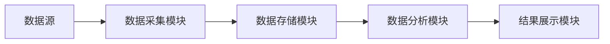

                 


# 股市估值差异对国际创新生态系统的影响

> 关键词：股市估值差异、创新生态系统、投资者行为、宏观经济因素、系统架构

> 摘要：本文探讨了股市估值差异对国际创新生态系统的影响，分析了估值差异的形成机制及其对创新生态系统的多方面影响。通过构建数学模型和系统架构，本文揭示了估值差异如何影响创新资源分配、企业融资能力以及创新动力，最终为政策制定者和投资者提供了实践建议。

---

## 第一部分：股市估值差异与创新生态系统概述

### 第1章：股市估值差异与创新生态系统概述

#### 1.1 股市估值差异的定义与背景
##### 1.1.1 股市估值的基本概念
股市估值是通过市场参与者对上市公司未来盈利能力的预期，确定其股票价格的过程。股票价格反映了市场对公司的整体价值评估，而估值差异则指同一市场中不同股票或同一股票在不同时间点的估值差异。

##### 1.1.2 估值差异的形成原因
1. **市场情绪**：投资者情绪波动会导致股票价格偏离其实际价值，从而引发估值差异。
2. **信息不对称**：不同投资者掌握的信息不同，导致对同一股票的估值出现差异。
3. **投资者行为**：不同类型的投资者（如短期交易者和长期投资者）在市场中的行为差异也会导致估值差异。

##### 1.1.3 创新生态系统的核心概念
创新生态系统是由企业、投资者、政府、科研机构等多方参与者共同构建的系统，其目标是推动技术创新和商业创新。创新生态系统的核心在于资源的高效分配和合作。

---

#### 1.2 股市估值差异与创新生态系统的关系
##### 1.2.1 创新生态系统的主要组成部分
1. **创新主体**：企业、科研机构、个人。
2. **创新资源**：资金、技术、人才。
3. **创新环境**：政策、市场、文化。

##### 1.2.2 估值差异对创新生态系统的影响路径
1. **资源分配**：估值差异影响资金流向，进而影响创新资源的分配。
2. **企业融资**：估值差异影响企业的融资能力，从而影响其创新投入。
3. **创新动力**：估值差异影响企业的创新动力，高估值可能激励企业创新，低估值可能导致创新停滞。

##### 1.2.3 国际化视角下的估值差异问题
在国际化背景下，不同国家的股市估值差异受到汇率、贸易政策、地缘政治等多种因素的影响，这些因素进一步影响国际创新生态系统的稳定性。

---

#### 1.3 问题背景与研究意义
##### 1.3.1 当前股市估值差异的主要表现
近年来，全球股市波动加剧，尤其是在新冠疫情期间，许多科技公司的股票估值出现了显著差异。

##### 1.3.2 创新生态系统在国际经济中的地位
创新生态系统是推动经济增长的关键引擎，尤其是在技术驱动型经济中，创新生态系统的健康与否直接影响经济的可持续发展。

##### 1.3.3 研究估值差异对创新生态系统影响的重要性
研究估值差异对创新生态系统的影响有助于政策制定者和投资者更好地理解市场机制，优化资源配置，促进创新。

---

## 第二部分：股市估值差异的形成机制与影响分析

### 第2章：股市估值差异的形成机制

#### 2.1 市场参与者行为分析
##### 2.1.1 投资者行为对估值差异的影响
投资者的行为受市场情绪、风险偏好等因素影响，导致股票估值出现差异。例如，短期交易者可能因市场波动而频繁交易，导致股票价格偏离其实际价值。

##### 2.1.2 机构投资者的角色
机构投资者通过集中投资和专业分析，对股票估值有较大影响。然而，不同机构的分析结果可能不同，导致估值差异。

##### 2.1.3 信息不对称与市场预期
信息不对称会导致市场参与者对同一股票的估值出现差异。例如，内部信息掌握较多的投资者可能对股票有更高的估值，而普通投资者则可能低估其价值。

---

#### 2.2 市场波动与估值差异
##### 2.2.1 市场波动的定义与特征
市场波动是指股票价格的短期剧烈波动，通常由市场情绪、突发事件等因素引发。

##### 2.2.2 市场波动对估值差异的作用机制
市场波动会导致股票价格的短期剧烈波动，从而引发估值差异。例如，突发事件可能导致某公司股票价格暴跌，而其他公司股票价格相对稳定。

##### 2.2.3 市场情绪与估值差异的关系
市场情绪是影响股票估值的重要因素。当市场情绪乐观时，股票估值可能偏高；当市场情绪悲观时，股票估值可能偏低。

---

#### 2.3 宏观经济因素对估值差异的影响
##### 2.3.1 经济周期与估值差异
经济周期波动会影响企业的盈利能力和市场的整体估值。例如，在经济衰退期间，许多公司的股票估值可能低于其实际价值。

##### 2.3.2 利率政策与估值差异
利率政策通过影响资金成本和投资回报率，间接影响股票估值。例如，低利率环境可能导致股票估值上升，而高利率环境可能导致股票估值下降。

##### 2.3.3 汇率波动与估值差异
汇率波动会影响跨国公司的盈利能力和股票估值。例如，本币贬值可能导致出口型公司的股票估值上升，而进口型公司的股票估值可能下降。

---

### 第3章：股市估值差异的算法原理与数学模型

#### 3.1 数据挖掘与估值差异分析
##### 3.1.1 数据采集与预处理
从多个数据源获取股票价格、公司财务数据等信息，并进行清洗和预处理。

##### 3.1.2 特征提取与选择
通过统计分析和机器学习方法，提取影响股票估值的关键特征，例如市盈率、市净率等。

##### 3.1.3 估值差异预测模型
基于提取的特征，构建回归模型或分类模型，预测股票的估值差异。

---

#### 3.2 数学模型构建
##### 3.2.1 基于回归分析的模型
$$ y = \beta_0 + \beta_1x_1 + \beta_2x_2 + \epsilon $$
其中，$y$ 是估值差异，$x_1$ 和 $x_2$ 是影响估值差异的特征变量，$\epsilon$ 是误差项。

##### 3.2.2 时间序列分析模型
$$ ARIMA(p, d, q) $$
用于分析股票价格的时间序列数据，预测未来的估值差异。

---

### 第4章：系统架构与数据流分析

#### 4.1 系统功能设计
##### 4.1.1 数据采集模块
负责从多个数据源采集股票价格、公司财务数据等信息。

##### 4.1.2 数据分析模块
对采集的数据进行清洗、特征提取和建模分析。

##### 4.1.3 结果展示模块
将分析结果以可视化的方式展示，帮助用户理解估值差异的影响。

#### 4.2 系统架构图


---

### 第5章：项目实战与案例分析

#### 5.1 环境安装
安装必要的数据处理和分析工具，例如Python、Pandas、Scikit-learn等。

#### 5.2 核心代码实现
```python
import pandas as pd
from sklearn.linear_model import LinearRegression

# 数据预处理
data = pd.read_csv('stock_data.csv')
X = data[['市盈率', '市净率']]
y = data['估值差异']

# 建立回归模型
model = LinearRegression()
model.fit(X, y)

# 预测结果
predicted = model.predict(X)
```

#### 5.3 案例分析
以某科技公司为例，分析其股票估值差异对创新生态系统的影响。通过模型预测，发现其股票估值差异显著，可能影响其创新投入。

---

## 第六部分：总结与展望

### 第6章：总结与展望

#### 6.1 核心发现
股市估值差异对创新生态系统的影响复杂且深远，涉及多方参与者的行为和宏观经济因素。

#### 6.2 实践建议
政策制定者和投资者应关注估值差异的形成机制，优化资源配置，促进创新生态系统的健康发展。

#### 6.3 未来研究方向
未来研究可以进一步探讨人工智能技术在估值差异分析中的应用，以及全球化背景下估值差异的跨国影响。

---

## 作者：AI天才研究院 & 禅与计算机程序设计艺术

