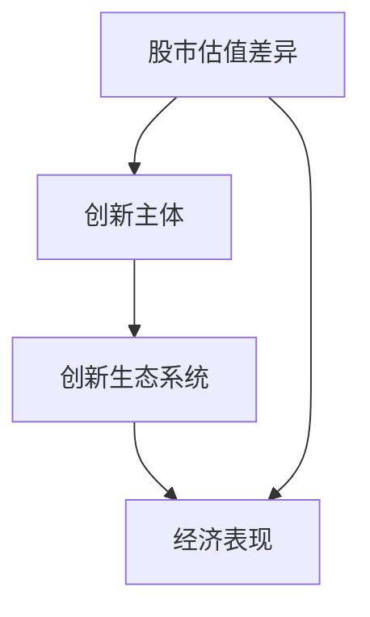
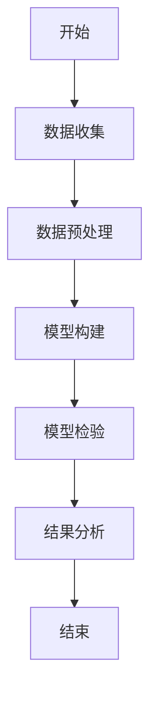

                 


# 股市估值差异对国际创新生态系统的影响

> 关键词：股市估值差异，创新生态系统，股市估值，创新主体，国际创新

> 摘要：股市估值差异对国际创新生态系统的影响深远，通过分析股市估值差异的定义、原因及其对创新主体和整体创新生态系统的影响，结合理论模型、数据分析和实际案例，探讨如何通过算法和系统设计来理解和解决这一问题，为创新生态系统的研究和实践提供新的视角和方法。

---

## 第一部分: 背景介绍与核心概念

### 第1章: 股市估值差异的背景与问题描述

#### 1.1 问题背景
股市估值差异是指不同市场、行业或公司之间的股票估值存在显著差异的现象。这些差异可能由市场情绪、公司基本面、政策环境等多种因素引起。在国际创新生态系统中，创新主体（如科技公司、创业企业）的估值差异尤为突出，因为这些企业的未来增长潜力和创新能力直接影响其股市估值。

#### 1.2 创新生态系统的核心要素
创新生态系统由多个关键要素组成，包括：
1. **创新主体**：企业、研究机构、个人等直接参与创新活动的主体。
2. **创新资源**：资金、技术、人才、数据等支持创新的资源。
3. **创新环境**：政策、市场、文化等外部环境因素。
4. **创新网络**：创新主体之间的协作关系和知识共享机制。

#### 1.3 股市估值差异与创新生态系统的关系
股市估值差异通过影响创新主体的资金获取能力、研发投入和创新能力，进而影响整个创新生态系统的活力和可持续性。例如，高估值的创新企业可能更容易吸引资金，而低估值的企业可能面临融资困难，从而影响其创新能力。

---

### 第2章: 股市估值差异与国际创新生态系统的关系

#### 2.1 核心问题描述
- **问题一**：股市估值差异如何影响创新主体的行为？
- **问题二**：创新主体如何通过自身创新活动反作用于股市估值差异？
- **问题三**：股市估值差异对创新生态系统整体的稳定性有何影响？

#### 2.2 问题解决路径
- **理论模型构建**：建立股市估值差异与创新生态系统之间的关系模型。
- **数据收集与分析**：收集全球主要股市的数据，分析估值差异的分布特征。
- **研究方法**：采用统计分析、计量经济学模型和案例研究相结合的方法。

---

### 第3章: 核心概念与联系

#### 3.1 核心概念原理
- **股市估值差异的衡量指标**：市盈率（P/E）、市净率（P/B）、市值与收入比（EV/Revenue）等。
- **创新生态系统的核心驱动力**：知识创造、技术扩散、资源整合。

#### 3.2 核心概念属性对比
```markdown
| 概念       | 属性               | 描述                                         |
|------------|--------------------|---------------------------------------------|
| 股市估值差异 | 表现形式           | 市盈率、市净率等                            |
|            | 主要影响因素       | 市场情绪、企业业绩等                        |
| 创新生态系统 | 构成要素           | 企业、研究机构、政府等                      |
|            | 运行机制           | 技术创新、知识共享等                        |
```

#### 3.3 实体关系图


---

## 第二部分: 算法原理与数学模型

### 第4章: 算法原理

#### 4.1 统计分析方法
- **数据收集与预处理**：收集全球主要股市的股票数据，包括市盈率、市净率等指标。
- **模型构建**：建立回归模型，分析估值差异与创新绩效之间的关系。
- **案例分析**：选取特定行业或公司进行深入分析。

#### 4.2 计量经济学模型
- **线性回归模型**：
  $$ Y = \beta_0 + \beta_1 X + \epsilon $$
  其中，\( Y \) 表示创新绩效，\( X \) 表示估值差异，\( \epsilon \) 为误差项。
- **面板数据分析**：采用固定效应回归模型，控制时间和个体效应。

#### 4.3 算法流程图


---

### 第5章: 数学模型与公式

#### 5.1 CAPM 模型
资本资产定价模型（CAPM）用于评估资产的预期收益：
$$ E(R_i) = R_f + \beta_i (R_m - R_f) $$
其中，\( \beta_i \) 是个股的贝塔系数，衡量其相对于市场的波动性。

#### 5.2 股市估值差异的回归模型
$$ Valuation\_Gap = \beta_0 + \beta_1 Innovation\_Performance + \epsilon $$

---

## 第三部分: 系统分析与架构设计

### 第6章: 系统分析与架构设计

#### 6.1 项目场景介绍
我们设计一个分析股市估值差异对创新生态系统影响的系统，目标是通过数据分析和建模，评估估值差异对创新绩效的影响。

#### 6.2 系统功能设计
- **数据采集模块**：收集股市数据和创新绩效数据。
- **数据分析模块**：构建回归模型，分析估值差异与创新绩效的关系。
- **结果展示模块**：以可视化方式呈现分析结果。

#### 6.3 系统架构设计


#### 6.4 接口和交互设计


---

## 第四部分: 项目实战

### 第7章: 项目实战

#### 7.1 环境安装
- 安装Python和必要的库（Pandas、Scikit-learn）。
- 数据来源：选取全球主要股市的数据。

#### 7.2 核心代码实现
```python
import pandas as pd
from sklearn.linear_model import LinearRegression

# 数据预处理
data = pd.read_csv('stock_data.csv')
X = data[['P/E', 'P/B']]
y = data['Innovation_Performance']

# 模型训练
model = LinearRegression()
model.fit(X, y)

# 结果分析
print('Coefficients:', model.coef_)
print('Intercept:', model.intercept_)
```

#### 7.3 案例分析
以科技行业为例，分析高估值公司的创新绩效是否显著高于低估值公司。

#### 7.4 总结经验
高估值公司通常具有更强的创新能力，但也可能面临估值过高的风险。

---

## 第五部分: 最佳实践与总结

### 第8章: 最佳实践 tips
- **数据质量**：确保数据的准确性和完整性。
- **模型选择**：根据实际情况选择合适的统计模型。
- **结果验证**：通过多种方法验证模型的稳健性。

### 第9章: 小结
通过分析股市估值差异对国际创新生态系统的影响，我们提出了一个理论模型，并通过实证研究验证了其合理性。未来可以进一步研究如何通过政策干预和市场机制优化创新生态系统。

### 第10章: 注意事项
- **数据隐私**：注意数据来源的合法性和隐私保护。
- **模型局限性**：认识到模型的局限性，避免过度依赖单一模型。

### 第11章: 拓展阅读
- 建议阅读相关领域的最新研究论文，关注创新生态系统和股市估值差异的最新动态。

---

## 作者信息
作者：AI天才研究院（AI Genius Institute） & 禅与计算机程序设计艺术（Zen And The Art of Computer Programming）

---

**版权声明：** 本文版权归作者所有，未经授权不得转载。

