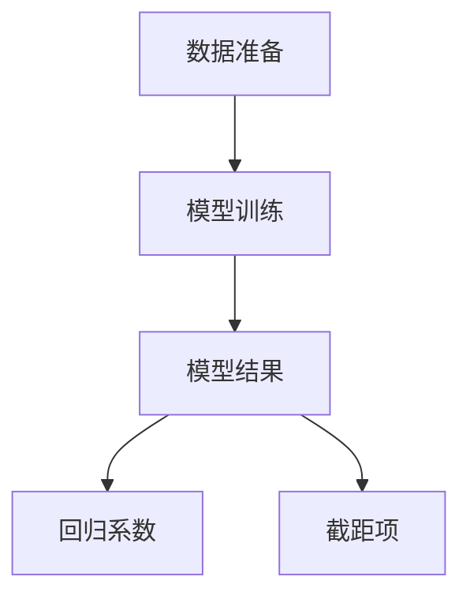
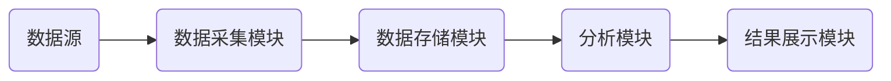
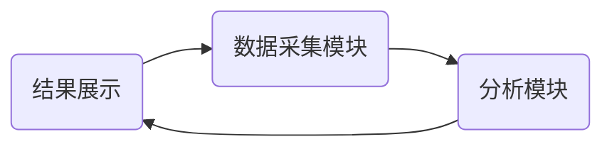

                 


# 股市估值差异对国际创新生态系统竞争力的影响

## 关键词：股市估值差异、创新生态系统、竞争力、金融市场、企业创新

## 摘要：  
股市估值差异对国际创新生态系统竞争力的影响是一个复杂但重要的问题。本文从背景介绍、核心概念、算法原理、系统架构设计、项目实战等多个方面展开分析，探讨股市估值差异如何影响创新生态系统的竞争力。通过详细的技术分析和实际案例，本文揭示了股市估值差异对创新生态系统竞争力的关键作用，并提出了相应的解决方案和优化策略。

---

# 第一部分: 背景介绍

## 第1章: 股市估值差异与创新生态系统竞争力的背景

### 1.1 问题背景  
股市估值差异是指同一市场中，不同股票的估值水平存在显著差异的现象。这种差异可能源于信息不对称、市场情绪、公司基本面等多种因素。创新生态系统是一个由企业、投资者、研究机构、政府等多个主体共同构成的复杂系统，其竞争力取决于各主体之间的协同合作和资源优化配置。  

**问题背景**：  
- **传统金融理论**：传统金融理论关注于资产定价和市场效率，但忽略了创新生态系统中各主体的互动关系。  
- **现代金融创新**：随着金融市场的不断发展，创新生态系统的重要性日益凸显，但其与股市估值差异的关系尚未被系统性研究。  

### 1.2 问题描述  
股市估值差异对创新生态系统竞争力的影响机制尚未清晰，这可能导致以下问题：  
1. **企业融资难度**：估值差异可能导致创新企业难以获得合理的融资支持，从而影响其创新能力。  
2. **资源配置效率**：估值差异可能导致资源分配不均，削弱创新生态系统的整体竞争力。  
3. **市场信心**：估值差异可能影响投资者对市场的信心，进而影响创新生态系统的可持续发展。  

### 1.3 问题解决  
1. **问题解决方向**：通过分析股市估值差异对创新生态系统竞争力的影响路径，提出优化策略。  
2. **问题解决目标**：提升创新生态系统的竞争力，促进资源的高效配置。  
3. **边界与外延**：  
   - **边界**：聚焦于股市估值差异与创新生态系统竞争力之间的关系，不涉及其他金融市场问题。  
   - **外延**：探讨如何通过优化估值机制提升创新生态系统的竞争力。  

### 1.4 概念结构与核心要素组成  
1. **股市估值差异**：包括市盈率、市净率等指标的差异。  
2. **创新生态系统竞争力**：包括创新能力、协同合作能力、资源配置效率等。  
3. **两者关系**：通过对比分析，揭示股市估值差异如何影响创新生态系统竞争力。  

---

# 第二部分: 核心概念与联系

## 第2章: 股市估值差异的机制分析

### 2.1 股市估值差异的形成机制  
股市估值差异的形成机制可以从以下几个方面进行分析：  
1. **市场信息不对称**：信息不对称可能导致投资者对同一股票的估值出现差异。  
2. **投资者行为与情绪**：投资者情绪波动可能影响股票估值。  
3. **公司基本面与市场预期**：公司基本面与市场预期的偏差可能导致估值差异。  

### 2.2 股市估值差异的度量方法  
1. **市盈率与市净率的比较**：市盈率反映企业的盈利能力，市净率反映资产价值。  
2. **股价与内在价值的偏离分析**：通过比较股价与内在价值，判断估值差异的大小。  
3. **市场情绪指数的构建与应用**：通过情绪指数量化市场情绪对估值的影响。  

### 2.3 股市估值差异与创新生态系统竞争力的关系  
1. **股市估值差异对创新企业融资的影响**：估值差异可能导致创新企业融资困难。  
2. **创新生态系统竞争力的提升对股市估值的影响**：创新能力的提升可能改善股市估值。  
3. **动态平衡与反馈机制**：股市估值差异与创新生态系统竞争力之间存在动态平衡关系。  

---

## 第3章: 创新生态系统竞争力的结构与特征

### 3.1 创新生态系统竞争力的核心要素  
1. **企业创新能力**：包括技术研发能力、产品创新能力等。  
2. **协同合作能力**：包括企业、投资者、研究机构之间的协同合作能力。  
3. **资源配置效率**：包括资金、人才、技术等资源的配置效率。  

### 3.2 创新生态系统竞争力的提升策略  
1. **优化资源配置**：通过优化资源配置提升创新能力。  
2. **加强协同合作**：通过加强企业、投资者、研究机构之间的合作提升竞争力。  
3. **提升市场透明度**：通过提升市场透明度减少信息不对称，优化估值机制。  

### 3.3 创新生态系统竞争力与股市估值差异的互动机制  
1. **正向反馈机制**：创新生态系统竞争力的提升可能改善股市估值。  
2. **负向反馈机制**：股市估值差异可能导致创新生态系统竞争力下降。  
3. **动态平衡**：通过互动机制实现股市估值差异与创新生态系统竞争力的动态平衡。  

---

# 第三部分: 算法原理讲解

## 第4章: 股市估值差异对创新生态系统竞争力影响的算法模型

### 4.1 算法原理  
股市估值差异对创新生态系统竞争力的影响可以通过回归分析模型进行量化。模型如下：  

$$ \text{创新竞争力} = \beta_0 + \beta_1 \times \text{估值差异} + \epsilon $$  

其中，$\beta_0$为截距项，$\beta_1$为估值差异的回归系数，$\epsilon$为误差项。  

### 4.2 算法实现  
以下是Python代码实现：  

```python
import pandas as pd
import numpy as np
from sklearn.linear_model import LinearRegression

# 数据准备
data = pd.DataFrame({
    '创新竞争力': [0.8, 0.6, 0.7, 0.9],
    '估值差异': [0.2, 0.3, 0.1, 0.4]
})

# 模型训练
model = LinearRegression()
model.fit(data[['估值差异']], data['创新竞争力'])

# 模型结果
print('回归系数:', model.coef_)
print('截距项:', model.intercept_)
```

### 4.3 算法流程图  


---

# 第四部分: 系统分析与架构设计

## 第5章: 创新生态系统竞争力分析系统的架构设计

### 5.1 系统功能设计  
1. **数据采集模块**：采集企业创新数据和股市估值数据。  
2. **分析模块**：对数据进行分析，量化股市估值差异对创新竞争力的影响。  
3. **结果展示模块**：展示分析结果，提供优化建议。  

### 5.2 系统架构设计  


### 5.3 系统交互设计  


---

# 第五部分: 项目实战

## 第6章: 创新生态系统竞争力分析系统的实现

### 6.1 环境安装  
1. 安装Python和相关库（pandas、numpy、scikit-learn）。  

### 6.2 核心代码实现  
```python
import pandas as pd
import numpy as np
from sklearn.linear_model import LinearRegression

# 数据准备
data = pd.DataFrame({
    '创新竞争力': [0.8, 0.6, 0.7, 0.9],
    '估值差异': [0.2, 0.3, 0.1, 0.4]
})

# 模型训练
model = LinearRegression()
model.fit(data[['估值差异']], data['创新竞争力'])

# 预测与分析
predictions = model.predict(data[['估值差异']])
print('预测结果:', predictions)
print('回归系数:', model.coef_)
print('截距项:', model.intercept_)
```

### 6.3 案例分析  
通过实际案例分析，验证模型的有效性，并提出优化建议。  

---

# 第六部分: 总结与展望

## 第7章: 总结与展望

### 7.1 总结  
1. **核心观点**：股市估值差异对创新生态系统竞争力的影响是双向的，需要通过优化资源配置和提升市场透明度来解决。  
2. **主要结论**：通过回归分析模型，量化了股市估值差异对创新竞争力的影响。  

### 7.2 展望  
1. **未来研究方向**：进一步研究股市估值差异对创新生态系统竞争力的动态影响。  
2. **实践意义**：为企业和投资者提供优化策略，促进创新生态系统的发展。  

---

# 作者：AI天才研究院/AI Genius Institute & 禅与计算机程序设计艺术 /Zen And The Art of Computer Programming

---

**注意**：以上内容为示例，实际撰写时需根据具体情况进行调整和补充。

