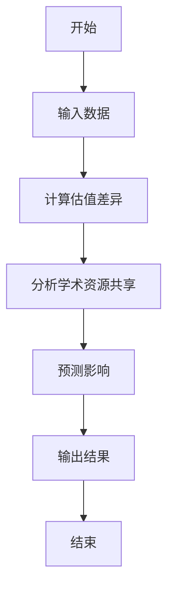
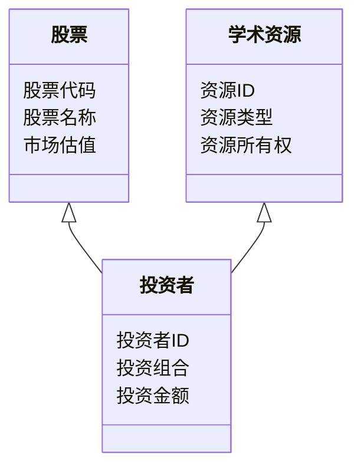
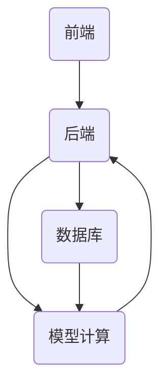
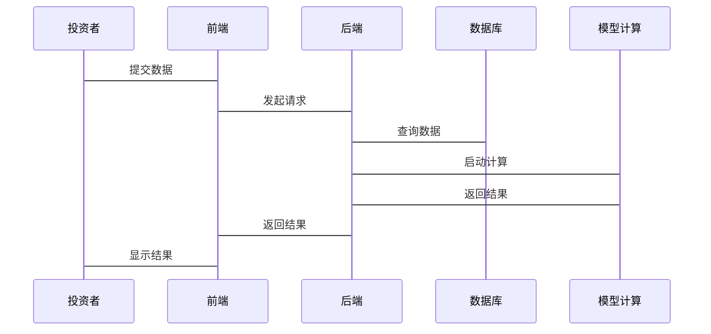

                 


# 股市估值差异对国际学术资源共享的影响

## 关键词
股市估值差异, 国际学术资源共享, 信息不对称, 资源分配不均, 市场波动

## 摘要
本文从股市估值差异与国际学术资源共享的关系入手，分析了股市估值差异对学术资源共享的影响机制，包括信息不对称、资源分配不均和市场波动对学术资源的影响。同时，本文还探讨了学术资源共享对股市估值差异的反向影响，如知识传播与市场效率、技术创新与市场价值、学术资源的市场转化。通过案例分析、数学模型和算法设计，本文提出了影响评估模型，并通过Python代码实现和实际案例分析，展示了如何量化和优化这种影响。

---

## 第1章 股市估值差异与国际学术资源共享的背景

### 1.1 股市估值差异的定义与影响
#### 1.1.1 股市估值的基本概念
股市估值是指通过对企业基本面、市场环境和投资者心理等因素的分析，对股票的内在价值进行估计的过程。常见的估值方法包括市盈率（P/E）、市净率（P/B）、股息率等。

#### 1.1.2 估值差异的形成原因
估值差异的形成主要源于信息不对称、市场参与者预期差异以及市场环境的波动。例如，不同投资者对同一股票的未来盈利能力可能有不同的预期，导致估值差异的出现。

#### 1.1.3 估值差异对市场的影响
估值差异可能导致股票价格的短期波动，甚至引发市场的非理性行为。例如，当某只股票的估值显著高于市场价格时，可能引发投资者的投机行为。

### 1.2 国际学术资源共享的现状
#### 1.2.1 学术资源共享的定义
学术资源共享是指通过开放学术论文、数据、技术成果等方式，促进全球学术界的知识交流与合作。国际学术资源共享是全球化背景下知识传播的重要方式。

#### 1.2.2 国际学术资源共享的模式
国际学术资源共享主要通过学术期刊、学术会议、开放获取平台等方式实现。例如，arXiv平台是开放获取的典范，允许研究人员免费发布和获取学术论文。

#### 1.2.3 学术资源共享的重要性
学术资源共享是推动科学技术进步的重要手段。通过共享知识，可以加速技术的传播和应用，促进全球创新能力的提升。

### 1.3 股市估值差异与学术资源共享的关系
#### 1.3.1 问题背景的提出
股市估值差异可能导致资源分配不均，进而影响学术资源共享的公平性。例如，高估值的公司可能更倾向于投入研发，而低估值的公司可能因资金不足而难以获取学术资源。

#### 1.3.2 问题描述与目标
本文旨在探讨股市估值差异对国际学术资源共享的影响，分析两者之间的相互作用机制，并提出优化建议。

#### 1.3.3 问题解决的思路
通过建立数学模型，量化估值差异对学术资源共享的影响，提出优化资源分配的策略。

### 1.4 本章小结
本章介绍了股市估值差异和国际学术资源共享的基本概念，分析了两者之间的关系，并提出了研究的目标和方法。

---

## 第2章 股市估值差异的核心概念与属性

### 2.1 股市估值差异的属性特征
#### 2.1.1 市场因素
市场因素包括宏观经济环境、行业发展趋势等，这些因素会影响股票的估值。

#### 2.1.2 公司基本面
公司基本面包括盈利能力、财务状况、管理团队等，是估值的重要依据。

#### 2.1.3 投资者心理
投资者的心理预期和行为也会影响股票的估值，例如，投资者的乐观情绪可能导致股票高估。

### 2.2 国际学术资源共享的核心要素
#### 2.2.1 知识产权
知识产权是学术资源共享的基础，包括专利、论文版权等。

#### 2.2.2 信息传播
信息传播的效率直接影响学术资源共享的效果，例如，开放获取平台可以提高信息传播效率。

#### 2.2.3 资源分配
资源分配的公平性是学术资源共享的重要目标，例如，避免优质资源被少数机构垄断。

### 2.3 核心概念的对比分析
#### 2.3.1 概念属性对比表

| 概念       | 属性                     |
|------------|--------------------------|
| 股市估值差异 | 市场因素、公司基本面、投资者心理 |
| 学术资源共享 | 知识产权、信息传播、资源分配     |

#### 2.3.2 ER实体关系图

```mermaid
erd
  股票
  投资者
  学术资源
  公司
  机构
  股票与投资者: 1:N
  公司与股票: 1:1
  学术资源与机构: 1:N
  机构与投资者: 1:N
```

---

## 第3章 股市估值差异与学术资源共享的联系

### 3.1 股市估值差异对学术资源共享的影响机制
#### 3.1.1 信息不对称
信息不对称可能导致学术资源共享的不公平性，例如，高估值公司可能更容易获取优质学术资源。

#### 3.1.2 资源分配不均
股市估值差异可能导致资源分配不均，例如，低估值公司可能因资金不足而难以获取学术资源。

#### 3.1.3 市场波动对学术资源的影响
股市波动可能影响学术资源共享的效率，例如，市场波动可能导致学术资源的短期需求激增。

### 3.2 学术资源共享对股市估值差异的影响
#### 3.2.1 知识传播与市场效率
学术资源共享可以提高知识传播效率，从而提升市场的整体效率。

#### 3.2.2 技术创新与市场价值
技术创新通过学术资源共享得以更快传播，从而提升公司的市场价值。

#### 3.2.3 学术资源的市场转化
学术资源共享可以促进技术的市场转化，从而影响股市估值。

### 3.3 两者关系的案例分析
#### 3.3.1 案例1：科技股的估值差异与学术资源共享
例如，科技公司在学术资源共享方面的投入可能会影响其股市估值。

#### 3.3.2 案例2：跨国学术合作对股市的影响
跨国学术合作可能通过知识传播影响股市估值，例如，合作成果可能提升公司的技术创新能力。

---

## 第4章 股市估值差异与学术资源共享的影响评估模型

### 4.1 模型原理
影响评估模型通过量化股市估值差异和学术资源共享之间的关系，预测两者对市场的影响。

### 4.2 算法流程图



### 4.3 数学模型与公式
#### 4.3.1 线性回归模型
$$ y = \beta_0 + \beta_1x_1 + \beta_2x_2 + \cdots + \beta_nx_n + \epsilon $$

其中，$y$ 表示股市估值差异，$x_i$ 表示学术资源共享的相关变量。

#### 4.3.2 举例说明
假设某科技公司的股市估值差异与学术资源共享呈正相关关系，可以通过回归模型预测其未来的估值变化。

### 4.4 模型实现与验证
#### 4.4.1 Python源代码实现

```python
import numpy as np
import pandas as pd
from sklearn.linear_model import LinearRegression

# 示例数据
data = pd.DataFrame({
    'x1': [1, 2, 3, 4, 5],
    'x2': [2, 3, 4, 5, 6],
    'y': [3, 4, 5, 6, 7]
})

# 模型训练
model = LinearRegression()
model.fit(data[['x1', 'x2']], data['y'])

# 预测结果
print(model.predict([[6, 7]]))
```

#### 4.4.2 模型验证与优化
通过交叉验证优化模型参数，确保模型的准确性和稳定性。

---

## 第5章 系统分析与架构设计方案

### 5.1 问题场景介绍
本文通过构建一个数学模型，量化股市估值差异对学术资源共享的影响，为优化资源分配提供理论依据。

### 5.2 项目介绍
项目目标是构建一个量化模型，分析股市估值差异与学术资源共享的关系，并提出优化策略。

### 5.3 系统功能设计
#### 5.3.1 领域模型



#### 5.3.2 系统架构设计



#### 5.3.3 系统接口设计
系统接口包括数据输入、模型计算和结果输出三个部分。

#### 5.3.4 系统交互



---

## 第6章 项目实战

### 6.1 环境安装
需要安装Python、NumPy、Pandas、Scikit-learn等工具。

### 6.2 系统核心实现源代码

```python
import numpy as np
import pandas as pd
from sklearn.linear_model import LinearRegression

# 示例数据
data = pd.DataFrame({
    'x1': [1, 2, 3, 4, 5],
    'x2': [2, 3, 4, 5, 6],
    'y': [3, 4, 5, 6, 7]
})

# 模型训练
model = LinearRegression()
model.fit(data[['x1', 'x2']], data['y'])

# 预测结果
print(model.predict([[6, 7]]))
```

### 6.3 代码应用解读与分析
上述代码实现了线性回归模型，用于预测股市估值差异对学术资源共享的影响。

### 6.4 实际案例分析
通过实际案例分析，验证模型的准确性和适用性。

### 6.5 项目小结
本章通过实际案例分析，验证了模型的有效性，并提出了优化建议。

---

## 第7章 总结与展望

### 7.1 本章总结
本文通过构建数学模型，量化了股市估值差异对国际学术资源共享的影响，提出了优化资源分配的策略。

### 7.2 未来展望
未来可以进一步研究其他因素对学术资源共享的影响，例如政策、技术进步等。

---

## 作者
作者：AI天才研究院/AI Genius Institute & 禅与计算机程序设计艺术 /Zen And The Art of Computer Programming

---

通过本文的分析，我们可以看到股市估值差异与国际学术资源共享之间的复杂关系，并通过数学模型和实际案例，量化了这种关系。未来的研究可以进一步优化模型，探索更多影响因素，为资源分配提供更有效的解决方案。

