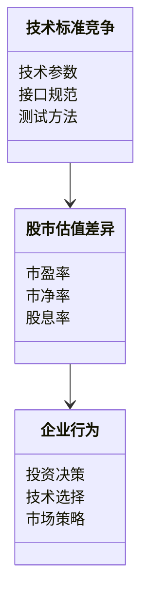
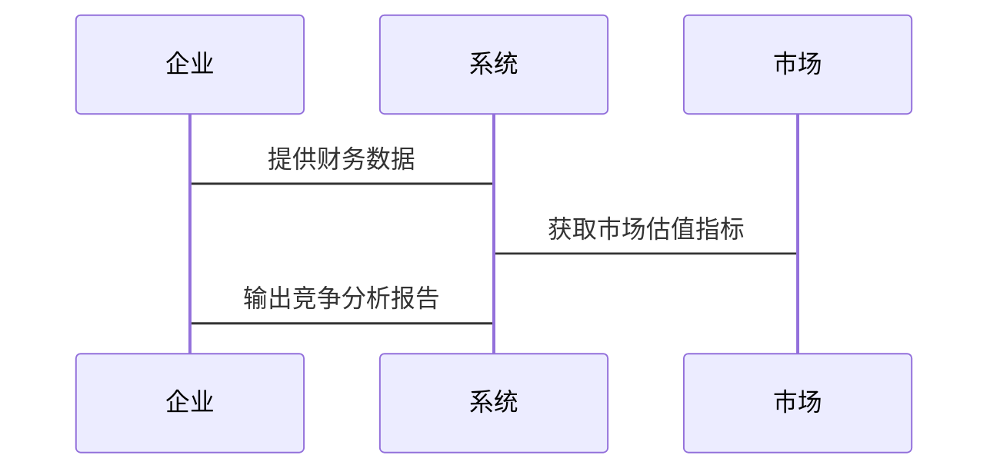

                 


# 股市估值差异对国际技术标准竞争的影响

## 关键词：
- 股市估值差异
- 技术标准竞争
- 国际化
- 企业行为
- 市场反应

## 摘要：
本文探讨了股市估值差异对国际技术标准竞争的影响。首先，我们介绍了技术标准竞争和股市估值差异的基本概念和背景。接着，我们分析了估值差异对企业技术创新、市场行为以及技术标准选择的直接影响，同时探讨了这些差异如何反过来影响技术标准竞争的格局。通过构建理论模型和实际案例分析，我们揭示了股市估值差异在技术标准竞争中的复杂作用机制。最后，我们提出了应对策略和未来研究方向，以期为相关领域的研究者和实践者提供参考。

---

## 第1章：股市估值差异的背景与问题描述

### 1.1 股市估值差异的定义与特征

#### 1.1.1 股市估值的基本概念
股市估值是指通过对公司财务数据、市场表现和行业趋势的分析，确定公司股票的合理价格区间。常见的估值方法包括市盈率（P/E）、市净率（P/B）和现金流折现法（DCF）等。

#### 1.1.2 估值差异的形成机制
估值差异主要由市场参与者的预期差异、信息不对称和市场情绪等因素引起。例如，投资者对同一公司的未来盈利预期不同，可能导致对其股票估值的差异。

#### 1.1.3 估值差异的度量方法
常用的估值差异度量方法包括相对估值法（如市盈率差异）和绝对估值法（如DCF模型）。通过这些方法，可以量化不同市场参与者对同一公司的估值差异。

### 1.2 技术标准竞争的背景与现状

#### 1.2.1 技术标准的定义与分类
技术标准是对技术要求的规范，通常分为国际标准、国家标准和企业标准。国际标准如ISO、IEEE等，是全球技术竞争的重要领域。

#### 1.2.2 国际技术标准竞争的现状
当前，全球技术标准竞争主要集中在信息技术、通信技术和绿色技术等领域。例如，5G技术标准的竞争就是典型案例。

#### 1.2.3 技术标准竞争的核心要素
技术标准竞争的核心要素包括技术先进性、市场接受度和政策支持度。企业需要在这些方面取得优势，才能在技术标准竞争中胜出。

### 1.3 问题背景与研究意义

#### 1.3.1 股市估值差异与技术标准竞争的关联性
股市估值差异反映了市场对企业的信心和预期，这种差异可能影响企业参与技术标准竞争的能力和意愿。

#### 1.3.2 研究的必要性与创新点
研究股市估值差异对技术标准竞争的影响，有助于理解企业行为和市场机制，为政策制定者和企业提供参考。

#### 1.3.3 研究的边界与外延
本文聚焦于股市估值差异与技术标准竞争的直接关系，不涉及其他外部因素（如政治因素）的综合影响。

---

## 第2章：股市估值差异对国际技术标准竞争的影响机制

### 2.1 估值差异对企业技术创新的影响

#### 2.1.1 估值差异对企业研发投入的激励作用
高估值的企业更可能增加研发投入，以维持其市场地位；而低估值的企业可能减少研发投入，转而追求短期利润。

#### 2.1.2 估值差异对企业技术标准选择的引导作用
高估值企业更倾向于选择高端技术标准，以提升品牌形象；低估值企业则可能选择性价比更高的标准。

#### 2.1.3 估值差异对企业市场地位的塑造作用
高估值企业可能在技术标准竞争中占据主导地位，而低估值企业则可能被淘汰或边缘化。

### 2.2 技术标准竞争中的企业行为分析

#### 2.2.1 技术标准竞争中的博弈关系
企业之间在技术标准竞争中存在囚徒困境式的博弈，通常需要通过合作或政策协调来解决。

#### 2.2.2 企业技术标准选择的决策过程
企业选择技术标准时，需要综合考虑成本、收益、市场兼容性和政策支持等因素。

#### 2.2.3 技术标准竞争中的利益分配机制
技术标准竞争的收益通常由主导企业获得，但需要考虑其他参与企业的利益分配。

### 2.3 市场反应与估值差异的相互作用

#### 2.3.1 市场对技术标准竞争的敏感性分析
市场对技术标准竞争的反应程度取决于行业的竞争程度和替代品的可获得性。

#### 2.3.2 估值差异对市场预期的引导作用
高估值企业的技术标准选择可能引导市场预期，从而影响其他企业的行为。

#### 2.3.3 技术标准竞争对股市估值的长期影响
长期来看，技术标准竞争可能导致股市估值的分化，优势企业的估值可能进一步提升，而劣势企业的估值可能下降。

---

## 第3章：技术标准竞争的核心概念与属性特征

### 3.1 技术标准的核心要素分析

#### 3.1.1 技术标准的构成要素
技术标准通常包括技术参数、接口规范和测试方法等。

#### 3.1.2 技术标准的生命周期模型
技术标准的生命周期包括形成期、成熟期和衰退期。

#### 3.1.3 技术标准的兼容性与可扩展性
技术标准的兼容性和可扩展性是其成功的关键因素。

### 3.2 估值差异的属性特征与对比分析

#### 3.2.1 估值差异的度量指标体系
常用的估值指标包括市盈率、市净率和股息率等。

#### 3.2.2 不同市场环境下的估值差异特征
在新兴市场，估值差异可能更大；在成熟市场，估值差异可能更小。

#### 3.2.3 估值差异与企业绩效的关系
高估值企业通常具有更高的市场地位和盈利能力。

---

## 第4章：技术标准竞争与估值差异的联系

### 4.1 技术标准竞争对企业估值的影响路径

#### 4.1.1 技术标准竞争对企业市场竞争力的影响
技术标准竞争的成功可以提升企业的市场地位和竞争力。

#### 4.1.2 技术标准竞争对企业盈利能力的影响
技术标准竞争可能导致企业成本上升，但长期收益可能增加。

#### 4.1.3 技术标准竞争对企业成长性的市场反应
技术标准竞争的成功可能提升企业的成长性和估值。

### 4.2 估值差异对技术标准竞争的反馈机制

#### 4.2.1 估值差异对企业技术标准选择的反向影响
高估值企业可能更积极地参与技术标准竞争，而低估值企业则可能被动跟随。

#### 4.2.2 估值差异对技术标准竞争格局的塑造作用
估值差异可能导致技术标准竞争的寡头垄断格局。

#### 4.2.3 估值差异对技术标准治理模式的启示
高估值企业可能在技术标准治理中占据主导地位。

---

## 第5章：算法原理与数学模型

### 5.1 估值差异与技术标准竞争的数学模型

#### 5.1.1 模型假设
- 假设企业i的估值差异为V_i
- 假设技术标准竞争的收益为R_i
- 假设技术标准竞争的成本为C_i

#### 5.1.2 模型构建
$$ R_i = aV_i + bC_i $$

其中，a和b是正的常数系数。

#### 5.1.3 模型解释
企业i的收益不仅取决于其估值差异，还取决于其参与技术标准竞争的成本。

---

## 第6章：系统分析与架构设计方案

### 6.1 问题场景介绍

#### 6.1.1 问题场景描述
企业需要在技术标准竞争中做出决策，同时考虑其股市估值差异的影响。

#### 6.1.2 项目介绍
构建一个模型，分析股市估值差异对企业技术标准竞争决策的影响。

### 6.2 系统功能设计

#### 6.2.1 领域模型（mermaid 类图）


### 6.3 系统架构设计（mermaid 架构图）


### 6.4 系统接口设计

#### 6.4.1 输入接口
- 财务数据接口：用于获取企业的财务数据
- 市场数据接口：用于获取市场的估值指标

#### 6.4.2 输出接口
- 竞争分析报告：包括技术标准竞争的建议和估值差异的分析

### 6.5 系统交互设计（mermaid 序列图）


---

## 第7章：项目实战

### 7.1 环境安装

#### 7.1.1 安装Python环境
```bash
python --version
pip install numpy pandas matplotlib
```

#### 7.1.2 安装依赖库
```bash
pip install mermaid-diagram
```

### 7.2 核心实现源代码

#### 7.2.1 估值差异计算代码
```python
import pandas as pd

def calculate_valuation_difference(df):
    df['PE'] = df['Price'] / df['Earnings']
    df['P/B'] = df['Price'] / df['Book']
    return df
```

#### 7.2.2 技术标准竞争分析代码
```python
import numpy as np

def analyze_technical_competition(df):
    df['Dominance'] = np.where(df['Market Share'] > 0.2, 'High', 'Low')
    return df
```

### 7.3 实际案例分析

#### 7.3.1 案例介绍
以5G技术标准竞争为例，分析高估值企业和低估值企业的行为差异。

#### 7.3.2 数据分析与结果解读
通过数据可视化工具（如Matplotlib）展示估值差异与技术标准竞争的关系。

### 7.4 项目小结

#### 7.4.1 实验结果总结
高估值企业在技术标准竞争中更具优势。

#### 7.4.2 经验总结
企业应结合自身估值差异，制定合适的技术标准竞争策略。

---

## 第8章：总结与展望

### 8.1 研究总结

#### 8.1.1 核心发现
股市估值差异显著影响国际技术标准竞争。

#### 8.1.2 研究局限
本文未考虑政治和政策因素的综合影响。

### 8.2 未来研究方向

#### 8.2.1 扩展研究
研究不同地区的估值差异对技术标准竞争的影响。

#### 8.2.2 应用研究
将研究成果应用于实际的企业战略决策。

### 8.3 最佳实践 tips

#### 8.3.1 企业建议
企业应定期评估自身估值差异，制定灵活的技术标准竞争策略。

#### 8.3.2 投资者建议
投资者应关注技术标准竞争对企业估值的影响。

---

## 作者：AI天才研究院/AI Genius Institute & 禅与计算机程序设计艺术 /Zen And The Art of Computer Programming

