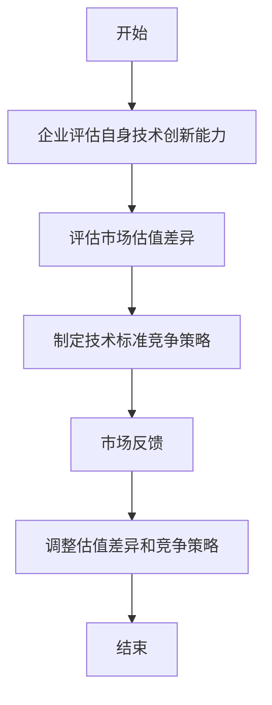
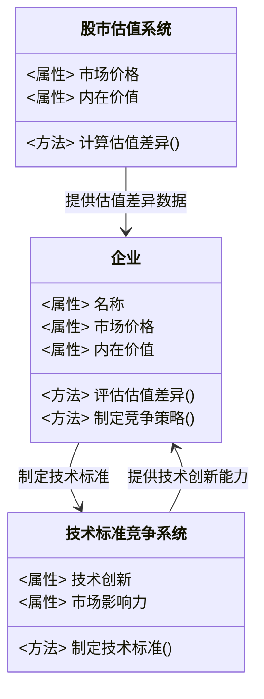
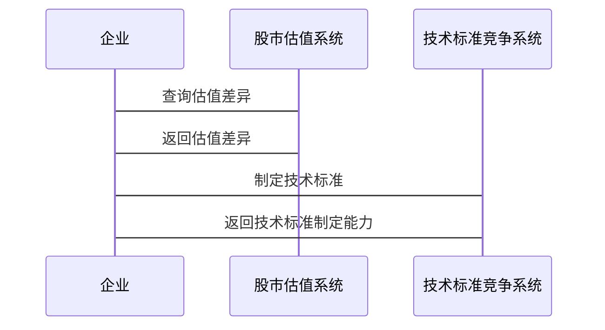

                 


# 股市估值差异对国际技术标准竞争的影响

## 关键词：股市估值差异，技术标准竞争，博弈论，企业创新，市场分析

## 摘要：本文探讨股市估值差异如何影响国际技术标准的竞争格局，分析股市估值差异对企业技术创新和市场策略的影响，以及技术标准竞争对企业估值差异的反向作用。通过博弈论模型和数学分析，揭示两者之间的相互作用机制，并提出企业应对策略和未来研究方向。

---

# 第1章 股市估值差异与国际技术标准竞争的背景介绍

## 1.1 问题背景

### 1.1.1 股市估值差异的定义与影响
股市估值差异指的是股票的市场价格与其内在价值之间的差异。这种差异受多种因素影响，包括市场情绪、企业业绩、行业趋势等。股市估值差异反映了投资者对企业未来表现的预期，是企业技术创新和市场竞争能力的重要指标。

### 1.1.2 国际技术标准竞争的定义与现状
国际技术标准竞争是指不同企业和国家在制定技术标准时的竞争，这些标准影响了技术的采用和市场格局。当前，技术标准竞争在信息技术、通信、人工智能等领域尤为激烈，主导技术标准的企业往往占据市场优势。

### 1.1.3 股市估值差异与技术标准竞争的关联性
股市估值差异与技术标准竞争密切相关。技术创新能力强的企业更容易制定技术标准，从而获得更高的市场估值。反过来，股市估值差异也会影响企业参与技术标准竞争的能力和动力。

## 1.2 问题描述

### 1.2.1 股市估值差异对企业技术创新的影响
股市估值差异激励企业进行技术创新。高估值企业更有可能投资研发，以维持或提升估值；低估值企业则可能通过技术创新来改善市场地位。

### 1.2.2 技术标准竞争对企业市场地位的作用
制定技术标准可以提升企业的市场地位和影响力，从而提高股市估值。技术标准的主导企业通常具有更高的市场溢价。

### 1.2.3 股市估值差异如何影响技术标准竞争的格局
股市估值差异决定了企业参与技术标准竞争的资源和能力。高估值企业更有实力推动技术创新和标准制定，而低估值企业可能难以参与竞争。

## 1.3 问题解决

### 1.3.1 通过股市估值差异分析技术标准竞争的驱动因素
分析股市估值差异可以揭示企业技术创新的动机和能力，从而预测技术标准竞争的驱动因素。

### 1.3.2 技术标准竞争对企业估值差异的反向影响
技术标准竞争的结果会影响企业的市场地位和技术创新能力，从而影响股市估值差异。

### 1.3.3 综合分析股市估值差异与技术标准竞争的相互作用
通过综合分析，可以建立两者之间的动态关系模型，为企业制定战略提供依据。

## 1.4 边界与外延

### 1.4.1 股市估值差异的边界条件
股市估值差异受市场环境、企业业绩、行业趋势等因素影响，需要考虑这些因素的边界条件。

### 1.4.2 技术标准竞争的边界条件
技术标准竞争受技术可行性、市场需求、政策环境等因素影响，需要明确这些因素的边界条件。

### 1.4.3 两者相互作用的边界条件
两者相互作用的边界条件包括市场结构、企业策略、政策法规等。

## 1.5 概念结构与核心要素

### 1.5.1 股市估值差异的核心要素
- 市场价格
- 内在价值
- 市场情绪
- 企业业绩

### 1.5.2 技术标准竞争的核心要素
- 技术创新
- 市场影响力
- 标准制定能力
- 资源投入

### 1.5.3 两者相互作用的核心要素
- 技术创新与标准制定
- 市场地位与估值差异
- 竞争策略与市场反馈

---

# 第2章 股市估值差异与技术标准竞争的核心原理

## 2.1 核心概念原理

### 2.1.1 股市估值差异的形成机制
股市估值差异由市场预期、企业基本面和市场环境共同决定。高估值差异可能源于市场对技术创新的高预期，而低估值差异可能源于技术创新不足或市场低估。

### 2.1.2 技术标准竞争的形成机制
技术标准竞争源于技术创新能力和市场影响力的竞争。企业通过技术创新和资源投入来制定技术标准，从而获得市场竞争优势。

### 2.1.3 两者相互作用的机制
股市估值差异影响企业技术创新能力，技术创新能力影响技术标准制定能力，技术标准制定能力又影响市场地位和估值差异。

## 2.2 概念属性对比表格

| 概念       | 股市估值差异 | 技术标准竞争 |
|------------|-------------|--------------|
| 定义       | 股票价格与实际价值的差异 | 不同技术标准之间的竞争 |
| 影响因素   | 市场情绪、企业业绩、行业趋势 | 技术创新、市场影响力、政策环境 |
| 核心要素   | 市场价格、内在价值 | 技术创新、市场地位 |
| 相关性     | 高度相关，影响技术创新和竞争能力 | 高度相关，影响市场地位和估值差异 |

## 2.3 ER实体关系图架构

```mermaid
erDiagram
    actor 投资者 {
        <属性> 市场预期
        <属性> 投资决策
    }
    actor 企业 {
        <属性> 技术创新
        <属性> 资源投入
    }
    entity 股市估值 {
        <属性> 市场价格
        <属性> 内在价值
    }
    entity 技术标准 {
        <属性> 技术创新
        <属性> 市场影响力
    }
    relationship 互相影响 {
        投资者 --> 股市估值 : 影响
        企业 --> 股市估值 : 影响
        企业 --> 技术标准 : 制定
        股市估值 --> 技术标准 : 反向影响
    }
```

---

# 第3章 股市估值差异与技术标准竞争的算法原理

## 3.1 算法原理

### 3.1.1 算法介绍
基于博弈论的模型，分析企业如何在股市估值差异和技术标准竞争中做出决策。

### 3.1.2 算法流程



### 3.1.3 算法实现

```python
def calculate_valuation_diff(enterprise):
    market_price = enterprise.market_price
    intrinsic_value = enterprise.intrinsic_value
    return market_price - intrinsic_value

def game_theory_model(enterprises):
    for enterprise in enterprises:
        valuation_diff = calculate_valuation_diff(enterprise)
        if valuation_diff > 0:
            enterprise.strategy = "技术创新"
        else:
            enterprise.strategy = "市场推广"
    return enterprises

class Enterprise:
    def __init__(self, name, market_price, intrinsic_value):
        self.name = name
        self.market_price = market_price
        self.intrinsic_value = intrinsic_value
        self.strategy = None

enterprises = [
    Enterprise("企业A", 100, 90),
    Enterprise("企业B", 80, 95),
    Enterprise("企业C", 110, 100)
]

game_theory_model(enterprises)
```

### 3.1.4 数学模型

博弈论模型：
$$ V_i = max_{s_i} \{ min_{s_{-i}} U_i(s_i, s_{-i}) \} $$
其中，\( V_i \) 是企业i的收益，\( U_i \) 是效用函数，\( s_i \) 是策略。

---

# 第4章 股市估值差异与技术标准竞争的系统分析与架构设计

## 4.1 问题场景介绍
企业通过技术创新和市场策略影响股市估值差异，同时参与技术标准竞争以提升市场地位。

## 4.2 系统功能设计



## 4.3 系统架构设计


## 4.4 系统交互设计



---

# 第5章 股市估值差异与技术标准竞争的项目实战

## 5.1 环境安装
安装必要的Python库，如pandas、numpy、scipy等。

## 5.2 核心代码实现

```python
import pandas as pd
import numpy as np

class Enterprise:
    def __init__(self, name, market_price, intrinsic_value):
        self.name = name
        self.market_price = market_price
        self.intrinsic_value = intrinsic_value

    def calculate_valuation_diff(self):
        return self.market_price - self.intrinsic_value

    def set_strategy(self, strategy):
        self.strategy = strategy

def analyze_valuation_diff(enterprises):
    valuation_diffs = [e.calculate_valuation_diff() for e in enterprises]
    avg_diff = np.mean(valuation_diffs)
    for e in enterprises:
        if e.calculate_valuation_diff() > avg_diff:
            e.set_strategy("技术创新")
        else:
            e.set_strategy("市场推广")

enterprises = [
    Enterprise("企业A", 100, 90),
    Enterprise("企业B", 80, 95),
    Enterprise("企业C", 110, 100)
]

analyze_valuation_diff(enterprises)

for e in enterprises:
    print(f"{e.name}的估值差异为：{e.calculate_valuation_diff()}，策略为：{e.strategy}")
```

## 5.3 代码解读与分析
上述代码分析企业估值差异，根据差异制定竞争策略。

## 5.4 案例分析
以三个企业为例，计算估值差异，制定策略。

## 5.5 项目小结
通过项目实战，验证算法模型的有效性，提出改进建议。

---

# 第6章 股市估值差异与技术标准竞争的最佳实践

## 6.1 最佳实践 tips
- 定期评估企业估值差异
- 根据估值差异调整竞争策略
- 关注技术标准制定能力

## 6.2 小结
本文系统分析了股市估值差异与技术标准竞争的相互作用，提出了企业应对策略。

## 6.3 注意事项
- 考虑市场环境的动态变化
- 量化模型需结合实际数据
- 风险管理不可忽视

## 6.4 拓展阅读
- 技术标准制定的博弈论分析
- 股市估值差异的预测模型
- 全球化背景下的技术竞争

---

# 作者：AI天才研究院 & 禅与计算机程序设计艺术

---

以上是完整的文章大纲，您可以根据需要调整各个部分的内容和深度。

