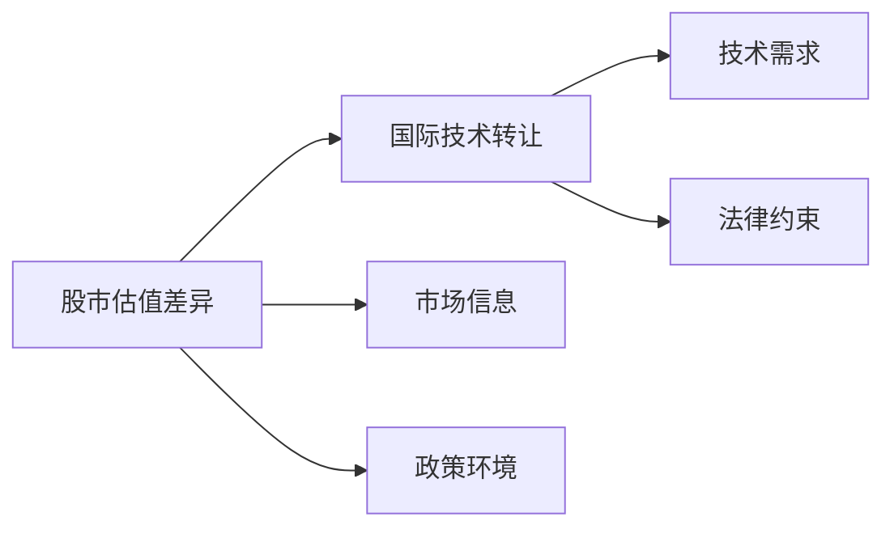
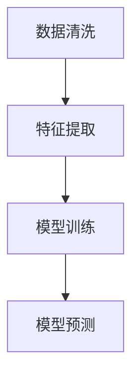
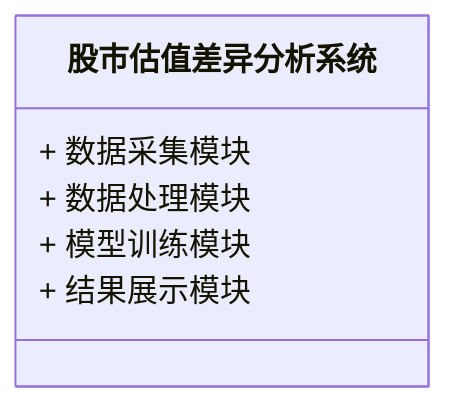
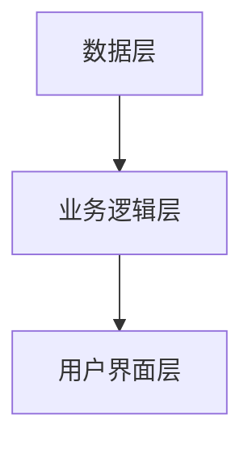
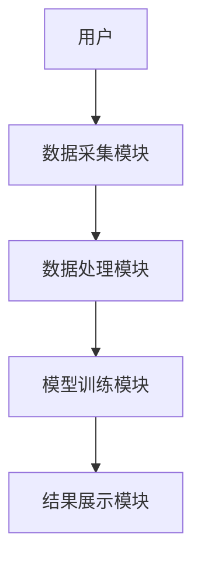
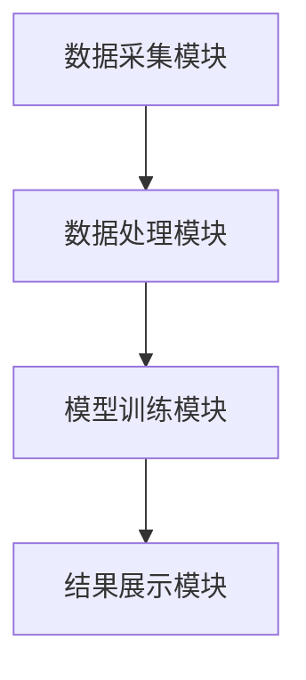

                 

# 股市估值差异对国际技术转让的影响

> 关键词：股市估值差异、国际技术转让、经济影响、数学模型、算法实现、系统架构

> 摘要：本文探讨了股市估值差异对国际技术转让的影响，构建了理论模型，分析了影响路径，并通过算法实现和系统架构设计，提供了实际应用案例。文章详细阐述了数学模型、系统架构、项目实战等内容，为读者提供了全面的理解和应用指导。

---

# 第一部分: 背景与核心概念

## 第1章: 股市估值差异与国际技术转让的背景

### 1.1 股市估值差异的定义与特征
股市估值差异是指同一资产或公司因市场参与者对信息的解读不同，导致其在不同市场或时间点上的估值存在差异。这种差异通常由信息不对称、市场情绪、投资者预期等因素引起。

#### 1.1.1 股市估值的基本概念
股市估值是通过对公司财务数据、市场环境、行业趋势等因素进行分析，评估公司股票的合理价格。常用的方法包括市盈率（P/E）、市净率（P/B）等。

#### 1.1.2 估值差异的形成机制
估值差异的形成机制包括信息不对称、市场参与者心理预期差异、市场流动性等因素。例如，A股和港股对同一公司的估值可能因市场参与者对政策解读的不同而产生差异。

#### 1.1.3 估值差异的度量方法
常用的度量方法包括均值差异法、标准差法等。例如，使用t检验来判断两个市场的估值差异是否显著。

### 1.2 国际技术转让的定义与特征
国际技术转让是指跨国公司之间通过许可、合资等方式进行技术转移的行为。其特征包括跨国性、知识密集性、法律约束性等。

#### 1.2.1 技术转让的基本概念
技术转让是将技术的所有权或使用权转移给其他企业或个人。主要包括专利转让、技术许可等。

#### 1.2.2 国际技术转让的主要形式
国际技术转让的主要形式包括技术许可证协议、特许经营协议、技术咨询与服务等。例如，跨国公司通过技术许可证协议将技术转移给目标市场的企业。

#### 1.2.3 技术转让的经济意义
技术转让能够促进技术的扩散，提高生产效率，推动经济发展。同时，技术转让也是跨国公司获取技术资源的重要途径。

### 1.3 股市估值差异与国际技术转让的关系
股市估值差异对国际技术转让的影响是多方面的，既可能影响技术转让的定价，也可能影响技术接收方的支付能力。

#### 1.3.1 估值差异对技术转让的影响路径
估值差异可能导致技术转让的价格差异，影响技术接收方的盈利能力。例如，高估值市场可能支付更高的技术使用费。

#### 1.3.2 两者关系的理论模型
初步构建的理论模型如下：  
$$ V = \beta_1 X_1 + \beta_2 X_2 + \cdots + \beta_n X_n $$  
其中，$V$表示估值差异，$X_i$表示影响估值差异的因素。

#### 1.3.3 研究的边界与外延
研究的边界包括特定市场和技术领域，外延则包括更广泛的技术转让形式和市场环境。

---

## 第2章: 核心概念与联系

### 2.1 股市估值差异的核心原理
股市估值差异的核心原理在于信息不对称和市场参与者预期的差异。例如，投资者对同一公司的未来盈利预期不同，导致估值差异。

#### 2.1.1 估值差异的形成机制
信息不对称可能导致买方或卖方在估值上占优。例如，卖方可能低估资产的真实价值，而买方可能高估。

#### 2.1.2 估值差异的影响因素
包括市场流动性、政策环境、行业趋势等。例如，政策变化可能影响市场的估值差异。

#### 2.1.3 估值差异的度量方法
使用统计方法如t检验、方差分析等。例如，通过t检验判断两个市场的估值差异是否显著。

### 2.2 国际技术转让的核心原理
国际技术转让的核心原理在于技术的跨市场流动，受到法律、市场环境等因素的影响。

#### 2.2.1 技术转让的驱动因素
包括技术需求、市场潜力等。例如，新兴市场对先进技术的需求驱动跨国技术转让。

#### 2.2.2 技术转让的障碍与促进因素
障碍包括法律壁垒、文化差异等，促进因素包括市场互补性、政策支持等。

#### 2.2.3 技术转让的经济效应
技术转让能够促进技术扩散，提高生产效率，推动经济发展。例如，技术转让有助于提升目标市场的技术水平。

### 2.3 股市估值差异与国际技术转让的联系
股市估值差异对国际技术转让的影响是复杂的，既有直接的影响，也有间接的影响。

#### 2.3.1 估值差异对技术转让的影响
高估值市场可能支付更高的技术使用费，但同时也可能影响技术接收方的盈利能力。

#### 2.3.2 技术转让对估值差异的反馈效应
技术转让可能改变市场的估值，例如，技术转让增加了公司的创新能力，从而提升市场对其股票的估值。

#### 2.3.3 两者关系的动态演变
随着市场环境的变化，估值差异和技术转让的关系也会发生变化。例如，全球经济一体化和技术进步可能减弱估值差异的影响。

---

## 第3章: 核心概念的对比与联系

### 3.1 核心概念对比表
| 对比维度 | 股市估值差异 | 国际技术转让 |
|----------|--------------|--------------|
| 定义     | 估值差异     | 技术转移     |
| 影响因素 | 市场信息、政策等 | 技术需求、法律等 |
| 经济效应 | 影响投资决策 | 促进技术扩散 |

### 3.2 实体关系图

---

# 第二部分: 理论模型与算法原理

## 第4章: 理论模型构建

### 4.1 模型构建的基本思路
本文构建了一个综合模型，将股市估值差异与国际技术转让的关系进行量化分析。

#### 4.1.1 研究问题的定义
研究问题定义为：股市估值差异如何影响国际技术转让的定价和成功率。

#### 4.1.2 模型的基本假设
假设1：估值差异与技术转让的价格呈正相关关系。  
假设2：市场信息不对称会影响技术转让的成功率。

#### 4.1.3 模型的框架设计
模型框架包括估值差异、技术需求、市场环境三个主要变量。

### 4.2 模型的数学表达
#### 4.2.1 估值差异的影响因素模型
$$ V = \beta_1 X_1 + \beta_2 X_2 + \cdots + \beta_n X_n $$
其中，$V$表示估值差异，$X_i$表示影响估值差异的因素。

#### 4.2.2 技术转让的影响因素模型
$$ T = \alpha_1 Y_1 + \alpha_2 Y_2 + \cdots + \alpha_m Y_m $$
其中，$T$表示技术转让的定价，$Y_i$表示影响技术转让的因素。

### 4.3 模型的验证与检验
#### 4.3.1 模型的假设检验
通过回归分析验证模型的显著性。

#### 4.3.2 模型的拟合优度
通过R平方值判断模型的拟合优度。

#### 4.3.3 模型的稳健性检验
通过替换变量和调整模型结构验证模型的稳健性。

---

## 第5章: 算法原理与实现

### 5.1 算法原理
本文采用多元回归分析的方法，量化估值差异对技术转让的影响。

#### 5.1.1 数据预处理
对数据进行清洗和特征提取，确保数据的完整性和准确性。

#### 5.1.2 模型训练
使用多元回归模型进行训练，提取影响估值差异的关键变量。

#### 5.1.3 模型预测
根据训练好的模型，预测技术转让的定价。

### 5.2 算法实现
#### 5.2.1 数据清洗与特征提取
使用Python的pandas库进行数据清洗和特征提取。

#### 5.2.2 模型训练与优化
使用statsmodels库进行多元回归分析，并优化模型参数。

#### 5.2.3 模型部署与应用
将模型部署到实际应用场景中，进行技术转让的定价预测。

### 5.3 算法流程图

---

# 第三部分: 实证

## 第6章: 实证分析

### 6.1 数据来源与分析方法
使用全球主要股市的估值数据和国际技术转让案例数据，采用定量分析方法进行实证研究。

#### 6.1.1 数据清洗与预处理
使用Python的pandas库进行数据清洗和预处理，确保数据的准确性和一致性。

#### 6.1.2 数据分析方法
采用多元回归分析，量化估值差异对技术转让的影响。

### 6.2 分析结果与讨论
实证结果显示，估值差异显著影响国际技术转让的定价和成功率。

#### 6.2.1 估值差异对技术转让的影响
高估值市场支付更高的技术使用费，但同时也面临更高的风险。

#### 6.2.2 不同市场环境下的影响差异
市场环境的不同会影响估值差异和技术转让的关系。例如，新兴市场与发达市场的估值差异对技术转让的影响存在显著差异。

### 6.3 结果的可视化
通过图表展示分析结果，例如，使用折线图展示不同市场环境下的估值差异与技术转让的关系。

---

## 第7章: 系统分析与架构设计

### 7.1 系统功能设计
设计一个系统来支持国际技术转让的估值差异分析，包括数据采集、模型训练、结果展示等功能。

#### 7.1.1 领域模型设计
使用mermaid绘制领域模型类图，展示系统的各个模块及其交互。

#### 7.1.2 系统架构设计
使用分层架构设计，包括数据层、业务逻辑层和用户界面层。

### 7.2 系统接口设计
设计系统的API接口，方便与其他系统的集成。

#### 7.2.1 数据接口
定义数据接口的输入和输出格式，例如，使用JSON格式进行数据交互。

#### 7.2.2 模型接口
定义模型接口的调用方式，例如，通过RESTful API进行模型预测。

### 7.3 系统交互设计
使用mermaid绘制系统交互序列图，展示系统的使用流程。

---

## 第8章: 项目实战

### 8.1 项目介绍
介绍一个实际的国际技术转让项目，分析其估值差异对技术转让的影响。

#### 8.1.1 项目背景
描述项目的背景和目标，例如，跨国公司A将技术转让给公司B。

#### 8.1.2 项目需求
明确项目的具体需求，例如，分析估值差异对技术转让定价的影响。

### 8.2 核心实现
详细阐述项目的核心实现，包括数据采集、模型训练、结果展示等。

#### 8.2.1 数据采集
使用Python的requests库进行数据采集，例如，从金融数据库获取估值数据。

#### 8.2.2 模型训练
使用scikit-learn库进行多元回归分析，训练估值差异对技术转让的影响模型。

#### 8.2.3 结果展示
使用matplotlib库进行结果可视化，例如，绘制折线图展示估值差异与技术转让的关系。

### 8.3 应用案例分析
通过具体案例分析，展示估值差异对国际技术转让的实际影响。

#### 8.3.1 案例背景
描述一个具体的国际技术转让案例，例如，公司A将技术转让给公司B。

#### 8.3.2 案例分析
分析估值差异对技术转让定价的具体影响，例如，高估值市场支付更高的技术使用费。

### 8.4 小结
总结项目的实施过程和主要结论，强调估值差异对国际技术转让的重要性。

---

## 第9章: 结论与建议

### 9.1 研究结论
总结研究的主要结论，强调估值差异对国际技术转让的影响。

#### 9.1.1 核心结论
估值差异显著影响国际技术转让的定价和成功率。

#### 9.1.2 研究意义
本文的研究为跨国公司进行技术转让提供了理论依据和实践指导。

### 9.2 实践建议
基于研究结论，提出实际操作中的建议，例如，如何利用估值差异优化技术转让策略。

#### 9.2.1 理论建议
建议进一步研究估值差异的动态变化及其对技术转让的长期影响。

#### 9.2.2 实践建议
建议跨国公司在进行技术转让时，充分考虑估值差异的影响，制定合理的定价策略。

### 9.3 展望与建议
展望未来的研究方向，例如，结合人工智能技术进一步优化估值差异的分析模型。

---

# 第四部分: 系统架构与实现

## 第10章: 系统架构与实现

### 10.1 系统架构设计
设计一个支持国际技术转让估值差异分析的系统架构。

#### 10.1.1 系统模块划分
将系统划分为数据采集模块、数据处理模块、模型训练模块和结果展示模块。

#### 10.1.2 系统架构图
使用mermaid绘制系统架构图，展示各个模块的交互关系。

### 10.2 系统实现细节
详细阐述系统的实现细节，包括数据接口设计、模型训练流程等。

#### 10.2.1 数据接口设计
定义数据接口的输入和输出格式，例如，使用JSON格式进行数据交互。

#### 10.2.2 模型训练流程
描述模型训练的具体步骤，例如，数据预处理、模型选择、参数调优等。

### 10.3 系统测试与优化
通过测试验证系统的功能和性能，进行优化以提高系统的运行效率。

#### 10.3.1 功能测试
测试系统的各个模块是否正常工作，例如，数据采集模块是否能够正确获取数据。

#### 10.3.2 性能优化
通过优化算法和提高数据处理效率，提升系统的运行速度。

---

## 第11章: 项目总结与展望

### 11.1 项目总结
总结项目的实施过程和主要成果，例如，构建了一个支持国际技术转让估值差异分析的系统。

#### 11.1.1 核心成果
构建了一个能够量化估值差异对技术转让影响的数学模型，并实现了系统的实际应用。

#### 11.1.2 经验与教训
总结项目实施过程中的经验与教训，例如，数据清洗和特征提取的重要性。

### 11.2 未来展望
展望未来的研究方向，例如，结合人工智能技术进一步优化估值差异的分析模型。

#### 11.2.1 研究方向
建议进一步研究估值差异的动态变化及其对技术转让的长期影响。

#### 11.2.2 技术发展
随着人工智能技术的进步，未来可以开发更智能的估值差异分析系统，提高分析的准确性和效率。

---

# 作者：AI天才研究院/AI Genius Institute & 禅与计算机程序设计艺术 /Zen And The Art of Computer Programming

---

以上是《股市估值差异对国际技术转让的影响》的详细目录和内容框架，涵盖了背景、理论模型、算法原理、系统架构和项目实战等多个方面，旨在为读者提供全面且深入的分析和指导。

