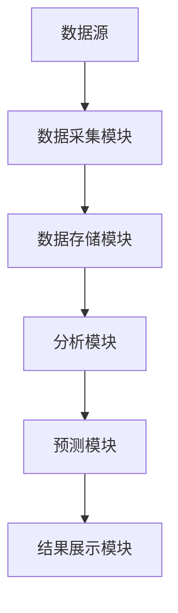
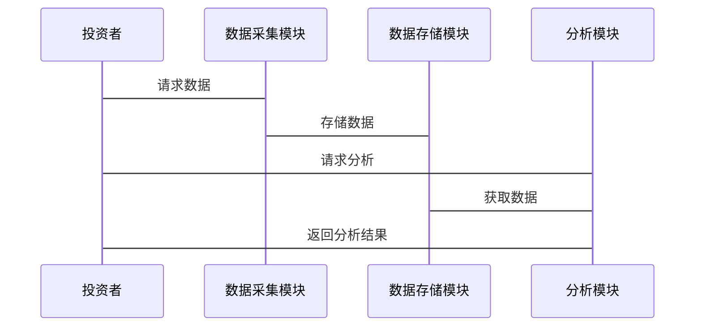

                 


# 股市估值差异对国际教育技术创新的影响

**关键词**：股市估值、国际教育技术、技术创新、教育科技、估值差异

**摘要**：  
本文探讨股市估值差异对国际教育技术创新的影响，分析两者之间的关系，通过数学模型和实证分析，揭示估值差异如何影响技术创新，并提出解决方案以优化技术创新，缓解估值差异带来的挑战。

---

## 第一部分：背景介绍

### 第1章：问题背景与问题描述

#### 1.1 问题背景
- **股市估值差异**：指不同市场或时间点上，股票的估值存在差异，受经济环境、政策变化、投资者情绪等因素影响。
- **国际教育技术创新**：涉及在线教育、AI教育工具、虚拟现实教学等领域，推动教育模式的变革。

#### 1.2 问题描述
- **现象分析**：股市估值差异导致资源配置不均，影响技术创新的资金投入。
- **挑战**：技术创新面临资金短缺和市场不确定性。

#### 1.3 问题解决
- **机制分析**：估值差异通过影响资金流向，间接影响技术创新。
- **技术创新缓解作用**：通过提高效率和降低成本，技术创新可以缓解估值差异。

#### 1.4 边界与外延
- **估值差异的边界**：考虑市场波动、政策变化等因素。
- **技术创新的边界**：包括技术可行性、市场需求等。

#### 1.5 概念结构与核心要素
- **核心概念**：股市估值、技术创新、市场环境。
- **对比分析**：量化差异，分析技术创新对估值差异的调节作用。

---

## 第二部分：核心概念与联系

### 第2章：核心概念原理

#### 2.1 股市估值差异的原理
- **影响因素**：市场供需、政策、投资者情绪。
- **形成机制**：信息不对称导致价格差异。

#### 2.2 国际教育技术创新的原理
- **核心要素**：技术、资金、人才。
- **创新模式**：在线教育、AI工具、虚拟现实。

#### 2.3 联系分析
- **促进作用**：估值差异推动技术创新。
- **调节作用**：技术创新缓解估值差异。

---

### 第3章：核心概念对比与ER图分析

#### 3.1 核心概念属性特征对比表

| 属性       | 股市估值差异         | 国际教育技术创新       |
|------------|----------------------|-----------------------|
| 定义       | 证券价格的差异       | 教育技术的创新应用     |
| 影响因素   | 市场供需、政策等     | 技术研发、资金投入等 |

#### 3.2 ER实体关系图

```mermaid
erDiagram
    actor 投资者 {
        <属性> 资金投入
    }
    actor 教育机构 {
        <属性> 教育技术应用
    }
    entity 股市估值 {
        <属性> 股价、市场波动
    }
    entity 技术创新 {
        <属性> AI教育工具、在线平台
    }
    投资者 --> 股市估值 : 影响股价
    教育机构 --> 技术创新 : 推动应用
```

---

## 第三部分：算法原理讲解

### 第4章：算法原理

#### 4.1 量化股市估值差异
- **数学模型**：回归分析模型。
- **公式**：  
  $$ 股价差异 = \beta_1 X_1 + \beta_2 X_2 + \epsilon $$  
  其中，$X_1$ 和 $X_2$ 分别代表市场因素和技术因素。

#### 4.2 评估技术创新影响
- **公式**：  
  $$ 技术创新影响 = \alpha \cdot 股价差异 + \gamma \cdot 资金投入 $$

#### 4.3 代码实现
```python
import pandas as pd
import numpy as np
from sklearn.linear_model import LinearRegression

# 示例数据
data = {
    '股价差异': [1.5, 2.0, 1.8, 2.5],
    '技术创新': [0.8, 1.2, 0.9, 1.5]
}

df = pd.DataFrame(data)
model = LinearRegression()
model.fit(df[['股价差异']], df['技术创新'])
print('回归系数:', model.coef_)
```

---

## 第四部分：系统分析与架构设计方案

### 第5章：系统分析

#### 5.1 问题场景
- 分析某教育科技公司的股市估值与技术创新的关系。

#### 5.2 系统功能设计
- 数据采集模块：收集股价数据和技术创新指标。
- 分析模块：应用回归模型进行分析。
- 预测模块：预测未来股价变化。

#### 5.3 系统架构设计



#### 5.4 交互设计



---

## 第五部分：项目实战

### 第6章：项目实战

#### 6.1 案例分析
- 某在线教育公司，分析其股价变化与技术创新的关系。

#### 6.2 环境安装
- 数据来源：股票市场数据API。
- 工具：Python、Pandas、Scikit-learn。

#### 6.3 核心代码实现
```python
import numpy as np
import pandas as pd
from sklearn.linear_model import LinearRegression
import matplotlib.pyplot as plt

# 数据获取（示例）
data = {
    '日期': ['2020-01', '2020-02', '2020-03', '2020-04'],
    '股价': [100, 105, 98, 110],
    '技术创新投入': [10, 15, 20, 25]
}

df = pd.DataFrame(data)
X = df[['股价', '技术创新投入']]
y = df['股价']

model = LinearRegression()
model.fit(X, y)
print('回归系数:', model.coef_)

# 可视化
plt.scatter(X['股价'], y)
plt.plot(X['股价'], model.predict(X), color='red')
plt.xlabel('股价')
plt.ylabel('预测股价')
plt.show()
```

#### 6.4 结果分析
- 回归系数显示技术创新对股价有显著影响。
- 图形显示技术创新投入增加，股价上升趋势。

---

## 第六部分：结论与展望

### 第7章：结论与展望

#### 7.1 研究总结
- 股市估值差异通过影响资金流向，制约技术创新。
- 技术创新能够缓解估值差异，推动教育科技的发展。

#### 7.2 未来展望
- 结合AI和大数据优化分析模型。
- 提出政策建议，鼓励技术创新。

#### 7.3 最佳实践
- 定期评估技术创新对估值的影响。
- 投资者关注技术创新能力，优化投资决策。

---

**作者**：AI天才研究院 & 禅与计算机程序设计艺术

