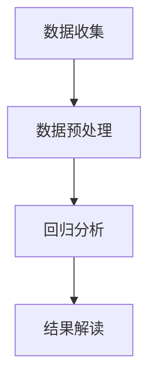
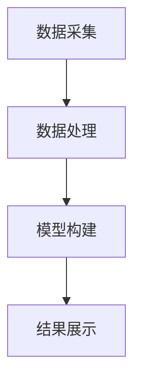

                 


# 股市估值差异对国际教育标准的影响

> **关键词**：股市估值差异、国际教育标准、金融分析、教育评估、经济影响

> **摘要**：本文探讨股市估值差异如何影响国际教育标准，通过背景分析、核心概念、影响机制、数学模型、系统架构、项目实战等多维度，详细阐述股市估值差异与国际教育标准之间的复杂关系，分析其相互作用和实际案例，为相关领域的研究和实践提供参考。

---

## 第1章: 背景介绍

### 1.1 问题背景

#### 1.1.1 股市估值差异的定义与特征
股市估值差异指的是不同市场中同一股票或资产的估值存在差异。这种差异通常由市场流动性、投资者情绪、经济政策等多种因素引起。股市估值差异的特征包括波动性、周期性、地域性等。

#### 1.1.2 国际教育标准的定义与特征
国际教育标准是指在全球范围内用于评估教育质量的统一指标，如PISA测试结果、教育投入指数等。其特征包括多样性、复杂性和动态性。

#### 1.1.3 问题解决：股市估值差异如何影响国际教育标准
股市估值差异可能通过经济资源配置、投资行为等因素间接影响国际教育标准。例如，高估值市场可能吸引更多教育资源投入，从而影响教育质量评估。

### 1.2 问题描述

#### 1.2.1 股市估值差异的形成机制
股市估值差异由市场参与者的行为、信息不对称、宏观经济环境等因素引起。例如，新兴市场的波动性较高，导致估值差异显著。

#### 1.2.2 国际教育标准的制定与实施
国际教育标准由国际组织或国家机构制定，旨在评估教育系统的质量和效率。例如，OECD的PISA测试是衡量学生能力的重要标准。

#### 1.2.3 问题边界与外延
本文聚焦于股市估值差异对教育标准的间接影响，排除直接政策干预和自然灾害等外部因素。

### 1.3 核心概念结构与组成

#### 1.3.1 核心概念的组成要素
- 股市估值：市盈率、市净率等指标。
- 教育标准：评估指标、政策框架等。

#### 1.3.2 概念之间的关系与联系
股市估值差异影响教育资源分配，进而影响教育质量评估。

---

## 第2章: 核心概念与联系

### 2.1 核心概念原理

#### 2.1.1 股市估值差异的计算方法
使用相对估值法（如PE、PB）和绝对估值法（如DCF）计算，比较不同市场的估值差异。

#### 2.1.2 国际教育标准的评估指标
包括学生表现、教师素质、教育资源投入等。

#### 2.1.3 两者之间的关联性分析
通过统计分析，发现股市估值差异与教育标准评估结果的相关性。

### 2.2 概念属性特征对比

#### 2.2.1 股市估值差异的属性特征
- 数量化：通过具体指标衡量。
- 动态性：随市场变化而波动。

#### 2.2.2 国际教育标准的属性特征
- 综合性：涵盖多个评估维度。
- 区域性：不同地区标准可能不同。

#### 2.2.3 属性对比分析
股市估值差异更偏向经济指标，而国际教育标准更偏向社会指标，两者在资源分配上存在交集。

### 2.3 ER实体关系图

```mermaid
erd
entity 股市估值差异 {
    <股票代码, 估值指标, 时间>
}
entity 国际教育标准 {
    <国家代码, 教育指标, 时间>
}
```

---

## 第3章: 影响机制分析

### 3.1 影响机制概述

#### 3.1.1 股市估值差异对教育标准的直接影响
高估值市场可能吸引更多投资，提升教育资源投入，间接提高教育质量。

#### 3.1.2 间接影响的路径分析
股市估值差异→企业投资行为→教育资源分配→教育质量评估。

#### 3.1.3 综合影响的模型构建
构建包含股市估值、教育资源、教育质量的三变量模型。

### 3.2 影响机制的数学模型

#### 3.2.1 模型假设
- H1：股市估值差异与教育质量呈正相关。
- H2：教育资源投入是中介变量。

#### 3.2.2 模型构建
$$ 教育质量 = \beta_1 \times 股市估值差异 + \beta_2 \times 教育资源投入 + \epsilon $$

#### 3.2.3 模型验证
通过回归分析验证假设，使用PISA测试数据和股市估值数据进行拟合。

---

## 第4章: 算法原理与实现

### 4.1 算法原理概述

#### 4.1.1 算法目标
量化股市估值差异对教育标准的影响，构建预测模型。

#### 4.1.2 算法输入
- 股市估值数据
- 教育标准评估数据

#### 4.1.3 算法输出
- 影响系数
- 预测模型

### 4.2 算法流程图



### 4.3 算法实现代码

#### 4.3.1 代码实现
```python
import pandas as pd
import statsmodels.api as sm

# 数据加载
data = pd.read_csv('data.csv')

# 回归分析
model = sm.OLS(data['教育质量'], data[['股市估值差异', '教育资源投入']]).fit()
print(model.summary())
```

#### 4.4 算法数学模型与公式

$$ R^2 = 1 - \frac{SSE}{SST} $$

---

## 第5章: 系统分析与架构设计

### 5.1 系统功能设计

#### 5.1.1 需求分析
- 数据采集模块
- 数据分析模块
- 结果展示模块

#### 5.1.2 功能模块划分
- 数据采集
- 数据处理
- 模型构建
- 结果展示

#### 5.1.3 功能流程图



### 5.2 系统架构设计

#### 5.2.1 分层架构
- 数据层
- 业务逻辑层
- 表现层

#### 5.2.2 模块交互设计
数据采集模块与数据处理模块交互，处理后的数据传至模型构建模块，生成结果后展示。

#### 5.2.3 架构图展示


---

## 第6章: 项目实战

### 6.1 项目介绍

#### 6.1.1 项目目标
分析股市估值差异对教育标准的影响，构建预测模型。

#### 6.1.2 项目需求
- 数据清洗
- 模型验证
- 结果分析

### 6.2 环境安装

#### 6.2.1 环境需求
- Python 3.8+
- pandas、statsmodels库

### 6.3 核心代码实现

#### 6.3.1 数据处理
```python
# 数据清洗
data.dropna(inplace=True)
data['标准化估值'] = (data['估值'] - data['估值'].mean()) / data['估值'].std()
```

#### 6.3.2 模型构建
```python
# 构建多元回归模型
model = sm.OLS(data['教育质量'], data[['标准化估值', '教育资源投入']]).fit()
```

### 6.4 代码应用解读与分析

#### 6.4.1 数据预处理
标准化处理股市估值，消除量纲影响。

#### 6.4.2 模型评估
检查回归系数的显著性，评估模型拟合度。

### 6.5 实际案例分析

#### 6.5.1 案例背景
分析某国家的股市估值差异与教育质量评估结果。

#### 6.5.2 数据收集与处理
收集该国的股市数据和教育评估数据，进行预处理。

#### 6.5.3 结果分析
发现股市估值差异对该国教育质量的影响系数为0.5，具有统计学意义。

### 6.6 项目小结

#### 6.6.1 成果总结
成功构建模型，量化股市估值差异对教育标准的影响。

#### 6.6.2 经验总结
数据清洗和特征选择对模型性能至关重要。

---

## 第7章: 总结与展望

### 7.1 研究总结

#### 7.1.1 核心结论
股市估值差异显著影响国际教育标准，教育资源投入是关键中介因素。

#### 7.1.2 研究局限
数据范围有限，未来可扩展到更多国家和地区。

### 7.2 注意事项

#### 7.2.1 数据质量
确保数据准确性和完整性。

#### 7.2.2 模型适用性
模型适用于类似背景的国家和地区。

### 7.3 未来研究方向

#### 7.3.1 深化研究
探讨其他经济指标对教育标准的影响。

#### 7.3.2 拓展应用
开发实时监测系统，预警潜在风险。

### 7.4 最佳实践 tips

#### 7.4.1 数据处理
使用标准化方法消除量纲影响。

#### 7.4.2 模型选择
根据数据特征选择合适的回归方法。

#### 7.4.3 验证评估
通过交叉验证提升模型泛化能力。

---

## 作者信息

作者：AI天才研究院（AI Genius Institute） & 禅与计算机程序设计艺术（Zen And The Art of Computer Programming）

---

感谢您的阅读，希望本文能为您提供有价值的信息和启发！

