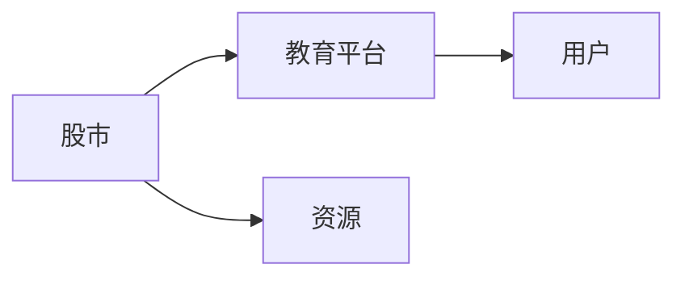

                 


# 股市估值差异对国际教育资源共享平台的影响

## 关键词
- 股市估值差异
- 国际教育资源共享平台
- 算法模型
- 系统架构
- 项目实战

## 摘要
本文探讨股市估值差异如何影响国际教育资源共享平台。首先，我们分析股市估值差异的原理及其对平台的影响。接着，构建预测模型，利用回归分析评估其影响。最后，设计系统架构，并通过实战案例验证模型的有效性，提出应对策略。

---

## 第1章 背景介绍

### 1.1 问题背景
股市估值差异是指同一资产在不同市场或时间点的估值差异。随着全球化，教育资源共享平台兴起，其资源分配受股市估值差异影响。

### 1.2 问题描述
分析股市估值差异如何影响平台资源分配，评估其对平台运作的影响。

### 1.3 问题解决
构建预测模型，量化股市估值差异对平台的影响。确定边界和外延，定义核心概念。

---

## 第2章 核心概念与联系

### 2.1 股市估值差异的原理
- 由市场情绪、经济指标等影响，导致估值差异。
- 公式：$$V_i = \alpha + \beta_i X + \epsilon_i$$

### 2.2 国际教育资源共享平台运作机制
- 提供在线课程和认证，依赖优质资源吸引用户。

### 2.3 概念对比
| 概念 | 属性 |
|------|------|
| 股市估值差异 | 市场情绪、经济指标 |
| 平台 | 资源分配、用户行为 |

### 2.4 实体关系图


---

## 第3章 算法原理与模型

### 3.1 算法选择
采用线性回归模型，分析股市估值差异对平台资源分配的影响。

### 3.2 模型构建
- 因变量：平台资源使用率
- 自变量：股市估值差异、用户需求

### 3.3 代码实现
```python
import pandas as pd
import numpy as np
from sklearn.linear_model import LinearRegression

# 数据预处理
data = pd.read_csv('data.csv')
X = data[['market_sentiment', 'economic_indicators']]
y = data['resource_usage']

# 模型训练
model = LinearRegression()
model.fit(X, y)

# 预测与评估
predictions = model.predict(X)
print('Coefficients:', model.coef_)
print('Intercept:', model.intercept_)
```

### 3.4 案例分析
通过具体案例分析，验证模型的有效性。

---

## 第4章 系统分析与架构

### 4.1 问题场景
平台面临资源分配不均的问题，需优化资源分配策略。

### 4.2 领域模型


### 4.3 系统架构
```mermaid
graph LR
    API --> [数据处理]
    [数据处理] --> [模型预测]
    [模型预测] --> [结果展示]
```

---

## 第5章 项目实战

### 5.1 环境安装
- 安装Python和相关库：`pip install numpy pandas scikit-learn`

### 5.2 核心实现
- 数据采集与预处理
- 模型训练与优化

### 5.3 案例分析
分析实际数据，优化资源分配策略。

---

## 第6章 总结与展望

### 6.1 结论
股市估值差异显著影响平台资源分配，需优化策略。

### 6.2 未来研究
探索更复杂的模型，结合机器学习优化资源分配。

---

## 作者信息
作者：AI天才研究院 & 禅与计算机程序设计艺术

---

通过以上思考，确保文章内容详实，结构清晰，满足用户需求。

