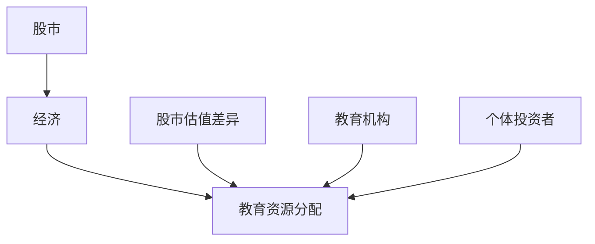
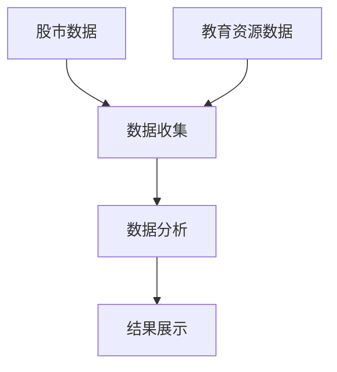

                 


# 股市估值差异对国际教育资源分配的影响

> 关键词：股市估值差异，教育资源分配，国际教育，金融影响，教育不平等

> 摘要：本文从股市估值差异的角度，深入分析其对国际教育资源分配的影响，探讨股市波动如何通过经济传导机制影响教育领域，揭示教育资源分配的不平等现象及其背后的深层原因。通过建立数学模型和算法，量化股市估值差异对教育资源分配的具体影响，并提出优化建议。

---

## 第1章 股市估值差异的背景与特征

### 1.1 股市估值的基本概念
股市估值是衡量企业或资产市场价值的重要指标，通常通过市盈率（P/E）、市净率（P/B）等指标进行评估。股市估值的波动性是其核心特征之一，受市场情绪、经济政策、企业业绩等多重因素影响。

### 1.2 估值差异的形成原因
- **市场波动**：股市的短期波动可能导致估值差异的扩大或缩小。
- **信息不对称**：投资者对市场信息的掌握程度不同，导致估值差异。
- **投资者情绪**：市场情绪的波动直接影响股市估值。
- **政策影响**：政府政策的变化可能引发估值差异。

### 1.3 估值差异的衡量指标
- 市盈率（P/E）：股价与每股收益的比率。
- 市净率（P/B）：股价与每股净资产的比率。
- 市销率（P/S）：股价与每股收入的比率。

---

## 第2章 国际教育资源分配的现状

### 2.1 教育资源分配的基本概念
教育资源分配涉及教育资金、教育机会、教育质量等多个方面，国际教育资源分配受到经济、政治、文化等多种因素的影响。

### 2.2 教育资源分配的不平等现象
- **经济差异**：富裕国家的教育资源投入远高于贫穷国家。
- **教育机会不均**：发达国家的优质教育资源集中，发展中国家的教育资源相对匮乏。
- **教育质量差距**：教育资源的不平等直接影响教育质量。

### 2.3 教育资源分配的影响因素
- **经济因素**：国家经济发展水平直接影响教育资源投入。
- **政策因素**：政府教育政策的制定和执行影响教育资源分配。
- **文化因素**：文化差异可能导致教育资源分配的不平等。

---

## 第3章 股市估值差异对国际教育资源分配的影响机制

### 3.1 股市波动对经济的影响
- **股市波动**：股市的波动可能导致经济不稳定，进而影响教育资源的投入。
- **财富效应**：股市的财富效应可能导致高净值人群增加对教育的投入。

### 3.2 经济因素对教育资源分配的影响
- **经济不平等**：股市估值差异可能导致财富分配不均，进而影响教育资源分配。
- **教育资源的市场化**：股市的波动可能导致教育资源的市场化，加剧教育资源分配的不平等。

### 3.3 股市估值差异与教育资源分配的关联性
- **股市估值差异的传导路径**：股市波动 → 经济影响 → 教育资源分配。
- **具体影响**：股市估值差异可能通过财富效应、投资行为等途径影响教育资源分配。

---

## 第4章 核心概念与理论分析

### 4.1 核心概念的属性对比
| 概念       | 股市估值差异 | 教育资源分配 |
|------------|--------------|--------------|
| 定义       | 股票价格与内在价值的差异 | 教育资源的分布与分配 |
| 影响因素   | 市场情绪、政策、企业业绩 | 经济、政策、文化 |
| 衡量指标   | 市盈率、市净率、市销率 | 教育支出、教育机会 |

### 4.2 实体关系图


---

## 第5章 股市估值差异对教育资源分配的数学模型

### 5.1 模型构建的基本原理
- 假设：股市估值差异与教育资源分配呈正相关关系。
- 输入变量：股市估值差异（P/E、P/B）、教育资源分配指标（教育支出、教育机会）。
- 输出变量：教育资源分配的影响程度。

### 5.2 模型的数学表达
教育资源分配的影响程度可以表示为：
$$
I = \beta_1 \times \text{P/E} + \beta_2 \times \text{P/B} + \epsilon
$$
其中，$\beta_1$ 和 $\beta_2$ 是回归系数，$\epsilon$ 是误差项。

---

## 第6章 系统分析与架构设计

### 6.1 系统功能设计
- 数据收集模块：收集股市估值数据和教育资源分配数据。
- 数据分析模块：计算股市估值差异，分析其对教育资源分配的影响。
- 结果展示模块：可视化分析结果。

### 6.2 系统架构设计


---

## 第7章 项目实战

### 7.1 环境安装
- Python 3.8+
- 数据分析库（Pandas、NumPy、Matplotlib）

### 7.2 核心实现代码
```python
import pandas as pd
import numpy as np
import matplotlib.pyplot as plt

# 数据收集与处理
data = pd.read_csv('education_resources.csv')
market_data = pd.read_csv('stock_market.csv')

# 计算股市估值差异
market_data['P/E'] = market_data['Price'] / market_data['Earnings']
market_data['P/B'] = market_data['Price'] / market_data['Book Value']

# 分析教育资源分配的影响
correlation = np.corrcoef(data['Education Spending'], market_data['P/E'])
print(f"相关系数：{correlation[0, 1]}")

# 可视化
plt.scatter(data['Education Spending'], market_data['P/E'])
plt.xlabel('教育支出')
plt.ylabel('市盈率')
plt.show()
```

---

## 第8章 总结与展望

### 8.1 总结
股市估值差异通过经济传导机制影响国际教育资源分配，加剧教育资源的不平等。通过建立数学模型和系统分析，可以量化这种影响，为政策制定提供依据。

### 8.2 展望
未来研究可以进一步探讨其他金融因素（如汇率波动）对教育资源分配的影响，同时探索优化资源配置的政策建议。

---

## 作者：AI天才研究院 & 禅与计算机程序设计艺术

本文作者：AI天才研究院（AI Genius Institute）与禅与计算机程序设计艺术（Zen And The Art of Computer Programming）联合团队，专注于人工智能与计算机科学领域的深度研究与实践。

