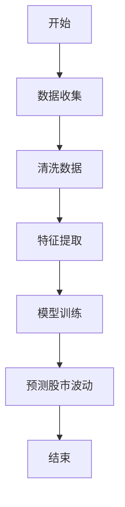
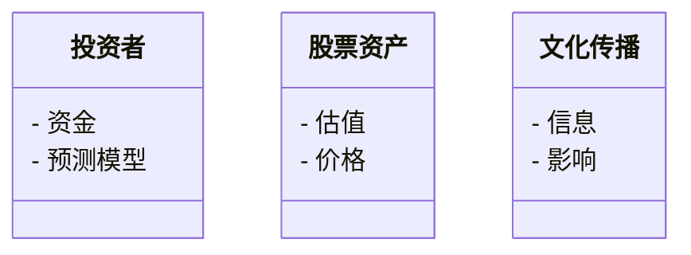
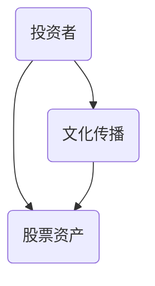

                 


# 股市估值差异对国际文化交流的影响

## 关键词：股市估值差异、国际文化交流、算法原理、数学模型、系统架构、项目实战

## 摘要：本文探讨股市估值差异对国际文化交流的影响，通过背景分析、核心概念、算法模型和系统设计，结合实际案例，揭示股市波动如何影响文化交流，以及文化交流如何反作用于股市估值。文章旨在为金融和文化领域的研究者提供新的视角和方法。

---

## 第一部分：背景介绍

### 第1章：问题背景与概念解析

#### 1.1 问题背景
- **股市估值差异**：指不同市场中同一资产的定价差异，受经济、政治、文化等多种因素影响。
- **国际文化交流**：跨国间思想、艺术、语言等的传播与互动，促进文化多样性。

#### 1.2 问题描述
- 股市估值差异日益显著，影响投资者信心和市场稳定性。
- 国际文化交流在信息传播和技术进步中扮演重要角色，但其对股市的影响尚未深入研究。

#### 1.3 问题解决
- 分析股市估值差异的形成机制。
- 探讨文化交流如何影响投资者情绪和决策。

#### 1.4 边界与外延
- 股市估值差异的边界：仅考虑主要经济体的市场波动。
- 文化交流的范围：涵盖语言、艺术、科技等多领域。

#### 1.5 概念结构与核心要素
- 股市估值差异：市场结构、政策、经济指标。
- 国际文化交流：传播媒介、受众、内容形式。

---

## 第二部分：核心概念与联系

### 第2章：核心概念解析

#### 2.1 核心概念原理
- 股市估值差异源于市场信息不对称和参与者预期差异。
- 国际文化交流促进知识共享，影响投资者认知。

#### 2.2 概念属性对比
| 属性 | 股市估值差异 | 国际文化交流 |
|------|--------------|---------------|
| 影响因素 | 经济指标、政策 | 文化因素、技术 |
| 表现形式 | 价格波动、市场分割 | 信息传播、文化输出 |
| 相关性 | 高 | 中 |

#### 2.3 ER实体关系图
```mermaid
er
actor: 投资者
object: 股票资产
relationship: 交易
```

---

## 第三部分：算法原理讲解

### 第3章：算法原理

#### 3.1 算法步骤


#### 3.2 Python代码实现
```python
import pandas as pd
from sklearn.model_selection import train_test_split
from sklearn.linear_model import LinearRegression

# 数据加载与清洗
data = pd.read_csv('market_data.csv')
data.dropna(inplace=True)

# 特征提取
features = data[['GDP', 'Interest_rate', 'Market_sentiment']]
target = data['Stock_price']

# 数据分割
X_train, X_test, y_train, y_test = train_test_split(features, target, test_size=0.2)

# 模型训练
model = LinearRegression()
model.fit(X_train, y_train)

# 预测
y_pred = model.predict(X_test)
print('预测值:', y_pred)
print('真实值:', y_test)
```

#### 3.3 数学模型
- **线性回归模型**：用于预测股市波动。
  $$ y = \beta_0 + \beta_1 x_1 + \beta_2 x_2 + \epsilon $$
- **协整分析**：评估变量间的长期均衡关系。
  $$ Δy_t = α + βΔx_t + γI_{t-1} + \epsilon_t $$

---

## 第四部分：数学模型与公式推导

### 第4章：数学模型

#### 4.1 线性回归模型
$$ R^2 = 1 - \frac{SSE}{SST} $$
其中，SSE为残差平方和，SST为总平方和。

#### 4.2 协整分析
$$ coint(f(x), f(y)) = 0 $$
用于检验变量间的协整关系。

---

## 第五部分：系统分析与架构设计

### 第5章：系统架构设计

#### 5.1 系统功能设计


#### 5.2 系统架构图


---

## 第六部分：项目实战

### 第6章：项目实战

#### 6.1 环境安装
- 安装Python和相关库（pandas, scikit-learn）。

#### 6.2 核心代码实现
```python
import pandas as pd
from sklearn.metrics import mean_squared_error

# 数据加载
data = pd.read_csv('market_data.csv')

# 特征工程
data['Market_sentiment'] = data['Market_sentiment'].astype('category').cat.codes

# 划分训练集和测试集
X = data[['GDP', 'Interest_rate', 'Market_sentiment']]
y = data['Stock_price']
X_train, X_test, y_train, y_test = train_test_split(X, y, test_size=0.2)

# 模型训练
model = LinearRegression()
model.fit(X_train, y_train)

# 预测与评估
y_pred = model.predict(X_test)
print('均方误差:', mean_squared_error(y_test, y_pred))
```

#### 6.3 案例分析
- 使用实际数据训练模型，分析文化交流对股市的影响。
- 讨论模型结果的解释和应用。

---

## 第七部分：总结与展望

### 第7章：总结

#### 7.1 最佳实践
- 数据清洗与特征选择是关键。
- 结合领域知识优化模型。

#### 7.2 小结
本文通过系统分析和实战，揭示了股市估值差异与国际文化交流的互动关系，为投资者和研究者提供了新的视角。

#### 7.3 注意事项
- 数据质量和模型选择影响结果。
- 结果需结合实际背景分析。

#### 7.4 拓展阅读
- 《文化资本与金融市场》。
- 《国际金融与文化传播》。

---

## 作者：AI天才研究院/AI Genius Institute & 禅与计算机程序设计艺术/Zen And The Art of Computer Programming

