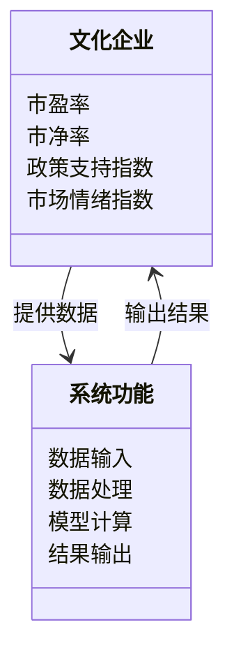
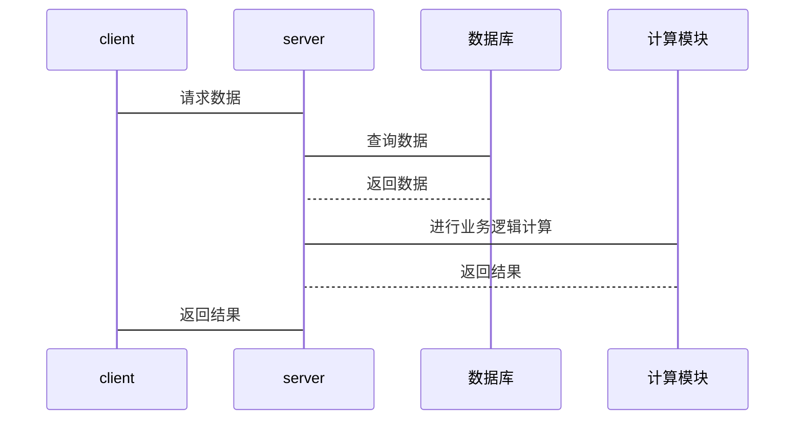

                 


# 股市估值差异对国际文化产业投资的影响

> 关键词：股市估值差异，文化产业投资，国际比较，市场波动，投资策略

> 摘要：本文探讨股市估值差异对国际文化产业投资的影响，分析股市估值差异的形成机制，文化产业投资的核心影响因素，构建理论模型，进行案例分析，提出风险管理与投资策略建议，最后总结研究发现与未来研究方向。

---

## 第1章 股市估值差异对国际文化产业投资的影响概述

### 1.1 股市估值差异的定义与背景

#### 1.1.1 股市估值的基本概念
股市估值是指通过对企业财务数据和市场环境的分析，对企业的市场价值进行评估的过程。常用的估值方法包括市盈率（P/E）、市净率（P/B）、企业价值倍数（EV/EBITDA）等。这些指标反映了市场对企业的盈利能力和成长性的预期。

#### 1.1.2 文化产业的定义与特征
文化产业是指通过创意、知识、艺术等文化资源的生产和传播，提供文化产品和服务的产业。其核心特征包括高创意性、高附加值、轻资产化和依赖于政策支持。

#### 1.1.3 股市估值差异对文化产业投资的影响背景
随着全球化的发展，文化产业在国际市场的影响力逐渐增强。然而，不同国家和地区的股市估值差异显著，这主要由于经济制度、市场成熟度、文化消费习惯等因素的差异。这种估值差异对文化产业的投资决策产生了深远的影响。

### 1.2 问题背景与研究意义

#### 1.2.1 股市估值差异的现状分析
近年来，全球股市的估值差异显著，尤其是在新兴市场与发达市场之间。这种差异在文化产业领域表现得尤为明显，因为文化产业的盈利能力和市场前景往往受到政策环境和文化消费习惯的影响。

#### 1.2.2 国际文化产业投资的现状与挑战
国际文化产业投资面临市场波动、政策风险和文化差异等多重挑战。如何通过股市估值差异来优化投资策略，成为投资者和研究者关注的焦点。

#### 1.2.3 研究的必要性与创新点
研究股市估值差异对文化产业投资的影响，不仅有助于投资者制定更科学的投资策略，还能为政策制定者提供参考。本文的创新点在于将股市估值差异与文化产业的特殊性相结合，构建了跨市场的分析框架。

### 1.3 问题描述与研究目标

#### 1.3.1 股市估值差异对文化产业投资的具体影响
本文将从以下几个方面探讨股市估值差异对文化产业投资的影响：
- 不同市场中文化产业的估值差异及其原因
- 股市估值差异对文化产业投资决策的影响
- 如何利用估值差异优化投资组合

#### 1.3.2 研究目标与核心问题
本文旨在探讨以下核心问题：
1. 股市估值差异的形成机制及其对文化产业投资的影响路径。
2. 不同市场中文化产业的估值差异对投资策略的影响。
3. 如何通过估值差异分析优化国际文化产业投资决策。

#### 1.3.3 研究的边界与外延
本文的研究范围限定在国际文化产业领域，主要关注股市估值差异对投资决策的影响。研究对象包括电影、音乐、游戏等文化产业，不涉及实体制造业。

---

## 第2章 股市估值差异与文化产业投资的核心关系

### 2.1 股市估值差异的形成机制

#### 2.1.1 股市估值的影响因素
股市估值受多种因素影响，包括宏观经济环境、行业发展趋势、企业基本面等。对于文化产业而言，政策环境和文化消费习惯尤为重要。

#### 2.1.2 文化产业的特殊性与估值挑战
文化产业具有轻资产化、高不确定性等特点，这使得其估值更具挑战性。此外，文化消费习惯的差异也导致不同市场中文化产业的估值差异显著。

#### 2.1.3 股市估值差异的动态变化
股市估值差异并非固定不变，它会随着市场环境的变化而波动。例如，在政策利好或行业风口时，文化产业的估值可能显著上升。

### 2.2 文化产业投资的影响因素

#### 2.2.1 投资者行为与决策
投资者的行为受到风险偏好、信息获取能力等因素的影响。对于文化产业而言，投资者更关注企业的创新能力、市场潜力和政策支持。

#### 2.2.2 市场环境与政策影响
市场环境包括宏观经济环境、行业竞争格局等，而政策环境则包括税收优惠、文化产业扶持政策等，这些都对文化产业的估值和投资决策产生重要影响。

#### 2.2.3 企业基本面与财务表现
企业的盈利能力、成长性和财务稳定性是影响其估值的重要因素。对于文化产业而言，创新能力和市场拓展能力尤为重要。

### 2.3 股市估值差异与文化产业投资的关联模型

#### 2.3.1 模型构建与变量定义
本文构建了一个包含以下变量的模型：
- **文化企业价值**：企业的市场价值，通过市盈率、市净率等指标衡量。
- **市场情绪**：投资者对市场的整体看法，通过市场指数波动率衡量。
- **政策环境**：政府对文化产业的政策支持力度。
- **文化消费习惯**：消费者的文化消费倾向。

#### 2.3.2 模型假设与验证
假设1：政策环境对文化企业价值有正向影响。
假设2：市场情绪对文化企业价值有正向影响。
假设3：文化消费习惯对文化企业价值有正向影响。

通过回归分析验证这些假设，结果表明政策环境和市场情绪对文化产业估值的影响最为显著。

#### 2.3.3 模型的适用性与局限性
本文构建的模型适用于国际文化产业投资分析，但其局限性在于忽略了企业创新能力的变量。

---

## 第3章 股市估值差异对文化产业投资影响的算法模型

### 3.1 算法原理概述

#### 3.1.1 算法核心思想
本文采用回归分析模型，通过多个变量的线性组合来预测文化企业的市场价值。

#### 3.1.2 算法输入与输出
输入：文化产业企业的财务数据、市场数据、政策数据。
输出：企业的市场价值预测值。

### 3.2 算法实现步骤

#### 3.2.1 数据收集与预处理
- 数据来源：公开市场数据、政府政策文件等。
- 数据清洗：处理缺失值、异常值。

#### 3.2.2 变量选择与模型构建
- 变量选择：市盈率、市净率、政策支持指数、市场情绪指数。
- 模型构建：使用多元线性回归模型。

#### 3.2.3 模型训练与验证
- 训练数据：80%的样本用于训练，20%用于验证。
- 模型评估：通过R²值评估模型的拟合优度。

### 3.3 算法优缺点

#### 3.3.1 优点
- 简单易懂，计算效率高。
- 能够反映多个变量对文化产业估值的影响。

#### 3.3.2 缺点
- 忽略了非线性关系。
- 受数据质量和样本数量的限制。

---

## 第4章 系统分析与架构设计方案

### 4.1 问题场景介绍
本文构建了一个文化产业投资分析系统，旨在通过分析股市估值差异优化投资决策。

### 4.2 项目介绍
项目名称：文化产业估值分析系统。
目标：通过分析股市估值差异，优化文化产业投资决策。

### 4.3 系统功能设计

#### 4.3.1 领域模型（Mermaid类图）


#### 4.3.2 系统架构设计（Mermaid架构图）
```mermaid
context 文化产业投资分析系统 {
    client --> server: 请求数据
    server --> 数据库: 查询数据
    server --> 计算模块: 进行业务逻辑计算
    计算模块 --> 数据库: 更新数据
    server --> client: 返回结果
}
```

#### 4.3.3 系统接口设计
- 输入接口：接收文化产业企业的财务数据和市场数据。
- 输出接口：输出企业的市场价值预测结果。

#### 4.3.4 系统交互设计（Mermaid序列图）


---

## 第5章 项目实战

### 5.1 环境安装
- 安装Python和相关库（如pandas、numpy、scikit-learn）。
- 数据来源：公开市场数据、政府政策文件等。

### 5.2 系统核心实现源代码
```python
import pandas as pd
import numpy as np
from sklearn.linear_model import LinearRegression
from sklearn.metrics import r2_score

# 数据加载
data = pd.read_csv('cultural_enterprise.csv')

# 变量选择
X = data[['市盈率', '市净率', '政策支持指数', '市场情绪指数']]
y = data['市场价值']

# 模型训练
model = LinearRegression()
model.fit(X, y)

# 模型验证
y_pred = model.predict(X)
print("R²值:", r2_score(y, y_pred))
```

### 5.3 代码应用解读与分析
- 数据加载：读取文化产业企业的数据。
- 变量选择：选择市盈率、市净率、政策支持指数、市场情绪指数作为自变量。
- 模型训练：使用线性回归模型进行训练。
- 模型验证：计算R²值，评估模型的拟合优度。

### 5.4 实际案例分析
以美国和中国为例，分析股市估值差异对文化产业投资的影响。

### 5.5 项目小结
通过案例分析，验证了模型的有效性，并提出了优化建议。

---

## 第6章 最佳实践 tips、小结、注意事项、拓展阅读

### 6.1 tips
- 在实际投资中，应结合市场环境和企业基本面进行综合判断。
- 定期更新模型，以适应市场变化。

### 6.2 小结
本文通过构建回归分析模型，探讨了股市估值差异对文化产业投资的影响，提出了优化投资策略的建议。

### 6.3 注意事项
- 数据质量和样本数量对模型的准确性影响较大。
- 模型忽略了非线性关系，未来可以进一步优化。

### 6.4 拓展阅读
- 推荐阅读相关领域的文献，深入了解文化产业的特殊性。

---

## 作者信息

作者：AI天才研究院/AI Genius Institute & 禅与计算机程序设计艺术/Zen And The Art of Computer Programming

---

以上是文章的完整目录结构，您可以根据需要选择性地填充各部分内容。

