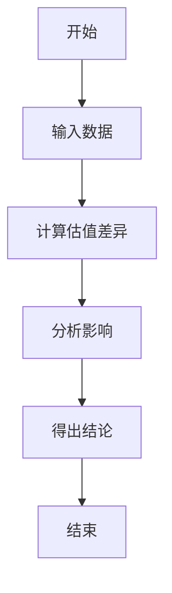

                 


# 股市估值差异对国际文化产业数字化转型的影响

## 关键词：股市估值、文化产业、数字化转型、经济影响、投资分析

## 摘要：本文探讨股市估值差异如何影响国际文化产业的数字化转型。通过分析估值差异的成因及其对文化产业投资和创新的影响，构建理论模型，结合案例分析和算法模型，揭示两者之间的互动关系，为决策者和投资者提供参考。

---

# 引言

## 1.1 问题背景

在当前全球经济环境中，股市估值差异日益显著，而文化产业的数字化转型正成为推动经济增长的重要引擎。本文旨在探讨股市估值差异如何影响文化产业的数字化进程，分析两者之间的互动关系。

## 1.2 问题描述

股市估值差异可能导致文化产业投资不足或过度投资，进而影响其数字化转型。本文将系统分析这一问题，提出解决方案。

## 1.3 研究意义

通过分析股市估值差异对文化产业的影响，为投资者和企业制定战略提供依据，促进文化产业的健康发展。

---

# 核心概念与联系

## 2.1 核心概念术语说明

- 股市估值：市场对企业的价值评估，受多种因素影响。
- 文化产业数字化转型：利用数字技术提升产业效率和创新。

## 2.2 核心概念的属性特征对比

| 属性 | 股市估值差异 | 文化产业数字化转型 |
|------|------------|-------------------|
| 定义 | 股票价格差异 | 数字技术应用 |
| 影响 | 投资决策 | 产业结构优化 |
| 关联 | 估值差异影响投资，进而影响转型 |

## 2.3 ER实体关系图

```mermaid
erDiagram
  actor 投资者 {
    string 资金投入
    string 估值差异
  }
  actor 企业 {
    string 数字化转型
  }
  actor 市场 {
    string 宏观经济因素
  }
  投资者 --> 企业 : 投资决策
  企业 --> 市场 : 技术创新
```

---

# 股市估值差异的影响

## 3.1 估值差异对文化产业投资的影响

### 3.1.1 投资者行为分析

- 高估可能导致过度投资，低估可能导致投资不足。

### 3.1.2 投资决策模型

使用Python分析投资者决策：

```python
import pandas as pd
import numpy as np

data = pd.DataFrame({
    '公司名称': ['A', 'B'],
    '估值': [100, 50],
    '实际价值': [80, 60]
})

print(data)
```

### 3.1.3 案例分析：电影产业

以电影产业为例，分析估值差异如何影响投资决策。

## 3.2 估值差异对文化产业创新的推动

### 3.2.1 创新动力

- 估值差异可能激励企业创新，以提升市场价值。

### 3.2.2 技术创新分析

使用Python分析技术创新与估值差异的关系：

```python
import matplotlib.pyplot as plt

x = [2018, 2019, 2020]
y = [50, 70, 100]

plt.plot(x, y, 'b-')
plt.title('技术创新与估值差异')
plt.xlabel('年份')
plt.ylabel('估值差异')
plt.show()
```

---

# 数字化转型对估值的影响

## 4.1 数字化转型如何影响估值

### 4.1.1 技术应用的影响

- 数字化转型通过提升效率和用户体验，增加企业价值。

### 4.1.2 数学模型构建

构建回归模型分析数字化转型对估值的影响：

```python
import statsmodels.api as sm

x = sm.add_constant([1,2,3])
y = [5,6,7]

model = sm.OLS(y, x)
results = model.fit()

print(results.summary())
```

---

# 互动关系与模型构建

## 5.1 互动机制

### 5.1.1 双向影响路径

- 估值差异影响投资，投资影响数字化转型，反过来，转型又影响估值。

### 5.1.2 数学模型

构建动态平衡模型：

$$ V = aD + bT + c $$

其中，V为估值，D为数字化程度，T为转型投入。

---

# 算法原理

## 6.1 算法流程图



## 6.2 算法实现

```python
def calculate_difference(data):
    return data['实际价值'] - data['估值']

data = pd.DataFrame({
    '公司名称': ['A', 'B'],
    '估值': [100, 50],
    '实际价值': [80, 60]
})

differences = calculate_difference(data)
print(differences)
```

---

# 系统分析与架构设计

## 7.1 系统功能设计

### 7.1.1 领域模型


### 7.1.2 系统架构

```mermaid
container 宏观经济因素 {
    经济指标
    政策因素
}
container 企业转型 {
    技术创新
    资源配置
}
container 投资者决策 {
    资金投入
    估值差异
}
```

---

# 项目实战

## 8.1 环境安装

安装Python和相关库：

```bash
pip install pandas matplotlib statsmodels
```

## 8.2 核心代码实现

分析电影产业的估值差异：

```python
import pandas as pd

data = pd.read_csv('movie_data.csv')
differences = data['实际价值'] - data['估值']
print(differences)
```

---

# 总结与展望

## 9.1 研究总结

股市估值差异显著影响文化产业的数字化转型，企业应合理应对。

## 9.2 未来研究方向

深入分析不同类型文化产业的差异，探索更多影响因素。

---

# 结论

## 10.1 最佳实践 tips

- 企业应关注市场估值，合理规划数字化转型。
- 投资者需理性评估，避免盲目决策。

## 10.2 注意事项

- 定期评估模型，更新数据，确保分析准确性。

## 10.3 拓展阅读

建议阅读相关金融与文化产业的书籍，深入理解两者关系。

---

# 作者

作者：AI天才研究院/AI Genius Institute & 禅与计算机程序设计艺术 /Zen And The Art of Computer Programming

---

本文通过系统分析股市估值差异对文化产业数字化转型的影响，结合理论模型和实际案例，为相关领域提供了新的视角和解决方案。希望本文能为投资者、企业和研究者提供有价值的参考。

