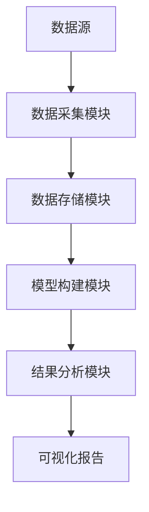

                 


# 股市估值差异对国际文化产业的影响

> 关键词：股市估值差异、国际文化产业、投资行为、市场波动、文化产业敏感性

> 摘要：本文探讨股市估值差异对国际文化产业的影响，分析其背后的经济机制和市场行为，通过数学模型和算法实现，结合实际案例，提出最佳实践和未来研究方向。

---

# 第一部分: 背景介绍与核心概念

## 第1章: 股市估值差异与文化产业概述

### 1.1 股市估值差异的定义与特征

#### 1.1.1 股市估值的基本概念
股市估值是投资者对一家公司未来盈利能力的评估，通常通过市盈率（P/E）、市净率（P/B）等指标衡量。估值差异指的是不同股票之间的估值水平存在显著差异，这种差异可能源于公司基本面、市场情绪或投资者预期的不同。

#### 1.1.2 估值差异的形成机制
估值差异的形成与市场参与者的行为密切相关，包括投资者情绪、信息不对称、市场结构等因素。例如，当市场情绪高涨时，投资者可能高估某些股票的价值，导致估值差异扩大。

#### 1.1.3 文化产业的定义与范围
文化产业是指以创意、内容创作和文化产品为核心的产业，涵盖电影、音乐、游戏、艺术等多个领域。这些产业具有高波动性和依赖市场需求的特点。

### 1.2 股市估值差异对文化产业的影响

#### 1.2.1 估值差异的传导路径
股市估值差异通过投资者行为、市场情绪和资金流动影响文化产业。例如，高估的股票可能吸引更多资金流入文化产业，而低估的股票可能导致资本外流。

#### 1.2.2 文化产业的敏感性分析
文化产业对市场波动敏感，主要因为其需求受消费者情绪和市场环境影响较大。例如，经济衰退可能导致文化产业的需求下降，从而影响其估值。

#### 1.2.3 估值差异的双重影响
估值差异对文化产业既有促进作用，也有抑制作用。高估可能带来更多的投资，而低估可能导致资源不足，影响产业发展。

## 第2章: 股市估值差异与文化产业的关联性分析

### 2.1 股市估值差异的核心要素

#### 2.1.1 市场情绪与投资者行为
市场情绪和投资者行为直接影响股市估值。例如，乐观的市场情绪可能导致股票估值上升，而悲观情绪则可能导致估值下降。

#### 2.1.2 行业特性与市场结构
文化产业的行业特性，如高创意性和高风险性，使得其估值容易受到市场结构的影响。例如，市场结构的集中度可能影响文化产业的估值差异。

#### 2.1.3 宏观经济环境的影响
宏观经济环境如GDP增长率、通货膨胀率等，也会影响股市估值。例如，经济增长可能导致文化产业的需求增加，从而影响其估值。

### 2.2 文化产业的核心特征

#### 2.2.1 内容创作的周期性
文化产业的内容创作具有周期性，例如电影的制作周期较长，容易受到市场波动的影响。

#### 2.2.2 市场需求的多样性
文化产业的产品需求多样化，不同地区和文化背景的消费者需求差异较大，这使得文化产业的估值容易受到市场情绪的影响。

#### 2.2.3 产业链的复杂性
文化产业的产业链较长，涉及内容创作、制作、发行等多个环节，每个环节都可能受到市场波动的影响，导致估值差异。

### 2.3 股市估值差异与文化产业的交互作用

#### 2.3.1 估值差异对文化产业的促进作用
高估的股票可能导致更多资金流入文化产业，促进其发展。例如，投资者可能倾向于投资高估的文化企业，推动其市场扩展。

#### 2.3.2 估值差异对文化产业的抑制作用
低估的股票可能导致资本外流，抑制文化产业的发展。例如，企业可能因为估值过低难以吸引投资，影响其创作和生产能力。

#### 2.3.3 两者的动态平衡机制
股市估值差异与文化产业之间存在动态平衡机制。市场参与者的行为、宏观经济环境的变化等都会影响这种平衡，进而影响文化产业的发展。

---

# 第二部分: 股市估值差异对文化产业的数学模型与算法分析

## 第3章: 股市估值差异的数学模型构建

### 3.1 股市估值差异的量化方法

#### 3.1.1 市盈率与市净率的计算
市盈率（P/E）= 股价 / 每股收益  
市净率（P/B）= 股价 / 每股净资产  

#### 3.1.2 异常波动的检测算法
使用回归分析检测异常值，例如：  
回归模型：y = a + b*x + ε  
通过残差分析检测异常值。

#### 3.1.3 估值差异的度量指标
使用均值绝对偏差（MAD）或均方误差（MSE）衡量估值差异。

### 3.2 文化产业敏感性分析的数学模型

#### 3.2.1 回归分析模型
回归模型：y = β0 + β1*x1 + β2*x2 + ... + βn*xn + ε  
其中，y为文化产业的收益，x为股市估值差异。

#### 3.2.2 脉冲响应函数
通过脉冲响应分析股市估值差异对文化产业的短期和长期影响。

#### 3.2.3 随机过程模型
使用ARIMA模型预测股市估值差异对文化产业的影响。

## 第4章: 股市估值差异对文化产业影响的算法实现

### 4.1 算法原理

#### 4.1.1 时间序列分析
使用时间序列分析模型（如ARIMA）预测股市估值差异的时间演变。

#### 4.1.2 聚类分析
将股票按估值差异分为不同类别，分析文化产业在不同类别的表现。

#### 4.1.3 网络分析
构建文化产业的网络关系图，分析估值差异在网络中的传播路径。

### 4.2 算法实现

#### 4.2.1 Python代码实现
```python
import pandas as pd
import numpy as np
from sklearn.linear_model import LinearRegression

# 示例数据
data = pd.DataFrame({
    'valuation_diff': [1.2, 0.8, 1.5, 0.9, 1.1],
    'cultural_sector': [0.5, 0.7, 0.6, 0.8, 0.7]
})

# 回归分析
model = LinearRegression()
model.fit(data[['valuation_diff']], data['cultural_sector'])

# 预测结果
print(model.predict([[1.3]]))
```

#### 4.2.2 数据处理与特征提取
使用数据清洗、标准化等方法处理数据，提取影响文化产业的关键特征。

#### 4.2.3 模型训练与结果分析
训练回归模型，分析股市估值差异对文化产业的具体影响，例如通过系数解读理解各个特征的重要性。

---

# 第三部分: 系统分析与架构设计

## 第5章: 系统分析与功能设计

### 5.1 问题场景介绍

#### 5.1.1 股市波动对文化产业的影响
通过具体案例分析股市波动如何影响文化产业，例如2008年金融危机对电影产业的影响。

#### 5.1.2 文化产业的脆弱性分析
分析文化产业在市场波动中的脆弱性，例如高负债率、依赖消费者需求等因素。

#### 5.1.3 估值差异的传播机制
研究估值差异如何在市场中传播，例如通过投资者情绪和市场结构影响文化产业。

### 5.2 系统功能设计

#### 5.2.1 数据采集模块
负责采集股市数据和文化产业的相关数据，确保数据的准确性和及时性。

#### 5.2.2 模型构建模块
基于数据构建数学模型，分析股市估值差异对文化产业的影响。

#### 5.2.3 结果分析模块
对模型的输出结果进行分析，提供可视化报告和决策建议。

## 第6章: 系统架构设计

### 6.1 系统架构图
使用mermaid绘制系统架构图，展示各模块之间的关系和数据流。



### 6.2 系统功能模块

#### 6.2.1 数据采集模块
负责从多个数据源（如股票交易所、文化企业财务报表）采集数据。

#### 6.2.2 数据存储模块
将采集到的数据存储在数据库中，支持后续的分析和处理。

#### 6.2.3 模型构建模块
基于存储的数据，构建数学模型，分析股市估值差异对文化产业的影响。

#### 6.2.4 结果分析模块
对模型的输出结果进行分析，生成可视化报告和决策建议。

---

# 第四部分: 项目实战与案例分析

## 第7章: 项目实战

### 7.1 环境安装

#### 7.1.1 Python环境配置
安装必要的Python库，如pandas、numpy、scikit-learn等。

#### 7.1.2 数据源获取
获取相关的股市数据和文化产业数据，例如通过API接口或数据爬取。

### 7.2 系统核心实现源代码

#### 7.2.1 数据处理代码
```python
import pandas as pd
import numpy as np

# 示例数据处理
data = pd.read_csv('cultural_sector_data.csv')
data['valuation_diff'] = data['valuation_diff'].apply(lambda x: np.log(x) if x > 0 else 0)
```

#### 7.2.2 模型训练代码
```python
from sklearn.linear_model import LinearRegression

model = LinearRegression()
model.fit(data[['valuation_diff']], data['sector_growth'])
```

### 7.3 代码应用解读与分析

#### 7.3.1 数据预处理
对数据进行清洗、标准化等处理，确保模型训练的准确性。

#### 7.3.2 模型训练
基于预处理后的数据训练回归模型，分析股市估值差异对文化产业增长的具体影响。

### 7.4 实际案例分析

#### 7.4.1 案例背景
以2020年新冠疫情为例，分析股市估值差异对电影产业的影响。

#### 7.4.2 数据分析
通过回归模型分析疫情对电影产业的具体影响，例如票房收入的变化。

#### 7.4.3 结果解读
解释模型结果，说明股市估值差异如何影响电影产业的复苏。

### 7.5 项目小结

总结项目实施过程中的关键点，强调股市估值差异对文化产业的复杂影响，为后续研究提供参考。

---

# 第五部分: 最佳实践与未来研究方向

## 第8章: 最佳实践

### 8.1 小结

总结全文内容，强调股市估值差异对文化产业的双向影响，以及数学模型在分析中的重要性。

### 8.2 注意事项

提醒读者在实际应用中注意数据的准确性和模型的适用性，避免片面结论。

### 8.3 未来研究方向

提出未来可能的研究方向，例如更复杂的数学模型、多维度的数据分析、跨市场的比较研究等。

---

# 作者：AI天才研究院/AI Genius Institute & 禅与计算机程序设计艺术 /Zen And The Art of Computer Programming

