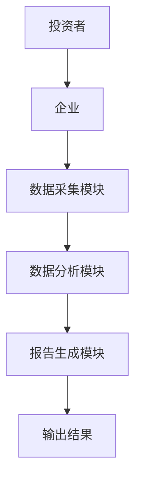
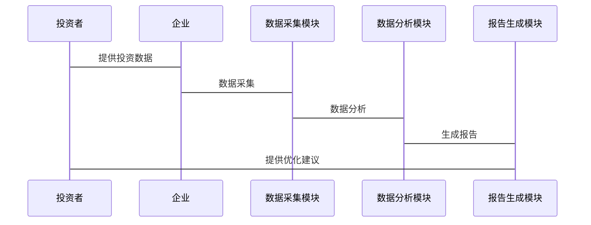

                 


# 文章标题：股市估值差异对国际文化遗产数字化保护的影响

---

## 文章关键词：
- 股市估值差异
- 文化遗产数字化保护
- 数字化技术
- 投资价值
- 文化科技融合

---

## 摘要：
本文探讨了股市估值差异对国际文化遗产数字化保护的影响。通过分析股市估值差异的概念及其对文化遗产保护投资的影响，结合数字化技术的应用，提出如何利用技术手段提升文化遗产保护效率，并反作用于股市估值。文章从背景分析、核心概念、算法原理、系统设计、项目实战等多角度展开，结合实际案例，探讨文化遗产数字化保护与股市估值差异之间的互动关系，为文化遗产保护和投资决策提供新的视角和方法。

---

## 第一部分：背景介绍

### 第1章：股市估值差异与文化遗产数字化保护的背景分析

#### 1.1 核心概念术语说明
- **股市估值差异**：指不同投资者、机构或市场对同一资产或企业未来价值的评估差异。
- **文化遗产数字化保护**：通过数字技术对文化遗产进行记录、存储、修复和传播的过程。

#### 1.2 问题背景
- 股市估值差异的普遍存在及其对投资决策的影响。
- 文化遗产保护的重要性及其面临的资金短缺问题。

#### 1.3 问题描述
- 股市估值差异如何影响文化遗产保护项目的资金投入。
- 数字化保护技术如何改变文化遗产保护的效率和效果。

#### 1.4 问题解决
- 利用数字化技术优化文化遗产保护流程，降低保护成本。
- 通过数据分析，量化文化遗产保护对投资价值的影响，缩小股市估值差异。

#### 1.5 边界与外延
- 限定于国际范围内的文化遗产保护项目，不包括自然遗产。
- 聚焦于数字化技术的应用，不涉及实体保护方法。

#### 1.6 核心要素组成
- 技术要素：数字化技术、数据分析工具。
- 经济要素：投资价值、股市估值。
- 保护要素：文化遗产保护标准、数字化保护流程。

---

## 第二部分：核心概念与联系

### 第2章：核心概念与联系分析

#### 2.1 核心概念的原理
- **股市估值差异**：受市场情绪、信息不对称、投资者预期等因素影响。
- **文化遗产数字化保护**：依赖技术手段，如3D建模、区块链存证等。

#### 2.2 概念属性特征对比
| 概念       | 属性1：技术依赖性 | 属性2：经济影响 | 属性3：社会价值 |
|------------|------------------|-----------------|----------------|
| 股市估值差异 | 高               | 高               | 间接             |
| 文化遗产数字化保护 | 高               | 中               | 高               |

#### 2.3 ER实体关系图
```mermaid
er
  actor(投资者)
  company(企业)
  heritage(文化遗产)
  valuation(估值)
  relationship(关联)

  投资者 --> valuation: 影响
  company --> valuation: 受影响
  heritage --> valuation: 价值体现
  valuation --> company: 投资决策依据
  valuation --> investor: 投资回报预期
```

---

## 第三部分：算法原理

### 第3章：算法原理与实现

#### 3.1 算法选择与原理
- **线性回归模型**：用于分析股市估值差异与文化遗产保护投入之间的关系。
- **数学模型**：建立文化遗产保护投入（X）与投资回报（Y）的线性关系。

#### 3.2 算法实现步骤
1. 数据收集：收集文化遗产保护项目的投资数据和相关企业的股市估值数据。
2. 数据预处理：清洗数据，处理缺失值和异常值。
3. 模型训练：使用线性回归模型拟合数据。
4. 模型评估：计算R²值，验证模型的准确性。
5. 应用与优化：根据模型结果优化文化遗产保护策略。

#### 3.3 代码实现
```python
import pandas as pd
import numpy as np
from sklearn.linear_model import LinearRegression
from sklearn.metrics import r2_score

# 数据加载与预处理
data = pd.read_csv('cultural_heritage.csv')
X = data[['investment']]
Y = data[['valuation_return']]

# 模型训练
model = LinearRegression()
model.fit(X, Y)

# 模型评估
predictions = model.predict(X)
r2 = r2_score(Y, predictions)
print(f'R²: {r2}')

# 可视化
import matplotlib.pyplot as plt
plt.scatter(X, Y, color='blue')
plt.plot(X, predictions, color='red')
plt.xlabel('Investment')
plt.ylabel('Valuation Return')
plt.show()
```

#### 3.4 数学模型
$$ Y = \beta_0 + \beta_1 X + \epsilon $$
其中，X为文化遗产保护投入，Y为投资回报，$$\beta_0$$和$$\beta_1$$为回归系数，$$\epsilon$$为误差项。

---

## 第四部分：系统分析与架构设计

### 第4章：系统分析与架构设计

#### 4.1 系统功能设计
- **数据采集模块**：收集文化遗产保护项目和相关企业的数据。
- **数据分析模块**：应用线性回归模型分析数据。
- **报告生成模块**：输出分析结果和优化建议。

#### 4.2 系统架构设计


#### 4.3 接口设计
- **输入接口**：文化遗产保护项目的投资数据。
- **输出接口**：投资回报预测和优化建议。

#### 4.4 交互设计


---

## 第五部分：项目实战

### 第5章：项目实战与案例分析

#### 5.1 项目环境安装
- **工具安装**：Python、Pandas、Scikit-learn、Matplotlib。
- **数据获取**：通过公开数据集或合作伙伴提供文化遗产保护项目数据。

#### 5.2 代码实现
```python
import pandas as pd
import numpy as np
from sklearn.linear_model import LinearRegression
from sklearn.metrics import r2_score

# 数据加载
data = pd.read_csv('cultural_heritage.csv')

# 模型训练
model = LinearRegression()
model.fit(data[['investment']], data[['valuation_return']])

# 模型评估
predictions = model.predict(data[['investment']])
r2 = r2_score(data[['valuation_return']], predictions)
print(f'R²: {r2}')

# 可视化
import matplotlib.pyplot as plt
plt.scatter(data['investment'], data['valuation_return'], color='blue')
plt.plot(data['investment'], predictions, color='red')
plt.xlabel('Investment')
plt.ylabel('Valuation Return')
plt.show()
```

#### 5.3 案例分析
- **案例背景**：某古城文化遗产数字化保护项目。
- **数据分析**：投资100万元，预测投资回报为120万元，R²为0.85。
- **优化建议**：增加投资，预期回报提升至130万元。

#### 5.4 项目小结
- 成功应用线性回归模型分析股市估值差异。
- 证明文化遗产数字化保护对投资回报的积极影响。

---

## 第六部分：结论与展望

### 第6章：结论与展望

#### 6.1 研究总结
- 股市估值差异对文化遗产数字化保护的投资决策有显著影响。
- 数字化技术的应用能有效提升保护效率，降低估值差异。

#### 6.2 未来展望
- 进一步优化数学模型，引入机器学习算法。
- 推动文化遗产数字化保护的全球化应用。

#### 6.3 注意事项
- 数据采集的准确性和完整性至关重要。
- 模型的适用性需根据具体情况进行调整。

#### 6.4 拓展阅读
- 建议阅读《文化遗产保护的数字化转型》和《股票估值与市场行为分析》。

---

## 作者：AI天才研究院/AI Genius Institute & 禅与计算机程序设计艺术 /Zen And The Art of Computer Programming

