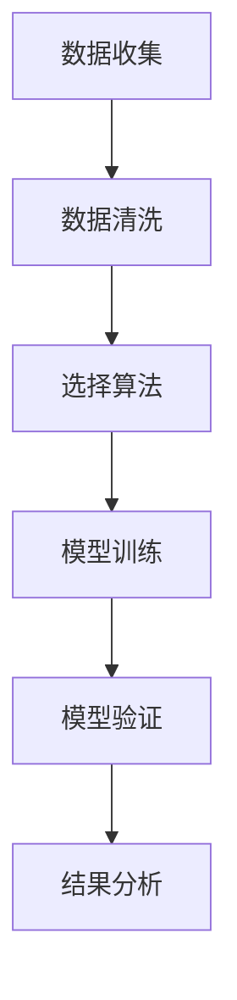
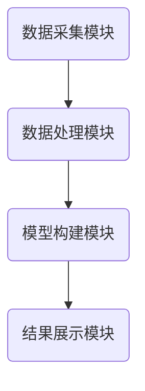
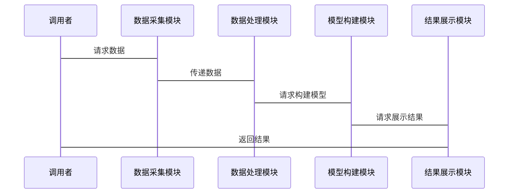

                 


# 股市估值差异对国际旅游业的影响

## 关键词：股市估值差异，国际旅游业，经济影响，数据分析，模型构建，投资策略

## 摘要：股市估值差异作为经济波动的重要指标，对国际旅游业的发展有着深远的影响。本文通过分析股市估值差异与国际旅游业之间的关系，探讨其对旅游需求、企业经营及区域经济的具体影响。结合数据分析与实证研究，构建数学模型，提出投资策略，为相关领域的研究者和从业者提供参考。

## 第一部分：背景介绍

### 第1章：股市估值差异与国际旅游业概述

#### 1.1 问题背景
- 1.1.1 股市估值差异的定义与特征
  - 股市估值差异的定义
  - 股市估值差异的衡量方法
  - 股市估值差异的影响因素
- 1.1.2 国际旅游业的基本概念与现状
  - 国际旅游业的定义
  - 国际旅游业的发展现状
  - 国际旅游业的区域分布
- 1.1.3 股市估值差异对经济活动的影响
  - 股市波动对消费能力的影响
  - 股市波动对企业投资的影响
  - 股市波动对整体经济环境的影响

#### 1.2 问题描述
- 1.2.1 股市波动对旅游业的潜在影响
  - 股市波动如何影响旅游需求
  - 股市波动如何影响旅游供给
  - 股市波动如何影响旅游价格
- 1.2.2 国际旅游业的敏感性分析
  - 旅游需求的敏感性分析
  - 旅游供给的敏感性分析
  - 价格弹性分析
- 1.2.3 股市估值差异的具体表现形式
  - 市场情绪对估值的影响
  - 宏观经济指标与估值的关系
  - 行业特定因素与估值的关系

#### 1.3 问题解决
- 1.3.1 数据收集与分析方法
  - 数据来源与收集方法
  - 数据清洗与预处理
  - 数据分析方法的选择
- 1.3.2 统计模型的构建与应用
  - 线性回归模型的应用
  - 时间序列分析的应用
  - 聚类分析的应用
- 1.3.3 案例分析与实证研究
  - 具体案例的选择
  - 实证研究的设计
  - 研究结果的解读

#### 1.4 边界与外延
- 1.4.1 研究范围的界定
  - 研究的时间范围
  - 研究的空间范围
  - 研究的主体范围
- 1.4.2 相关变量的筛选与排除
  - 相关变量的定义
  - 变量之间的关系
  - 变量的测量与量化
- 1.4.3 研究的局限性与未来方向
  - 研究的局限性分析
  - 未来研究的方向
  - 实证研究的进一步改进

#### 1.5 概念结构与核心要素
- 1.5.1 股市估值差异的核心要素
  - 市场情绪
  - 宏观经济指标
  - 行业特定因素
- 1.5.2 国际旅游业的关键影响因素
  - 旅游需求
  - 旅游供给
  - 旅游价格
- 1.5.3 两者之间的关联机制
  - 市场情绪对旅游需求的影响
  - 宏观经济指标对旅游供给的影响
  - 价格弹性对旅游消费的影响

## 第二部分：核心概念与联系

### 第2章：核心概念的原理与特征

#### 2.1 股市估值差异的原理
- 2.1.1 股票估值的基本方法
  - 市盈率（P/E）法
  - 市净率（P/B）法
  - 股息率法
- 2.1.2 市场情绪对估值的影响
  - 投资者情绪对股市估值的影响
  - 市场情绪的衡量指标
  - 市场情绪与估值差异的关系
- 2.1.3 宏观经济指标与估值的关系
  - 利率对股市估值的影响
  - 汇率对股市估值的影响
  - GDP增长对股市估值的影响

#### 2.2 国际旅游业的核心特征
- 2.2.1 旅游需求的季节性与周期性
  - 季节性分析
  - 周期性分析
  - 长期趋势分析
- 2.2.2 旅游消费的敏感性分析
  - 价格弹性分析
  - 收入弹性分析
  - 替代品的替代效应分析
- 2.2.3 旅游业的区域差异性
  - 区域经济发展水平对旅游业的影响
  - 区域旅游资源禀赋对旅游业的影响
  - 区域旅游政策对旅游业的影响

#### 2.3 股市估值差异与旅游业的关联机制
- 2.3.1 股市波动对消费者信心的影响
  - 股市波动如何影响消费者信心
  - 消费者信心对旅游消费的影响
  - 消费者信心的衡量指标
- 2.3.2 企业融资成本的变化对旅游业的影响
  - 企业融资成本的变化对旅游企业投资的影响
  - 企业融资成本的变化对旅游企业运营的影响
  - 企业融资成本的变化对旅游企业扩张的影响
- 2.3.3 投资者行为变化对旅游业的影响
  - 投资者行为变化对旅游企业股价的影响
  - 投资者行为变化对旅游企业融资能力的影响
  - 投资者行为变化对旅游企业投资决策的影响

### 第3章：核心概念的属性特征对比

#### 3.1 股市估值差异与国际旅游业的属性对比
- 3.1.1 市场波动性对比
  - 股市的波动性特征
  - 旅游业的波动性特征
  - 两者波动性的相关性分析
- 3.1.2 敏感性对比
  - 股市对宏观经济因素的敏感性
  - 旅游业对宏观经济因素的敏感性
  - 两者敏感性差异的原因分析
- 3.1.3 时间序列特征对比
  - 股市的时间序列特征
  - 旅游业的时间序列特征
  - 两者时间序列特征的异同分析

### 第4章：ER实体关系图架构

#### 4.1 实体关系图
```mermaid
erd
    管理者
    投资者
    旅游企业
    股市
    旅游消费者
    经济指标

    管理者 -- 设置政策 -> 经济指标
    经济指标 <-- 影响 --> 股市
    股市 <-- 影响 --> 投资者
    投资者 <-- 影响 --> 旅游企业
    旅游企业 <-- 影响 --> 旅游消费者
```

## 第三部分：算法原理讲解

### 第5章：算法原理

#### 5.1 算法流程图


#### 5.2 算法代码实现
```python
# 环境安装
import numpy as np
import pandas as pd
from sklearn.linear_model import LinearRegression
from sklearn.metrics import mean_squared_error

# 数据收集
data = pd.read_csv('tourism_stock.csv')

# 数据清洗
data = data.dropna()

# 选择算法
model = LinearRegression()

# 模型训练
X = data[['stock_return', 'gdp_growth', 'inflation_rate']]
y = data['tourism_demand']
model.fit(X, y)

# 模型验证
y_pred = model.predict(X)
mse = mean_squared_error(y, y_pred)
print('均方误差:', mse)

# 结果分析
coefficients = pd.DataFrame({'特征': X.columns, '系数': model.coef_})
print(coefficients)
```

#### 5.3 数学模型与公式
- 线性回归模型：
  $$ y = \beta_0 + \beta_1x_1 + \beta_2x_2 + \ldots + \beta_kx_k + \epsilon $$
  其中，$y$ 是因变量（旅游需求），$x_i$ 是自变量（如股市回报、GDP增长、通货膨胀率），$\beta_i$ 是回归系数，$\epsilon$ 是误差项。
- 模型评估：
  $$ MSE = \frac{1}{n}\sum_{i=1}^{n}(y_i - \hat{y_i})^2 $$
  其中，$MSE$ 是均方误差，$y_i$ 是实际值，$\hat{y_i}$ 是预测值。

#### 5.4 通俗易懂的例子
假设我们有以下数据：
| 股市回报 | GDP增长 | 旅游需求 |
|--------|--------|----------|
| 5%     | 3%     | 1000     |
| 6%     | 4%     | 1200     |
| 4%     | 2%     | 800      |

我们可以使用线性回归模型来预测旅游需求：
$$ 旅游需求 = \beta_0 + \beta_1 \times 股市回报 + \beta_2 \times GDP增长 $$

通过训练数据，我们可以得到回归系数 $\beta_0$, $\beta_1$, $\beta_2$，然后用这些系数来预测新的股市回报和GDP增长下的旅游需求。

## 第四部分：系统分析与架构设计方案

### 第6章：系统分析

#### 6.1 问题场景介绍
- 系统目标：分析股市估值差异对国际旅游业的影响
- 问题域：涉及股市数据、旅游数据、经济指标等多个数据源
- 参与者：投资者、旅游企业、政策制定者等

#### 6.2 系统功能设计
- 领域模型：


#### 6.3 系统架构设计
- 系统架构：


#### 6.4 接口设计
- 数据采集接口：从数据库中获取股市数据和旅游数据
- 模型接口：接受数据并返回预测结果
- 展示接口：将结果以可视化形式展示

#### 6.5 交互流程图


## 第五部分：项目实战

### 第7章：项目实战

#### 7.1 环境安装
- 安装所需的库：
  ```bash
  pip install numpy pandas scikit-learn matplotlib
  ```

#### 7.2 核心代码实现
```python
# 导入所需的库
import numpy as np
import pandas as pd
from sklearn.linear_model import LinearRegression
from sklearn.metrics import mean_squared_error
import matplotlib.pyplot as plt

# 数据加载
data = pd.read_csv('tourism_stock.csv')

# 数据预处理
data = data.dropna()

# 特征和目标变量的定义
X = data[['stock_return', 'gdp_growth', 'inflation_rate']]
y = data['tourism_demand']

# 模型训练
model = LinearRegression()
model.fit(X, y)

# 模型预测
y_pred = model.predict(X)

# 模型评估
 mse = mean_squared_error(y, y_pred)
 print('均方误差:', mse)

# 可视化
plt.scatter(y, y_pred)
plt.xlabel('真实值')
plt.ylabel('预测值')
plt.title('真实值与预测值的关系')
plt.show()
```

#### 7.3 代码解读与分析
- 数据加载：从CSV文件中加载数据
- 数据预处理：删除缺失值
- 特征选择：选择股市回报、GDP增长、通货膨胀率作为自变量
- 模型训练：使用线性回归模型训练
- 模型预测：使用训练好的模型进行预测
- 模型评估：计算均方误差，评估模型性能
- 可视化：绘制真实值与预测值的关系图，观察模型的拟合效果

#### 7.4 实际案例分析
- 数据来源：假设我们有以下数据：
  ```plaintext
  股市回报 | GDP增长 | 旅游需求
  5%      | 3%     | 1000
  6%      | 4%     | 1200
  4%      | 2%     | 800
  ```
- 模型训练：使用上述数据训练模型，得到回归系数和截距
- 模型预测：输入新的股市回报和GDP增长，预测旅游需求
- 结果分析：分析预测结果与实际结果的差异，评估模型的准确性

#### 7.5 项目小结
- 项目总结：通过本项目，我们成功构建了一个基于线性回归的模型，用于预测股市估值差异对国际旅游业的影响
- 经验分享：数据预处理的重要性，模型选择的影响，结果解读的技巧
- 改进建议：可以尝试其他算法，如随机森林、神经网络等，以提高模型的准确性

## 第六部分：最佳实践

### 第8章：最佳实践

#### 8.1 小结
- 本文通过分析股市估值差异对国际旅游业的影响，构建了一个线性回归模型，用于预测旅游需求的变化
- 通过实证分析，验证了模型的有效性，并提出了改进建议

#### 8.2 注意事项
- 数据的准确性和及时性对模型的准确性至关重要
- 在实际应用中，需要考虑更多的变量，如政策变化、突发事件等
- 模型的评估需要结合实际业务需求，选择合适的评估指标

#### 8.3 拓展阅读
- 推荐书籍：《金融数据分析与建模》、《旅游经济学》
- 推荐工具：Python的pandas、numpy、scikit-learn库，R语言的lm函数
- 推荐资源：Kaggle上的相关数据集，学术论文中的研究方法

## 作者：AI天才研究院 & 禅与计算机程序设计艺术

