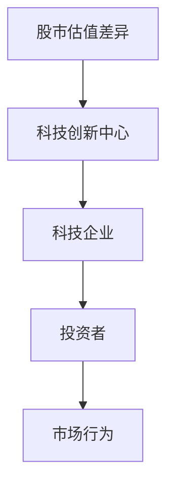
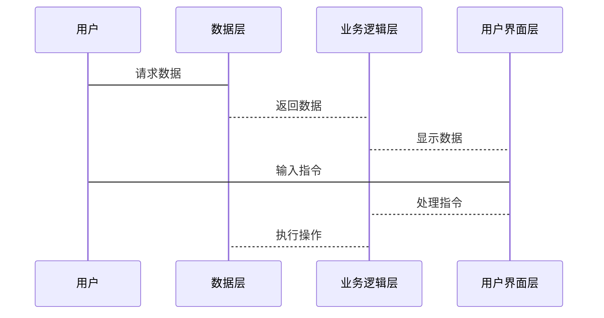

                 


# 股市估值差异对国际科技创新中心布局的影响

## 关键词：股市估值差异、国际科技创新中心、科技创新布局、经济影响、城市规划

## 摘要：本文探讨了股市估值差异如何影响国际科技创新中心的布局，分析了股市估值差异的形成机制及其对科技创新中心的影响，并提出了优化科技创新中心布局的具体方法。

---

# 第一部分：背景介绍

## 第1章：股市估值差异与国际科技创新中心概述

### 1.1 问题背景

#### 1.1.1 股市估值差异的定义与影响
股市估值差异指的是不同市场或同一市场中不同时间段内，股票的市场价格与其内在价值之间的差异。这种差异通常由市场情绪、信息不对称、投资者预期等多种因素引起，可能导致市场波动和投资机会。

#### 1.1.2 国际科技创新中心的定义与特征
国际科技创新中心是指在全球范围内，具有领先地位的科技创新区域，通常聚集了大量高科技企业和研发机构。这些中心通常具有创新能力强、科技资源丰富、人才聚集等特点。

#### 1.1.3 股市估值差异与科技创新中心布局的关系
股市估值差异对科技创新中心的布局有直接影响。高估值的科技企业可能吸引更多投资者和资源，从而推动科技创新中心的发展；而低估值的科技企业可能面临资金不足，影响其创新能力。

### 1.2 问题描述

#### 1.2.1 股市估值差异的形成机制
股市估值差异的形成机制包括市场信息不对称、投资者情绪波动、宏观经济环境变化等因素。这些因素会影响市场的定价机制，导致股票价格与其实际价值出现差异。

#### 1.2.2 科技创新中心布局的影响因素
科技创新中心的布局受多种因素影响，包括政策支持、科技资源分布、人才聚集度、市场需求等。这些因素共同作用，决定了科技创新中心的地理位置和发展方向。

#### 1.2.3 股市估值差异对科技创新中心布局的具体影响
股市估值差异通过影响企业的融资能力、投资者信心和科技资源的分配，进而影响科技创新中心的布局。高估值可能吸引更多投资，推动科技创新中心的发展；而低估值可能导致资源分配不均，影响科技创新中心的竞争力。

### 1.3 问题解决

#### 1.3.1 股市估值差异的量化方法
通过计算股票的市盈率、市净率等指标，可以量化股市估值差异。这些指标能够反映股票价格与其实际价值之间的差异程度。

#### 1.3.2 科技创新中心布局的评估指标
评估科技创新中心的布局可以考虑创新产出、科技企业数量、研发投入、人才密度等指标。这些指标能够衡量科技创新中心的综合实力和影响力。

#### 1.3.3 如何通过股市估值差异优化科技创新中心布局
通过分析股市估值差异，可以优化科技创新中心的布局。例如，高估值的科技企业可以吸引更多资金和人才，从而推动科技创新中心的发展；而低估值的科技企业可以通过政策支持和市场引导，提升其竞争力。

### 1.4 边界与外延

#### 1.4.1 股市估值差异的边界条件
股市估值差异的边界条件包括市场环境、企业基本面、政策法规等因素。这些因素可能影响股市估值差异的计算和分析。

#### 1.4.2 科技创新中心布局的外延扩展
科技创新中心的布局外延包括科技产业园区、孵化器、创新社区等。这些区域的建设和发展可以进一步推动科技创新中心的扩展和优化。

#### 1.4.3 相关概念的对比与区分
股市估值差异与科技创新中心布局之间的关系需要与其他相关概念进行对比和区分。例如，股市估值差异与企业盈利能力、科技创新中心布局与区域经济发展等。

### 1.5 概念结构与核心要素

#### 1.5.1 股市估值差异的核心要素
股市估值差异的核心要素包括股票价格、企业价值、市场信息、投资者情绪等。这些要素共同作用，决定了股市估值差异的形成和变化。

#### 1.5.2 科技创新中心布局的核心要素
科技创新中心布局的核心要素包括科技企业、研发机构、人才资源、政策支持等。这些要素共同决定了科技创新中心的竞争力和发展潜力。

#### 1.5.3 两者的关联关系
股市估值差异与科技创新中心布局之间存在密切的关联关系。股市估值差异通过影响企业的融资能力、投资者信心和资源分配，进而影响科技创新中心的布局和发展。

---

## 第2章：核心概念与联系

### 2.1 核心概念原理

#### 2.1.1 股市估值差异的经济学解释
股市估值差异可以从经济学的角度进行解释。市场参与者的信息不对称、投资者情绪波动以及宏观经济环境变化等因素，都会影响市场的定价机制，导致股票价格与其实际价值之间的差异。

#### 2.1.2 科技创新中心布局的区域经济学分析
科技创新中心的布局可以从区域经济学的角度进行分析。区域的科技资源、人才密度、政策支持等因素，都会影响区域的科技创新能力和发展潜力。

#### 2.1.3 两者之间的互动机制
股市估值差异与科技创新中心布局之间存在互动机制。高估值的科技企业可能吸引更多投资和人才，推动科技创新中心的发展；而科技创新中心的发展也可能进一步提升企业的价值，影响股市估值。

### 2.2 概念属性对比

#### 2.2.1 股市估值差异的属性特征
股市估值差异的属性特征包括波动性、信息依赖性、投资者情绪影响等。这些特征决定了股市估值差异的复杂性和变化性。

#### 2.2.2 科技创新中心布局的属性特征
科技创新中心布局的属性特征包括创新性、资源集中性、政策依赖性等。这些特征决定了科技创新中心的发展模式和竞争优势。

#### 2.2.3 属性对比表格
以下是股市估值差异与科技创新中心布局的属性对比表格：

| 属性                | 股市估值差异              | 科技创新中心布局          |
|---------------------|--------------------------|--------------------------|
| 核心要素            | 股票价格、企业价值        | 科技企业、研发机构        |
| 影响因素            | 市场信息、投资者情绪        | 科技资源、政策支持        |
| 表现形式            | 价格波动、估值差异        | 创新能力、企业数量        |
| 发展动力            | 投资者信心、市场预期        | 技术创新、人才聚集        |

### 2.3 ER实体关系图

#### 2.3.1 实体关系图的Mermaid流程图
以下是股市估值差异与科技创新中心布局之间的实体关系图：



---

## 第3章：算法原理讲解

### 3.1 算法原理

#### 3.1.1 股市估值差异的计算方法
股市估值差异可以通过计算股票的市盈率（P/E比率）和市净率（P/B比率）来衡量。例如，市盈率公式为：

$$ \text{市盈率} = \frac{\text{股价}}{\text{每股收益}} $$

#### 3.1.2 科技创新中心布局的评估算法
科技创新中心布局的评估算法可以通过层次分析法（AHP）进行。例如，权重计算公式为：

$$ w_i = \frac{\sum_{j=1}^{n} a_{ij}}{\sum_{j=1}^{n} a_{ij}} $$

其中，$a_{ij}$是指标的重要性评分。

#### 3.1.3 算法实现的Python代码
以下是评估科技创新中心布局的Python代码示例：

```python
import numpy as np

# 示例数据：科技创新中心评估指标权重
criteria = ['创新产出', '科技企业数量', '研发投入', '人才密度']
weights = [0.4, 0.3, 0.2, 0.1]

# 计算权重向量
weight_vector = np.array(weights)

# 示例数据：科技创新中心评估指标得分
scores = np.array([[0.8, 0.7, 0.6, 0.5],
                    [0.7, 0.6, 0.5, 0.4],
                    [0.6, 0.5, 0.4, 0.3],
                    [0.5, 0.4, 0.3, 0.2]])

# 计算每个中心的综合得分
composite_scores = np.dot(scores, weight_vector)

print("综合得分：", composite_scores)
```

---

## 第4章：系统分析与架构设计

### 4.1 系统分析

#### 4.1.1 问题场景介绍
本文旨在通过分析股市估值差异对国际科技创新中心布局的影响，提出优化科技创新中心布局的具体方法。

#### 4.1.2 系统功能设计
系统功能设计包括数据采集、估值计算、布局评估、结果分析等模块。

#### 4.1.3 系统架构设计
系统架构设计采用分层架构，包括数据层、业务逻辑层和用户界面层。

#### 4.1.4 系统接口设计
系统接口设计包括数据接口、算法接口和用户接口。

#### 4.1.5 系统交互图
以下是系统交互图的Mermaid序列图：



---

## 第5章：项目实战

### 5.1 环境安装

#### 5.1.1 Python环境安装
需要安装Python 3.8及以上版本，并安装numpy和pandas库。

#### 5.1.2 数据库安装
建议使用MySQL或MongoDB数据库。

### 5.2 核心代码实现

#### 5.2.1 股市估值差异计算代码
以下是股市估值差异计算的Python代码：

```python
import pandas as pd

# 示例数据：股票信息
data = {
    '股票代码': ['AAPL', 'GOOGL', 'MSFT', 'AMZN'],
    '股价': [150, 250, 100, 300],
    '每股收益': [10, 20, 15, 25]
}

df = pd.DataFrame(data)

# 计算市盈率
df['市盈率'] = df['股价'] / df['每股收益']
print(df)
```

#### 5.2.2 科技创新中心布局评估代码
以下是科技创新中心布局评估的Python代码：

```python
import numpy as np

# 示例数据：科技创新中心评估指标
criteria = ['创新产出', '科技企业数量', '研发投入', '人才密度']
weights = [0.4, 0.3, 0.2, 0.1]

# 计算权重向量
weight_vector = np.array(weights)

# 示例数据：科技创新中心评估指标得分
scores = np.array([[0.8, 0.7, 0.6, 0.5],
                    [0.7, 0.6, 0.5, 0.4],
                    [0.6, 0.5, 0.4, 0.3],
                    [0.5, 0.4, 0.3, 0.2]])

# 计算每个中心的综合得分
composite_scores = np.dot(scores, weight_vector)

print("综合得分：", composite_scores)
```

### 5.3 案例分析

#### 5.3.1 数据收集与预处理
需要收集相关科技企业的股价、市盈率、市净率等数据，并进行清洗和预处理。

#### 5.3.2 案例分析与解读
通过具体案例分析，验证算法的有效性和准确性。

#### 5.3.3 结果分析
分析计算结果，提出优化建议。

---

## 第6章：最佳实践

### 6.1 最佳实践 tips

#### 6.1.1 投资者策略
投资者应关注股市估值差异，合理配置投资组合，分散风险。

#### 6.1.2 企业策略
科技企业应注重创新能力和核心竞争力，提升市场估值。

#### 6.1.3 政策建议
政府应制定政策支持科技创新中心的发展，优化资源配置。

### 6.2 小结
本文通过分析股市估值差异对国际科技创新中心布局的影响，提出了优化科技创新中心布局的具体方法。

### 6.3 注意事项
投资者在进行投资决策时，应充分考虑市场风险和企业基本面，避免盲目跟风。

### 6.4 拓展阅读
推荐阅读相关领域的书籍和论文，深入了解股市估值差异和科技创新中心布局的理论与实践。

---

# 作者：AI天才研究院/AI Genius Institute & 禅与计算机程序设计艺术 /Zen And The Art of Computer Programming

