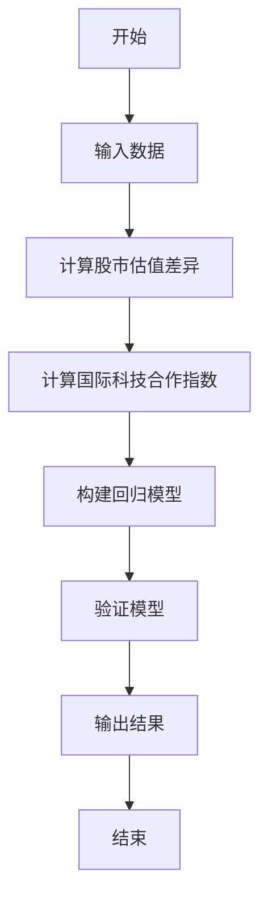
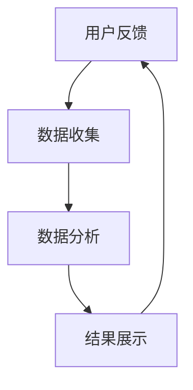

                 


# 股市估值差异对国际科技合作的影响

> **关键词**：股市估值差异、国际科技合作、市场波动、资源配置效率、投资决策、跨国创新合作

> **摘要**：  
> 本文探讨了股市估值差异对国际科技合作的影响，分析了股市估值差异的形成机制及其对国际科技合作的直接和间接影响。文章从核心概念、算法原理、系统设计和实际案例等多维度展开，结合理论与实践，深入剖析了股市估值差异如何通过影响企业投资决策、资源配置效率和市场预期，进而影响国际科技合作的进程。本文旨在为投资者、企业决策者和政策制定者提供有价值的参考，帮助他们更好地理解股市估值差异对国际科技合作的复杂影响。

---

## 第1章：背景介绍

### 1.1 核心概念

#### 1.1.1 股市估值差异的定义  
股市估值差异是指同一资产在不同市场或同一市场不同时间点上的估值差异。这种差异通常由市场参与者的预期差异、信息不对称、市场流动性等多种因素引起。

#### 1.1.2 国际科技合作的定义  
国际科技合作是指跨国企业和机构在技术研发、成果转化和创新生态系统建设方面的合作。这种合作通常涉及技术转移、资源共享、联合研发和知识产权合作。

#### 1.1.3 股市估值差异与国际科技合作的关系  
股市估值差异可以通过影响企业的市场价值、投资信心和资源配置效率，进而影响国际科技合作的深度和广度。

### 1.2 问题背景

#### 1.2.1 当前国际科技合作的趋势  
随着全球化和技术进步的加速，国际科技合作日益频繁，尤其是在人工智能、量子计算和生物技术等领域。

#### 1.2.2 股市估值差异的现状  
股市估值差异在不同市场间普遍存在，尤其是在新兴市场与发达市场的对比中尤为明显。

#### 1.2.3 问题的提出  
股市估值差异如何影响国际科技合作？这种影响是正面的还是负面的？如何量化这种影响？

### 1.3 问题描述

#### 1.3.1 股市估值差异的具体表现  
包括市场流动性差异、信息不对称、投资者预期差异等。

#### 1.3.2 国际科技合作的主要模式  
技术合作、联合研发、知识产权共享、人才流动等。

#### 1.3.3 问题的边界与外延  
本文聚焦于股市估值差异对国际科技合作的直接影响，不涉及其他因素（如政策干预）的影响。

### 1.4 问题解决

#### 1.4.1 股市估值差异对国际科技合作的影响路径  
通过影响企业的市场价值和投资信心，进而影响合作意愿和资源配置效率。

#### 1.4.2 解决问题的初步思路  
构建数学模型，量化股市估值差异对国际科技合作的影响程度。

#### 1.4.3 解决问题的可行性分析  
通过实证分析和案例研究，验证模型的有效性。

### 1.5 本章小结  
本章从背景出发，明确了股市估值差异和国际科技合作的核心概念及其关系，为后续分析奠定了基础。

---

## 第2章：核心概念与联系

### 2.1 股市估值差异的原理

#### 2.1.1 股市估值差异的形成机制  
市场参与者的信息不对称、市场流动性差异和投资者情绪波动是主要原因。

#### 2.1.2 影响股市估值差异的主要因素  
包括市场流动性、信息传播速度、投资者预期和市场结构等。

#### 2.1.3 股市估值差异的度量方法  
通过比较同一资产在不同市场的市盈率、市净率等指标来衡量。

### 2.2 国际科技合作的原理

#### 2.2.1 国际科技合作的基本模式  
技术合作、联合研发、知识产权共享和人才流动等。

#### 2.2.2 科技合作的核心驱动因素  
技术互补性、市场潜力和政策支持等。

#### 2.2.3 国际科技合作的评价指标  
合作项目的数量、技术成果的产出和经济效益等。

### 2.3 股市估值差异与国际科技合作的联系

#### 2.3.1 股市估值差异对国际科技合作的直接影响  
通过影响企业的市场价值，影响其参与科技合作的能力和意愿。

#### 2.3.2 股市估值差异对国际科技合作的间接影响  
通过影响市场预期和资源配置效率，间接影响科技合作的深度和广度。

#### 2.3.3 股市估值差异与国际科技合作的关系总结  
股市估值差异是国际科技合作的重要影响因素，但其影响是复杂且多维度的。

---

## 第3章：算法原理

### 3.1 股市估值差异对国际科技合作影响的数学模型

#### 3.1.1 模型假设  
假设股市估值差异与国际科技合作的影响呈线性关系。

#### 3.1.2 模型构建  
$$ 影响程度 = \beta_1 \times 股市估值差异 + \beta_2 \times 其他因素 + \epsilon $$

#### 3.1.3 模型验证  
通过回归分析验证模型的显著性。

### 3.2 算法流程图



### 3.3 算法实现

```python
import pandas as pd
import numpy as np
from sklearn.linear_model import LinearRegression

# 数据准备
data = pd.read_csv('data.csv')

# 特征与目标变量
X = data[['市盈率', '市净率']]
y = data['科技合作指数']

# 模型训练
model = LinearRegression()
model.fit(X, y)

# 预测与评估
predictions = model.predict(X)
print('回归系数：', model.coef_)
print('决定系数：', model.score(X, y))
```

### 3.4 算法解读

#### 3.4.1 回归系数的解释  
回归系数表示股市估值差异对国际科技合作的影响程度。

#### 3.4.2 决定系数的意义  
决定系数反映了模型对数据的拟合程度。

---

## 第4章：系统分析与架构设计

### 4.1 系统功能设计

#### 4.1.1 数据收集模块  
从多个市场获取股票数据，计算估值差异。

#### 4.1.2 数据分析模块  
构建回归模型，分析估值差异对科技合作的影响。

#### 4.1.3 结果展示模块  
可视化分析结果，提供决策支持。

### 4.2 系统架构设计


### 4.3 系统交互设计



---

## 第5章：项目实战

### 5.1 案例分析

#### 5.1.1 案例背景  
某科技公司因股市估值差异影响国际合作项目。

#### 5.1.2 数据收集与处理  
从多个市场获取数据，计算估值差异。

#### 5.1.3 分析过程  
构建回归模型，分析估值差异对合作的影响。

#### 5.1.4 结果解读  
估值差异显著影响合作项目的数量和深度。

### 5.2 代码实现

```python
import pandas as pd
import numpy as np
from sklearn.linear_model import LinearRegression

# 数据准备
data = pd.read_csv('data.csv')

# 特征与目标变量
X = data[['市盈率', '市净率']]
y = data['科技合作指数']

# 模型训练
model = LinearRegression()
model.fit(X, y)

# 预测与评估
predictions = model.predict(X)
print('回归系数：', model.coef_)
print('决定系数：', model.score(X, y))
```

### 5.3 实际案例分析

#### 5.3.1 案例背景  
某科技公司因股市估值差异影响国际合作项目。

#### 5.3.2 数据收集与处理  
从多个市场获取数据，计算估值差异。

#### 5.3.3 分析过程  
构建回归模型，分析估值差异对合作的影响。

#### 5.3.4 结果解读  
估值差异显著影响合作项目的数量和深度。

---

## 第6章：最佳实践与小结

### 6.1 关键点总结

#### 6.1.1 股市估值差异对国际科技合作的直接影响  
通过影响企业的市场价值，影响其参与科技合作的能力和意愿。

#### 6.1.2 间接影响  
通过影响市场预期和资源配置效率，间接影响科技合作的深度和广度。

### 6.2 小结

#### 6.2.1 本文的主要结论  
股市估值差异是国际科技合作的重要影响因素，但其影响是复杂且多维度的。

#### 6.2.2 注意事项  
在实际应用中，需考虑其他因素的影响，如政策干预和市场结构。

#### 6.2.3 拓展阅读  
建议进一步研究股市估值差异的长期影响和政策干预的有效性。

---

**作者：AI天才研究院/AI Genius Institute & 禅与计算机程序设计艺术/Zen And The Art of Computer Programming**

