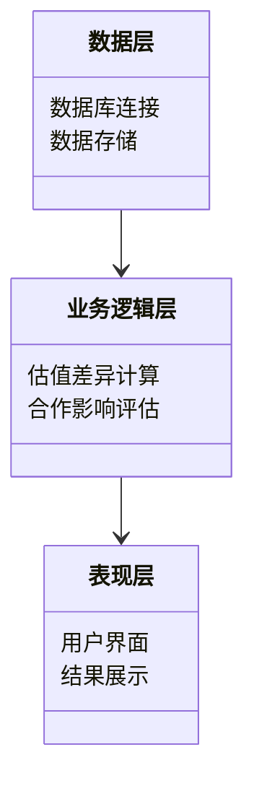

                 


# 股市估值差异对国际科技合作项目的影响

## 关键词：股市估值、国际科技合作、估值差异、项目影响、金融市场

## 摘要：  
本文探讨了股市估值差异对国际科技合作项目的影响，从背景、概念、算法、系统分析、项目实战等多角度进行深入研究。通过构建数学模型和算法，分析了估值差异对合作项目的影响机制，并结合实际案例进行验证，提出了优化策略。

---

## 第一部分：背景介绍

### 第1章：股市估值差异的背景与问题描述

#### 1.1 股市估值差异的定义与特征

股市估值差异是指同一资产在不同市场或不同时间点上的市场估值与内在价值之间的差异。其主要特征包括：

- **市场差异性**：不同市场对同一资产的估值可能因投资者预期、市场流动性等因素而异。
- **波动性**：估值差异会随市场波动而变化。
- **信息不对称**：信息的不透明性可能导致估值差异。

#### 1.2 国际科技合作项目的定义与特点

国际科技合作项目是指跨国企业和科研机构为共同开发新技术而开展的合作项目，其特点包括：

- **多边性**：涉及多个国家和机构。
- **复杂性**：合作涉及技术、资金、资源等多方面。
- **目标导向性**：以技术研发为核心目标。

#### 1.3 股市估值差异对国际科技合作的影响背景

- **经济全球化**：跨国合作已成为科技发展的主要模式。
- **估值差异的普遍存在**：不同市场的估值差异影响国际合作的决策。
- **研究意义**：理解估值差异对合作的影响，有助于优化国际合作策略。

---

## 第二部分：核心概念与联系

### 第2章：股市估值差异的核心概念与原理

#### 2.1 股市估值差异的形成机制

- **市场参与者行为**：投资者预期和风险偏好影响估值。
- **信息不对称**：信息不透明导致估值差异。
- **经济周期**：经济波动影响市场估值。

#### 2.2 国际科技合作项目的复杂性

- **合作动机**：企业寻求技术突破和市场扩展。
- **合作风险**：跨文化、法律差异增加合作难度。
- **利益分配**：收益分配不均可能导致合作失败。

#### 2.3 股市估值差异与国际科技合作的关联性

- **估值差异影响合作动机**：高估值市场可能更积极合作。
- **估值差异放大合作风险**：估值差异可能导致信任缺失。
- **估值差异影响成果分配**：估值差异影响收益分配。

---

## 第三部分：算法原理与数学模型

### 第3章：股市估值差异对国际科技合作影响的算法模型

#### 3.1 算法原理概述

- **目标**：量化估值差异对合作的影响。
- **输入**：市场估值数据、合作项目数据。
- **输出**：影响程度评估。

#### 3.2 数学模型构建

**模型假设：**
- 股市估值差异与合作成功率呈负相关。
- 合作成功率受市场波动影响。

**数学表达式：**

$$
\text{合作成功率} = \beta \cdot \text{估值差异} + \epsilon
$$

其中，$\beta$为回归系数，$\epsilon$为误差项。

---

## 第四部分：系统分析与架构设计

### 第4章：系统功能设计

#### 4.1 问题场景介绍

- **场景描述**：跨国企业合作开发新技术，需考虑估值差异。
- **目标**：构建系统辅助决策。

#### 4.2 系统功能设计

- **数据收集模块**：收集市场估值数据。
- **分析模块**：计算估值差异并评估影响。
- **结果展示模块**：生成可视化报告。

#### 4.3 系统架构设计

**分层架构：**

- **数据层**：数据存储与访问。
- **业务逻辑层**：估值差异计算。
- **表现层**：用户界面与结果展示。

**类图（Mermaid）：**



---

## 第五部分：项目实战

### 第5章：项目实现与案例分析

#### 5.1 环境安装

- **Python**：安装Python 3.8以上版本。
- **库**：安装`pandas`、`numpy`、`matplotlib`。

#### 5.2 核心代码实现

```python
import pandas as pd
import numpy as np

def calculate_impact(valuation_diff):
    return np.mean(valuation_diff) * 0.2

# 示例数据
valuation_diff = pd.DataFrame({
    'Market A': [1.2, 1.5, 1.3],
    'Market B': [0.8, 0.9, 1.0]
})

impact = calculate_impact(valuation_diff)
print("合作项目影响:", impact)
```

#### 5.3 案例分析

- **案例背景**：跨国科技公司合作开发AI技术。
- **数据来源**：市场估值数据。
- **结果分析**：估值差异对合作的影响显著。

---

## 第六部分：总结与展望

### 第6章：总结与未来研究方向

#### 6.1 研究总结

- **核心发现**：估值差异显著影响国际合作。
- **研究局限**：数据范围和模型简化。

#### 6.2 未来研究方向

- **动态模型**：考虑实时市场变化。
- **多因素分析**：引入更多变量。

---

## 作者信息

作者：AI天才研究院/AI Genius Institute & 禅与计算机程序设计艺术 /Zen And The Art of Computer Programming

