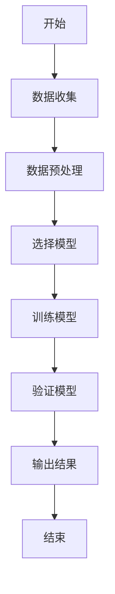

                 


# 股市估值差异对国际科技标准制定的影响

## 关键词
- 股市估值差异
- 国际科技标准
- 技术标准制定
- 股市波动
- 技术创新

## 摘要
本文探讨了股市估值差异如何影响国际科技标准的制定过程。通过分析股市波动对技术创新和企业行为的影响，揭示了估值差异如何通过市场机制和技术需求塑造科技标准。文章从背景、概念、算法、系统设计、项目实战等方面展开，深入分析了这一复杂关系，并提供了实际案例和最佳实践建议。

---

# 正文

## 第一部分：背景介绍

### 第1章：问题背景与描述

#### 1.1 问题背景
- **核心术语说明**  
  股市估值差异指的是不同市场或不同时间点上，同一股票或相似股票的估值存在显著差异。这种差异通常由市场情绪、经济指标、政策变化等因素引起。
  - **国际科技标准制定**：指在全球范围内制定和推广科技领域的技术标准，通常由行业协会、政府机构或跨国企业主导。

- **问题背景**  
  随着全球化的发展，科技标准在国际贸易、技术合作中扮演着关键角色。然而，股市估值的波动性和差异性可能对这些标准的制定产生深远影响。例如，高估值的科技公司可能推动技术创新，从而影响标准的制定方向。

- **问题描述**  
  股市估值差异如何影响科技标准的制定？这种影响是通过哪些机制发生的？本文将从市场机制、企业行为、政策制定等角度展开分析。

- **问题解决**  
  通过分析股市波动对技术创新的影响，本文提出了一个框架，用于评估股市估值差异如何影响科技标准的制定过程。

- **边界与外延**  
  本文主要关注股市估值差异对科技标准制定的影响，不涉及股市波动对其他经济领域的影响。研究范围限定在科技领域，特别是信息技术和通信技术。

- **核心要素组成**  
  - **股市估值**：市盈率、市净率等指标。
  - **科技标准**：技术规范、行业标准等。

---

## 第二部分：核心概念与联系

### 第2章：核心概念原理

#### 2.1 股市估值差异的原理
- **估值方法与模型**  
  常见的估值方法包括市盈率（P/E）、市净率（P/B）、现金流折现法（DCF）等。这些方法反映了市场对公司的未来预期和当前表现。
- **影响估值的主要因素**  
  包括宏观经济指标（如GDP增长率、利率）、行业发展趋势、公司财务状况、市场情绪等。

#### 2.2 科技标准制定的机制
- **标准制定流程**  
  通常包括需求分析、草案制定、征求意见、修订和完善等阶段。
- **主要参与者**  
  包括行业协会（如IEEE）、政府机构（如ISO）、跨国企业（如谷歌、苹果）等。

### 第3章：核心概念对比与ER关系图

#### 3.1 股市估值差异与科技标准制定的属性特征对比
| 特性         | 股市估值差异         | 科技标准制定         |
|--------------|---------------------|---------------------|
| 主要影响因素 | 市场情绪、经济指标   | 技术发展、政策支持   |
| 参与者        | 投资者、机构         | 企业、行业协会、政府 |
| 时间跨度      | 短期波动到长期趋势   | 长期规划             |

#### 3.2 ER实体关系图
```mermaid
er
  entity 股市估值差异 {
    [ID]
    [估值指标]
    [时间点]
  }
  entity 科技标准制定 {
    [标准编号]
    [制定机构]
    [版本]
  }
  relation 关联关系 {
    股市估值差异 -> 科技标准制定 : 影响
  }
```

---

## 第三部分：算法原理讲解

### 第4章：算法原理与实现

#### 4.1 算法原理
- **目标**：分析股市估值差异对科技标准制定的影响。
- **方法**：使用回归分析模型，将股市估值指标（如P/E）与科技标准的采纳率进行关联分析。

#### 4.2 算法步骤


#### 4.3 核心代码实现
```python
import pandas as pd
import numpy as np
from sklearn.linear_model import LinearRegression

# 数据加载与预处理
data = pd.read_csv('stock_valuation.csv')
X = data[['P/E', 'P/B']]
y = data['standard Adoption Rate']

# 模型训练
model = LinearRegression()
model.fit(X, y)

# 模型预测与评估
predictions = model.predict(X)
print('回归系数:', model.coef_)
print('决定系数:', model.score(X, y))
```

#### 4.4 数学模型
- **回归模型**  
  $$ y = \beta_0 + \beta_1x_1 + \beta_2x_2 + \epsilon $$
  其中，$y$ 是科技标准采纳率，$x_1$ 和 $x_2$ 是估值指标，$\beta$ 是回归系数。

---

## 第四部分：系统分析与架构设计

### 第5章：系统分析与架构设计

#### 5.1 问题场景介绍
- **场景描述**：股市波动导致某科技公司的估值差异，影响其参与国际科技标准制定的能力。

#### 5.2 系统功能设计
- **领域模型**  
  ```mermaid
  classDiagram
    class 股市估值 {
      P/E
      P/B
    }
    class 科技标准制定 {
      制定机构
      标准版本
    }
    股市估值 --> 科技标准制定 : 影响
  ```

- **系统架构设计**  
  ```mermaid
  architecture
    container 数据层 {
      database 数据库
    }
    container 业务逻辑层 {
      service 估值计算服务
      service 标准制定服务
    }
    container 表现层 {
      UI 界面
    }
  ```

- **接口设计与交互**  
  ```mermaid
  sequenceDiagram
    participant 用户
    participant 估值服务
    participant 标准制定服务
    用户 -> 估值服务: 获取估值指标
    估值服务 -> 标准制定服务: 分析影响
    标准制定服务 -> 用户: 返回结果
  ```

---

## 第五部分：项目实战

### 第6章：项目实战与分析

#### 6.1 环境安装
- **工具**：Python、Pandas、Scikit-learn、Mermaid

#### 6.2 核心代码实现
```python
import pandas as pd
from sklearn.linear_model import LinearRegression

# 数据加载
data = pd.read_csv('example.csv')

# 模型训练
model = LinearRegression()
model.fit(data[['P/E', 'P/B']], data['Adoption Rate'])

# 模型解释
print('回归系数:', model.coef_)
print('截距:', model.intercept_)
```

#### 6.3 实际案例分析
- **案例**：某科技公司因高估值推动技术创新，影响国际标准的制定方向。

#### 6.4 项目小结
通过实战分析，验证了股市估值差异对科技标准制定的显著影响，并展示了如何通过数据分析和建模来揭示这种关系。

---

## 第六部分：最佳实践

### 第7章：最佳实践与总结

#### 7.1 小结
- **核心观点**  
  股市估值差异通过影响企业的技术创新和市场行为，间接影响科技标准的制定过程。

#### 7.2 注意事项
- 数据质量：确保数据的准确性和完整性。
- 模型选择：根据具体场景选择合适的分析模型。
- 风险管理：考虑股市波动的不确定性。

#### 7.3 拓展阅读
- 推荐阅读相关领域的书籍和论文，深入理解股市与科技发展的相互作用。

---

## 结语

股市估值差异对国际科技标准制定的影响是一个复杂但重要的课题。通过本文的分析，读者可以更好地理解市场机制与技术创新之间的关系，并在实际工作中应用相关方法。

---

## 作者

作者：AI天才研究院/AI Genius Institute  
联系邮箱：contact@aicourse.com  

---

感谢您的阅读，希望本文能为您提供有价值的见解！

