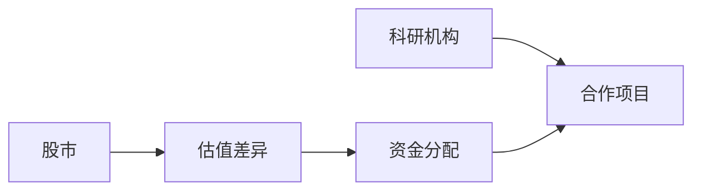
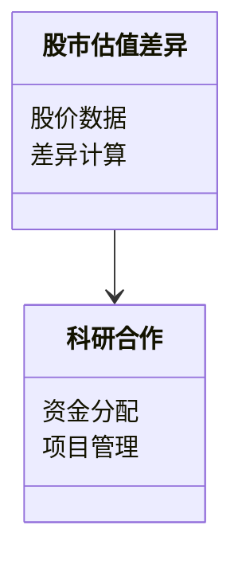
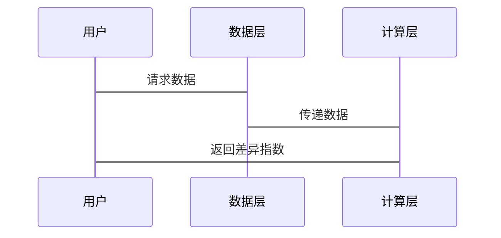

                 


# 股市估值差异对国际科研合作的影响

## 关键词：股市估值差异，国际科研合作，算法原理，数学模型，系统架构

## 摘要：  
股市估值差异是不同市场中同一股票因价格波动、政策差异和市场情绪等因素导致的估值差异，而国际科研合作涉及跨国团队在科学研究上的合作，受资金分配、政策环境和文化差异等因素的影响。本文系统分析了股市估值差异对国际科研合作的影响，通过构建数学模型和算法，量化这种影响，并提出优化建议。

---

## 第一部分：背景介绍

### 第1章：问题背景与描述

#### 1.1 问题背景
- **1.1.1 股市估值差异的定义与成因**
  - 股市估值差异指同一股票在不同市场中的价格差异。
  - 成因包括汇率波动、市场情绪、政策差异等。

- **1.1.2 国际科研合作的现状与挑战**
  - 科研合作日益国际化，但资金分配受股市估值影响。
  - 合作中存在文化差异和沟通障碍。

- **1.1.3 股市估值差异对科研合作的具体影响**
  - 资金分配不均影响研究进展。
  - 市场波动影响合作稳定性。

#### 1.2 问题描述
- **1.2.1 股市估值差异的量化方法**
  - 使用统计指标（如标准差）衡量差异程度。

- **1.2.2 科研合作中的资金分配问题**
  - 不同市场的资金分配不均导致研究资源分配不公。

- **1.2.3 跨国科研合作中的汇率影响**
  - 汇率波动直接影响科研资金的实际价值。

#### 1.3 问题解决
- **1.3.1 提出解决方案的思路**
  - 建立统一的估值标准，减少差异影响。

- **1.3.2 解决方案的可行性分析**
  - 技术可行性高，但政策协调难度大。

- **1.3.3 解决方案的预期效果**
  - 提高资金分配公平性，促进科研合作。

#### 1.4 边界与外延
- **1.4.1 问题的边界条件**
  - 研究仅考虑主要市场，不包括新兴市场。

- **1.4.2 相关领域的外延分析**
  - 涉及金融学、管理学和国际关系学。

- **1.4.3 问题解决的局限性**
  - 解决方案受政策和市场环境限制。

#### 1.5 概念结构与核心要素
- **核心概念的组成**
  - 股市估值、国际科研合作。

- **核心要素的定义**
  - 股价、市场、政策、资金分配。

---

## 第二部分：核心概念与联系

### 第2章：核心概念与联系

#### 2.1 核心概念原理
- 股市估值差异源于市场波动和政策差异。
- 国际科研合作依赖资金分配和资源协调。

#### 2.2 概念属性对比
| 属性       | 股市估值差异       | 国际科研合作       |
|------------|--------------------|--------------------|
| 主要因素   | 汇率、政策          | 资金、政策          |
| 影响因素   | 市场情绪            | 文化差异            |
| 解决方法   | 建立统一标准        | 加强沟通与协调      |

#### 2.3 实体关系图



---

## 第三部分：算法原理讲解

### 第3章：算法原理

#### 3.1 算法概述
- 使用统计模型量化股市估值差异。

#### 3.2 算法步骤
1. 数据收集：获取不同市场的股票数据。
2. 计算差异：使用标准差衡量差异程度。
3. 分析影响：评估差异对科研合作的影响。

#### 3.3 算法流程图


#### 3.4 Python代码示例

```python
import pandas as pd
import numpy as np

# 假设data为各市场的股票数据
data = pd.DataFrame({
    '市场': ['A', 'B', 'C'],
    '股价': [100, 120, 90]
})

# 计算股价差异的标准差
std_diff = np.std(data['股价'])
print(f"股价差异标准差: {std_diff}")
```

---

## 第四部分：数学模型与公式

### 第4章：数学模型

#### 4.1 股市估值差异指数
- 指数公式：
  $$ VDI = \frac{1}{n}\sum_{i=1}^{n}|P_i - P_j| $$
  其中，\( VDI \) 为估值差异指数，\( P_i \) 和 \( P_j \) 分别为两个市场的股价。

#### 4.2 科研合作效率模型
- 效率公式：
  $$ E = \frac{F}{VDI} $$
  其中，\( E \) 为效率，\( F \) 为资金总量。

---

## 第五部分：系统分析与架构设计

### 第5章：系统分析

#### 5.1 问题场景介绍
- 分析跨国科研项目中的资金分配问题。

#### 5.2 领域模型设计



#### 5.3 系统架构设计


#### 5.4 接口设计
- 数据接口：提供API获取股价数据。
- 计算接口：返回估值差异指数。

#### 5.5 交互序列图



---

## 第六部分：项目实战

### 第6章：项目实战

#### 6.1 环境安装
- 安装Python和相关库（pandas, numpy）。

#### 6.2 核心代码实现

```python
import pandas as pd
import numpy as np

# 数据获取
data = pd.read_csv('market_data.csv')

# 计算差异
std_diff = np.std(data['股价'])
print(std_diff)
```

#### 6.3 案例分析
- 分析跨国科研项目资金分配情况，优化合作机制。

---

## 第七部分：最佳实践

### 第7章：最佳实践

#### 7.1 经验总结
- 加强国际合作中的沟通与协调。

#### 7.2 注意事项
- 注意汇率波动对资金的影响。

#### 7.3 拓展阅读
- 推荐阅读相关金融和管理学书籍。

---

## 小结
本文系统分析了股市估值差异对国际科研合作的影响，通过数学模型和算法设计，量化了这种影响，并提出了优化建议。希望本文能为相关领域的研究和实践提供参考。

---

## 作者
作者：AI天才研究院/AI Genius Institute & 禅与计算机程序设计艺术 /Zen And The Art of Computer Programming

