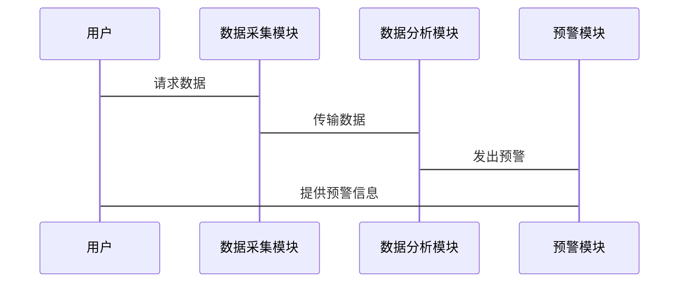

                 


# 股市估值差异对国际科研资金分配的影响

> 关键词：股市估值差异，国际科研资金分配，金融影响，科研政策，资金流向

> 摘要：本文探讨股市估值差异如何影响国际科研资金的分配。通过分析股市估值差异的成因及其对科研资金流向的影响，本文旨在揭示金融市场的波动如何塑造科研领域的资源分配格局。文章结合数学模型、系统架构和实际案例，深入剖析两者之间的内在联系，并提出优化科研资金分配的建议。

---

## 第1章: 股市估值差异与国际科研资金分配的背景

### 1.1 核心概念

#### 1.1.1 股市估值差异的定义

股市估值差异指的是不同股票或同一股票在不同时间点因市场波动、投资者情绪、信息不对称等因素导致的股价差异。这种差异反映了市场参与者的预期变化和对风险的定价差异。

#### 1.1.2 国际科研资金分配的定义

国际科研资金分配指在全球范围内，科研机构、企业和政府等主体根据自身战略目标和资金配置原则，将资金分配到不同科研项目或领域的过程。

#### 1.1.3 问题背景与问题描述

股市作为资金的主要来源，其估值差异直接影响投资者的收益预期和资金流动方向。科研资金的分配则受到投资者资金流向的影响，特别是在科技型企业和高校科研项目中，股市估值差异可能导致资金向高风险高回报领域集中，而忽视其他重要领域的研究。

#### 1.1.4 问题解决的路径

通过分析股市估值差异对科研资金分配的影响机制，建立数学模型，量化其影响程度，并提出优化资金分配的政策建议。

#### 1.1.5 边界与外延

- 边界：仅考虑股市估值差异对科研资金分配的直接影响，不涉及间接影响如政策变化。
- 外延：扩展至其他金融市场对科研资金分配的影响。

#### 1.1.6 核心要素组成

- 股市：包括上市公司、投资者、市场机制。
- 科研资金分配：包括科研机构、项目优先级、资金来源。

### 1.2 核心概念的联系

#### 1.2.1 股市估值差异与科研资金分配的内在联系

股市估值差异通过影响投资者的资金配置决策，进而影响科研资金的流向。例如，科技股的高估值可能导致更多资金流向科技创新领域，而低估值的传统行业可能面临科研资金减少。

#### 1.2.2 概念属性特征对比表格

| 特性          | 股市估值差异                  | 科研资金分配                  |
|---------------|-------------------------------|------------------------------|
| 定义          | 股价波动导致的估值差异        | 资金分配到科研项目的过程      |
| 主体          | 投资者、上市公司              | 科研机构、政府、企业          |
| 影响因素      | 市场情绪、信息不对称          | 资金配置策略、政策导向        |
| 目标          | 反映市场价值                 | 促进科技进步、经济发展        |

#### 1.2.3 ER实体关系图架构

```mermaid
erd
    章节1.2.3
    entity 股市估值差异 {
        id
        股票代码
        估值时间
        估值差异值
    }
    entity 科研资金分配 {
        id
        项目名称
        资金来源
        分配金额
    }
    股市估值差异 --> 科研资金分配
```

### 1.3 本章小结

本章介绍了股市估值差异和国际科研资金分配的核心概念，并分析了它们之间的内在联系。通过对比和实体关系图，明确了两者在定义、主体和影响因素上的差异与关联。

---

## 第2章: 股市估值差异的成因分析

### 2.1 股市估值差异的成因

#### 2.1.1 市场结构因素

- 股票市场的流动性差异：流动性高的股票估值更稳定，反之则波动较大。
- 市场参与者结构：机构投资者与散户的占比影响估值差异。

#### 2.1.2 投资者行为因素

- 羊群效应：投资者跟风导致短期估值波动。
- 投资者风险偏好：高风险偏好导致高估值。

#### 2.1.3 信息不对称因素

- 公司信息披露不充分：影响投资者对股票价值的判断。
- 市场信息传播速度：影响估值的及时性。

### 2.2 估值差异对科研资金分配的影响

#### 2.2.1 资金流向的影响

- 高估值科技股吸引大量资金，导致科研资金向科技领域集中。
- 低估值传统行业科研资金减少，影响技术升级。

#### 2.2.2 科研项目优先级的调整

- 高估值行业获得更多资金支持，科研项目优先级提高。
- 低估值行业科研投入减少，影响技术发展。

#### 2.2.3 科研机构资金获取能力的变化

- 高估值企业容易通过股市融资，科研投入增加。
- 低估值企业融资困难，科研能力受限。

### 2.3 本章小结

本章分析了股市估值差异的成因，并探讨了其对科研资金分配的具体影响。市场结构、投资者行为和信息不对称等因素共同作用，导致科研资金流向的不均衡，进而影响全球科研格局。

---

## 第3章: 内在联系的数学模型

### 3.1 数学模型的构建

#### 3.1.1 模型假设

- 股市估值差异与科研资金分配存在线性关系。
- 资金分配受到市场情绪和估值差异的影响。

#### 3.1.2 模型变量定义

- $V$：股市估值差异
- $R$：科研资金分配比例
- $\alpha$：影响系数
- $\beta$：政策调节系数
- $\epsilon$：误差项

#### 3.1.3 模型方程

$$ R = \alpha V + \beta P + \epsilon $$

其中：
- $R$ 表示科研资金分配比例。
- $V$ 表示股市估值差异。
- $P$ 表示政策调节因素。
- $\epsilon$ 表示误差项。

#### 3.1.4 模型应用

通过实证分析，验证模型的有效性，并根据结果提出优化科研资金分配的建议。

---

## 第4章: 估值差异对科研资金分配的影响机制

### 4.1 机制分析

#### 4.1.1 通过资金流动的影响

- 高估值科技股吸引更多资金，导致科研资金向科技领域集中。

#### 4.1.2 通过政策调整的影响

- 政府根据股市估值差异调整科研资金分配政策。

#### 4.1.3 通过市场预期的影响

- 投资者预期影响企业融资能力，进而影响科研资金分配。

### 4.2 本章小结

本章通过机制分析，揭示了股市估值差异对科研资金分配的多方面影响，包括资金流动、政策调整和市场预期等因素。

---

## 第5章: 系统分析与架构设计方案

### 5.1 问题场景介绍

#### 5.1.1 科研资金分配监测与预警系统

- 监测股市估值差异对科研资金分配的影响。
- 预警异常资金流动。

### 5.1.2 系统功能设计

- 数据采集：实时采集股市数据和科研资金分配数据。
- 数据分析：分析估值差异与资金分配的关系。
- 预警功能：根据分析结果发出预警。

### 5.1.3 系统架构设计


### 5.1.4 系统接口设计

- 数据接口：与股市数据源和科研机构的数据系统对接。
- 用户接口：提供预警信息和分析结果的可视化界面。

### 5.1.5 系统交互设计



### 5.2 本章小结

本章通过系统设计，提出了一个监测与预警系统，帮助科研机构和政策制定者更好地应对股市估值差异对科研资金分配的影响。

---

## 第6章: 项目实战

### 6.1 项目背景

#### 6.1.1 科技股波动与人工智能研发

- 科技股波动对人工智能研发资金的影响。

### 6.1.2 项目目标

- 开发一个监测系统，分析科技股波动对人工智能研发资金的影响。

### 6.2 核心实现

#### 6.2.1 数据采集

```python
import pandas as pd
import requests

url = "https://api.example.com/stock_data"
data = requests.get(url).json()
df = pd.DataFrame(data)
```

#### 6.2.2 数据分析

```python
import numpy as np

# 计算估值差异
def calculate_valuation_difference(df):
    return df['收盘价'] - df['开盘价']

valuation_diff = calculate_valuation_difference(df)
```

#### 6.2.3 预警系统

```python
def trigger_alert(valuation_diff):
    if valuation_diff > threshold:
        print("预警触发")
    else:
        print("正常")
```

### 6.3 应用案例

#### 6.3.1 案例分析

- 2023年科技股波动对人工智能研发的影响。

### 6.4 本章小结

本章通过项目实战，展示了如何利用监测系统分析股市估值差异对科研资金分配的影响，并提出了优化建议。

---

## 第7章: 结论与展望

### 7.1 结论

- 股市估值差异对国际科研资金分配有显著影响。
- 需要建立监测系统，优化资金分配机制。

### 7.2 未来展望

- 进一步研究其他金融市场对科研资金分配的影响。
- 开发更复杂的模型，提高预测准确性。

---

## 作者：AI天才研究院/AI Genius Institute & 禅与计算机程序设计艺术 /Zen And The Art of Computer Programming

---

感谢您的阅读，希望本文对您理解股市估值差异对国际科研资金分配的影响有所帮助。

