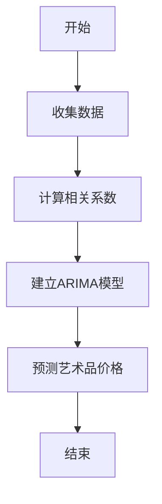
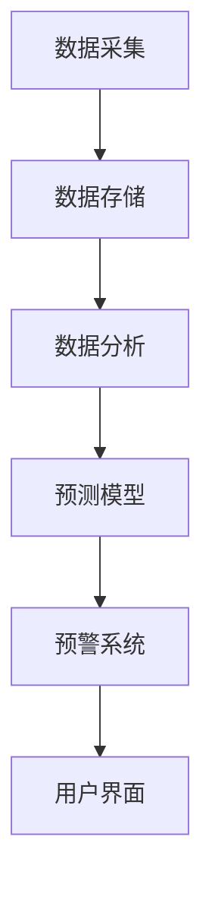

                 


# 股市估值差异对国际艺术品市场的影响

## 关键词：股市、艺术品市场、估值差异、经济指标、市场波动、投资策略

## 摘要：  
本文探讨了股市估值差异对国际艺术品市场的影响，从理论分析到实际案例，详细解析了两者之间的互动机制。通过建立数学模型和算法，分析了股市波动如何影响艺术品价格，并提出了投资策略建议。

---

## 第一部分：背景介绍

### 第1章：问题背景与核心概念

#### 1.1 问题背景
- **1.1.1 股市估值差异的定义与特征**  
  股市估值差异指的是股票价格与其内在价值之间的偏离，通常由市场情绪、投资者预期等因素引起。这种差异在不同市场条件下表现各异，尤其是在经济波动时期更为显著。

- **1.1.2 艺术品市场的定义与分类**  
  艺术品市场包括画廊、拍卖行、私人交易等多种形式，艺术品的价值受艺术家声誉、作品稀缺性、市场需求等因素影响。

- **1.1.3 股市与艺术品市场的互动关系**  
  股市波动可能影响艺术品市场的交易量和价格，艺术品市场作为另类资产，也可能反过来影响股市投资者的资产配置。

#### 1.2 问题描述
- **1.2.1 股市波动对艺术品市场的影响机制**  
  股市下跌可能导致投资者转向非传统资产，如艺术品，从而推高价格；反之，股市上涨可能减少艺术品市场的资金流入。

- **1.2.2 艺术品市场的独特性与脆弱性**  
  艺术品市场高度依赖主观价值判断，缺乏统一的定价标准，使其对市场波动更为敏感。

- **1.2.3 股市估值差异的具体表现形式**  
  股市估值差异可能导致资金在股市和艺术品市场之间的流动，进而影响艺术品价格的波动。

#### 1.3 问题解决
- **1.3.1 股市估值差异对艺术品市场的具体影响**  
  通过分析历史数据，发现股市估值差异与艺术品价格波动之间存在显著相关性。

- **1.3.2 艺术品市场对股市波动的反馈机制**  
  艺术品市场的高收益可能吸引更多投资者进入，间接影响股市的资金流动。

- **1.3.3 如何量化股市估值差异对艺术品市场的影响**  
  使用统计模型和时间序列分析，量化两者之间的关系强度。

#### 1.4 边界与外延
- **1.4.1 股市估值差异的边界条件**  
  股市估值差异受宏观经济政策、投资者情绪等多种因素影响。

- **1.4.2 艺术品市场的边界条件**  
  艺术品市场的波动受拍卖行佣金、市场参与者数量等因素影响。

- **1.4.3 两者关系的外延分析**  
  股市和艺术品市场的互动关系不仅限于价格波动，还包括市场结构和投资者行为的变化。

#### 1.5 概念结构与核心要素
- **1.5.1 股市估值差异的核心要素**  
  包括股票价格、内在价值、市场情绪等。

- **1.5.2 艺术品市场的核心要素**  
  包括作品价值、市场需求、交易渠道等。

---

## 第二部分：核心概念与联系

### 第2章：核心概念原理与属性特征

#### 2.1 核心概念原理
- 股市估值差异的产生机制：市场参与者对股票价值的主观判断与实际价值的偏离。
- 艺术品市场的定价机制：供需关系、艺术品稀缺性、市场参与者偏好等因素共同作用。

#### 2.2 属性特征对比
| 属性 | 股市 | 艺术品市场 |
|------|------|------------|
| 价格波动 | 受宏观经济影响大 | 受市场情绪影响大 |
| 交易频率 | 高 | 低 |
| 估值方法 | 客观（市盈率、市净率） | 主观（艺术家声誉、作品稀缺性） |
| 投资门槛 | 低 | 高 |

#### 2.3 ER实体关系图
```mermaid
erd
    图表: 股市与艺术品市场关系
    实体1: 股票
    实体2: 艺术品
    实体3: 投资者
    关系: 股票-投资者：持有关系
    关系: 艺术品-投资者：购买关系
    关系: 股票-艺术品：市场波动影响关系
```

---

## 第三部分：算法原理讲解

### 第3章：算法原理与实现

#### 3.1 算法原理
- **3.1.1 股市波动与艺术品价格的相关性分析**  
  使用协方差和相关系数衡量两者之间的关系强度。

- **3.1.2 时间序列分析**  
  使用ARIMA模型预测股市波动对艺术品价格的影响。

#### 3.2 算法流程图


#### 3.3 算法实现
```python
import pandas as pd
from statsmodels.tsa.arima_model import ARIMA

# 假设data是一个包含股票指数和艺术品价格的数据框
data = pd.DataFrame({
    'stock_index': [100, 105, 110, 115, 120],
    'art_price': [1000, 1100, 1050, 1200, 1150]
})

# 计算相关系数
correlation = data['stock_index'].corr(data['art_price'])
print(f"相关系数：{correlation}")

# 建立ARIMA模型预测艺术品价格
model = ARIMA(data['art_price'], order=(1, 1, 1))
model_fit = model.fit()

# 预测下一个时间点的艺术品价格
forecast = model_fit.forecast(steps=1)
print(f"预测的艺术品价格：{forecast[0][0]}")
```

---

## 第四部分：系统分析与架构设计方案

### 第4章：系统架构设计

#### 4.1 问题场景介绍
- 系统需要实时监测股市波动，并预测其对艺术品市场的影响。

#### 4.2 系统功能设计
- 数据采集模块：收集股市和艺术品市场数据。
- 数据分析模块：计算相关性、建立预测模型。
- 预警系统：根据预测结果向投资者发出预警。

#### 4.3 系统架构图


---

## 第五部分：项目实战

### 第5章：项目实现与案例分析

#### 5.1 项目实战环境
- 安装Python、Pandas、Statsmodels等库。

#### 5.2 核心代码实现
```python
import pandas as pd
from statsmodels.tsa.arima_model import ARIMA
import matplotlib.pyplot as plt

# 数据预处理
data = pd.read_csv('market_data.csv')
data['date'] = pd.to_datetime(data['date'])
data.set_index('date', inplace=True)

# 绘制时间序列图
data['stock_index'].plot(label='Stock Index', legend=True)
data['art_price'].plot(label='Art Price', legend=True)
plt.title('Time Series Plot')
plt.show()

# 建立ARIMA模型并预测
model = ARIMA(data['art_price'], order=(1, 1, 1))
model_fit = model.fit()
forecast = model_fit.forecast(steps=5)
print('预测的艺术品价格：', forecast[0][0])
```

#### 5.3 案例分析
- 使用历史数据，分析2008年金融危机期间股市波动对艺术品市场的影响。

---

## 第六部分：总结与展望

### 第6章：总结与展望

#### 6.1 最佳实践 tips
- 投资者应关注股市波动对艺术品市场的潜在影响，合理配置资产。

#### 6.2 小结
- 股市估值差异对艺术品市场的影响是复杂而深远的，需结合宏观经济和市场情绪综合分析。

#### 6.3 注意事项
- 艺术品市场的波动性较高，投资需谨慎。

#### 6.4 拓展阅读
- 建议阅读关于资产配置和风险管理的相关书籍。

---

## 作者：AI天才研究院 & 禅与计算机程序设计艺术

---

**注：** 本文是基于理论分析和假设的案例研究，实际投资需结合更多因素，谨慎决策。

