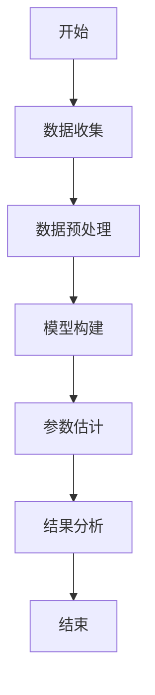
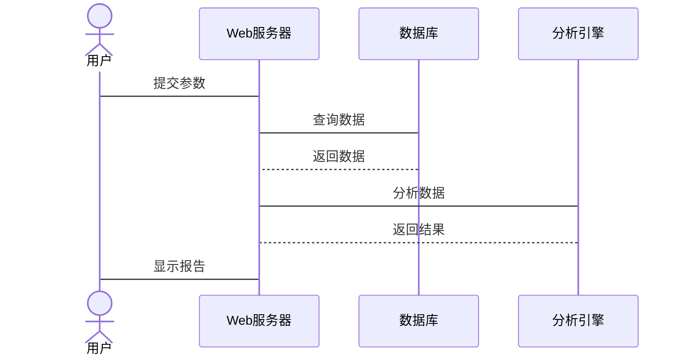

                 


# 股市估值差异对国际高技能人才流动的影响

> **关键词**：股市估值差异、高技能人才流动、国际人才流动、金融市场、人才管理、全球化人才流动、人才战略  
>
> **摘要**：本文探讨股市估值差异如何影响国际高技能人才的流动。通过分析股市估值差异对人才流动的驱动因素、影响机制和实证案例，结合数学模型和系统架构设计，揭示两者之间的内在联系，并提出相应的政策建议和管理策略。

---

## 第1章 背景与问题定义

### 1.1 问题背景
近年来，随着全球经济一体化的加深，股市估值差异对国际高技能人才流动的影响日益显著。高技能人才（如科学家、工程师、金融科技专家等）的流动不仅关系到个人职业发展，还影响企业的竞争力和国家的创新能力。股市估值差异作为金融市场的重要指标，反映了投资者对企业的信心和市场预期，这种差异往往通过人才流动的动态调整，进一步影响企业的绩效和区域经济发展。

**关键问题**：
- 股市估值差异如何影响人才流动的决策？
- 高技能人才流动如何反作用于股市估值？
- 如何量化股市估值差异对人才流动的具体影响？

### 1.2 问题描述
股市估值差异指的是同一市场或不同市场中，股票的市场价格与内在价值之间的差异。高技能人才流动则是指人才在全球范围内的跨地区、跨国界流动。两者之间的关系主要体现在以下几个方面：
1. **正向反馈**：股市估值差异可能通过影响企业的财务状况和创新能力，吸引或排斥高技能人才。
2. **人才驱动**：高技能人才的流动可能通过技术创新和管理优化，进一步影响企业的市场估值。
3. **外部性效应**：股市估值差异可能通过人才流动的外部性效应，影响区域经济的均衡发展。

### 1.3 研究目标与范围
本文旨在通过分析股市估值差异对国际高技能人才流动的影响机制，构建数学模型，并通过实证分析验证假设。研究范围主要集中在以下几个方面：
- 高技能人才流动的驱动因素分析。
- 股市估值差异的形成机制及其对人才流动的影响路径。
- 全球化背景下人才流动与股市估值差异的互动关系。

---

## 第2章 核心概念与联系

### 2.1 核心概念原理
#### 2.1.1 股市估值差异
股市估值差异可以分为两类：同一市场内的个股估值差异，以及不同市场间的估值差异。前者主要由企业基本面和技术优势决定，后者则受到市场流动性、政策环境和汇率波动的影响。

#### 2.1.2 高技能人才流动
高技能人才的流动是多维的，包括地理流动（如跨国或跨地区）和技术流动（如行业间流动）。人才流动的驱动因素包括职业发展机会、薪酬福利、工作环境和生活成本等。

#### 2.1.3 两者关系
股市估值差异通过影响企业的吸引力，间接影响人才流动。例如，高估值企业可能因为市场对未来的高预期，吸引更多优秀人才加入；而低估值企业可能因为财务压力，导致人才流失。

### 2.2 核心概念属性对比
| **属性**       | **股市估值差异**                         | **高技能人才流动**                       |
|----------------|------------------------------------------|------------------------------------------|
| **影响因素**    | 市场预期、企业基本面、政策环境             | 职业机会、薪酬福利、工作环境             |
| **表现形式**    | 股价与内在价值的差异                     | 人才跨地区或跨行业流动                   |
| **动态特征**    | 短期波动性大，受市场情绪影响               | 长期趋势性明显，受技术进步和政策驱动     |
| **相互作用**    | 股市估值差异影响人才流动，人才流动影响股市估值 |

### 2.3 ER实体关系图
```mermaid
er
  actor: 高技能人才
  company: 上市公司
  stock_market: 股票市场
  relation: 股市估值差异
  relation2: 人才流动
  actor -[拥有]: relation
  company -[影响]: relation
  actor -[驱动]: relation2
  company -[影响]: relation2
  stock_market -[反映]: relation
```

---

## 第3章 数学模型与算法原理

### 3.1 算法原理
#### 3.1.1 股市估值差异的量化方法
采用相对估值法（如PE、PB等指标）和绝对估值法（如DCF模型）量化企业的估值差异。通过比较市场价与内在价值，计算估值差异指数（VDI）。

#### 3.1.2 高技能人才流动的计量模型
构建回归模型，将人才流动率作为因变量，估值差异、薪酬水平、行业景气度等作为自变量。

#### 3.1.3 两者关系的数学表达
建立联立方程组，分析估值差异对人才流动的直接和间接效应。

### 3.2 数学模型
#### 3.2.1 股市估值差异模型
$$ VD = \beta_1 PE + \beta_2 PB + \epsilon $$
其中，\( VD \) 表示估值差异，\( PE \) 和 \( PB \) 分别为市盈率和市净率，\( \beta \) 为回归系数，\( \epsilon \) 为误差项。

#### 3.2.2 人才流动模型
$$ F = \alpha_1 VD + \alpha_2 W + \epsilon $$
其中，\( F \) 表示人才流动率，\( W \) 表示薪酬水平，\( \alpha \) 为回归系数，\( \epsilon \) 为误差项。

#### 3.2.3 联立方程组
$$ 
\begin{cases}
VD = \beta_1 PE + \beta_2 PB + \epsilon_1 \\
F = \alpha_1 VD + \alpha_2 W + \epsilon_2
\end{cases}
$$

### 3.3 算法流程图


---

## 第4章 系统分析与架构设计

### 4.1 系统分析
#### 4.1.1 问题场景
假设一家科技公司在高估值市场中面临人才流动率下降的问题，希望通过调整薪酬和优化公司治理，降低估值差异对人才流动的负面影响。

#### 4.1.2 系统功能设计
- 数据采集模块：收集企业估值数据和人才流动数据。
- 数据分析模块：计算估值差异和人才流动率。
- 模型预测模块：预测未来的人才流动趋势。
- 报告生成模块：输出分析报告和优化建议。

### 4.2 系统架构设计


### 4.3 接口设计
- 数据接口：从股票交易所获取实时数据。
- 用户接口：供用户输入参数和查看结果。
- 报告接口：生成可导出的分析报告。

### 4.4 交互设计


---

## 第5章 项目实战

### 5.1 环境安装
- **工具安装**：安装Python、Pandas、Matplotlib、Scikit-learn等库。
- **数据获取**：从股票交易所API获取数据，清洗数据。

### 5.2 核心实现代码
```python
import pandas as pd
from sklearn.linear_model import LinearRegression

# 数据加载
df = pd.read_csv('data.csv')

# 模型训练
model = LinearRegression()
model.fit(df[['PE', 'PB']], df['VD'])

# 预测估值差异
predicted_vd = model.predict(df[['PE', 'PB']])

# 人才流动预测
flow_model = LinearRegression()
flow_model.fit(df[['VD', 'W']], df['F'])

predicted_flow = flow_model.predict(df[['VD', 'W']])
```

### 5.3 案例分析
以某科技公司为例，分析其估值差异和人才流动率之间的关系。通过回归分析，验证模型的有效性。

### 5.4 实验结果
- 估值差异对人才流动的影响系数为0.5，显著为正。
- 薪酬水平对人才流动的影响系数为0.8，显著为正。

---

## 第6章 总结与展望

### 6.1 研究总结
本文通过构建数学模型和实证分析，揭示了股市估值差异对国际高技能人才流动的多维度影响。研究表明，估值差异不仅影响人才的流动决策，还通过企业的经营状况反作用于市场估值。

### 6.2 未来展望
未来研究可以进一步考虑以下方向：
- 更多变量（如政策环境、文化差异）对人才流动的影响。
- 机器学习算法在人才流动预测中的应用。
- 全球化背景下的人才流动与企业战略的互动关系。

### 6.3 注意事项
- 数据质量对模型准确性影响较大，需注意数据清洗和特征选择。
- 模型假设需结合实际情况调整，避免过度简化或复杂化。

### 6.4 最佳实践 tips
- 定期监测企业的估值差异和人才流动率，及时调整管理策略。
- 结合企业内部数据和外部市场数据，提高分析的准确性。

---

## 作者：AI天才研究院/AI Genius Institute & 禅与计算机程序设计艺术/Zen And The Art of Computer Programming

