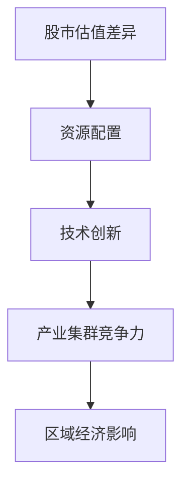

                 


# 股市估值差异对国际高新技术产业集群的影响

> 关键词：股市估值差异、高新技术产业集群、资源配置、技术创新、系统动力学模型

> 摘要：本文探讨股市估值差异对国际高新技术产业集群的影响，分析其如何通过资源配置和技术创新影响产业集群的竞争力。文章结合理论分析和系统建模，提出促进产业集群发展的政策建议。

---

# 第一部分: 背景介绍与核心概念

## 第1章: 股市估值差异与高新技术产业集群概述

### 1.1 股市估值差异的定义与特征

#### 1.1.1 股市估值的基本概念
股市估值是指通过对企业未来现金流的折现或其他方法，确定其市场价值的过程。常见的估值方法包括市盈率（P/E）、市净率（P/B）和 discounted cash flow (DCF) 模型。

$$
\text{市盈率} = \frac{\text{股价}}{\text{每股收益}}
$$

#### 1.1.2 估值差异的形成机制
估值差异源于信息不对称、投资者情绪、宏观经济环境等因素。例如，成长型企业由于未来盈利不确定，通常会被市场给予更高的估值溢价。

#### 1.1.3 高新技术产业集群的定义与特征
高新技术产业集群是指在特定区域或领域，集中了大量高科技企业的群体。这些企业之间通常存在协同效应，共同推动技术创新和产业发展。

### 1.2 问题背景与研究意义

#### 1.2.1 股市估值差异的现状分析
近年来，股市估值差异显著，尤其是在高新技术领域，企业的估值差异可能反映了市场对技术创新潜力的不同预期。

#### 1.2.2 高新技术产业集群的发展趋势
高新技术产业集群在全球范围内快速发展，尤其是在人工智能、生物医药等领域，产业集群已成为区域经济发展的重要驱动力。

#### 1.2.3 研究的价值与意义
研究股市估值差异对产业集群的影响，有助于理解市场如何通过资源配置推动技术创新，并为政策制定者提供参考。

---

## 第2章: 股市估值差异对国际高新技术产业集群的影响机制

### 2.1 核心概念与联系

#### 2.1.1 股市估值差异与企业融资的关系
估值差异直接影响企业的融资能力。高估值企业更容易获得资金支持，从而推动技术创新。

#### 2.1.2 高新技术产业集群的形成与发展的关键因素
技术创新、产业链协同和政策支持是产业集群发展的关键因素。

#### 2.1.3 估值差异对产业集群竞争力的影响
估值差异通过影响资源配置和技术创新，进而影响产业集群的竞争力。

### 2.2 影响机制的理论模型

#### 2.2.1 概念属性特征对比表格

| 概念                | 特征1        | 特征2        |
|---------------------|--------------|--------------|
| 股市估值差异       | 信息不对称    | 投资者情绪    |
| 高新技术产业集群   | 技术创新     | 产业链协同    |

#### 2.2.2 ER实体关系图架构
```mermaid
erd
    左边：企业
    中间：股市估值
    右边：产业集群
    企业与股市估值有双向箭头
    企业与产业集群有双向箭头
    股市估值与产业集群有双向箭头
```

#### 2.2.3 估值差异对产业集群的系统动力学模型（Mermaid流程图）


---

# 第二部分: 股市估值差异的理论分析

## 第3章: 股市估值差异的形成原因与特征

### 3.1 股市估值差异的形成原因

#### 3.1.1 市场信息不对称的影响
信息不对称导致市场对同一企业的估值出现差异。例如，内部信息掌握较多的企业可能获得更高的估值。

#### 3.1.2 投资者情绪与预期的作用
投资者情绪波动会影响市场对企业的估值。例如，市场乐观时，高成长企业的估值可能被高估。

#### 3.1.3 宏观经济环境的波动
宏观经济政策、利率变化等因素也会影响股市估值。例如，低利率环境可能导致整体估值上升。

### 3.2 高新技术产业集群的特征分析

#### 3.2.1 技术创新的核心作用
技术创新是产业集群发展的核心驱动力。例如，人工智能领域的技术创新推动了相关产业集群的发展。

#### 3.2.2 产业链协同效应
产业集群中的企业通过协同效应降低成本、提高效率。例如，半导体产业集群中的芯片设计与制造企业协同合作。

#### 3.2.3 区域经济与政策支持的互动
政策支持如税收优惠、研发补贴等，对产业集群的发展至关重要。例如，硅谷的政策支持促进了高新技术产业集群的发展。

---

## 第4章: 股市估值差异对资源配置的影响

### 4.1 资源配置的理论框架

#### 4.1.1 资源配置的基本概念
资源配置指将有限资源（如资金、技术）分配给不同企业或项目的过程。股市估值差异影响资源配置效率。

#### 4.1.2 股市估值差异对资源配置效率的影响
高估值企业更容易获得资金，可能导致资源分配不均。例如，高估值的科技企业可能吸引过多资金，而传统企业则被忽视。

#### 4.1.3 高新技术产业集群中的资源配置特点
产业集群中的企业通常共享资源，如技术、人才和市场。例如，生物技术产业集群中的企业共享研发设施。

---

## 第5章: 股市估值差异对技术创新的影响

### 5.1 技术创新的融资需求

#### 5.1.1 技术创新的高风险与高回报特性
技术创新需要大量前期投入，但成功后可能带来高回报。例如，人工智能技术的成功可能带来指数级增长。

#### 5.1.2 估值差异对技术创新投入的激励作用
高估值企业更愿意投入技术创新，因为市场对其技术潜力有更高的预期。

#### 5.1.3 技术创新与产业集群发展的互动关系
技术创新推动产业集群发展，而产业集群为技术创新提供支持。例如，硅谷的创新文化促进了科技产业集群的发展。

---

# 第三部分: 股市估值差异对高新技术产业集群的影响分析

## 第6章: 股市估值差异对产业集群竞争力的影响

### 6.1 产业集群竞争力的评价指标

#### 6.1.1 竞争力的多维度分析
竞争力可以从技术创新能力、市场份额、利润率等多个维度衡量。例如，一家企业的市场占有率可以反映其竞争力。

#### 6.1.2 股市估值差异对产业集群竞争力的直接与间接影响
高估值可能提升企业的竞争力，但可能导致资源过度集中，影响整体产业集群的健康发展。

#### 6.1.3 竞争力提升的路径分析
通过优化资源配置、加强技术创新和提升产业链协同效应，可以提升产业集群竞争力。

### 6.2 系统动力学模型的应用

#### 6.2.1 系统动力学模型构建
系统动力学模型用于分析估值差异、资源配置和技术创新之间的动态关系。例如，可以模拟不同估值差异下产业集群的竞争优势变化。

#### 6.2.2 模型的仿真与验证
通过仿真可以发现，适度的估值差异有助于优化资源配置，提升技术创新能力，从而增强产业集群竞争力。

#### 6.2.3 模型结果对政策制定的启示
政策制定者应关注估值差异的适度性，避免过度波动，同时优化资源配置机制，促进技术创新。

---

## 第7章: 实证分析与案例研究

### 7.1 实证分析

#### 7.1.1 数据来源与处理
选取全球主要高新技术产业集群（如硅谷、班加罗尔）的相关数据，分析股市估值差异对产业集群竞争力的影响。

#### 7.1.2 分析方法与结果
通过回归分析发现，适度的估值差异与产业集群竞争力呈正相关。

### 7.2 案例研究

#### 7.2.1 硅谷产业集群的估值差异分析
硅谷的高估值企业如苹果、谷歌推动了当地产业集群的发展。

#### 7.2.2 班加罗尔产业集群的估值差异分析
班加罗尔的生物技术产业集群通过政策支持和技术创新，实现了快速发展。

---

## 第8章: 政策建议与未来展望

### 8.1 政策建议

#### 8.1.1 完善市场机制
通过提高信息透明度和市场效率，减少估值差异的不合理波动。

#### 8.1.2 加强政策支持
政府应通过税收优惠、研发补贴等措施，支持高新技术产业集群的发展。

#### 8.1.3 优化资源配置
鼓励企业间协同合作，优化资源配置，提升整体竞争力。

### 8.2 未来展望

#### 8.2.1 数字化与智能化趋势
随着数字化和智能化技术的发展，高新技术产业集群将更加依赖技术创新和资源共享。

#### 8.2.2 全球化与区域化并行
全球化背景下，区域产业集群的重要性将更加凸显。

---

# 第四部分: 结论与展望

## 第9章: 结论

### 9.1 核心发现
股市估值差异对高新技术产业集群的发展具有重要影响，适度的估值差异有助于优化资源配置和技术创新。

### 9.2 研究局限
本文主要基于理论分析和部分案例，未来需要更多实证研究支持。

### 9.3 未来研究方向
进一步研究不同经济环境下估值差异对产业集群的影响，探索更多促进产业集群发展的策略。

---

# 作者：AI天才研究院 & 禅与计算机程序设计艺术

