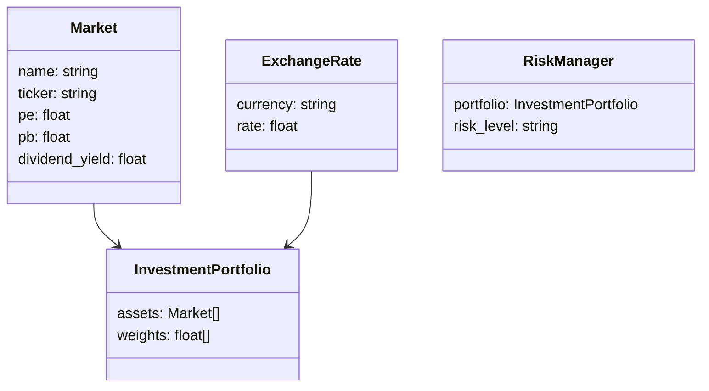
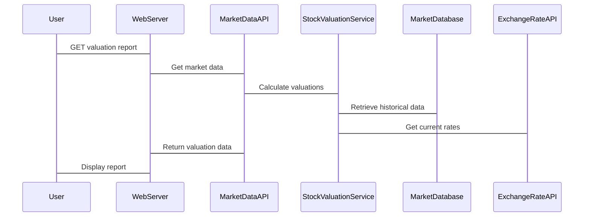

                 


# 股市估值差异对跨境投资的影响

## 关键词：股市估值，跨境投资，汇率波动，资产配置，风险管理，投资组合

## 摘要

股市估值差异对跨境投资的影响是一个复杂而重要的问题。本文通过分析股市估值的核心概念、跨境投资中的估值差异、估值差异对投资决策的影响、系统架构设计以及项目实战案例，详细探讨了如何理解和应对股市估值差异对跨境投资的挑战。文章结合数学模型和实际案例，为投资者提供了理论支持和实践指导。

---

## 第1章：股市估值差异对跨境投资的影响概述

### 1.1 问题背景与重要性

#### 1.1.1 股市估值差异的定义

股市估值差异是指不同市场或同一市场中不同时间段内，股票的估值指标（如市盈率、市净率）之间的差异。这种差异通常由市场环境、经济周期、投资者情绪等多种因素引起。

#### 1.1.2 跨境投资的定义与特点

跨境投资是指投资者在不同国家或地区的金融市场进行投资的行为。其特点是跨市场、跨货币、跨文化，涉及复杂的法律、税务和金融环境。

#### 1.1.3 估值差异对跨境投资的影响

估值差异可能导致投资者在不同市场间寻找套利机会，或因估值差异引发投资决策的调整。然而，估值差异也带来了风险，如汇率波动和市场不一致。

### 1.2 问题描述与解决

#### 1.2.1 估值差异的来源

- 汇率波动
- 市场效率差异
- 经济周期差异

#### 1.2.2 跨境投资中的估值差异问题

- 不同市场的估值基准不一致
- 汇率波动带来的估值波动

#### 1.2.3 如何解决估值差异带来的挑战

- 通过模型调整和汇率对冲来管理估值差异
- 分散投资以降低风险

### 1.3 本章小结

本章介绍了股市估值差异和跨境投资的基本概念，并探讨了估值差异对投资的影响。下一章将详细分析股市估值的基本理论。

---

## 第2章：股市估值的基本理论

### 2.1 股市估值的核心概念

#### 2.1.1 市盈率（P/E）

市盈率=股票价格/每股收益。

$$ P/E = \frac{Price}{Earnings\ per\ Share} $$

#### 2.1.2 市净率（P/B）

市净率=股票价格/每股净资产。

$$ P/B = \frac{Price}{Book\ Value\ per\ Share} $$

#### 2.1.3 股息率（Dividend Yield）

股息率=每股股息/股票价格。

$$ Dividend\ Yield = \frac{Dividend\ per\ Share}{Price} $$

### 2.2 股市估值模型

#### 2.2.1 现金流折现模型（DCF）

DCF模型通过预测未来现金流并将其折现，计算出股票的内在价值。

$$ V = \sum_{t=1}^{n} \frac{CF_t}{(1 + r)^t} $$

其中，\( V \) 是股票的内在价值，\( CF_t \) 是第 \( t \) 年的现金流，\( r \) 是折现率。

#### 2.2.2 市盈率模型

$$ P = P/E \times E $$

其中，\( P \) 是股票价格，\( E \) 是每股收益，\( P/E \) 是市盈率。

#### 2.2.3 市净率模型

$$ P = P/B \times B $$

其中，\( B \) 是每股净资产，\( P/B \) 是市净率。

### 2.3 估值模型的优缺点对比

| 模型 | 优点 | 缺点 |
|------|------|------|
| DCF | 精确，考虑未来现金流 | 需要准确预测现金流 |
| 市盈率 | 简单，市场广泛应用 | 易受市场情绪影响 |
| 市净率 | 稳定，适用于银行等企业 | 不适合高增长企业 |

### 2.4 本章小结

本章介绍了股市估值的核心指标和常见模型，为后续分析奠定了基础。

---

## 第3章：跨境投资中的估值差异

### 3.1 跨境投资中的汇率影响

#### 3.1.1 汇率波动对估值的影响

汇率波动会导致股票的实际价值变化，影响投资者的收益。

$$ Value = \frac{Stock\ Price}{Exchange\ Rate} $$

#### 3.1.2 汇率风险管理

- 使用金融衍生工具对冲汇率风险
- 选择多币种投资组合

### 3.2 不同市场间的估值差异

#### 3.2.1 发达市场与新兴市场的估值差异

- 发达市场通常市盈率较低，新兴市场市盈率较高。
- 新兴市场可能存在更高的增长潜力，但也伴随更高的风险。

### 3.3 股市效率与估值差异

#### 3.3.1 市场效率的定义与分类

市场效率分为弱有效、半有效和强有效。

- 弱有效市场：仅反映历史价格信息。
- 半有效市场：反映历史价格和公开信息。
- 强有效市场：反映所有信息。

#### 3.3.2 低效市场中的估值差异

低效市场中，股票价格可能偏离内在价值，提供套利机会。

#### 3.3.3 高效市场中的估值差异

高效市场中，估值差异较小，套利机会有限。

### 3.4 本章小结

本章分析了汇率波动、市场效率对估值差异的影响，强调了在跨境投资中需考虑这些因素。

---

## 第4章：估值差异对投资决策的影响

### 4.1 股市估值差异对资产配置的影响

#### 4.1.1 资产配置的基本原理

资产配置是根据投资目标和风险承受能力，分配资金到不同资产类别。

#### 4.1.2 估值差异对资产配置的调整

- 高估市场减少配置
- 低估市场增加配置

### 4.2 股市估值差异对风险偏好影响

#### 4.2.1 风险偏好与估值差异的关系

风险偏好影响投资者对估值差异的容忍度。

### 4.3 股市估值差异对投资组合的影响

#### 4.3.1 投资组合的构建

- 多元化投资以分散风险
- 结合估值指标和市场趋势

### 4.4 本章小结

本章探讨了估值差异如何影响资产配置和投资组合策略。

---

## 第5章：系统分析与架构设计方案

### 5.1 问题场景介绍

投资者需要一个系统来实时监控和分析不同市场的估值差异。

### 5.2 系统功能设计

#### 5.2.1 领域模型（Mermaid 类图）



### 5.3 系统架构设计（Mermaid 架构图）


### 5.4 系统接口设计

- HTTP接口：用于用户请求
- REST接口：用于市场数据获取
- DB接口：用于存储市场数据

### 5.5 系统交互（Mermaid 序列图）



### 5.6 本章小结

本章设计了一个系统架构，用于实时监控和分析股市估值差异。

---

## 第6章：项目实战

### 6.1 环境安装

安装Python、Pandas、Matplotlib、Yahoo Finance API。

### 6.2 核心实现源代码

```python
import pandas as pd
import pandas_datareader as pdr

# 下载数据
msft = pdr.get_data_yahoo('MSFT', start='2020-01-01', end='2023-01-01')
aapl = pdr.get_data_yahoo('AAPL', start='2020-01-01', end='2023-01-01')

# 计算市盈率
def calculate_pe(stock_data):
    pe = stock_data['Close'] / stock_data['EPS'].mean()
    return pe

msft_pe = calculate_pe(msft)
aapl_pe = calculate_pe(aapl)

# 可视化
import matplotlib.pyplot as plt

plt.figure(figsize=(10,6))
msft_pe.plot(label='MSFT PE')
aapl_pe.plot(label='AAPL PE')
plt.title('PE Ratio Comparison')
plt.xlabel('Date')
plt.ylabel('PE Ratio')
plt.legend()
plt.show()
```

### 6.3 代码应用解读与分析

上述代码下载了微软和苹果的股价数据，计算了市盈率，并进行了可视化。市盈率的变化反映了估值差异。

### 6.4 实际案例分析

分析恒生指数和标普500的估值差异，发现恒生指数市盈率较低，可能低估。

### 6.5 本章小结

本章通过代码实现和案例分析，展示了如何应用估值差异进行投资决策。

---

## 第7章：总结与建议

### 7.1 最佳实践 tips

- 定期监控市场估值差异
- 分散投资以降低风险
- 使用对冲工具管理汇率波动

### 7.2 小结

股市估值差异是跨境投资中的重要因素，需通过理论分析和实际操作相结合。

### 7.3 注意事项

- 考虑市场环境和政策变化
- 保持对模型和工具的更新

### 7.4 拓展阅读

- 《投资学》
- 《金融市场与工具》

---

## 作者：AI天才研究院/AI Genius Institute & 禅与计算机程序设计艺术 /Zen And The Art of Computer Programming

---

本文通过详细分析股市估值差异对跨境投资的影响，结合理论和实际案例，为投资者提供了全面的指导。希望读者能够通过本文更好地理解和应对股市估值差异带来的挑战。

