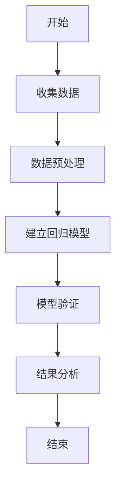
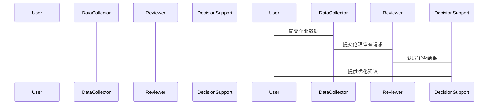

                 


# 股市估值高低对企业AI伦理委员会构成的影响

## 关键词：股市估值、AI伦理委员会、企业治理、伦理审查、人工智能

## 摘要：本文探讨了股市估值的高低如何影响企业中AI伦理委员会的构成。通过分析高估值和低估值对企业资源分配、公众期望和企业治理的影响，本文揭示了股市估值与AI伦理委员会之间的内在联系，并提出了相应的管理策略。

---

## 第一部分：背景介绍

### 第1章：问题背景与核心概念

#### 1.1 问题背景
- **1.1.1 股市估值的定义与影响**
  股市估值是市场对一家公司价值的评估，常用的指标包括市盈率（P/E）和市净率（P/B）。高估值意味着市场对公司前景看好，低估值则可能表明市场对其未来表现持怀疑态度。

- **1.1.2 AI伦理委员会的定义与作用**
  AI伦理委员会是负责审查和指导企业在使用人工智能技术时的行为，确保技术的使用符合伦理标准，避免对社会、环境和人类造成负面影响。

- **1.1.3 股市估值与企业治理的关系**
  股市估值不仅反映企业的财务状况，还影响企业的治理结构和战略决策。高估值企业通常面临更大的公众和投资者压力，要求公司在治理和伦理方面表现更佳。

#### 1.2 问题描述
- **1.2.1 股市估值对企业决策的影响**
  高估值企业可能在资源分配上更有优势，能够投入更多资金到AI伦理审查和合规工作。而低估值企业可能面临生存压力，优先考虑短期财务目标。

- **1.2.2 AI伦理委员会在企业中的角色**
  AI伦理委员会在企业治理中扮演关键角色，特别是在高估值企业中，确保AI技术的使用符合伦理标准，维护公司声誉。

- **1.2.3 问题的提出：股市估值如何影响AI伦理委员会的构成**
  股市估值的高低直接影响企业对AI伦理委员会的资源投入和人员构成，进而影响其运作效率和独立性。

#### 1.3 问题解决
- **1.3.1 通过AI技术优化企业治理**
  AI技术可以帮助企业更高效地进行伦理审查和合规管理，提升治理效率。

- **1.3.2 伦理委员会在企业AI治理中的作用**
  伦理委员会通过审查和指导AI技术的使用，确保企业在技术创新的同时，履行社会责任。

- **1.3.3 股市估值与伦理委员会构成的关联性分析**
  股市估值影响企业的资源分配和治理结构，进而影响伦理委员会的构成和运作。

#### 1.4 边界与外延
- **1.4.1 股市估值的边界条件**
  股市估值受多种因素影响，包括宏观经济环境、行业状况和企业自身表现。

- **1.4.2 AI伦理委员会的边界条件**
  伦理委员会的独立性和有效性取决于企业的支持和资源投入。

- **1.4.3 问题的外延与相关领域的联系**
  股市估值与企业治理、伦理管理等多个领域相关，共同影响企业的可持续发展。

#### 1.5 核心概念与组成
- **1.5.1 核心概念：股市估值与AI伦理委员会**
  股市估值是企业的外部评价，AI伦理委员会是企业内部的治理结构。

- **1.5.2 核心要素：企业治理、伦理框架、市场反应**
  这些要素共同作用，影响企业的AI伦理管理。

- **1.5.3 概念结构与关系图**
  绘制概念图，展示股市估值、企业治理和AI伦理委员会之间的相互作用。

---

## 第二部分：核心概念与联系

### 第2章：核心概念原理

#### 2.1 股市估值的原理
- **2.1.1 市盈率、市净率等估值指标的计算方法**
  - 市盈率（P/E）= 股价 / 每股净利润
  - 市净率（P/B）= 股价 / 每股净资产

- **2.1.2 股价与企业基本面的关系**
  股价反映市场对公司未来盈利能力和增长潜力的预期。

- **2.1.3 市场情绪对估值的影响**
  市场情绪波动会影响投资者对股票的需求，从而影响股价和估值。

#### 2.2 AI伦理委员会的原理
- **2.2.1 伦理委员会的组织结构**
  通常包括内部成员（如法务、合规人员）和外部专家（如伦理学家、律师）。

- **2.2.2 伦理审查的流程与标准**
  包括项目评估、风险分析、合规审查等步骤。

- **2.2.3 伦理委员会的决策机制**
  通过集体讨论和投票，确保决策的公正性和透明度。

#### 2.3 核心概念对比分析
- **2.3.1 股市估值与企业治理的关系**
  高估值企业通常在治理结构上更为完善，注重合规和透明度。

- **2.3.2 AI伦理委员会与企业治理的关系**
  伦理委员会是企业治理的重要组成部分，负责监督AI技术的使用。

- **2.3.3 股市估值对伦理委员会构成的具体影响**
  高估值企业更倾向于建立专业化的伦理委员会，而低估值企业可能在资源上有所限制。

#### 2.4 核心概念属性对比表
| **属性**         | **股市估值**               | **AI伦理委员会**            |
|------------------|---------------------------|-----------------------------|
| 定义             | 市场对企业的价值评估       | 企业内部的治理结构          |
| 影响因素         | 财务表现、市场情绪         | 企业治理、伦理审查标准      |
| 目标             | 反映企业价值              | 确保AI技术的伦理使用        |
| 关系             | 影响企业治理结构          | 是企业治理的一部分          |

#### 2.5 ER实体关系图
- **2.5.1 实体关系图的绘制**
  绘制ER图，展示企业、股市估值、AI伦理委员会之间的关系。

- **2.5.2 关系图的解释与分析**
  企业通过股市估值影响其治理结构，进而影响AI伦理委员会的构成和运作。

---

## 第三部分：算法原理

### 第3章：算法原理

#### 3.1 算法原理概述
- **3.1.1 算法目的**
  分析股市估值与AI伦理委员会构成之间的关系，预测估值变化对委员会的影响。

- **3.1.2 算法步骤**
  1. 收集数据：包括企业的股市估值指标和伦理委员会构成数据。
  2. 数据预处理：清洗数据，处理缺失值和异常值。
  3. 建立模型：使用回归分析或其他统计方法，分析估值与委员会构成的关系。
  4. 模型验证：通过交叉验证评估模型的准确性。

#### 3.2 算法流程图


#### 3.3 数学模型
- **线性回归模型**
  $$ y = \beta_0 + \beta_1 x + \epsilon $$
  其中，y为伦理委员会构成的指标，x为股市估值指标。

#### 3.4 Python代码实现
```python
import pandas as pd
import numpy as np
from sklearn.linear_model import LinearRegression
from sklearn.metrics import mean_squared_error

# 假设df为数据框，包含'valuation'和'committee_size'两列
X = df[['valuation']]
y = df['committee_size']

model = LinearRegression()
model.fit(X, y)

y_pred = model.predict(X)
mse = mean_squared_error(y, y_pred)
print(f"均方误差：{mse}")
print(f"系数：{model.coef_[0]}")
print(f"截距：{model.intercept_}")
```

---

## 第四部分：系统分析与架构设计

### 第4章：系统分析与架构设计

#### 4.1 问题场景介绍
- **场景描述**
  企业面临高估值和低估值两种情况，需根据估值调整AI伦理委员会的构成和运作。

#### 4.2 系统功能设计
- **功能模块**
  1. 数据采集模块：收集企业估值和伦理委员会构成数据。
  2. 伦理审查模块：对AI项目进行伦理审查和风险评估。
  3. 决策支持模块：基于数据模型提供伦理委员会构成的优化建议。

#### 4.3 系统架构设计


#### 4.4 系统接口设计
- **API接口**
  - 数据采集接口：用于接收企业估值和委员会构成数据。
  - 审查结果接口：返回伦理审查的结果和建议。

#### 4.5 系统交互图


---

## 第五部分：项目实战

### 第5章：项目实战

#### 5.1 环境安装
- **安装Python和必要的库**
  - 使用Anaconda安装环境，包含pandas、numpy、scikit-learn等库。

#### 5.2 系统核心实现
```python
import pandas as pd
from sklearn.linear_model import LinearRegression

# 加载数据
df = pd.read_csv('data.csv')

# 建立模型
model = LinearRegression()
model.fit(df[['valuation']], df['committee_size'])

# 预测结果
predictions = model.predict(df[['valuation']])
```

#### 5.3 代码应用解读与分析
- **代码功能**
  - 读取数据：从CSV文件中读取企业估值和伦理委员会构成数据。
  - 建立模型：使用线性回归模型分析两者之间的关系。
  - 预测结果：基于模型预测伦理委员会构成的变化。

#### 5.4 实际案例分析
- **案例分析**
  某高估值企业通过调整伦理委员会构成，优化AI伦理审查流程，提升治理效率。

#### 5.5 项目小结
- **项目总结**
  通过项目实战，验证了股市估值对AI伦理委员会构成的影响，并展示了如何通过技术手段优化企业治理。

---

## 第六部分：最佳实践、小结、注意事项、拓展阅读

### 第6章：最佳实践

#### 6.1 最佳实践
- **高估值企业**
  - 投资于专业的伦理委员会，确保AI技术的合规使用。
- **低估值企业**
  - 在有限资源下，寻求成本效益高的伦理管理方式。

#### 6.2 小结
- 股市估值直接影响企业对AI伦理委员会的资源投入和人员构成，进而影响其运作效率和独立性。

#### 6.3 注意事项
- **数据隐私**
  在分析企业数据时，需确保数据隐私和合规性。
- **模型局限**
  线性回归模型可能无法捕捉复杂的关系，需结合其他方法进行分析。

#### 6.4 拓展阅读
- 推荐阅读《企业治理与人工智能》、《AI伦理管理指南》等相关书籍。

---

## 结语

股市估值高低对企业AI伦理委员会的构成有重要影响。高估值企业更倾向于建立强大、专业的伦理委员会，而低估值企业可能在资源有限的情况下，难以充分构建和维护有效的伦理委员会。企业需根据自身估值情况，合理配置资源，确保AI伦理委员会的独立性和有效性，实现可持续发展。

---

## 作者：AI天才研究院/AI Genius Institute & 禅与计算机程序设计艺术 /Zen And The Art of Computer Programming

