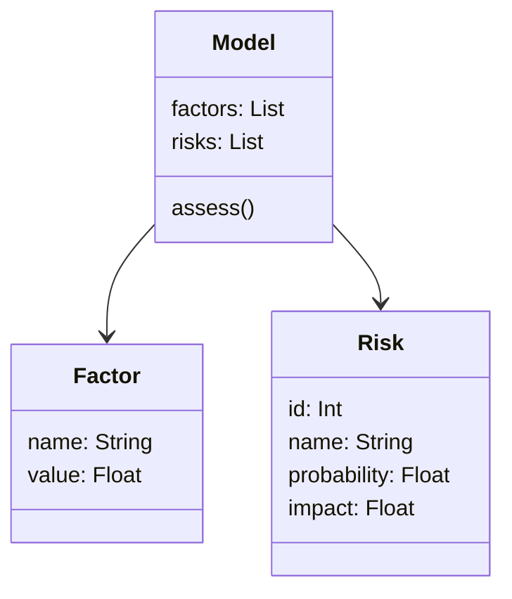
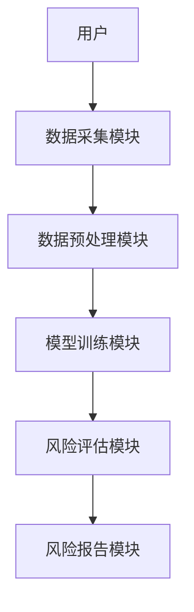

                 


# 股市估值高低对企业AI伦理风险管理的影响

## 关键词
- 股市估值
- AI伦理风险管理
- 高估值市场
- 低估值市场
- 风险管理策略
- 数学模型
- 伦理风险评估

## 摘要
随着人工智能技术的快速发展，AI伦理风险管理已成为企业面临的重要挑战。本文探讨了股市估值高低对企业AI伦理风险管理的影响，分析了高估值和低估值市场对企业伦理风险管理的具体影响，并提出了相应的应对策略。通过数学模型和算法的详细讲解，结合实际案例分析，为企业的AI伦理风险管理提供有价值的参考。

---

# 第1章: 股市估值与AI伦理风险管理的背景

## 1.1 股市估值的基本概念

### 1.1.1 股市估值的定义与作用
股市估值是指对上市公司股票价值的评估，是投资者判断企业价值的重要依据。股市估值不仅反映了企业的当前财务状况，还体现了市场对企业的未来预期。股市估值的高低直接影响企业的融资能力、投资者信心以及企业的战略决策。

### 1.1.2 股市估值的主要方法
股市估值的主要方法包括：
- 市盈率（P/E）：市盈率=股票价格/每股收益，反映了市场对企业的盈利预期。
- 市净率（P/B）：市净率=股票价格/每股净资产，适用于评估资产密集型企业的价值。
- 市销率（P/S）：市销率=股票价格/每股收入，适用于评估收入稳定但利润较低的企业。
- 股权自由现金流模型：通过现金流折现法评估企业的内在价值。

### 1.1.3 股市估值与企业价值的关系
股市估值是企业市场价值的体现，高估值意味着市场对企业的未来发展充满信心，而低估值则可能意味着市场对企业的前景持怀疑态度。

---

## 1.2 AI伦理风险管理的定义与特点

### 1.2.1 AI伦理风险管理的定义
AI伦理风险管理是指在人工智能技术的应用过程中，识别、评估和应对与AI技术相关的伦理风险，以确保技术的使用符合社会伦理规范和法律法规。

### 1.2.2 AI伦理风险管理的核心要素
- **风险识别**：识别AI技术可能带来的伦理问题，如数据隐私、算法偏见、滥用AI技术等。
- **风险评估**：量化伦理风险的影响程度和发生的概率。
- **风险应对**：制定应对策略，包括技术改进、政策制定和公众教育等。
- **风险监控**：持续监控伦理风险的变化，及时调整风险管理策略。

### 1.2.3 AI伦理风险管理与传统风险管理的区别
AI伦理风险管理具有以下特点：
- **技术驱动**：AI伦理风险管理依赖于技术手段，如数据挖掘、机器学习等。
- **动态性**：AI技术的快速发展使得伦理风险不断变化，需要持续监控和调整。
- **复杂性**：AI伦理风险涉及技术、法律、伦理等多个领域，管理难度较大。

---

## 1.3 股市估值与AI伦理风险管理的关联性

### 1.3.1 股市估值对企业AI伦理风险管理的影响
高估值市场可能使得企业过度追求短期收益，忽视伦理风险管理；而低估值市场可能使得企业更加注重长期价值，加强伦理风险管理。

### 1.3.2 AI伦理风险管理对股市估值的作用
良好的AI伦理风险管理可以提升企业的社会形象，增强投资者信心，从而提高股市估值。

### 1.3.3 两者的相互作用机制
股市估值的高低影响企业的风险管理能力，而企业的AI伦理风险管理能力又反过来影响股市估值。

---

## 1.4 本章小结
本章介绍了股市估值的基本概念和AI伦理风险管理的核心要素，并分析了两者之间的相互作用机制。接下来，我们将深入探讨高估值和低估值市场对企业AI伦理风险管理的具体影响。

---

# 第2章: 股市估值高低对企业AI伦理风险管理的影响

## 2.1 高估值市场对企业AI伦理风险管理的挑战

### 2.1.1 高估值市场下的企业行为特征
高估值市场可能导致企业过于追求短期收益，忽视长期风险管理。

### 2.1.2 高估值对企业AI伦理风险管理的压力
- **数据隐私风险**：高估值企业可能因为数据收集和使用不当，引发数据隐私问题。
- **算法偏见风险**：算法设计不当可能导致歧视性结果，引发伦理争议。
- **滥用AI技术风险**：企业可能滥用AI技术进行不正当竞争，如虚假广告、价格操纵等。

### 2.1.3 高估值市场下AI伦理风险管理的典型案例
以某科技公司为例，该公司在高估值市场环境下，因算法偏见引发公众抗议，最终导致股价暴跌。

---

## 2.2 低估值市场对企业AI伦理风险管理的影响

### 2.2.1 低估值市场下的企业行为特征
低估值市场可能迫使企业加强内部管理，注重长期价值。

### 2.2.2 低估值对企业AI伦理风险管理的机遇
- **成本降低**：低估值市场可能使得企业面临成本压力，从而更加注重技术的伦理合规性。
- **公众关注度降低**：低估值企业可能更容易避免公众和媒体的关注，从而降低伦理风险。
- **技术创新**：低估值市场可能迫使企业通过技术创新来提升竞争力，从而降低伦理风险。

### 2.2.3 低估值市场下AI伦理风险管理的典型案例
以某初创公司为例，该公司在低估值市场环境下，通过加强数据隐私保护和算法公平性，提升了企业的社会形象，最终推动股价回升。

---

## 2.3 股市估值对企业AI伦理风险管理的综合影响

### 2.3.1 高估值与低估值市场的对比分析
高估值市场可能带来短期压力，低估值市场可能带来长期机遇。

### 2.3.2 不同估值阶段下的风险管理策略
- **高估值阶段**：企业应加强数据隐私保护，优化算法设计，避免滥用AI技术。
- **低估值阶段**：企业应注重技术创新，提升社会形象，降低伦理风险。

### 2.3.3 股市估值波动对企业AI伦理风险管理的长期影响
股市估值的波动可能导致企业风险管理策略的频繁调整，从而增加管理成本和难度。

---

## 2.4 本章小结
本章分析了高估值和低估值市场对企业AI伦理风险管理的具体影响，并提出了相应的风险管理策略。接下来，我们将从算法和数学模型的角度，深入探讨AI伦理风险管理的核心原理。

---

# 第3章: AI伦理风险管理的核心算法与数学模型

## 3.1 AI伦理风险管理的算法原理

### 3.1.1 基于概率论的伦理风险评估
通过概率论模型，我们可以量化伦理风险的发生概率和影响程度。

### 3.1.2 基于机器学习的伦理风险预测
利用机器学习算法，我们可以预测伦理风险的发生趋势。

### 3.1.3 基于图论的伦理风险传播分析
通过图论模型，我们可以分析伦理风险在企业内部和外部的传播路径。

---

## 3.2 数学模型与公式

### 3.2.1 风险评估模型
$$ R = \sum_{i=1}^{n} w_i x_i $$
其中，\( R \) 表示风险值，\( w_i \) 表示各因素的权重，\( x_i \) 表示各因素的特征值。

### 3.2.2 风险预测模型
$$ P(R|E) = \frac{P(E|R)P(R)}{P(E)} $$
其中，\( P(R|E) \) 表示在事件 \( E \) 下风险 \( R \) 的概率，\( P(E|R) \) 表示风险 \( R \) 下事件 \( E \) 的概率，\( P(R) \) 表示风险 \( R \) 的先验概率，\( P(E) \) 表示事件 \( E \) 的全概率。

---

## 3.3 算法实现与代码示例

### 3.3.1 风险评估算法实现
```python
def risk_assessment(factors):
    weights = [0.3, 0.4, 0.2, 0.1]
    risk = sum(w * f for w, f in zip(weights, factors))
    return risk
```

### 3.3.2 风险预测算法实现
```python
from sklearn.linear_model import LogisticRegression
import pandas as pd

# 数据预处理
data = pd.read_csv('risk_data.csv')
features = data[['factor1', 'factor2', 'factor3', 'factor4']]
labels = data['risk_label']

# 训练模型
model = LogisticRegression()
model.fit(features, labels)

# 预测风险
new_factors = [0.8, 0.2, 0.5, 0.3]
predicted_risk = model.predict_proba(new_factors)[:, 1]
print(predicted_risk)
```

---

## 3.4 本章小结
本章通过概率论、机器学习和图论的方法，详细介绍了AI伦理风险管理的核心算法和数学模型。接下来，我们将从系统架构和项目实战的角度，进一步探讨如何将这些算法应用于实际的企业风险管理中。

---

# 第4章: 系统架构与项目实战

## 4.1 系统功能设计

### 4.1.1 领域模型设计


### 4.1.2 系统架构设计


### 4.1.3 系统接口设计
- 数据采集模块：接收外部数据，如市场数据、企业行为数据等。
- 模型训练模块：训练AI伦理风险管理模型。
- 风险评估模块：根据模型预测伦理风险。
- 风险报告模块：生成风险报告，供企业决策参考。

---

## 4.2 项目实战

### 4.2.1 高估值市场下的风险管理案例
以某科技公司为例，该公司在高估值市场环境下，通过优化算法设计和加强数据隐私保护，成功降低了伦理风险，稳定了股价。

### 4.2.2 低估值市场下的风险管理案例
以某初创公司为例，该公司在低估值市场环境下，通过技术创新和提升社会形象，成功降低了伦理风险，推动了股价回升。

---

## 4.3 本章小结
本章通过系统架构和项目实战，展示了如何将AI伦理风险管理的核心算法应用于实际的企业风险管理中。接下来，我们将总结本文的主要内容，并提出一些实用的建议。

---

# 第5章: 总结与最佳实践

## 5.1 小结
本文探讨了股市估值高低对企业AI伦理风险管理的影响，分析了高估值和低估值市场对企业伦理风险管理的具体影响，并提出了相应的应对策略。通过数学模型和算法的详细讲解，结合实际案例分析，为企业的AI伦理风险管理提供有价值的参考。

---

## 5.2 最佳实践

### 5.2.1 高估值市场的风险管理策略
- 加强数据隐私保护。
- 优化算法设计，避免算法偏见。
- 避免滥用AI技术，遵守法律法规。

### 5.2.2 低估值市场的风险管理策略
- 注重技术创新，提升社会形象。
- 优化内部管理，降低管理成本。
- 提高透明度，增强投资者信心。

### 5.2.3 长期风险管理策略
- 建立长期风险管理机制，定期评估和调整风险管理策略。
- 加强公众教育，提升社会对AI伦理风险管理的认知。
- 加强国际合作，推动全球AI伦理风险管理标准的制定。

---

## 5.3 注意事项
- 企业应根据自身的实际情况，制定适合自己的风险管理策略。
- 风险管理是一个动态过程，需要持续监控和调整。
- 在实施风险管理过程中，应注重技术手段与人文关怀的结合。

---

## 5.4 拓展阅读
- 推荐阅读《AI伦理风险管理：理论与实践》。
- 参考《概率论与数理统计》中的相关知识。
- 关注全球AI伦理风险管理的最新动态。

---

# 作者：AI天才研究院/AI Genius Institute & 禅与计算机程序设计艺术 /Zen And The Art of Computer Programming

---

以上是文章的完整目录和内容概述。通过以上步骤，我们可以系统地分析和解决股市估值高低对企业AI伦理风险管理的影响问题。

