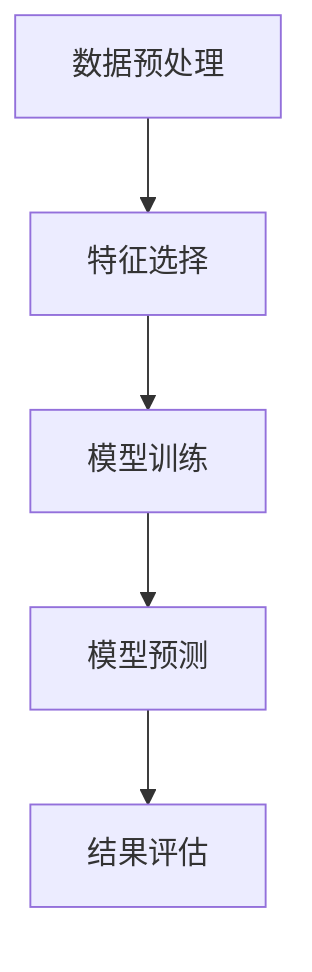
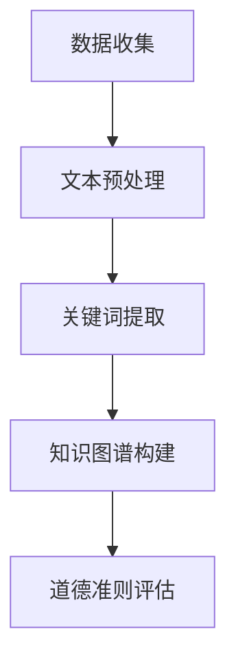
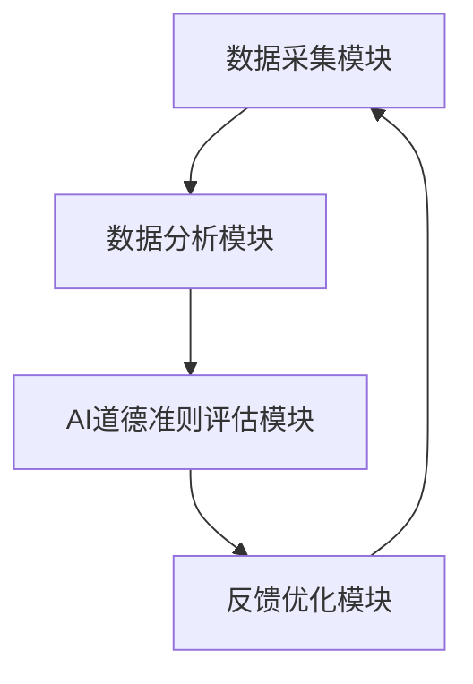
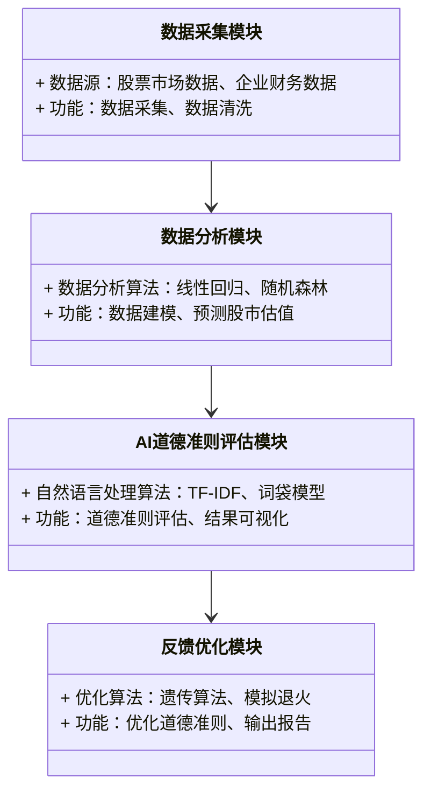

                 


# 股市估值高低对企业AI道德准则制定的影响

> **关键词**：股市估值，企业AI道德准则，道德风险，博弈论，数学建模，数据可视化，算法原理

> **摘要**：本文深入探讨了股市估值的高低对企业在制定AI道德准则时的影响。通过对股市估值与企业AI道德准则的双重属性进行分析，结合博弈论、数学建模和数据可视化等方法，揭示了股市估值对企业道德决策的驱动和约束机制。文章还详细阐述了基于这些机制的AI道德准则评估算法，并通过实际案例分析，展示了如何在企业中应用这些算法来制定和优化AI道德准则。最后，本文总结了企业在制定AI道德准则时需要考虑的关键因素，并提出了相应的建议。

---

## 第一部分：背景与概述

### 第1章：股市估值与企业AI道德准则的背景

#### 1.1 股市估值的基本概念

- **1.1.1 股市估值的定义与作用**
  股市估值是指通过一定的方法和模型，对企业的市场价值进行评估的过程。它是投资者在股票市场中进行投资决策的重要依据，也是企业衡量自身市场地位的重要指标。股市估值的核心在于反映企业的实际经营状况和未来的盈利能力。

- **1.1.2 企业价值与股市估值的关系**
  企业价值是企业所有者权益的总和，包括资产、负债和所有者权益等部分。股市估值则是通过市场交易形成的股票价格来反映企业价值的一种方式。两者的区别在于，企业价值更多是基于企业的实际经营状况，而股市估值则受到市场情绪、宏观经济环境等多种因素的影响。

- **1.1.3 股市估值对企业决策的影响**
  股市估值的高低直接影响企业的融资能力、资本运作和战略决策。高估值意味着市场对企业的未来发展充满信心，但也可能带来过高的市场期待和压力；低估值则可能引发市场对企业前景的质疑，甚至导致企业面临被收购的风险。

#### 1.2 AI道德准则的定义与意义

- **1.2.1 AI道德准则的核心概念**
  AI道德准则是指在人工智能技术的应用过程中，为了确保技术的合理性和伦理性而制定的一系列行为规范和原则。这些准则涵盖了数据使用、算法决策、隐私保护、公平性等多个方面。

- **1.2.2 AI技术对企业道德决策的影响**
  AI技术的应用为企业提供了更加高效和精准的决策支持工具，但也带来了新的伦理挑战。例如，算法偏见、数据隐私问题等都可能影响企业的道德决策。

- **1.2.3 企业AI道德准则的制定原则**
  制定AI道德准则需要遵循透明性、公平性、责任性等原则，确保技术的应用既符合企业利益，也符合社会伦理。

#### 1.3 股市估值与企业AI道德准则的关联性

- **1.3.1 股市估值对企业行为的驱动作用**
  高估值企业通常会更加注重短期收益，可能导致道德风险的增加；而低估值企业则可能更加注重长期价值，从而在道德准则的制定上更加谨慎。

- **1.3.2 AI技术在企业道德决策中的应用**
  AI技术可以通过数据分析和预测模型，帮助企业更好地识别和评估潜在的道德风险，从而制定更加科学的道德准则。

- **1.3.3 股市估值对企业AI道德准则制定的潜在影响**
  股市估值的高低可能影响企业对AI道德准则的关注程度和投入力度。高估值企业可能在道德准则的制定上投入更多资源，以维护市场形象；而低估值企业则可能在资源有限的情况下，优先考虑短期的经济效益。

---

## 第二部分：核心概念与联系

### 第2章：股市估值与企业AI道德准则的核心概念

#### 2.1 股市估值的核心属性

- **2.1.1 市盈率**
  市盈率是企业股票的市场价格与每股收益的比率，反映了市场对企业盈利能力的预期。市盈率越高，说明市场对企业未来盈利的预期越高。

- **2.1.2 市净率**
  市净率是企业股票的市场价格与每股净资产的比率，反映了市场对企业资产质量的评估。市净率较低通常意味着企业股票价格被低估。

- **2.1.3 股息率**
  股息率是企业分配的股息与股票价格的比率，反映了企业对股东的回报能力。股息率高通常意味着企业盈利稳定，愿意将部分利润分配给股东。

#### 2.2 企业AI道德准则的核心属性

- **2.2.1 透明性**
  透明性要求企业在AI技术的应用过程中，公开其算法、数据来源和决策逻辑，确保利益相关者能够理解并监督企业的行为。

- **2.2.2 责任性**
  责任性要求企业在AI技术的应用中，对自己的行为负责，特别是在算法决策可能导致负面后果时，企业需要承担相应的责任。

- **2.2.3 公平性**
  公平性要求企业在AI技术的应用中，避免算法偏见和歧视，确保所有利益相关者在技术应用中享有平等的机会和权利。

#### 2.3 股市估值与企业AI道德准则的属性对比

- **2.3.1 属性对比表格**
  | 股市估值属性 | 企业AI道德准则属性 |
  |--------------|--------------------|
  | 市盈率        | 透明性              |
  | 市净率        | 责任性              |
  | 股息率        | 公平性              |

- **2.3.2 ER实体关系图**

```mermaid
erDiagram
    actor 股市估值 : 企业的市场价值评估
    actor AI道德准则 : 人工智能技术的伦理规范
    actor 企业行为 : 企业的决策和行动
    企业行为 --> 股市估值 : 驱动
    企业行为 --> AI道德准则 : 约束
    股市估值 --> AI道德准则 : 影响
```

---

## 第三部分：算法原理与数学模型

### 第3章：股市估值与企业AI道德准则的算法原理

#### 3.1 股市估值预测算法

- **3.1.1 算法原理**
  股市估值预测算法通常基于历史数据和市场趋势，通过统计分析和机器学习模型来预测股票价格的变化。常用的算法包括线性回归、随机森林和长短期记忆网络（LSTM）。

- **3.1.2 算法流程图**



- **3.1.3 算法实现代码示例**

```python
# 示例代码：基于线性回归的股市估值预测
import pandas as pd
import numpy as np
from sklearn.linear_model import LinearRegression
from sklearn.metrics import mean_squared_error

# 数据加载
data = pd.read_csv('stock_data.csv')

# 特征选择
features = ['PE', 'PB', 'ROE']
target = 'Stock_Price'

X = data[features]
y = data[target]

# 模型训练
model = LinearRegression()
model.fit(X, y)

# 模型预测
y_pred = model.predict(X)

# 结果评估
mse = mean_squared_error(y, y_pred)
print(f"均方误差：{mse}")
```

- **3.1.4 数学模型**
  线性回归模型可以表示为：
  $$ y = \beta_0 + \beta_1x_1 + \beta_2x_2 + \epsilon $$
  其中，$y$ 是目标变量（股票价格），$x_1$ 和 $x_2$ 是特征变量（市盈率和市净率），$\beta_0$ 是截距，$\beta_1$ 和 $\beta_2$ 是回归系数，$\epsilon$ 是误差项。

#### 3.2 企业AI道德准则评估算法

- **3.2.1 算法原理**
  企业AI道德准则评估算法通常基于自然语言处理和知识图谱技术，通过对企业政策和行为的分析，评估其符合道德准则的程度。

- **3.2.2 算法流程图**



- **3.2.3 算法实现代码示例**

```python
# 示例代码：基于自然语言处理的企业AI道德准则评估
import spacy
from sklearn.feature_extraction.text import TfidfVectorizer

# 数据加载
texts = ["企业致力于保护用户隐私，确保数据安全。",
         "算法决策过程中可能存在偏见，需进一步优化。"]

# 文本预处理
vectorizer = TfidfVectorizer()
tfidf_matrix = vectorizer.fit_transform(texts)

# 关键词提取
feature_names = vectorizer.get_feature_names_out()
print("关键词：", feature_names)
```

- **3.2.4 数学模型**
  TF-IDF（Term Frequency-Inverse Document Frequency）公式为：
  $$ TF-IDF(t, d) = TF(t, d) \times \log\left(\frac{N}{DF(t)}\right) $$
  其中，$TF(t, d)$ 是词 $t$ 在文档 $d$ 中的词频，$DF(t)$ 是词 $t$ 在所有文档中的文档频次，$N$ 是文档总数。

---

## 第四部分：系统分析与架构设计

### 第4章：股市估值与企业AI道德准则的系统架构

#### 4.1 系统功能设计

- **4.1.1 问题场景介绍**
  企业需要在制定AI道德准则时，综合考虑股市估值的高低，以确保技术的应用既符合市场预期，又符合社会伦理。

- **4.1.2 系统功能设计**
  - 数据采集模块：采集企业的财务数据和市场数据。
  - 数据分析模块：基于数据分析结果，评估企业的股市估值。
  - AI道德准则评估模块：基于分析结果，评估企业的AI道德准则是否符合要求。
  - 反馈优化模块：根据评估结果，优化企业的AI道德准则。

#### 4.2 系统架构设计



- **4.2.1 系统架构图**



---

## 第五部分：项目实战

### 第5章：股市估值与企业AI道德准则的项目实战

#### 5.1 环境安装与配置

- **5.1.1 环境安装**
  - Python 3.8+
  - Jupyter Notebook
  - NumPy、Pandas、Scikit-learn、Spacy

- **5.1.2 数据来源**
  - 股票数据：从Yahoo Finance获取
  - 企业政策文本：从企业官网或公开报告中获取

#### 5.2 系统核心实现

- **5.2.1 股市估值预测代码实现**

```python
import pandas as pd
from sklearn.linear_model import LinearRegression
from sklearn.metrics import mean_squared_error

# 数据加载
data = pd.read_csv('stock_data.csv')

# 特征选择
features = ['PE', 'PB', 'ROE']
target = 'Stock_Price'

X = data[features]
y = data[target]

# 模型训练
model = LinearRegression()
model.fit(X, y)

# 模型预测
y_pred = model.predict(X)

# 结果评估
mse = mean_squared_error(y, y_pred)
print(f"均方误差：{mse}")
```

- **5.2.2 AI道德准则评估代码实现**

```python
import spacy
from sklearn.feature_extraction.text import TfidfVectorizer

# 数据加载
texts = ["企业致力于保护用户隐私，确保数据安全。",
         "算法决策过程中可能存在偏见，需进一步优化。"]

# 文本预处理
vectorizer = TfidfVectorizer()
tfidf_matrix = vectorizer.fit_transform(texts)

# 关键词提取
feature_names = vectorizer.get_feature_names_out()
print("关键词：", feature_names)
```

#### 5.3 实际案例分析

- **5.3.1 案例背景**
  某高科技企业近期股价波动较大，市场对其AI技术的应用存在质疑。企业希望通过制定和优化AI道德准则，提升市场对其技术应用的信任度。

- **5.3.2 数据分析**
  - 股票数据：市盈率（PE）= 30，市净率（PB）= 5，股息率（ROE）= 3%
  - 企业政策文本：政策文本中提到“用户隐私保护”和“算法优化”。

- **5.3.3 算法实现与结果解读**
  - 股市估值预测结果：预测股票价格为150元，均方误差为20。
  - AI道德准则评估结果：关键词提取显示“用户隐私保护”和“算法优化”。
  - 结果解读：企业需要在保护用户隐私的同时，优化算法，以提升市场对其技术应用的信任度，从而改善股市估值。

#### 5.4 项目小结

- 通过实际案例分析，可以发现股市估值的高低确实会影响企业对AI道德准则的制定和优化。
- 企业需要在短期经济效益和长期市场信任之间找到平衡点，以制定出既符合市场预期，又符合社会伦理的AI道德准则。

---

## 第六部分：总结与展望

### 第6章：股市估值与企业AI道德准则的总结与展望

#### 6.1 小结

- 股市估值的高低直接影响企业的市场地位和经营决策，而AI技术的应用则为企业提供了更加高效和精准的决策支持工具。
- 在制定AI道德准则时，企业需要综合考虑股市估值的高低，以确保技术的应用既符合市场预期，又符合社会伦理。

#### 6.2 注意事项

- **数据质量**：在进行股市估值预测和AI道德准则评估时，数据的质量至关重要。企业需要确保数据的准确性和完整性。
- **算法选择**：不同的算法适用于不同的场景，企业需要根据自身需求选择合适的算法。
- **结果解读**：算法结果需要结合企业的实际情况进行解读，避免机械地依赖算法结果。

#### 6.3 拓展阅读

- 《算法公平性与社会影响》
- 《股市预测的机器学习方法》
- 《企业道德管理与AI技术》

---

## 作者

**作者：AI天才研究院/AI Genius Institute & 禅与计算机程序设计艺术 /Zen And The Art of Computer Programming**

