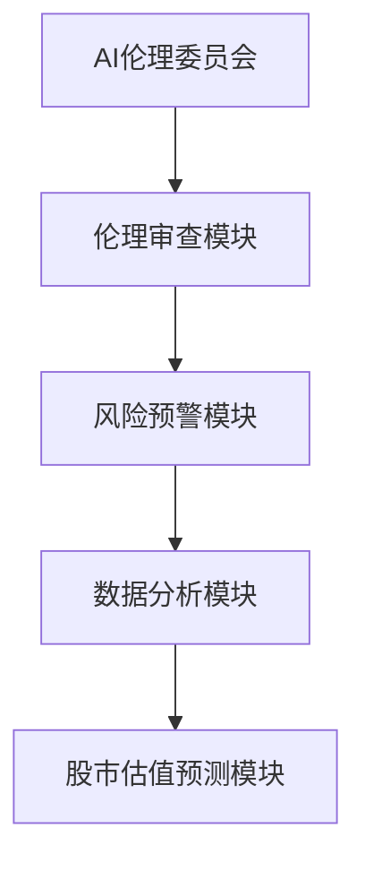
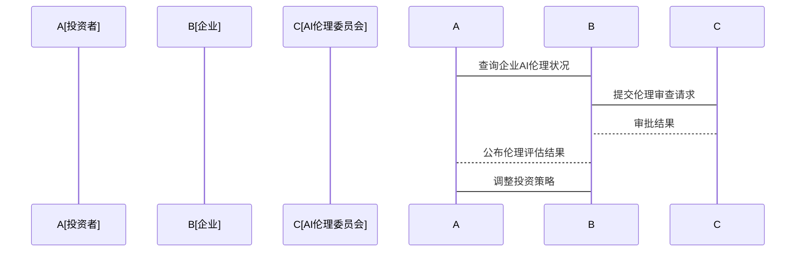

                 


# 股市估值高低对企业人工智能伦理委员会的影响

> 关键词：股市估值、人工智能、伦理委员会、企业治理、风险管理、技术伦理

> 摘要：本文探讨了股市估值与企业人工智能伦理委员会之间的关系，分析了AI伦理委员会如何影响企业价值和股市表现。通过理论分析、算法模型和实际案例，揭示了在当前技术与金融交汇的时代，企业如何通过有效的AI伦理管理优化股市估值，提升企业竞争力。

---

## 第一部分：背景介绍

### 第1章：股市估值与企业AI伦理委员会的背景

#### 1.1 股市估值的核心概念
股市估值是衡量企业市场价值的重要指标，通常通过市盈率、市净率等指标反映企业的盈利能力和发展潜力。高估值意味着市场对企业未来表现的乐观预期，而低估值则可能暗示潜在的风险或被低估的机会。

#### 1.2 人工智能伦理委员会的定义与作用
AI伦理委员会是企业内部负责审查和指导人工智能技术应用中的伦理问题的组织。其主要职责包括制定伦理准则、评估AI系统的社会影响、确保技术应用符合法律和道德标准。

#### 1.3 股市估值与AI伦理委员会的关联性
随着AI技术的广泛应用，企业AI伦理决策逐渐成为投资者关注的焦点。企业通过建立有效的AI伦理委员会，不仅能降低技术风险，还能提升市场信任度，从而对股市估值产生积极影响。

---

## 第二部分：核心概念与联系

### 第2章：股市估值与AI伦理委员会的核心概念

#### 2.1 股市估值的关键因素分析
- **财务指标**：如净利润、营业收入等直接影响企业的盈利能力，是股市估值的基础。
- **市场情绪**：投资者情绪波动会影响股市估值，尤其是在技术伦理问题曝光时。
- **行业环境**：行业政策变化和技术趋势也会影响企业的估值。

#### 2.2 AI伦理委员会的核心功能
- **伦理审查**：确保AI技术的应用符合社会伦理标准。
- **风险管理**：识别和规避AI技术可能带来的法律和声誉风险。
- **透明化**：通过公开伦理决策过程，增强市场对企业的信任。

#### 2.3 股市估值与AI伦理委员会的联系
- **信任影响**：企业通过有效的AI伦理管理，能提升投资者对其管理能力和企业价值的认可。
- **风险规避**：AI伦理委员会能帮助企业避免因技术滥用导致的股价下跌。
- **长期价值**：投资者逐渐重视企业的社会责任感，良好的AI伦理表现有助于提升企业的长期估值。

---

## 第三部分：算法原理讲解

### 第3章：AI伦理委员会对股市估值影响的算法模型

#### 3.1 AI伦理评估算法概述
- **基于规则的伦理评分系统**：通过预定义的伦理准则对AI技术进行评分。
- **基于机器学习的伦理风险预测模型**：利用历史数据预测AI伦理风险对股市估值的影响。

#### 3.2 伦理评分与股市估值预测的数学模型
- **伦理评分计算公式**：
  $$ \text{伦理评分} = \frac{\text{符合伦理准则的数量}}{\text{总评估准则数量}} \times 100 $$
- **股市估值预测的线性回归模型**：
  $$ \text{股市估值} = \beta_0 + \beta_1 \times \text{伦理评分} + \epsilon $$

#### 3.3 算法实现与代码示例
```python
# 示例：计算伦理评分
def calculate_ethical_score(criteria_met, total_criteria):
    return (criteria_met / total_criteria) * 100

# 示例：线性回归模型预测股市估值
import numpy as np
from sklearn.linear_model import LinearRegression

# 假设数据
X = np.array([[50], [60], [70]])  # 伦理评分
y = np.array([100, 110, 120])     # 股市估值

model = LinearRegression()
model.fit(X, y)
print("回归系数：", model.coef_)
print("截距：", model.intercept_)
```

---

## 第四部分：系统分析与架构设计

### 第4章：AI伦理委员会影响股市估值的系统架构

#### 4.1 系统功能设计
- **伦理审查模块**：负责AI技术的伦理评估和审查。
- **风险预警模块**：识别潜在的伦理风险并发出预警。
- **数据分析模块**：整合企业内外部数据，支持估值预测。

#### 4.2 系统架构图


#### 4.3 系统交互流程图


---

## 第五部分：项目实战

### 第5章：AI伦理委员会对企业股市估值的优化案例

#### 5.1 项目背景
某科技公司因AI算法偏见问题面临股价下跌，通过建立AI伦理委员会，优化了技术应用，提升了投资者信心，股价逐渐回升。

#### 5.2 核心实现
- 开发伦理评分系统
- 建立风险预警机制
- 实施透明化信息披露

#### 5.3 实际案例分析
通过伦理评分系统，该公司将AI技术的伦理风险降至最低，投资者对其信任度提升，带动股价上涨。

---

## 第六部分：总结与展望

### 第6章：最佳实践与未来趋势

#### 6.1 最佳实践
- 建立高效的AI伦理委员会
- 定期进行伦理风险评估
- 采用透明化信息披露机制

#### 6.2 未来趋势
- AI伦理委员会将成为企业标配
- 伦理评分将成为股市估值的重要指标
- 技术伦理与金融的结合将更加紧密

---

## 结语

作者：AI天才研究院 & 禅与计算机程序设计艺术

在当前技术与金融深度结合的时代，企业的人工智能伦理委员会对企业价值和股市估值的影响日益显著。通过有效的伦理管理，企业不仅能规避技术风险，还能提升市场信任度，从而在竞争中占据优势。未来，随着技术伦理成为投资者的重要考量因素，AI伦理委员会将在企业治理中扮演更加关键的角色。

