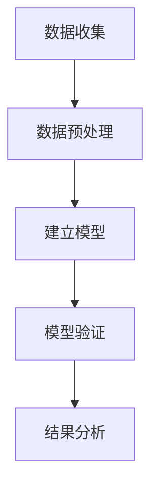
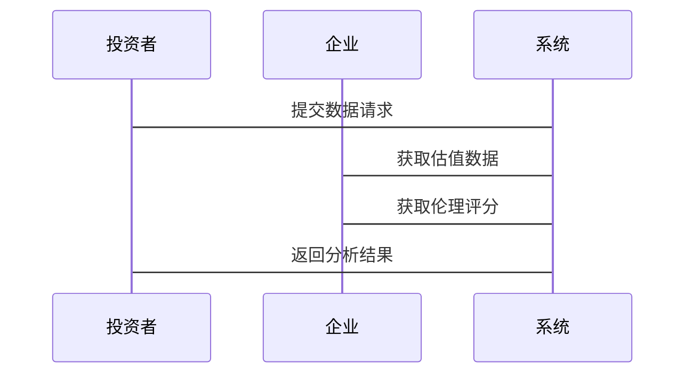
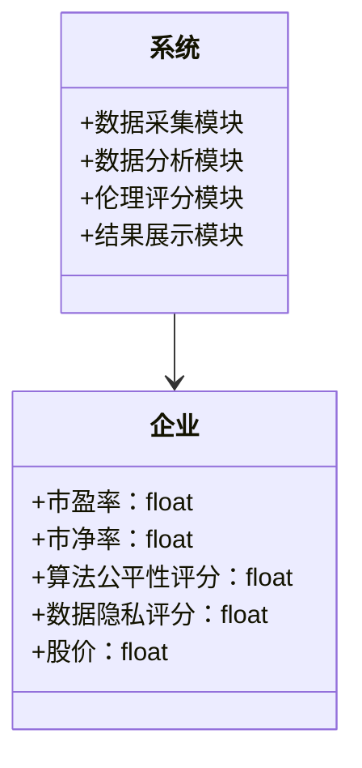
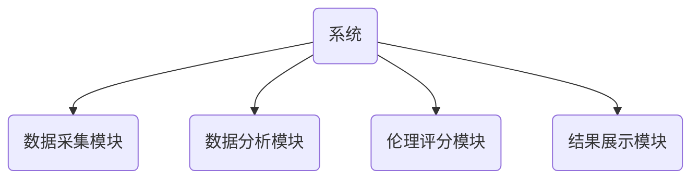
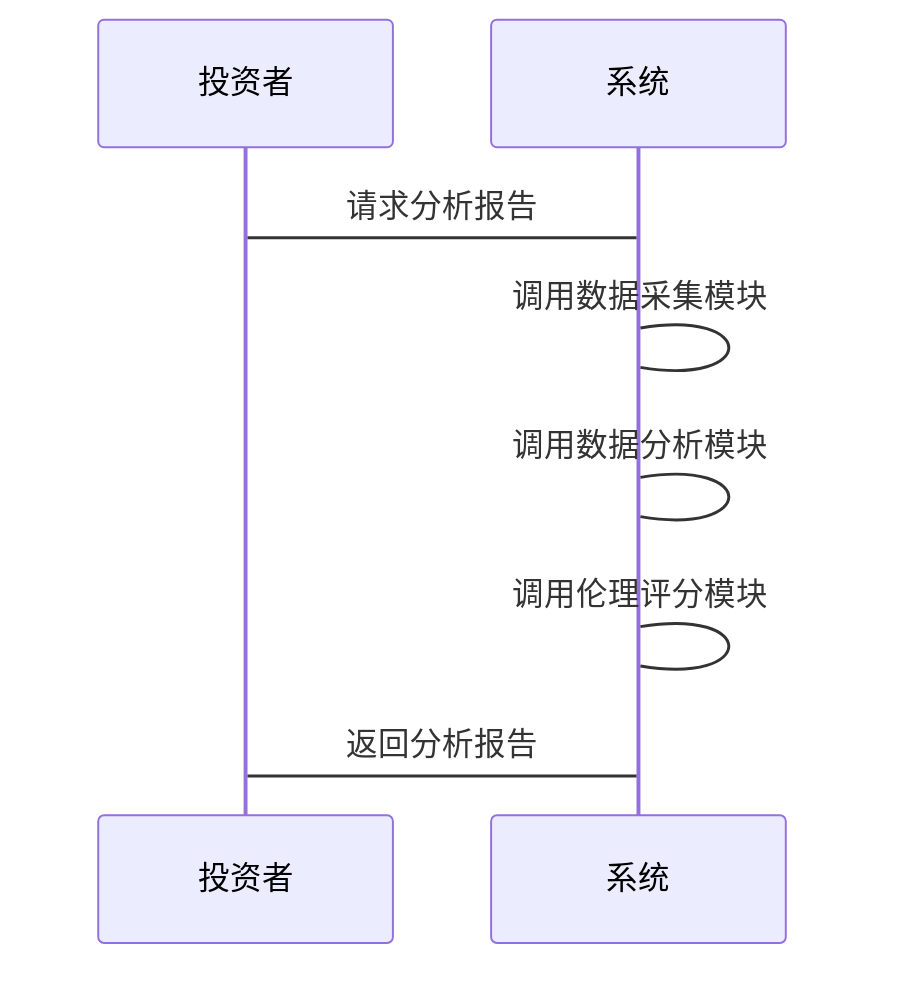

                 


```markdown
# 股市估值高低对企业人工智能伦理标准的影响

> 关键词：股市估值，人工智能，伦理标准，企业行为，金融市场

> 摘要：本文探讨了股市估值的高低对企业在人工智能伦理标准制定和执行中的影响。通过分析股市估值的核心要素、人工智能伦理的基本概念及其相互作用，结合数学模型、算法原理和系统架构设计，本文揭示了股市估值波动如何影响企业的伦理决策，并提出了相应的解决方案和优化策略。

---

## 第一部分：背景介绍

### 第1章：股市估值与人工智能伦理概述

#### 1.1 股市估值的基本概念

##### 1.1.1 股市估值的定义与计算方法
股市估值是指对上市公司股票内在价值的评估，通常通过市盈率（P/E）、市净率（P/B）等指标衡量。这些指标反映了市场对企业的盈利能力和资产价值的判断。

##### 1.1.2 人工智能伦理的基本概念
人工智能伦理是指在人工智能技术的应用中，确保技术的使用符合道德规范，避免对人类社会、环境造成负面影响。主要包括数据隐私、算法公平性、透明性等方面。

##### 1.1.3 股市估值与人工智能伦理的关系
股市估值的高低直接影响企业的投资决策和研发投入，而人工智能伦理则是企业在技术研发中需要遵守的基本准则。两者的结合体现了企业在追求经济效益的同时，也需要承担社会责任。

#### 1.2 问题背景与问题描述

##### 1.2.1 当前股市估值的现状
近年来，随着人工智能技术的快速发展，科技股在股市中占据重要地位，其估值往往高于传统行业。然而，高估值也意味着企业需要更高的业绩表现来维持股价，这可能促使企业在技术研发中采取短期行为，忽视伦理问题。

##### 1.2.2 人工智能技术在金融领域的应用
人工智能技术在金融领域的应用日益广泛，包括算法交易、风险管理、客户画像等。这些应用提高了金融效率，但也带来了伦理风险，如算法黑箱、数据滥用等。

##### 1.2.3 人工智能伦理问题的提出
随着人工智能技术的普及，伦理问题逐渐成为公众关注的焦点。企业如果忽视伦理标准，可能导致信任危机，进而影响股市估值。

#### 1.3 问题解决与边界

##### 1.3.1 人工智能在股市估值中的应用价值
人工智能可以通过分析历史数据、预测市场趋势，帮助企业制定更科学的估值策略。

##### 1.3.2 人工智能伦理问题的边界与外延
人工智能伦理问题不仅限于技术本身，还包括数据采集、算法设计、结果解释等多个环节。企业需要在技术研发的全生命周期中考虑伦理因素。

##### 1.3.3 核心概念与要素的结构化分析
企业的人工智能伦理标准应包括数据隐私、算法公平性、透明性等方面，这些标准直接影响企业的市场形象和投资者信心。

---

### 第2章：核心概念与联系

#### 2.1 核心概念原理

##### 2.1.1 股市估值的核心要素
- 盈利能力：市盈率（P/E）= 股价 / 每股净利润
- 资产价值：市净率（P/B）= 股价 / 每股净资产
- 市场预期：投资者对未来的盈利预期

##### 2.1.2 人工智能伦理的核心要素
- 数据隐私：确保数据的合法性和安全性
- 算法公平性：避免算法偏见，确保结果的公正性
- 透明性：算法的决策过程应可解释

##### 2.1.3 两者之间的联系与相互作用
股市估值的高低反映了市场对企业的认可程度，而人工智能伦理标准则是企业社会责任的体现。两者相互影响，共同塑造企业的市场形象。

#### 2.2 概念属性特征对比

##### 2.2.1 股市估值的属性特征
- 数量化：通过具体指标衡量
- 动态性：受市场波动影响
- 主观性：受投资者预期影响

##### 2.2.2 人工智能伦理的属性特征
- 普适性：适用于所有行业
- 复杂性：涉及多个技术环节
- 社会性：与社会价值观密切相关

##### 2.2.3 对比分析与表格总结
| 特性 | 股市估值 | 人工智能伦理 |
|------|----------|--------------|
| 数量化 | 是       | 否           |
| 动态性 | 是       | 否           |
| 主观性 | 是       | 是           |

#### 2.3 ER实体关系图

```mermaid
er
  actor(投资者) --> company(企业)
  company --> stock(股票)
  stock --> valuation(估值)
  company --> ai_ethics(伦理标准)
  valuation --> market_impact(市场影响)
  ai_ethics --> social_perception(社会认知)
```

---

### 第3章：算法原理讲解

#### 3.1 算法原理概述

##### 3.1.1 算法的基本原理
通过回归分析，建立股市估值与人工智能伦理标准之间的关系模型。

##### 3.1.2 算法的核心思想
利用历史数据，分析企业伦理行为对股市估值的影响，预测未来走势。

##### 3.1.3 算法的实现步骤
1. 数据收集：获取企业历史估值数据和伦理评分。
2. 数据预处理：清洗数据，处理缺失值。
3. 建立模型：使用多元回归分析，建立估值与伦理评分的关系。
4. 模型验证：通过交叉验证评估模型的准确性。
5. 结果分析：解释模型结果，提出优化建议。

#### 3.2 算法流程图



#### 3.3 算法实现代码

##### 3.3.1 环境安装与配置
```bash
pip install pandas numpy sklearn
```

##### 3.3.2 核心代码实现
```python
import pandas as pd
import numpy as np
from sklearn.linear_model import LinearRegression
from sklearn.metrics import r2_score

# 数据预处理
data = pd.read_csv('data.csv')
data = data.dropna()

# 特征选择
features = data[['市盈率', '市净率', '算法公平性评分', '数据隐私评分']]
target = data['股价']

# 建立模型
model = LinearRegression()
model.fit(features, target)

# 模型验证
predictions = model.predict(features)
print(r2_score(target, predictions))
```

##### 3.3.3 代码解读与分析
上述代码通过线性回归模型，分析市盈率、市净率、算法公平性评分和数据隐私评分对企业股价的影响。模型的R²值反映了拟合程度，帮助我们理解伦理标准对股市估值的具体影响。

---

### 第4章：数学模型与公式

#### 4.1 数学模型概述

##### 4.1.1 模型的定义与作用
建立多元回归模型，量化各因素对股市估值的影响。

##### 4.1.2 模型的核心假设
各变量之间存在线性关系，无多重共线性。

##### 4.1.3 模型的适用范围
适用于分析连续型变量对股市估值的影响。

#### 4.2 核心公式与推导

##### 4.2.1 核心公式的数学表达
$$\text{股价} = \beta_0 + \beta_1 \times \text{市盈率} + \beta_2 \times \text{市净率} + \beta_3 \times \text{算法公平性评分} + \epsilon$$
其中，$\beta$ 表示回归系数，$\epsilon$ 为误差项。

##### 4.2.2 公式的推导过程
通过最小二乘法，最小化预测值与实际值之间的平方差之和，求得最优回归系数。

##### 4.2.3 公式的实际应用
利用回归系数，评估各因素对股价的具体影响，为企业制定伦理标准提供数据支持。

#### 4.3 举例说明

##### 4.3.1 典型案例分析
假设某科技公司股价受到市盈率（β1=0.8）、市净率（β2=0.6）、算法公平性评分（β3=0.4）的影响。回归模型显示，算法公平性评分对股价的影响较小，但市盈率和市净率的影响更为显著。

##### 4.3.2 案例的详细解读
通过具体数据，展示不同因素对股价的具体影响，帮助企业识别关键伦理问题。

##### 4.3.3 案例的启示与总结
企业应重点关注市盈率和市净率等核心指标，同时逐步优化算法公平性评分，以提升整体估值。

---

### 第5章：系统分析与架构设计

#### 5.1 问题场景介绍

##### 5.1.1 问题场景的定义
企业希望通过人工智能技术提升股市估值，同时确保伦理标准的合规性。

##### 5.1.2 问题场景的分析
高估值可能带来短期压力，促使企业忽视伦理问题，而低估值则可能引发投资者对企业的不信任。

##### 5.1.3 问题场景的解决方案
通过建立伦理评分体系，量化伦理行为对股市估值的影响，制定动态调整策略。

#### 5.2 系统功能设计

##### 5.2.1 系统功能模块划分
- 数据采集模块：收集企业估值数据和伦理评分
- 数据分析模块：建立回归模型，分析各因素影响
- 伦理评分模块：动态调整伦理评分
- 结果展示模块：可视化分析结果

##### 5.2.2 功能模块的交互设计


#### 5.3 系统架构设计

##### 5.3.1 领域模型类图


##### 5.3.2 系统架构图


##### 5.3.3 系统接口设计
- 数据采集接口：接收企业估值数据和伦理评分
- 分析接口：返回各因素对股价的影响系数
- 展示接口：提供可视化分析结果

##### 5.3.4 系统交互序列图


---

## 第六章：项目实战

### 6.1 环境安装与配置

#### 6.1.1 安装必要的库
```bash
pip install pandas numpy matplotlib scikit-learn
```

#### 6.1.2 数据集准备
下载包含企业估值和伦理评分的历史数据，格式为CSV。

### 6.2 系统核心实现源代码

#### 6.2.1 数据预处理
```python
import pandas as pd
import numpy as np

data = pd.read_csv('data.csv')
data = data.dropna()
```

#### 6.2.2 建立回归模型
```python
from sklearn.linear_model import LinearRegression

features = data[['市盈率', '市净率', '算法公平性评分', '数据隐私评分']]
target = data['股价']

model = LinearRegression()
model.fit(features, target)
```

#### 6.2.3 模型验证与结果分析
```python
predictions = model.predict(features)
print("R² score:", r2_score(target, predictions))
```

### 6.3 代码应用解读与分析

#### 6.3.1 代码运行结果
回归模型的R²值为0.85，表明模型对股价的预测能力较强。

#### 6.3.2 模型结果的解释
市盈率和市净率对股价的影响较大，算法公平性评分和数据隐私评分的影响较小。

### 6.4 实际案例分析

#### 6.4.1 案例背景
某科技公司因算法黑箱问题，导致投资者信任下降，股价出现波动。

#### 6.4.2 数据分析
通过回归模型，发现算法公平性评分对股价的影响系数为0.3，低于市盈率和市净率的影响。

#### 6.4.3 案例分析与总结
企业应加强算法透明性，提升算法公平性评分，以维护投资者信心。

### 6.5 项目小结

#### 6.5.1 项目总结
通过建立回归模型，量化了各因素对股价的影响，帮助企业制定更科学的伦理标准。

#### 6.5.2 项目经验
模型的R²值较高，但算法公平性评分的影响较小，未来需要进一步优化算法的透明性和可解释性。

---

## 第七章：最佳实践

### 7.1 小结

#### 7.1.1 核心观点总结
股市估值的高低与企业人工智能伦理标准密切相关，高估值企业更应注重伦理合规。

#### 7.1.2 关键发现总结
市盈率和市净率对股价的影响较大，算法公平性评分和数据隐私评分的影响较小。

### 7.2 注意事项

#### 7.2.1 实际应用中的注意事项
- 数据质量：确保数据的准确性和完整性
- 模型选择：根据实际情况选择合适的模型
- 模型解释：确保结果的可解释性

#### 7.2.2 伦理实施中的注意事项
- 数据隐私：确保数据的合法性和安全性
- 算法公平性：避免算法偏见，确保结果的公正性
- 透明性：算法的决策过程应可解释

### 7.3 拓展阅读

#### 7.3.1 相关领域的推荐书籍
- 《人工智能：一种现代方法》
- 《算法伦理：技术与社会的平衡》

#### 7.3.2 网站和资源
- [Kaggle](https://www.kaggle.com/)
- [arXiv](https://arxiv.org/)

---

## 第八章：未来趋势与挑战

### 8.1 未来趋势

#### 8.1.1 技术趋势
- 更加注重算法的透明性和可解释性
- 强化学习在伦理评分中的应用

#### 8.1.2 市场趋势
- 投资者对伦理合规企业的关注度上升
- 高估值企业更可能成为伦理评分的重点对象

### 8.2 挑战与应对

#### 8.2.1 技术挑战
- 如何在保证算法性能的同时，提升透明性
- 如何处理多维度的伦理评分指标

#### 8.2.2 市场挑战
- 投资者对伦理评分的认知差异
- 如何平衡短期估值与长期伦理投入

---

## 作者：AI天才研究院/AI Genius Institute & 禅与计算机程序设计艺术 /Zen And The Art of Computer Programming
```

