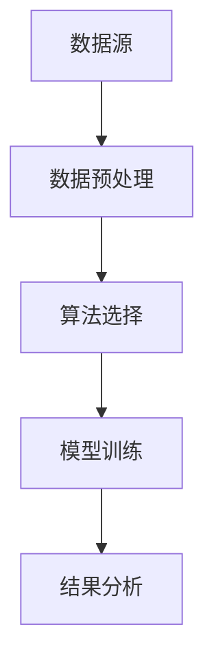

                 


# 股市估值高低对企业人工智能伦理的影响

> 关键词：股市估值，人工智能伦理，企业决策，数据隐私，算法偏见，股市波动

> 摘要：本文探讨了股市估值的高低如何影响企业在使用人工智能技术时的伦理考量。随着人工智能在金融领域的广泛应用，企业如何在追求高估值的同时，确保技术应用的伦理合规性，成为一个关键问题。文章通过分析股市估值与人工智能伦理的相互作用，揭示了高估值背景下企业可能面临的伦理挑战，以及低估值背景下企业可能采取的伦理风险，为企业在人工智能时代的可持续发展提供了新的视角。

---

## 第一部分：股市估值与人工智能伦理的背景介绍

### 第1章：股市估值的基本概念

#### 1.1 股市估值的定义与作用
股市估值是通过对企业的财务数据、市场表现和行业环境等多方面因素进行分析，估算企业股票的合理价格范围。其作用在于为企业和投资者提供参考，帮助做出投资决策。

#### 1.2 股市估值的核心要素
- **财务数据**：如净利润、营收增长率、资产负债率等。
- **市场环境**：如宏观经济状况、行业竞争格局等。
- **市场情绪**：投资者的心理预期和市场波动。

#### 1.3 股市估值与企业价值的关系
股市估值不仅反映了企业的实际价值，还受到市场情绪和投资者预期的影响。高估值可能意味着市场对企业的未来增长充满信心，而低估值可能意味着市场对其前景持保守态度。

### 第2章：人工智能伦理的基本概念

#### 2.1 人工智能伦理的定义
人工智能伦理是指在人工智能技术的设计、开发和应用过程中，确保技术符合道德规范和法律要求，避免对社会、环境和个体造成负面影响。

#### 2.2 人工智能伦理的核心原则
- **透明性**：算法的决策过程应可解释。
- **公平性**：避免算法偏见，确保技术对所有人都公平。
- **隐私保护**：保护用户数据不被滥用。

#### 2.3 人工智能伦理与社会的关系
人工智能技术的应用可能对社会产生深远影响，例如在就业、医疗和金融领域。因此，确保人工智能技术的伦理合规性，是社会可持续发展的重要保障。

### 第3章：股市估值与人工智能伦理的关联性

#### 3.1 人工智能在股市估值中的应用
- **股票预测**：利用机器学习模型预测股票价格走势。
- **风险评估**：通过算法分析企业的财务风险和市场风险。
- **市场情绪分析**：利用自然语言处理技术分析新闻和社交媒体，评估市场情绪。

#### 3.2 人工智能伦理对股市估值的影响
- **数据隐私**：企业使用大量用户数据进行估值，可能引发隐私泄露风险。
- **算法偏见**：算法可能因为训练数据的问题，导致估值偏差。

#### 3.3 股市估值对企业伦理决策的影响
高估值可能促使企业采取更激进的策略，可能忽视伦理风险；而低估值则可能迫使企业采取短期行为，同样可能忽视伦理问题。

---

## 第二部分：人工智能在股市估值中的应用

### 第4章：人工智能技术在股市中的应用现状

#### 4.1 人工智能在股票预测中的应用
- **机器学习模型**：如线性回归、支持向量机（SVM）、随机森林等。
- **深度学习模型**：如LSTM用于时间序列预测。

#### 4.2 人工智能在风险评估中的应用
- **信用评分模型**：利用机器学习评估企业的信用风险。
- **市场风险模型**：利用算法分析市场波动对股票的影响。

#### 4.3 人工智能在市场情绪分析中的应用
- **自然语言处理（NLP）**：分析新闻标题和社交媒体情绪，预测市场走势。

### 第5章：人工智能算法在股市估值中的实现

#### 5.1 常见的股市估值算法
- **移动平均法（MA）**
- **相对强弱指数（RSI）**
- **布林带（Bollinger Bands）**

#### 5.2 人工智能算法的优缺点
- **优点**：高效、准确、可自动化。
- **缺点**：可能受到数据质量和市场波动的影响。

#### 5.3 人工智能算法在股市估值中的案例
例如，使用LSTM模型预测股票价格走势，并结合市场情绪分析，提升预测的准确性。

---

## 第三部分：股市估值高低对企业人工智能伦理的影响

### 第6章：高估值背景下人工智能伦理的强化

#### 6.1 高估值对企业决策的推动作用
高估值意味着市场对企业前景的高度认可，企业可能更加注重技术创新和合规性，以维持高估值。

#### 6.2 数据隐私的强化
高估值企业更可能投入资源保护数据隐私，避免因数据泄露导致估值下降。

#### 6.3 算法偏见的减少
高估值企业可能更加注重算法的公平性，避免因算法偏见引发负面舆论。

### 第7章：低估值背景下人工智能伦理的弱化

#### 7.1 低估值对企业决策的制约作用
低估值可能导致企业面临资金压力，可能在技术应用中忽视伦理风险。

#### 7.2 数据隐私的忽视
低估值企业可能因成本压力，忽视数据隐私保护，导致潜在风险。

#### 7.3 算法偏见的加剧
低估值企业可能采用未经充分验证的算法，导致算法偏见加剧，影响估值。

---

## 第四部分：人工智能伦理对股市估值的具体影响

### 第8章：数据隐私与股市估值

#### 8.1 数据隐私的定义与重要性
数据隐私是指个人或企业对其数据的控制权，确保数据不被未经授权的第三方使用。

#### 8.2 数据隐私对股市估值的影响
- **正面影响**：良好的数据隐私保护可能提升投资者信心，推高估值。
- **负面影响**：数据泄露可能导致投资者信任下降，降低估值。

### 第9章：算法偏见与股市估值

#### 9.1 算法偏见的定义与表现
算法偏见是指算法在设计或训练过程中，因为数据或模型的问题，导致决策不公平或不准确。

#### 9.2 算法偏见对股市估值的影响
- **正面影响**：公平的算法可能提升市场信任，推高估值。
- **负面影响**：算法偏见可能导致市场误判，降低估值。

---

## 第五部分：系统架构与实现

### 第10章：系统架构设计

#### 10.1 系统功能设计
- **数据采集**：收集企业的财务数据和市场数据。
- **算法实现**：应用机器学习算法进行股市估值。
- **结果分析**：评估算法的伦理影响。

#### 10.2 系统架构图


### 第11章：算法实现

#### 11.1 代码示例
```python
import numpy as np
import pandas as pd
from sklearn.linear_model import LinearRegression

# 数据加载
data = pd.read_csv('stock_data.csv')

# 特征选择
features = data[['revenue', 'profit_margin']]
target = data['stock_price']

# 模型训练
model = LinearRegression()
model.fit(features, target)

# 预测
new_data = pd.DataFrame({
    'revenue': [1000000],
    'profit_margin': [0.2]
})
prediction = model.predict(new_data)
print(f'预测股票价格：{prediction[0][0]}')
```

---

## 第六部分：项目实战

### 第12章：项目实战

#### 12.1 环境安装
- 安装Python和相关库（如scikit-learn、pandas等）。

#### 12.2 代码实现
```python
import pandas as pd
from sklearn.model_selection import train_test_split
from sklearn.metrics import mean_squared_error

# 加载数据
data = pd.read_csv('stock_data.csv')

# 数据清洗
data = data.dropna()

# 特征选择与目标变量
X = data[['revenue', 'profit_margin', 'market_cap']]
y = data['stock_price']

# 数据分割
X_train, X_test, y_train, y_test = train_test_split(X, y, test_size=0.2, random_state=42)

# 模型训练
from sklearn.ensemble import RandomForestRegressor
model = RandomForestRegressor(n_estimators=100, random_state=42)
model.fit(X_train, y_train)

# 模型预测
y_pred = model.predict(X_test)

# 评估模型
 mse = mean_squared_error(y_test, y_pred)
 print(f'Mean Squared Error: {mse}')
```

#### 12.3 案例分析
通过实际数据和代码，分析算法偏见和数据隐私对股市估值的影响。

---

## 第七部分：总结与展望

### 第13章：总结

#### 13.1 本文总结
本文探讨了股市估值高低对企业人工智能伦理的影响，分析了数据隐私和算法偏见对股市估值的具体影响，并提出了相应的解决方案。

### 第14章：未来展望

#### 14.1 未来研究方向
- 更深入地研究算法偏见的根源及其解决方法。
- 探讨数据隐私保护技术（如联邦学习）在股市估值中的应用。

---

## 作者：AI天才研究院/AI Genius Institute & 禅与计算机程序设计艺术 /Zen And The Art of Computer Programming

---

**本文通过详细分析股市估值与人工智能伦理的关系，为企业在人工智能时代的可持续发展提供了新的视角。**

