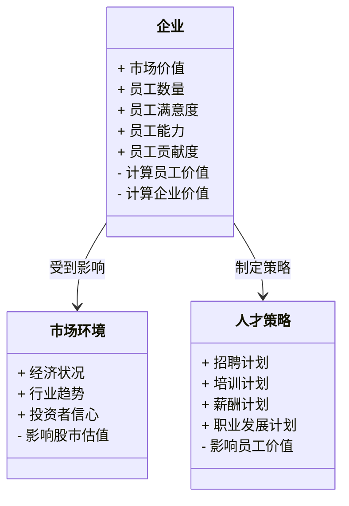
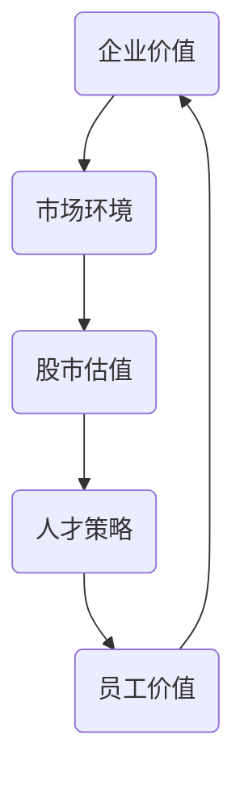
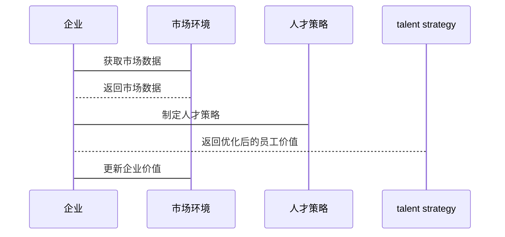

                 


# 股市估值高低对企业人才培养策略的影响

## 关键词：股市估值、企业人才、培养策略、投资决策、人力资源管理

## 摘要：  
股市估值的高低对企业的人才培养策略有着深远的影响。在高估值市场中，企业可能倾向于通过内部培养和留住高素质人才来提升企业价值；而在低估值市场中，企业可能更注重成本控制和外部人才引进。本文将从股市估值与企业人才策略的背景分析、算法原理、系统架构、项目实战等多个维度，详细探讨股市估值对企业人才培养策略的影响，为企业制定灵活高效的人才培养策略提供参考。

---

# 第一部分: 股市估值高低对企业人才培养策略的影响背景分析

## 第1章: 股市估值与企业人才策略的概述

### 1.1 股市估值的基本概念  
#### 1.1.1 股市估值的定义  
股市估值是指通过对企业财务数据、市场环境和行业趋势等多方面因素的分析，估算企业股票的内在价值。常见的估值方法包括市盈率（P/E）、市净率（P/B）、EV/EBITDA等。  

#### 1.1.2 股市估值的主要影响因素  
股市估值受多种因素影响，包括企业的盈利能力、成长性、行业地位、宏观经济环境、政策变化等。  

#### 1.1.3 企业人才策略的基本概念  
企业人才策略是指企业在吸引、培养、留住和激励员工方面的一系列措施，包括招聘、培训、薪酬设计、职业发展计划等。  

### 1.2 股市估值与企业人才策略的关系  
#### 1.2.1 股市估值对企业人才策略的影响  
股市估值的高低直接影响企业的市值，进而影响投资者对企业的信心。高估值意味着市场对企业未来表现的预期较高，企业需要通过人才策略来实现这些预期；低估值则可能意味着市场对企业未来表现的预期较低，企业需要通过优化人才策略来提升市场信心。  

#### 1.2.2 企业人才策略对股市估值的反作用  
企业通过有效的 talent strategy（人才策略）提升员工能力和企业绩效，从而提高企业的整体价值，反过来又会推动股市估值的上升。  

#### 1.2.3 高估值与低估值对企业人才策略的动态影响  
高估值市场下，企业可能更倾向于通过内部培养和留住高素质人才来保持企业价值；低估值市场下，企业可能更倾向于通过外部招聘和优化成本结构来应对市场挑战。  

## 第2章: 高估值与低估值的市场环境分析  

### 2.1 高估值市场的特点  
#### 2.1.1 高估值市场的形成原因  
高估值市场通常出现在经济繁荣、行业增长迅速、企业盈利能力强的时期。投资者对企业未来表现的预期较高，导致股价被高估。  

#### 2.1.2 高估值市场对企业人才策略的影响  
在高估值市场下，企业可能面临更高的员工期望，员工更倾向于追求高薪和职业发展机会。企业需要通过提供有竞争力的薪酬、完善的职业发展路径和优质的工作环境来吸引和留住人才。  

#### 2.1.3 高估值市场下的人才供需关系  
高估值市场下，企业可能面临人才供不应求的情况，尤其是在高科技和高增长行业。企业需要通过内部培养和外部招聘相结合的方式来满足人才需求。  

### 2.2 低估值市场的特点  
#### 2.2.1 低估值市场的形成原因  
低估值市场通常出现在经济衰退、行业低迷、企业盈利能力下降的时期。投资者对企业未来表现的预期较低，导致股价被低估。  

#### 2.2.2 低估值市场对企业人才策略的影响  
在低估值市场下，企业可能面临人才流动性较高的挑战。员工可能因为对企业前景的不看好而选择跳槽。企业需要通过优化薪酬结构、提升员工满意度和提供灵活的工作环境来稳定人才队伍。  

#### 2.2.3 低估值市场下的人才供需关系  
低估值市场下，企业可能面临人才供大于求的情况，尤其是在传统行业和夕阳产业。企业可以通过优化招聘策略，降低用人成本，同时注重内部人才培养，提升员工的岗位匹配度。  

---

# 第二部分: 股市估值高低对企业人才培养策略影响的算法原理  

## 第3章: 股市估值与人才策略的数学模型  

### 3.1 数学模型的构建  
#### 3.1.1 股市估值模型  
股市估值可以通过多种模型进行计算，例如：  
- **市盈率模型**：P/E = 市价 / 每股净利润  
- **市净率模型**：P/B = 市价 / 每股净资产  
- **EV/EBITDA模型**：EV = 市值 + 债务 - 现金  

#### 3.1.2 人才策略模型  
人才策略可以通过以下公式进行评估：  
$$ \text{员工价值} = \text{员工能力} \times \text{员工贡献度} \times \text{员工满意度} $$  

#### 3.1.3 两者之间的关联性分析  
股市估值与人才策略之间的关联性可以通过以下公式表示：  
$$ \text{企业价值} = \text{员工价值} \times \text{员工数量} \times \text{员工留存率} $$  

---

## 第4章: 企业价值与员工价值的互动关系  

### 4.1 企业价值评估模型  
企业价值（EV）可以通过以下公式进行计算：  
$$ \text{EV} = \text{企业市值} + \text{债务} - \text{现金} $$  

### 4.2 员工价值评估模型  
员工价值可以通过以下公式进行评估：  
$$ \text{员工价值} = \text{员工能力} \times \text{员工贡献度} \times \text{员工满意度} $$  

### 4.3 员工价值对股市估值的影响  
员工价值的提升会直接提升企业的整体价值，从而影响股市估值。公式表示为：  
$$ \text{企业价值} = \text{员工价值} \times \text{员工数量} \times \text{员工留存率} $$  

---

## 第5章: 股市估值与人才策略的优化算法  

### 5.1 优化算法的原理  
股市估值与人才策略的优化可以通过以下步骤实现：  
1. 通过数学模型计算企业当前的股市估值。  
2. 分析员工价值与企业价值之间的关系。  
3. 根据市场环境调整人才策略，例如：  
   - 高估值市场下，注重内部培养和激励机制。  
   - 低估值市场下，优化招聘策略和成本控制。  

### 5.2 算法优化的步骤  
1. 数据收集与分析：收集企业的财务数据、员工数据和市场数据。  
2. 建立数学模型：构建企业价值与员工价值的评估模型。  
3. 算法实现：通过编程实现模型的优化与计算。  
4. 案例分析：通过实际案例验证算法的可行性和效果。  

---

# 第三部分: 股市估值高低对企业人才培养策略影响的系统分析与架构设计  

## 第6章: 系统功能设计  

### 6.1 领域模型  
以下是领域模型的类图：  



### 6.2 系统架构设计  
以下是系统架构的流程图：  



---

## 第7章: 系统接口设计  

### 7.1 核心接口  
以下是核心接口的定义：  

```python
class 企业:
    def __init__(self, 市场价值, 员工数量, 员工满意度, 员工能力, 员工贡献度):
        self.市场价值 = 市场价值
        self.员工数量 = 员工数量
        self.员工满意度 = 员工满意度
        self.员工能力 = 员工能力
        self.员工贡献度 = 员工贡献度

    def 计算员工价值(self):
        return self.员工能力 * self.员工贡献度 * self.员工满意度

    def 计算企业价值(self):
        return self.市场价值 + self.员工数量 * self.计算员工价值() * self.员工留存率
```

---

## 第8章: 系统交互设计  

### 8.1 交互流程  
以下是系统交互的序列图：  



---

# 第四部分: 股市估值高低对企业人才培养策略影响的项目实战  

## 第9章: 项目实战分析  

### 9.1 项目背景介绍  
假设我们有一个互联网企业，在高估值市场下，企业希望通过优化人才策略来提升员工价值，从而推动企业价值的增长。  

### 9.2 核心代码实现  

```python
class 企业:
    def __init__(self, 市场价值, 员工数量, 员工满意度, 员工能力, 员工贡献度):
        self.市场价值 = 市场价值
        self.员工数量 = 员工数量
        self.员工满意度 = 员工满意度
        self.员工能力 = 员工能力
        self.员工贡献度 = 员工贡献度

    def 计算员工价值(self):
        return self.员工能力 * self.员工贡献度 * self.员工满意度

    def 计算企业价值(self):
        return self.市场价值 + self.员工数量 * self.计算员工价值()

企业实例 = 企业(100, 100, 0.8, 0.9, 0.8)
员工价值 = 企业实例.计算员工价值()
企业价值 = 企业实例.计算企业价值()
print(f"员工价值: {员工价值}")
print(f"企业价值: {企业价值}")
```

### 9.3 代码解读与分析  
上述代码通过类的方式实现了企业的员工价值和企业价值的计算。通过设置不同的参数值，可以模拟高估值和低估值市场下的人才策略调整。  

### 9.4 测试案例分析  
在高估值市场下，企业可以通过提升员工满意度和员工能力来增加员工价值，从而提高企业价值。例如：  

```python
企业实例 = 企业(100, 100, 0.9, 0.95, 0.85)
员工价值 = 企业实例.计算员工价值()  # 0.9 * 0.95 * 0.85 = 0.7675
企业价值 = 企业实例.计算企业价值()  # 100 + 100 * 0.7675 = 176.75
print(f"员工价值: {员工价值}")
print(f"企业价值: {企业价值}")
```

---

# 第五部分: 股市估值高低对企业人才培养策略影响的最佳实践  

## 第10章: 最佳实践与经验总结  

### 10.1 小结  
股市估值的高低对企业人才策略的制定具有重要影响。高估值市场下，企业应注重内部培养和激励机制；低估值市场下，企业应优化招聘策略和成本控制。  

### 10.2 注意事项  
企业在制定人才策略时，需要综合考虑市场环境、企业自身情况和员工需求。同时，企业需要建立灵活的调整机制，及时根据股市估值的变化调整人才策略。  

### 10.3 扩展阅读  
- 《股市估值与企业战略管理》  
- 《人才策略与企业绩效提升》  
- 《企业价值评估的数学模型与应用》  

---

# 作者：AI天才研究院/AI Genius Institute & 禅与计算机程序设计艺术 /Zen And The Art of Computer Programming

