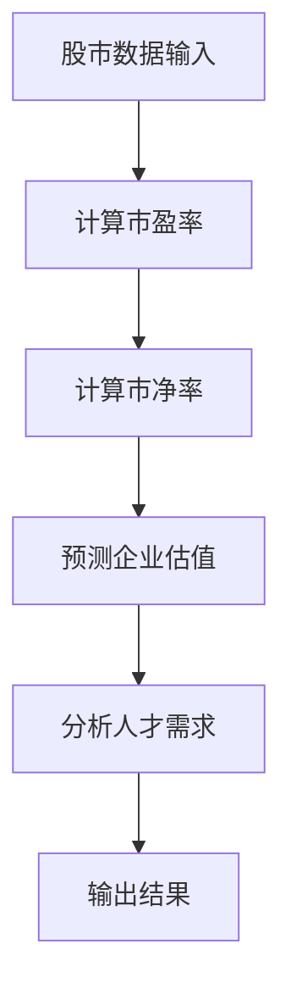
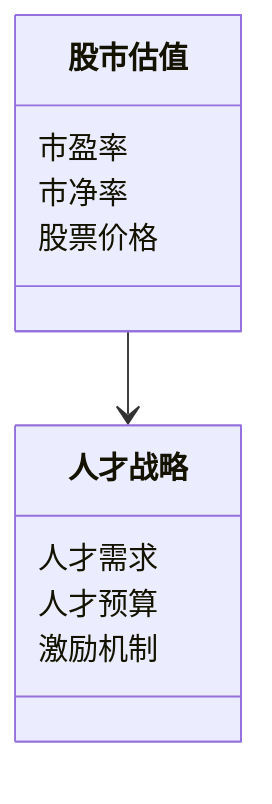
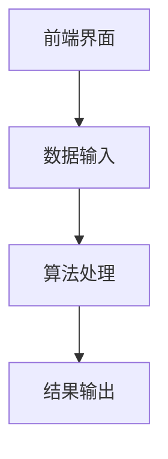

                 


```markdown
# 股市估值高低对企业人才战略的影响

> 关键词：股市估值，企业人才战略，经济周期，企业价值，人才需求，市场波动

> 摘要：本文探讨了股市估值与企业人才战略之间的关系，分析了高估值和低估值对企业人才战略的影响，提出了在不同估值环境下调整人才战略的具体方法，为企业制定有效的人才战略提供了理论依据和实践指导。

---

## 第一部分: 股市估值与企业人才战略的背景介绍

### 1.1 股市估值的基本概念

#### 1.1.1 股市估值的定义
股市估值是指通过对企业财务数据和市场情况的分析，确定企业股票在市场上的合理价格范围。常见的估值方法包括市盈率（P/E）、市净率（P/B）等。

#### 1.1.2 股市估值的影响因素
股市估值受多种因素影响，包括企业的盈利能力、行业地位、市场环境、宏观经济状况等。

#### 1.1.3 企业人才战略的基本概念
企业人才战略是指企业在吸引、培养和留住人才方面的规划和策略，旨在通过优化人才结构和能力，提升企业的竞争力。

---

### 1.2 股市估值与企业人才战略的关系

#### 1.2.1 股市估值对企业人才战略的直接影响
高估值可能促使企业加大研发投入和人才引进，而低估值可能促使企业调整成本结构，优化人员配置。

#### 1.2.2 企业人才战略对股市估值的反向影响
人才战略的有效实施可以提升企业的市场竞争力，从而影响投资者对企业的估值。

#### 1.2.3 两者关系的边界与外延
本文将从理论和实证两个方面，分析股市估值与人才战略之间的动态关系。

---

## 第二部分: 股市估值与企业人才战略的核心概念与联系

### 2.1 核心概念原理

#### 2.1.1 股市估值的核心要素
- 企业盈利能力
- 行业竞争状况
- 宏观经济环境

#### 2.1.2 企业人才战略的核心要素
- 人才引进策略
- 人才培养计划
- 人才激励机制

#### 2.1.3 两者之间的联系机制
- 股市估值影响企业人才预算
- 人才战略影响企业市场表现
- 两者共同作用于企业价值

---

### 2.2 概念属性特征对比

| 属性 | 股市估值 | 企业人才战略 |
|------|----------|--------------|
| 核心目标 | 确定企业股票价值 | 提升企业竞争力 |
| 影响因素 | 财务数据、市场环境 | 人才需求、企业战略 |
| 实施主体 | 投资者、机构 | 企业管理层 |
| 变化周期 | 短期波动 | 长期规划 |

---

### 2.3 ER实体关系图

```mermaid
er
actor 股市估值, role 影响企业人才战略
actor 企业人才战略, role 受股市估值影响
```

---

## 第三部分: 股市估值对企业人才战略的算法原理

### 3.1 算法原理概述

#### 3.1.1 股市估值预测模型
通过回归分析，利用历史数据预测未来的股市估值。

#### 3.1.2 人才需求预测模型
基于企业当前的估值，预测未来的人才需求。

#### 3.1.3 两者关系的算法模型
构建联立方程，分析股市估值变化对人才战略的影响。

---

### 3.2 算法流程图



---

### 3.3 算法实现代码

```python
import pandas as pd
import numpy as np

def calculate_stock_valuation(data):
    # 计算市盈率
    pe = data['市盈率']
    # 计算市净率
    pb = data['市净率']
    # 预测企业估值
    valuation = (pe + pb) / 2
    return valuation

# 示例数据
data = {'市盈率': [15, 20, 25],
         '市净率': [1.5, 2.0, 2.5]}
valuation = calculate_stock_valuation(data)
print(valuation)
```

---

## 第四部分: 股市估值与企业人才战略的数学模型

### 4.1 数学模型概述

#### 4.1.1 企业价值公式
$$ V = \frac{P}{E} $$
其中，V是企业价值，P是股票价格，E是每股收益。

#### 4.1.2 人才需求预测公式
$$ D = a \times V + b \times T $$
其中，D是人才需求，V是企业价值，T是时间变量，a和b是系数。

---

## 第五部分: 系统分析与架构设计方案

### 5.1 系统功能设计

#### 5.1.1 领域模型


#### 5.1.2 系统架构


---

## 第六部分: 项目实战

### 6.1 环境安装

#### 6.1.1 工具安装
- 安装Python
- 安装Pandas、NumPy库

### 6.2 核心实现代码

```python
import pandas as pd
import numpy as np

def calculate_stock_valuation(data):
    pe = data['市盈率']
    pb = data['市净率']
    valuation = (pe + pb) / 2
    return valuation

data = pd.DataFrame({
    '市盈率': [15, 20, 25],
    '市净率': [1.5, 2.0, 2.5]
})
valuation = calculate_stock_valuation(data)
print(valuation)
```

---

## 第七部分: 总结与展望

### 7.1 总结
本文分析了股市估值与企业人才战略的关系，提出了在不同估值环境下调整人才战略的具体方法。

### 7.2 展望
未来研究可以进一步探讨更多影响因素，如政策变化、技术进步对企业人才战略的影响。

---

## 第八部分: 最佳实践 Tips

### 8.1 小结
- 高估值环境下，企业应注重创新和高端人才培养。
- 低估值环境下，企业应优化成本，注重内部人才培养。

### 8.2 注意事项
- 数据收集要准确
- 模型选择要合理
- 结果分析要全面

### 8.3 拓展阅读
- 《企业战略管理》
- 《股市分析与投资策略》

---

## 作者信息

作者：AI天才研究院/AI Genius Institute & 禅与计算机程序设计艺术 /Zen And The Art of Computer Programming
```

