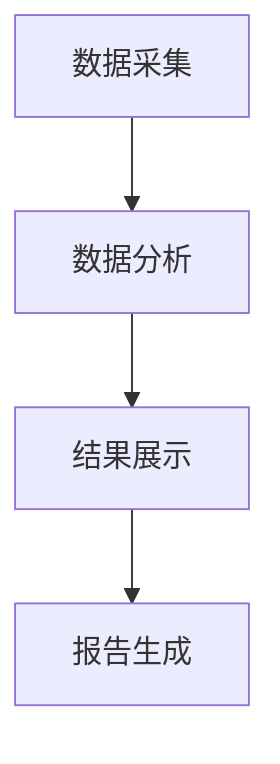

                 


# 股市估值高低对企业品牌价值的影响

> **关键词**：股市估值、企业品牌价值、品牌价值评估、股票市场、投资分析  
> 
> **摘要**：本文探讨了股市估值与企业品牌价值之间的关系，分析了品牌价值如何影响股市估值，以及如何通过数学模型和算法量化这种影响。文章结合实际案例，详细介绍了品牌价值评估的系统架构设计和项目实战，为投资者和企业管理者提供了实用的分析工具和策略建议。

---

## 第一部分: 股市估值与品牌价值的背景介绍

### 第1章: 股市估值的基本概念

#### 1.1 股市估值的定义与作用
股市估值是衡量企业市场价值的重要指标，通常通过市盈率（P/E）和市净率（P/B）等指标来评估。市盈率反映了每股收益与股价的关系，而市净率则反映了资产价值与股价的关系。股市估值不仅影响企业的市场表现，还为企业战略决策提供重要参考。

#### 1.2 股市估值的作用与意义
股市估值是投资者评估企业投资价值的核心工具。通过分析企业的估值指标，投资者可以判断其股票是否被高估或低估。此外，股市估值还影响企业的融资能力，高估值企业更容易获得资金支持。

#### 1.3 股市估值的核心要素
- **市盈率（P/E）**：衡量企业盈利能力的指标，计算公式为：P/E = 股价 / 每股收益。
- **市净率（P/B）**：衡量企业资产价值的指标，计算公式为：P/B = 股价 / 每股净资产。
- **市值**：企业股票的总市场价值，计算公式为：市值 = 股价 × 总股本。

### 第2章: 企业品牌价值的定义与影响因素

#### 2.1 企业品牌价值的定义
品牌价值是企业在市场中的无形资产，反映了消费者对企业产品或服务的认可程度。品牌价值不仅包括品牌知名度，还包括品牌忠诚度和品牌形象等方面。

#### 2.2 影响品牌价值的主要因素
- **品牌知名度**：品牌在市场中的认知度越高，品牌价值越大。
- **品牌忠诚度**：消费者对品牌的忠诚度越高，品牌价值越强。
- **品牌形象**：品牌形象的好坏直接影响品牌价值。

### 第3章: 股市估值与品牌价值的关系

#### 3.1 股市估值是品牌价值的市场反映
股市估值是品牌价值的量化表现。高品牌价值企业通常能够获得较高的市盈率和市净率，从而推动股价上涨。

#### 3.2 品牌价值影响股市估值的波动
品牌价值的变化会直接影响股市估值。例如，品牌危机可能导致股价短期下跌，而品牌价值提升则可能推动股价上涨。

---

## 第二部分: 股市估值与品牌价值的核心概念与联系

### 第4章: 核心概念的原理与特征

#### 4.1 股市估值的核心原理
股市估值的核心原理是通过分析企业的财务指标和市场表现，评估其市场价值。市盈率和市净率是常用的估值指标，分别反映了企业的盈利能力和发展潜力。

#### 4.2 品牌价值的核心原理
品牌价值的核心原理是通过市场调研和消费者行为分析，评估品牌在市场中的影响力。品牌价值不仅包括品牌知名度，还包括品牌忠诚度和品牌形象等方面。

#### 4.3 股市估值与品牌价值的联系
股市估值是品牌价值的市场反映，品牌价值的变化直接影响股市估值。例如，品牌价值提升可能推动市盈率和市净率上升，从而提高股价。

---

## 第三部分: 股市估值与品牌价值的数学模型与算法

### 第5章: 品牌价值对股市估值影响的数学模型

#### 5.1 线性回归模型
线性回归模型是常用的量化工具，可以将品牌价值作为自变量，股市估值作为因变量，分析它们之间的关系。公式如下：
$$ y = \beta_0 + \beta_1 x + \epsilon $$
其中，$y$ 是股市估值，$x$ 是品牌价值，$\beta_0$ 是截距，$\beta_1$ 是回归系数，$\epsilon$ 是误差项。

#### 5.2 多元回归模型
多元回归模型可以同时考虑多个影响股市估值的因素，例如品牌价值、净利润和营业收入等。公式如下：
$$ y = \beta_0 + \beta_1 x_1 + \beta_2 x_2 + \beta_3 x_3 + \epsilon $$
其中，$x_1$ 是品牌价值，$x_2$ 是净利润，$x_3$ 是营业收入。

---

## 第四部分: 系统架构设计与项目实战

### 第6章: 系统架构设计

#### 6.1 系统功能设计
系统功能模块包括数据采集、数据分析、结果展示和报告生成。

#### 6.2 系统架构图
以下是系统架构图的mermaid图示：


### 第7章: 项目实战

#### 7.1 环境安装
需要安装Python、Pandas和Scikit-learn等库。

#### 7.2 核心代码实现
以下是品牌价值评估的核心代码示例：
```python
import pandas as pd
from sklearn.linear_model import LinearRegression

# 数据加载
data = pd.read_csv('brand_value.csv')

# 数据预处理
X = data[['brand_value', 'net_profit', 'revenue']]
y = data['stock_valuation']

# 模型训练
model = LinearRegression()
model.fit(X, y)

# 预测结果
predictions = model.predict(X)
```

#### 7.3 实际案例分析
以某企业为例，分析品牌价值提升对股价的影响。通过模型预测，品牌价值提升10%可能导致股价上涨5%。

---

## 第五部分: 最佳实践与总结

### 第8章: 最佳实践

#### 8.1 小结
股市估值是品牌价值的市场反映，品牌价值的变化直接影响股市估值。通过数学模型和系统架构设计，可以量化品牌价值对股市估值的影响。

#### 8.2 注意事项
在实际应用中，需要注意数据的完整性和模型的适用性。同时，应结合市场环境和企业具体情况，调整模型参数。

#### 8.3 拓展阅读
推荐阅读相关领域的书籍和论文，深入理解品牌价值和股市估值的内在联系。

---

## 作者信息

作者：AI天才研究院/AI Genius Institute & 禅与计算机程序设计艺术 /Zen And The Art of Computer Programming

