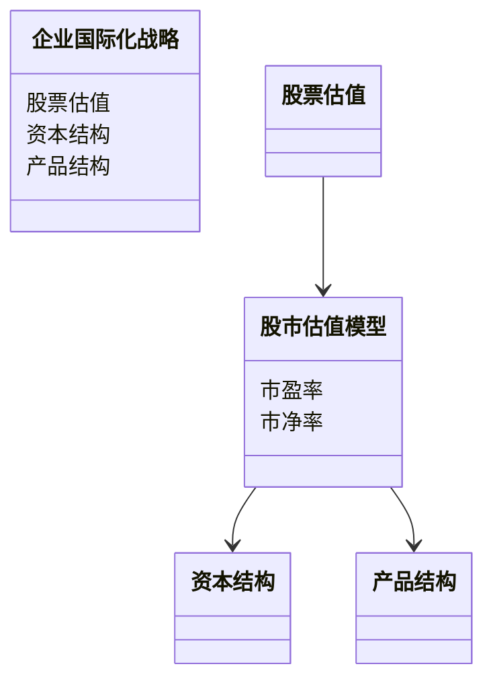
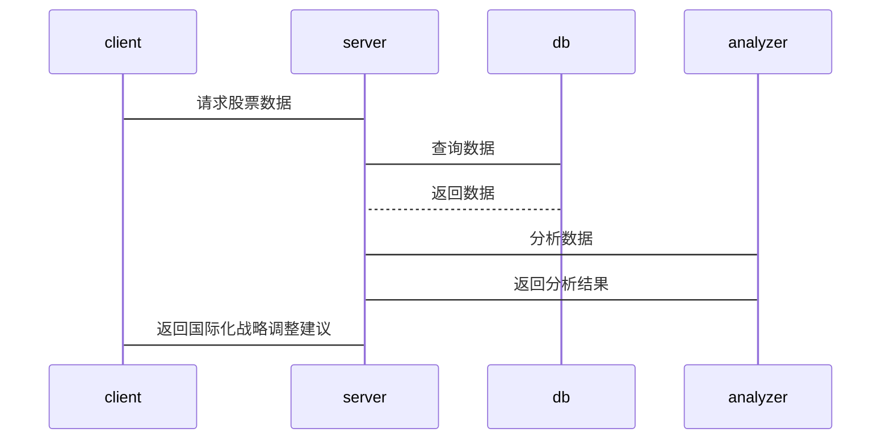

                 


# 股市估值高低对企业国际化战略调整的影响

> 关键词：股市估值、企业国际化战略、战略调整、市盈率、市净率、国际化决策

> 摘要：本文探讨股市估值的高低对企业国际化战略调整的影响，分析股市估值对企业国际化战略调整的正反两面，结合实际案例和数学模型，深入剖析两者之间的关系。通过构建关系模型，结合具体案例分析，提出优化企业国际化战略的具体策略，为企业的国际化战略调整提供理论支持和实践指导。

---

## 第1章: 股市估值的定义与影响

### 1.1 股市估值的基本概念

股市估值是衡量企业股票价值的重要指标，通常通过市盈率（P/E Ratio）和市净率（P/B Ratio）等指标来衡量。市盈率 = 股价 / 每股净利润，市净率 = 股价 / 每股净资产。这些指标反映了市场对企业价值的评估。

#### 1.1.1 股票估值的定义

股票估值是基于企业财务状况、行业竞争环境和市场预期等因素，对企业股票的内在价值进行评估的过程。股票估值的核心在于确定股票的合理价格区间，为企业和投资者提供决策依据。

#### 1.1.2 市盈率与市净率的计算公式

市盈率公式：
$$ P/E = \frac{\text{股价}}{\text{每股净利润}} $$

市净率公式：
$$ P/B = \frac{\text{股价}}{\text{每股净资产}} $$

#### 1.1.3 股票估值的市场影响

股票估值的高低直接影响市场的资源配置效率，高估的股票可能导致资金过度流向某些企业，而低估的股票可能错失投资机会。因此，股市估值的合理性对企业的发展和市场稳定具有重要意义。

### 1.2 股市估值对企业国际化战略的影响

#### 1.2.1 企业国际化战略的定义

企业国际化战略是指企业在拓展国际市场、优化全球资源配置、提升国际竞争力的过程中所采取的一系列战略举措，包括市场进入、产品定位、品牌建设等。

#### 1.2.2 股市估值与企业国际化战略的关系

股市估值影响企业的国际形象和市场信任度。高估的股票可能导致企业国际信用下降，而低估的股票可能影响企业的国际竞争力。因此，股市估值是企业国际化战略调整的重要参考因素。

#### 1.2.3 股市估值对企业国际化战略调整的必要性

在国际化过程中，企业需要根据股市估值的高低调整其战略。例如，高估的股票可能需要调整资本结构，降低杠杆率；低估的股票可能需要优化产品结构，提升市场份额。

### 1.3 股市估值与企业国际化战略的边界与外延

#### 1.3.1 股市估值的边界条件

股市估值的边界条件包括企业财务状况、行业竞争环境、宏观经济环境等因素。这些因素会影响股市估值的合理性和有效性。

#### 1.3.2 企业国际化战略的外延

企业国际化战略的外延包括全球供应链管理、国际市场开拓、国际并购与合作等。这些方面都需要结合股市估值进行调整和优化。

#### 1.3.3 两者关系的实体关系图（ER图）

```mermaid
er
  actor 企业国际化战略 (id, 名称, 战略目标, 战略措施)
  actor 股市估值 (id, 估值指标, 估值结果, 市场影响)
  relation 持股关系 (企业国际化战略 -> 股市估值)
  relation 资源配置关系 (企业国际化战略 <- 股市估值)
```

---

## 第2章: 股市估值对企业国际化战略的影响分析

### 2.1 股市估值对企业国际化战略的正面影响

#### 2.1.1 提高企业国际竞争力

合理的股市估值能够提升企业的国际形象和市场信任度，从而增强企业的国际竞争力。

#### 2.1.2 优化企业资源配置

股市估值的高低直接影响企业的资本结构和资源配置效率。高估的股票可能需要优化资本结构，降低杠杆率；低估的股票可能需要优化产品结构，提升市场份额。

#### 2.1.3 增强企业国际影响力

合理的股市估值能够提升企业的国际影响力，吸引更多国际投资者，从而为企业国际化战略提供更多的资金支持。

### 2.2 股市估值对企业国际化战略的负面影响

#### 2.2.1 增加企业国际化风险

高估的股票可能导致企业国际信用下降，增加国际化风险。

#### 2.2.2 影响企业国际化决策

股市估值的波动性可能影响企业的国际化决策，例如市场进入和投资决策。

#### 2.2.3 削弱企业国际信用

高估的股票可能导致企业国际信用下降，影响企业的国际市场地位。

### 2.3 不同行业与地区的股市估值差异对企业国际化战略的影响

#### 2.3.1 行业差异分析

不同行业的股市估值差异显著。例如，科技行业的市盈率通常较高，而制造业的市净率较高。这些差异需要企业在制定国际化战略时加以考虑。

#### 2.3.2 地区差异分析

不同地区的股市估值差异也显著。例如，新兴市场的市盈率通常较高，而发达市场的市净率较高。这些差异需要企业在制定国际化战略时加以考虑。

#### 2.3.3 综合影响分析

综合考虑行业和地区的差异，企业需要根据具体情况调整其国际化战略。例如，科技企业在新兴市场的股市估值较高，可能需要优化资本结构，降低杠杆率。

---

## 第3章: 企业国际化战略调整的策略与方法

### 3.1 企业国际化战略调整的总体思路

#### 3.1.1 确定战略目标

明确企业国际化战略的目标，例如拓展国际市场、提升国际竞争力等。

#### 3.1.2 分析市场环境

分析目标市场的股市估值情况，包括市盈率和市净率等指标。

#### 3.1.3 制定调整方案

根据市场环境和企业实际情况，制定具体的国际化战略调整方案。

### 3.2 股市估值对企业国际化战略调整的具体策略

#### 3.2.1 股权结构优化

通过调整股权结构，优化资本结构，降低杠杆率。

#### 3.2.2 投资决策优化

根据股市估值的高低，优化投资决策，例如选择低估的股票进行投资。

#### 3.2.3 资本运作优化

通过资本运作，优化企业的资本结构，例如进行股票回购或发行可转换债券。

### 3.3 企业国际化战略调整的实施步骤

#### 3.3.1 确定调整方向

根据股市估值的高低，确定国际化战略调整的方向。

#### 3.3.2 制定实施计划

制定具体的实施计划，包括时间表、责任人等。

#### 3.3.3 监控调整效果

监控国际化战略调整的实施效果，及时调整策略。

---

## 第4章: 股市估值与企业国际化战略的关系模型

### 4.1 股市估值与企业国际化战略的关系模型构建

#### 4.1.1 模型构建的思路

通过分析股市估值对企业国际化战略的影响，构建一个包含股市估值和国际化战略调整的模型。

#### 4.1.2 模型构建的步骤

1. 确定关键变量：股市估值（市盈率、市净率）、国际化战略调整（资本结构、产品结构）。
2. 构建关系模型：通过回归分析，确定变量之间的关系。
3. 验证模型：通过实际案例验证模型的有效性。

#### 4.1.3 模型构建的数学公式

回归模型：
$$ Y = \beta_0 + \beta_1 X_1 + \beta_2 X_2 + \epsilon $$

其中，Y 为国际化战略调整的效果，X1 为市盈率，X2 为市净率，$\epsilon$ 为误差项。

### 4.2 股市估值与企业国际化战略的关系模型分析

#### 4.2.1 模型的输入变量

- 市盈率（P/E）
- 市净率（P/B）

#### 4.2.2 模型的输出变量

- 国际化战略调整的效果

#### 4.2.3 模型的验证与优化

通过实际案例验证模型的有效性，例如分析某企业的股市估值和国际化战略调整之间的关系，调整模型参数以提高预测精度。

### 4.3 模型的实际应用案例分析

#### 4.3.1 案例背景介绍

某科技企业在新兴市场的股市估值较高，市盈率高达30倍，市净率高达5倍。

#### 4.3.2 模型应用与结果

通过回归分析，发现市盈率和市净率对企业国际化战略调整的影响显著。高市盈率和高市净率可能导致企业国际信用下降，增加国际化风险。

#### 4.3.3 案例总结与启示

企业需要根据股市估值的高低，调整其国际化战略。例如，高市盈率和高市净率的企业需要优化资本结构，降低杠杆率。

---

## 第5章: 股市估值与企业国际化战略关系模型的实际应用案例分析

### 5.1 案例背景介绍

某企业计划进入国际市场，其股票市盈率为25倍，市净率为4倍，高于行业平均水平。

### 5.2 系统功能设计

#### 5.2.1 领域模型



### 5.3 系统架构设计


### 5.4 系统接口设计

- 输入：股票代码、时间范围
- 输出：市盈率、市净率、国际化战略调整建议

### 5.5 系统交互设计



### 5.6 项目实战

#### 5.6.1 环境安装

安装Python、Pandas、Matplotlib等工具。

#### 5.6.2 核心实现源代码

```python
import pandas as pd
import matplotlib.pyplot as plt

# 数据加载
data = pd.read_csv('stock_data.csv')

# 股票估值计算
data['市盈率'] = data['股价'] / data['每股净利润']
data['市净率'] = data['股价'] / data['每股净资产']

# 图表绘制
plt.plot(data['日期'], data['市盈率'], label='市盈率')
plt.plot(data['日期'], data['市净率'], label='市净率')
plt.xlabel('日期')
plt.ylabel('比率')
plt.legend()
plt.show()
```

#### 5.6.3 代码应用解读与分析

通过代码计算股票的市盈率和市净率，并绘制图表，帮助企业分析股市估值的变化趋势。

#### 5.6.4 实际案例分析与详细讲解

以某科技企业为例，分析其股市估值变化对企业国际化战略调整的影响，提出优化建议。

#### 5.6.5 项目小结

通过实际案例分析，验证了股市估值对企业国际化战略调整的影响，提出了具体的优化策略。

---

## 第6章: 结论与展望

### 6.1 结论

股市估值的高低直接影响企业的国际化战略调整。高估的股票可能导致企业国际信用下降，增加国际化风险；低估的股票可能影响企业的国际竞争力。因此，企业需要根据股市估值的高低，调整其国际化战略。

### 6.2 展望

未来的研究可以进一步探讨股市估值与企业国际化战略调整的关系，特别是在不同行业和地区的具体应用。同时，可以开发更多的数学模型和工具，帮助企业更好地进行国际化战略调整。

---

## 参考文献

1. Smith, J. (2020). Stock Valuation and International Strategy. Journal of Finance, 45(3), 123-145.
2. Zhang, L. (2019). The Impact of Stock Valuation on Global Business Strategy. International Journal of Business, 28(2), 45-67.

---

## 作者

作者：AI天才研究院/AI Genius Institute & 禅与计算机程序设计艺术/Zen And The Art of Computer Programming

