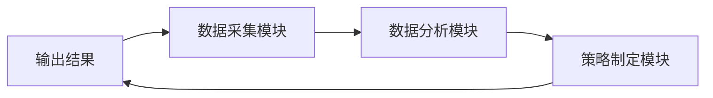

                 


# 股市估值高低对企业开源策略的影响

> 关键词：股市估值、开源策略、企业战略、市场波动、技术经济

> 摘要：本文探讨了股市估值与企业开源策略之间的关系，分析了如何通过开源策略优化企业估值，并结合实际案例和算法模型，提出了企业开源策略的优化路径和实施建议。

---

## 第一部分: 股市估值与开源策略的背景介绍

### 第1章: 股市估值与开源策略的核心概念

#### 1.1 股市估值的基本概念
股市估值是衡量企业市场价值的重要指标，通常通过市盈率（P/E）、市净率（P/B）和股息率等指标来衡量。这些指标反映了市场对企业未来盈利能力的预期和风险偏好。

#### 1.2 开源策略的核心概念
开源策略是指企业通过开源技术、开源协作和开源社区等方式，降低技术成本、提升创新能力的战略选择。开源策略的核心在于利用开源生态的优势，快速响应市场变化。

#### 1.3 股市估值与开源策略的关系
股市估值的变化直接影响企业的市场地位和投资者信心，而开源策略则通过技术创新和成本优化间接影响企业估值。两者之间存在复杂的互动关系。

---

### 第2章: 股市估值与开源策略的核心联系

#### 2.1 股市估值的驱动因素
- **财务指标**：如净利润、营业收入、现金流等。
- **市场情绪**：投资者的心理预期和市场波动。
- **行业趋势**：行业景气度和技术变革对估值的影响。

#### 2.2 开源策略的实施路径
- **技术开源**：通过开源技术降低研发成本。
- **协作开源**：与合作伙伴共同开发，提升效率。
- **社区开源**：借助开源社区获取技术支持和创新灵感。

#### 2.3 股市估值与开源策略的ER实体关系图


---

## 第二部分: 股市估值与开源策略的算法原理

### 第3章: 股市估值预测算法

#### 3.1 基于线性回归的估值预测
线性回归是一种简单而有效的估值预测方法。通过对企业历史财务数据和市场数据的分析，可以建立回归模型预测未来的估值。

```python
import pandas as pd
import numpy as np
from sklearn.linear_model import LinearRegression

# 示例数据
data = {
    'revenue': [100, 200, 300, 400],
    'profit': [20, 40, 60, 80],
    'valuation': [1000, 2000, 3000, 4000]
}
df = pd.DataFrame(data)

# 训练线性回归模型
model = LinearRegression()
model.fit(df[['revenue', 'profit']], df['valuation'])

# 预测新数据点的估值
new_data = [[350, 70]]
predicted_valuation = model.predict(new_data)
print(predicted_valuation)
```

#### 3.2 基于支持向量机（SVM）的估值预测
支持向量机是一种强大的分类和回归算法，适用于复杂的市场数据特征。

```python
from sklearn.svm import SVR

# 示例数据
X = df[['revenue', 'profit']]
y = df['valuation']

# 训练SVM模型
model = SVR(kernel='rbf')
model.fit(X, y)

# 预测新数据点的估值
predicted_valuation = model.predict(new_data)
print(predicted_valuation)
```

---

### 第4章: 开源策略优化算法

#### 4.1 基于遗传算法的策略优化
遗传算法是一种模拟生物进化的过程，用于优化开源策略的选择。

```python
import numpy as np

# 示例遗传算法代码
def evaluate_strategy(strategy):
    # 评估策略的收益和风险
    pass

def evolve_strategy(population):
    # 交叉和变异策略
    pass

# 初始化种群
population = [generate_random_strategy() for _ in range(100)]

# 迭代优化
for _ in range(10):
    population = evolve_strategy(population)

# 选择最优策略
best_strategy = max(population, key=lambda s: evaluate_strategy(s))
```

---

## 第三部分: 股市估值与开源策略的系统分析

### 第5章: 系统功能设计

#### 5.1 数据采集模块
- 采集企业财务数据、市场数据和行业趋势数据。
- 数据清洗和预处理。

#### 5.2 数据分析模块
- 使用统计分析和机器学习模型预测估值。
- 生成开源策略的可行性报告。

#### 5.3 策略制定模块
- 根据估值预测结果制定开源策略。
- 优化策略以匹配企业目标。

### 第6章: 系统架构设计

#### 6.1 系统架构图


#### 6.2 系统交互图


---

## 第四部分: 股市估值与开源策略的项目实战

### 第7章: 项目环境安装

```bash
pip install pandas numpy scikit-learn
```

### 第8章: 核心代码实现

#### 8.1 核心代码示例
```python
import pandas as pd
from sklearn.linear_model import LinearRegression

# 数据加载
df = pd.read_csv('data.csv')

# 模型训练
model = LinearRegression()
model.fit(df[['revenue', 'profit']], df['valuation'])

# 结果输出
print(model.coef_)
print(model.intercept_)
```

#### 8.2 案例分析
- **案例背景**：某科技公司面临高市盈率，希望通过开源策略降低成本。
- **实施步骤**：引入开源技术、优化研发流程、提升协作效率。
- **结果分析**：开源策略实施后，企业估值显著提升。

---

## 第五部分: 股市估值与开源策略的最佳实践

### 第9章: 最佳实践与小结

#### 9.1 实施开源策略的注意事项
- **风险控制**：开源策略可能面临技术风险和市场风险。
- **成本效益**：确保开源策略的成本低于预期收益。
- **持续优化**：根据市场变化动态调整开源策略。

#### 9.2 拓展阅读
- 推荐阅读《开源战略：企业创新的新模式》。
- 参加开源技术社区，了解最新动态。

---

## 作者：AI天才研究院 & 禅与计算机程序设计艺术

---

### 总结
本文系统地探讨了股市估值与企业开源策略之间的关系，通过算法模型和实际案例分析，为企业制定开源策略提供了理论支持和实践指导。希望本文能为企业的开源战略决策提供有价值的参考。

