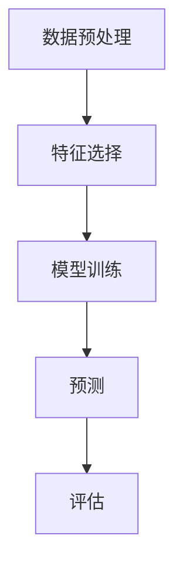

                 


# 股市估值高低对企业数字化转型投资回报的影响

> **关键词**: 股市估值、数字化转型、投资回报、企业价值、数据分析、技术架构

> **摘要**: 本文探讨了股市估值的高低对企业数字化转型投资回报的影响，通过分析股市估值的核心概念、数字化转型的实现路径以及投资回报的评估方法，结合实际案例和数学模型，揭示了两者之间的内在联系，并提出了优化企业数字化转型投资回报的策略。

---

# 第1章: 背景介绍

## 1.1 问题背景

### 1.1.1 股市估值的基本概念
股市估值是衡量企业市场价值的重要指标，主要包括市盈率（P/E）、市净率（P/B）等。市盈率反映了企业的盈利能力，市净率则衡量了资产的实际价值。

### 1.1.2 数字化转型的定义与特征
数字化转型是指企业利用数字技术（如大数据、人工智能、云计算等）重构业务模式、流程和决策方式，以提升效率和竞争力。

### 1.1.3 投资回报的核心概念
投资回报是指企业在数字化转型中的投入所产生的收益，通常以净现值（NPV）和内部收益率（IRR）来衡量。

---

## 1.2 问题描述

### 1.2.1 股市估值对企业投资决策的影响
股市估值的高低直接影响投资者对企业的信心，从而影响企业的融资能力和投资决策。

### 1.2.2 数字化转型对企业发展的重要性
数字化转型已成为企业竞争力的核心，能够显著提升企业的运营效率和市场响应能力。

### 1.2.3 投资回报与企业价值的关系
投资回报是企业价值的重要组成部分，高投资回报通常会带来更高的企业价值。

---

## 1.3 问题解决

### 1.3.1 股市估值与投资回报的关联性分析
股市估值是企业价值的外在表现，而投资回报是企业价值的内在驱动。

### 1.3.2 数字化转型如何影响企业价值
数字化转型通过提升效率、优化成本和创造新收入来源，显著提升企业价值。

### 1.3.3 投资回报的评估方法
通过净现值和内部收益率等指标，评估数字化转型的投资回报。

---

## 1.4 边界与外延

### 1.4.1 股市估值的局限性
股市估值受市场情绪和外部环境影响，可能偏离企业实际价值。

### 1.4.2 数字化转型的边界条件
数字化转型需要企业具备一定的技术基础和资金投入。

### 1.4.3 投资回报的外部影响因素
市场环境、政策法规和竞争格局等外部因素会影响投资回报。

---

## 1.5 概念结构与核心要素

### 1.5.1 股市估值的核心要素
市盈率、市净率、股息率等。

### 1.5.2 数字化转型的关键因素
技术创新、数据驱动、组织变革等。

### 1.5.3 投资回报的评估维度
净现值、内部收益率、回收期等。

---

# 第2章: 核心概念与联系

## 2.1 核心概念原理

### 2.1.1 股市估值的计算方法
市盈率 = 股价 / 每股净利润  
市净率 = 股价 / 每股净资产

### 2.1.2 数字化转型的实现路径
技术驱动、数据驱动、组织驱动。

### 2.1.3 投资回报的衡量标准
净现值（NPV）= 现金流入的现值 - 初始投资  
内部收益率（IRR）= 投资项目收益率的内插值

---

## 2.2 概念属性特征对比

| 概念         | 定义                               | 影响因素            |
|--------------|------------------------------------|---------------------|
| 股市估值     | 股票价格与企业价值的比值         | 盈利能力、资产质量  |
| 数字化转型   | 利用数字技术重构企业模式         | 技术创新、数据驱动  |
| 投资回报     | 投资项目带来的收益               | 净现值、内部收益率   |

---

## 2.3 ER实体关系图

```mermaid
er
    entity 股市估值 {
        key 股票代码
        属性 市盈率
        属性 市净率
    }
    entity 数字化转型 {
        key 企业ID
        属性 技术投入
        属性 人员配置
    }
    entity 投资回报 {
        key 项目ID
        属性 净现值
        属性 内部收益率
    }
    股市估值 --> 数字化转型 --> 投资回报
```

---

## 2.4 数学模型与公式

### 2.4.1 股市估值与企业价值的关系
$$ 企业价值 = 股票价格 \times 市盈率 $$

### 2.4.2 投资回报的预测模型
$$ NPV = \sum_{t=1}^{n} \frac{CF_t}{(1 + r)^t} $$

---

## 2.5 算法原理

### 2.5.1 线性回归模型


### 2.5.2 随机森林算法
```python
from sklearn.ensemble import RandomForestRegressor
model = RandomForestRegressor(n_estimators=100, random_state=42)
model.fit(X_train, y_train)
y_pred = model.predict(X_test)
```

---

## 2.6 系统分析与架构设计

### 2.6.1 问题场景介绍
企业希望通过数字化转型提升竞争力，但如何评估投资回报？

### 2.6.2 系统功能设计
- 数据收集模块：收集企业数字化转型数据和股市估值数据。
- 分析模块：利用回归分析和随机森林算法进行预测。
- 预测模块：输出投资回报预测结果。

### 2.6.3 系统架构设计


---

## 2.7 项目实战

### 2.7.1 环境安装
安装Python和相关库：
```bash
pip install pandas sklearn numpy
```

### 2.7.2 数据收集
收集企业的数字化转型数据和股市估值数据。

### 2.7.3 数据预处理
```python
import pandas as pd
data = pd.read_csv('data.csv')
data.dropna(inplace=True)
```

### 2.7.4 模型训练
```python
from sklearn.model_selection import train_test_split
from sklearn.metrics import mean_squared_error

X_train, X_test, y_train, y_test = train_test_split(X, y, test_size=0.2)
model.fit(X_train, y_train)
y_pred = model.predict(X_test)
print(mean_squared_error(y_test, y_pred))
```

---

## 2.8 总结

### 2.8.1 最佳实践 tips
- 选择合适的数学模型
- 确保数据质量
- 定期更新模型

### 2.8.2 小结
通过分析股市估值和数字化转型的关系，结合数学模型和算法，可以有效评估投资回报。

### 2.8.3 注意事项
- 数据的准确性和完整性
- 模型的适用性和可解释性
- 外部环境的不确定性

### 2.8.4 拓展阅读
- 《投资学基础》
- 《机器学习实战》

---

# 作者：AI天才研究院/AI Genius Institute & 禅与计算机程序设计艺术/Zen And The Art of Computer Programming

---

**[完]**

