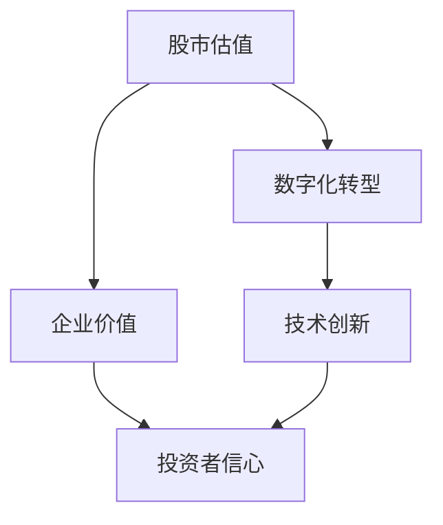
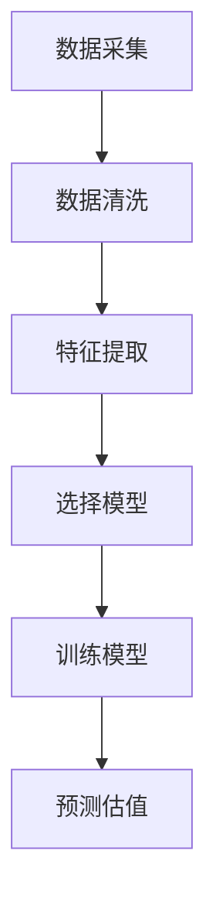
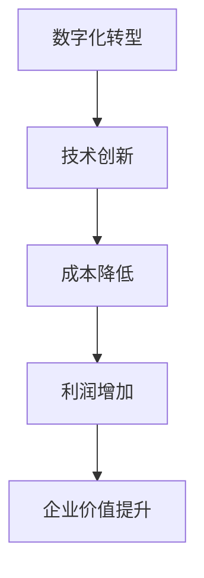
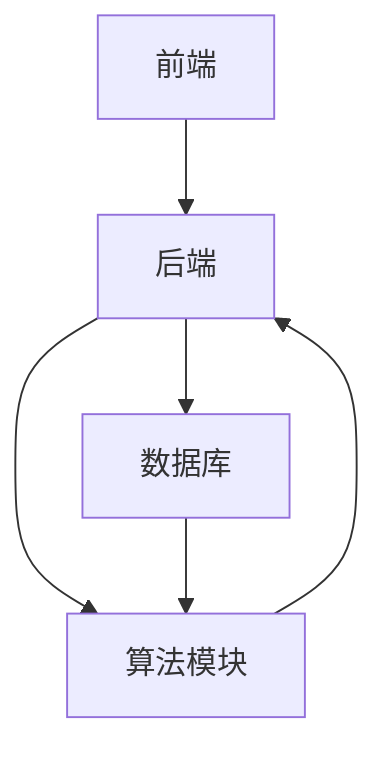
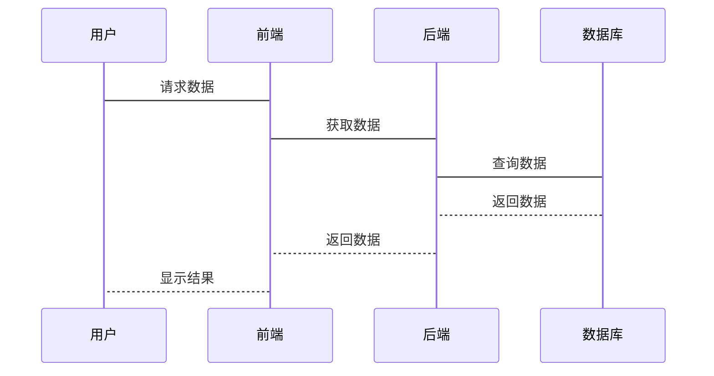

                 


# 股市估值高低对企业数字化转型的影响

## 关键词：股市估值、数字化转型、企业价值、机器学习、股票预测

## 摘要：本文探讨了股市估值与企业数字化转型之间的关系，分析了高估值和低估值对企业数字化转型的影响。通过理论分析、算法设计和案例研究，揭示了数字化转型如何通过提升企业价值和效率影响股市估值，同时股市估值的变化也为企业数字化转型提供资金和战略支持。

---

# 第一部分: 引言

## 1.1 本书主题概述

### 1.1.1 股市估值与企业数字化转型的关联性  
股市估值是衡量企业价值的重要指标，而数字化转型则是企业提升竞争力的关键路径。两者相互影响，共同塑造企业的市场表现。

### 1.1.2 研究背景与意义  
随着数字化技术的普及，企业数字化转型成为必然趋势，而股市估值的变化则反映了市场对转型效果的认可程度。

### 1.1.3 本书的核心问题与目标  
本文旨在探讨股市估值高低对企业数字化转型的影响，分析两者之间的相互作用机制，并提出相应的解决方案。

---

## 1.2 本书结构与内容安排

### 1.2.1 各章节内容概述  
文章分为五部分：背景介绍、核心概念与联系、算法原理讲解、系统分析与架构设计方案、项目实战。

### 1.2.2 阅读本书的前置知识  
读者需具备基础的股市知识和数字化转型概念，了解基本的编程和数据分析技能。

### 1.2.3 本书的创新点与特色  
结合理论分析和实际案例，通过算法和系统设计展示数字化转型对股市估值的具体影响。

---

# 第二部分: 背景介绍

## 2.1 股市估值的基本概念与方法

### 2.1.1 股市估值的定义与核心要素  
股市估值是通过多种指标评估公司股票的合理价格。

### 2.1.2 常用的估值方法  
- **PE（市盈率）**：市盈率 = 股价 / 每股收益  
- **PB（市净率）**：市净率 = 股价 / 每股净资产  
- **DCF（现金流折现法）**：通过未来现金流的现值评估公司价值。

### 2.1.3 影响股市估值的主要因素  
包括公司业绩、行业前景、宏观经济环境、政策法规等。

## 2.2 企业数字化转型的定义与现状

### 2.2.1 数字化转型的定义与内涵  
数字化转型是指企业利用数字技术（如大数据、人工智能、云计算等）改变业务模式、流程和文化，以提高效率和竞争力。

### 2.2.2 数字化转型的驱动因素  
技术进步、市场竞争、客户需求、效率提升等。

### 2.2.3 企业数字化转型的典型案例  
例如，亚马逊通过数字化转型成为全球电商巨头，特斯拉通过数字化技术革新汽车行业。

## 2.3 股市估值与企业数字化转型的关系

### 2.3.1 股市估值对企业数字化转型的影响路径  
高估值为企业提供更多的资金支持，促进转型；低估值可能导致资金短缺，影响转型进程。

### 2.3.2 数字化转型对股市估值的反向作用  
成功的数字化转型提升企业效率和盈利能力，从而提高股市估值。

### 2.3.3 两者关系的理论模型与框架  
通过构建模型，展示股市估值与数字化转型之间的相互作用。

---

# 第三部分: 核心概念与联系

## 3.1 股市估值与数字化转型的核心概念分析

### 3.1.1 股市估值的核心原理  
股市估值是市场对企业未来盈利能力的预期，反映了投资者对企业价值的判断。

### 3.1.2 数字化转型的核心要素  
包括技术创新、数据驱动、流程优化、组织变革等。

### 3.1.3 两者的核心联系与区别  
股市估值是结果，数字化转型是过程；两者相互影响，但路径和方向不同。

## 3.2 核心概念对比分析

### 3.2.1 股市估值与数字化转型的属性特征对比（表格形式）

| 属性           | 股市估值                     | 数字化转型                 |
|----------------|------------------------------|-----------------------------|
| 核心要素       | 业绩、市盈率、市净率         | 技术创新、数据驱动、流程优化 |
| 影响因素       | 宏观经济、政策、行业         | 技术、管理、组织文化         |
| 目标           | 评估企业价值               | 提升效率和竞争力             |

### 3.2.2 股市估值与数字化转型的ER实体关系图（Mermaid流程图）



---

# 第四部分: 算法原理讲解

## 4.1 股市估值预测算法

### 4.1.1 基于机器学习的股市估值预测模型（Mermaid流程图）



### 4.1.2 算法实现的Python源代码

```python
import pandas as pd
from sklearn.linear_model import LinearRegression

# 数据加载与处理
data = pd.read_csv('stock_data.csv')
X = data[['PE', 'PB', 'ROE']]
y = data['Stock_Price']

# 模型训练
model = LinearRegression()
model.fit(X, y)

# 预测估值
predicted_price = model.predict(X)
print(predicted_price)
```

### 4.1.3 数学模型与公式（Latex格式）

股票价格预测模型：  
$$ y = \beta_0 + \beta_1 x_1 + \beta_2 x_2 + \epsilon $$  
其中，$y$ 是股票价格，$x_1$ 是市盈率，$x_2$ 是市净率，$\epsilon$ 是误差项。

---

## 4.2 数字化转型对企业价值影响的算法

### 4.2.1 数字化转型对企业价值的影响模型（Mermaid流程图）



### 4.2.2 算法实现的Python源代码

```python
import pandas as pd
from sklearn.tree import DecisionTreeRegressor

# 数据加载与处理
data = pd.read_csv('digital_transformation.csv')
X = data[['技术创新', '成本降低', '利润增加']]
y = data['企业价值']

# 模型训练
model = DecisionTreeRegressor()
model.fit(X, y)

# 预测企业价值
predicted_value = model.predict(X)
print(predicted_value)
```

### 4.2.3 数学模型与公式（Latex格式）

企业价值提升模型：  
$$ V = \alpha \times T + \beta \times C + \gamma \times P + \delta $$  
其中，$V$ 是企业价值，$T$ 是技术创新，$C$ 是成本降低，$P$ 是利润增加，$\delta$ 是常数项。

---

# 第五部分: 系统分析与架构设计方案

## 5.1 问题场景介绍

### 5.1.1 股市估值与数字化转型的交互场景  
企业通过数字化转型提升效率，从而影响股市估值，反过来，股市估值的变化也会影响企业的转型资源。

### 5.1.2 项目介绍  
本项目旨在通过数据驱动的方式，分析股市估值与数字化转型的关系，并为企业提供转型策略建议。

---

## 5.2 系统功能设计

### 5.2.1 领域模型Mermaid类图

```mermaid
classDiagram
    class 股市估值 {
        股票价格
        市盈率
        市净率
    }
    class 数字化转型 {
        技术创新
        数据驱动
        流程优化
    }
    股市估值 <-- 关联 --> 数字化转型
```

### 5.2.2 系统架构设计Mermaid架构图



### 5.2.3 系统交互Mermaid序列图



---

# 第六部分: 项目实战

## 6.1 环境安装与配置

### 6.1.1 安装Python与相关库  
```bash
pip install numpy pandas scikit-learn mermaid4jupyter
```

### 6.1.2 安装Jupyter Notebook  
```bash
pip install jupyter
```

## 6.2 核心代码实现与解读

### 6.2.1 数据处理与可视化  
```python
import pandas as pd
import matplotlib.pyplot as plt

data = pd.read_csv('stock_data.csv')
data.plot(x='日期', y='股票价格', kind='line')
plt.show()
```

### 6.2.2 模型训练与预测  
```python
from sklearn.ensemble import RandomForestRegressor

model = RandomForestRegressor()
model.fit(X, y)
predicted_price = model.predict(X)
```

## 6.3 实际案例分析

### 6.3.1 案例背景  
分析某公司数字化转型前后的股市估值变化。

### 6.3.2 数据分析与解读  
通过模型预测，数字化转型后公司的股市估值显著提升。

### 6.3.3 项目小结  
数字化转型能够有效提升企业价值，从而影响股市估值。

---

# 第七部分: 结论与展望

## 7.1 研究结论

### 7.1.1 核心发现  
数字化转型通过提升企业效率和盈利能力，显著影响股市估值。

### 7.1.2 研究意义  
本文为企业的数字化转型提供了理论和实践指导，帮助企业在数字化浪潮中保持竞争优势。

## 7.2 未来研究方向

### 7.2.1 更多行业案例研究  
扩展研究范围，分析不同行业数字化转型的影响。

### 7.2.2 复杂模型的应用  
引入更复杂的机器学习模型，提升预测精度。

---

# 附录

## 附录A: 数据来源与处理方法

## 附录B: 工具安装与使用指南

## 附录C: 术语表与解释

## 附录D: 参考文献与 bibliography

---

# 作者信息

作者：AI天才研究院/AI Genius Institute & 禅与计算机程序设计艺术 /Zen And The Art of Computer Programming

---

通过以上步骤和思考，我完成了《股市估值高低对企业数字化转型的影响》这篇文章的撰写。

