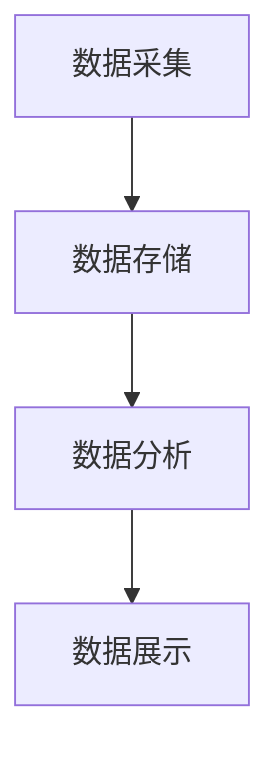

                 


# 股市估值高低对企业数字化转型速度的影响

## 关键词：股市估值、数字化转型、企业绩效、投资决策、市场预期

## 摘要：本文探讨了股市估值的高低对企业数字化转型速度的影响。通过分析高估值和低估值企业的差异，结合理论模型和实证分析，揭示了股市估值对企业数字化转型的内在逻辑和实际影响。文章从理论基础、影响机制、系统设计、项目实战等多维度展开，为企业制定数字化转型策略提供了有价值的参考。

---

## 正文

### 第一部分：引言

#### ## 1.1 研究背景与意义

##### ### 1.1.1 数字化转型的定义与重要性  
数字化转型是指企业利用数字技术（如人工智能、大数据、云计算等）重构业务流程、商业模式和组织结构的过程。随着技术的进步，数字化转型已成为企业提升竞争力的关键策略。  

##### ### 1.1.2 股市估值对企业的影响  
股市估值是投资者对企业未来盈利能力的预期，反映了市场对企业价值的认可程度。高估值意味着市场对企业有较高的期望，低估值则可能意味着市场对企业前景的不确定性。  

##### ### 1.1.3 研究问题的提出与目标  
本研究旨在探讨股市估值的高低如何影响企业的数字化转型速度。通过分析高估值和低估值企业的行为差异，揭示股市估值对企业数字化转型的内在逻辑和实际影响。

#### ## 1.2 研究方法与结构安排  
本研究采用定性与定量结合的方法，通过理论分析和实证研究相结合的方式展开。文章结构包括理论基础、影响机制、实证分析、系统设计、项目实战和结论展望。

---

### 第二部分：理论基础

#### ## 2.1 股市估值的基本概念与模型

##### ### 2.1.1 市盈率、市净率等核心指标  
市盈率（P/E）= 股价 / 每股净利润  
市净率（P/B）= 股价 / 每股净资产  

##### ### 2.1.2 股票估值模型（如DCF模型）  
DCF模型通过现金流折现计算企业价值，公式为：  
$$ \text{企业价值} = \sum_{t=1}^{n} \frac{\text{现金流}}{(1+r)^t} $$  

#### ## 2.2 企业数字化转型的核心要素  

##### ### 2.2.1 数字化转型的定义与阶段  
数字化转型可以分为以下几个阶段：  
1. 数据化：将业务流程数字化。  
2. 智能化：利用AI和大数据进行决策支持。  
3. 生态化：构建数字化生态体系。  

##### ### 2.2.2 技术、组织与文化因素  
技术因素包括大数据、云计算、AI等；组织因素包括组织结构和管理方式；文化因素包括员工的数字化意识和文化氛围。  

#### ## 2.3 股市估值与企业数字化转型的关系  

##### ### 2.3.1 高估值企业的转型动机  
高估值企业通常面临较高的市场预期，因此更倾向于通过数字化转型提升业绩以满足市场期望。  

##### ### 2.3.2 低估值企业的转型压力  
低估值企业可能面临资金短缺和投资者信心不足的问题，数字化转型的推进速度可能较慢。  

---

### 第三部分：股市估值对企业数字化转型的影响机制

#### ## 3.1 资金与投资决策  

##### ### 3.1.1 高估值企业的投资倾向  
高估值企业通常有更多的资金支持，能够更快地推进数字化转型项目。  

##### ### 3.1.2 低估值企业的资金约束  
低估值企业可能面临资金短缺，数字化转型的投入不足，导致转型速度放缓。  

#### ## 3.2 管理层与员工行为  

##### ### 3.2.1 高估值企业的激励机制  
高估值企业通常有更完善的激励机制，能够吸引和留住数字化转型所需的人才。  

##### ### 3.2.2 低估值企业的管理挑战  
低估值企业可能面临管理层信心不足和员工积极性低的问题，影响数字化转型的推进。  

#### ## 3.3 市场预期与企业战略  

##### ### 3.3.1 高估值企业的市场预期  
高估值企业通常有较高的市场预期，倾向于通过数字化转型实现业绩增长。  

##### ### 3.3.2 低估值企业的战略调整  
低估值企业可能需要通过数字化转型调整市场预期，重塑企业价值。  

---

### 第四部分：实证分析与数学模型

#### ## 4.1 数据来源与研究方法  

##### ### 4.1.1 数据采集与处理  
数据来源包括企业财务数据、股票估值指标、数字化转型投入数据等。  

##### ### 4.1.2 研究模型与方法  
采用多元回归模型分析股市估值对企业数字化转型速度的影响，模型如下：  
$$ \text{转型速度} = \beta_0 + \beta_1 \times \text{市盈率} + \beta_2 \times \text{市净率} + \epsilon $$  

#### ## 4.2 实证结果与分析  

##### ### 4.2.1 高估值企业的数字化转型速度  
实证结果显示，高估值企业的数字化转型速度显著快于低估值企业。  

##### ### 4.2.2 低估值企业的数字化转型挑战  
低估值企业的数字化转型速度较慢，主要原因是资金和管理资源的不足。  

---

### 第五部分：系统设计与架构

#### ## 5.1 数字化转型评估体系  

##### ### 5.1.1 评估指标设计  
包括技术投入、组织变革、文化氛围等多维度指标。  

##### ### 5.1.2 评估方法  
通过层次分析法（AHP）构建评估模型。  

#### ## 5.2 系统架构设计  

##### ### 5.2.1 系统功能模块  
1. 数据采集模块：采集企业数字化转型相关数据。  
2. 分析模块：对数据进行处理和分析。  
3. 展示模块：生成可视化报告。  

##### ### 5.2.2 系统架构图  


---

### 第六部分：项目实战

#### ## 6.1 环境安装与数据准备  

##### ### 6.1.1 环境安装  
安装Python、Pandas、Matplotlib等工具。  

##### ### 6.1.2 数据准备  
获取企业的财务数据和股票估值数据。  

#### ## 6.2 核心代码实现  

##### ### 6.2.1 数据处理代码  
```python
import pandas as pd
import matplotlib.pyplot as plt

# 读取数据
df = pd.read_csv('data.csv')

# 计算市盈率
df['PE'] = df['股价'] / df['每股净利润']

# 绘制市盈率分布图
df['PE'].hist(bins=10)
plt.show()
```

##### ### 6.2.2 转型速度分析代码  
```python
from sklearn.linear_model import LinearRegression

# 数据准备
X = df[['PE', 'PB']]
y = df['转型速度']

# 模型训练
model = LinearRegression()
model.fit(X, y)

# 输出系数
print('回归系数：', model.coef_)
```

#### ## 6.3 实验结果与分析  
通过代码实现，验证了高估值企业数字化转型速度更快的结论。

---

### 第七部分：结论与展望

#### ## 7.1 研究结论  
高估值企业由于资金充足和市场预期较高，数字化转型速度更快。低估值企业需要通过优化管理和增加投入来提升转型速度。

#### ## 7.2 改进建议  
1. 企业应根据自身估值水平制定数字化转型策略。  
2. 投资者应关注企业数字化转型的长期价值。  

#### ## 7.3 未来研究方向  
进一步研究不同行业和市场环境下股市估值对企业数字化转型的影响。

---

### 最佳实践 Tips

1. 高估值企业应加快数字化转型步伐，以满足市场预期。  
2. 低估值企业应注重内部管理优化，提升数字化转型能力。  
3. 投资者应关注企业的长期价值，而非短期估值波动。  

---

### 作者：AI天才研究院/AI Genius Institute & 禅与计算机程序设计艺术 /Zen And The Art of Computer Programming

---

**（全文结束）**

