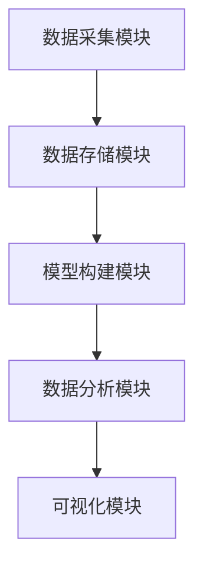

                 


# 股市估值高低对企业数字孪生技术应用的影响

## 关键词：股市估值、数字孪生技术、企业价值、数据驱动决策、算法优化

## 摘要：  
本文探讨了股市估值与企业数字孪生技术应用之间的关系。通过分析数字孪生技术如何影响企业运营效率、创新能力和抗风险能力，进而影响企业价值和股市估值。文章结合理论与实践，从算法原理、系统架构到项目案例，全面解析数字孪生技术在企业中的应用价值，并为读者提供深入的见解和实用建议。

---

## 第1章: 股市估值的基本概念与影响因素

### 1.1 股市估值的定义与计算方法

股市估值是衡量企业市场价值的重要指标，通常通过市盈率（P/E）、市净率（P/B）、EV/EBITDA等指标来评估。股市估值的高低反映了市场对企业的信心和对其未来盈利能力的预期。  

**市盈率公式：**  
$$P/E = \frac{\text{股价}}{\text{每股收益}}$$  

**市净率公式：**  
$$P/B = \frac{\text{股价}}{\text{每股净资产}}$$  

### 1.2 数字孪生技术的定义与应用领域

数字孪生技术是一种通过数字模型实时模拟物理系统的技术，广泛应用于制造业、医疗、能源等领域。其核心在于通过数据驱动的方式，实现对物理世界的精准模拟和优化。  

**数字孪生技术的特点：**  
- **实时性**：基于实时数据进行建模和分析。  
- **交互性**：用户可以通过数字模型与物理系统进行互动。  
- **预测性**：通过数据建模和算法优化，预测系统行为和趋势。  

### 1.3 影响股市估值的主要因素

股市估值受多种因素影响，包括企业财务状况、行业竞争环境、宏观经济政策等。其中，企业的技术创新能力和运营效率是影响估值的重要因素。数字孪生技术作为一种新兴技术，正在成为提升企业竞争力的关键工具。

---

## 第2章: 数字孪生技术对企业运营的影响

### 2.1 数字孪生技术对企业效率的提升

数字孪生技术通过实时数据采集和分析，帮助企业优化资源配置，降低运营成本。例如，在制造业中，数字孪生技术可以实时监控生产线运行状态，预测设备故障，从而减少停机时间。

**数据采集与处理流程：**  
1. 传感器采集物理系统数据。  
2. 数据清洗与预处理。  
3. 数据特征提取与建模。  

### 2.2 数字孪生技术对企业创新的推动

数字孪生技术为企业提供了创新的工具和平台。例如，在产品设计中，数字孪生技术可以模拟产品的生命周期，帮助企业在设计阶段发现问题并进行优化。

**数字孪生在产品设计中的应用：**  
1. 通过数字模型进行产品原型设计。  
2. 通过模拟测试优化产品性能。  
3. 通过数据反馈指导产品迭代。  

---

## 第3章: 数字孪生技术与企业价值的关系

### 3.1 数字孪生技术对企业价值的直接影响

数字孪生技术通过提升企业运营效率、降低成本和提高产品质量，直接提升了企业的盈利能力。例如，通过数字孪生技术优化供应链管理，可以降低库存成本，提高交付效率。

**企业价值提升的数学模型：**  
$$\text{企业价值} = f(\text{运营效率}, \text{成本控制}, \text{产品质量})$$  

### 3.2 数字孪生技术对企业市场价值的间接影响

数字孪生技术通过提升企业创新能力和抗风险能力，增强了市场对企业的信心。例如，在金融市场上，数字孪生技术的应用可以提升企业的透明度，增强投资者对企业的信任。

**企业市场竞争力的提升：**  
- 通过数字孪生技术实现精准营销。  
- 通过数字孪生技术优化客户服务。  
- 通过数字孪生技术提升品牌影响力。  

---

## 第4章: 数字孪生技术的算法原理与数学模型

### 4.1 数据采集与处理算法

数字孪生技术的核心在于数据的采集与处理。通过传感器、数据库等工具，采集物理系统的实时数据，并通过数据清洗和特征提取，为后续建模提供高质量的数据支持。

**数据清洗算法：**  
1. 去除异常值。  
2. 填补缺失值。  
3. 标准化数据。  

### 4.2 数字孪生模型构建

数字孪生模型的构建需要结合领域知识和数据驱动的方法。通过机器学习算法，构建能够实时反映物理系统状态的数字模型。

**机器学习模型选择：**  
- **监督学习**：用于预测系统行为。  
- **无监督学习**：用于发现数据中的隐含模式。  
- **强化学习**：用于优化系统决策。  

---

## 第5章: 数字孪生系统的架构设计与实现

### 5.1 系统架构设计

数字孪生系统通常包括数据采集模块、模型构建模块、数据分析模块和可视化模块。  

**系统架构图：**  


### 5.2 系统功能设计

数字孪生系统的功能设计需要结合企业的实际需求。例如，制造业中的数字孪生系统需要支持设备监控、生产优化和质量控制等功能。

**系统功能模块：**  
- **数据采集模块**：负责采集物理系统的实时数据。  
- **模型构建模块**：负责构建数字孪生模型。  
- **数据分析模块**：负责对数据进行分析和预测。  
- **可视化模块**：负责将分析结果以可视化的方式呈现给用户。  

---

## 第6章: 项目实战与案例分析

### 6.1 项目背景与目标

假设我们正在为一家制造企业设计一个数字孪生系统，目标是通过实时监控生产线运行状态，优化生产流程，降低生产成本。

### 6.2 环境安装与配置

#### 6.2.1 数据采集工具安装  
- 使用Python的`paho-mqtt`库连接物联网设备。  
- 安装`paho-mqtt`：  
  ```bash
  pip install paho-mqtt
  ```

#### 6.2.2 数据分析工具安装  
- 使用`scikit-learn`进行机器学习建模。  
- 安装`scikit-learn`：  
  ```bash
  pip install scikit-learn
  ```

### 6.3 核心代码实现

#### 数据采集模块代码示例：  
```python
import paho.mqtt.client as mqtt

def on_connect(client, userdata, flags, rc):
    print("Connected with result code " + str(rc))
    client.subscribe("生产线/设备1/状态")

def on_message(client, userdata, msg):
    print("收到数据：" + msg.payload.decode())

client = mqtt.Client()
client.on_connect = on_connect
client.on_message = on_message

client.connect("localhost", 1883, 60)
client.loop_forever()
```

#### 数据分析模块代码示例：  
```python
from sklearn.ensemble import RandomForestRegressor
import pandas as pd

# 加载数据
data = pd.read_csv("生产线数据.csv")

# 特征工程
features = data.drop('故障率', axis=1)
target = data['故障率']

# 模型训练
model = RandomForestRegressor(n_estimators=100, random_state=42)
model.fit(features, target)

# 预测
new_data = features.iloc[-1].values.reshape(1, -1)
print("预测故障率：", model.predict(new_data)[0])
```

### 6.4 项目小结

通过数字孪生技术的应用，企业可以实时监控生产线运行状态，预测设备故障，优化生产流程，从而降低生产成本，提高生产效率。

---

## 第7章: 总结与展望

### 7.1 总结

数字孪生技术作为一种新兴的技术工具，正在帮助企业提升运营效率、创新能力和抗风险能力，进而影响企业的价值和股市估值。通过数据驱动的决策和算法优化，企业可以更好地应对市场变化，实现可持续发展。

### 7.2 展望

未来，随着人工智能和大数据技术的进一步发展，数字孪生技术将在更多领域得到应用。例如，在金融领域，数字孪生技术可以用于实时监控企业运营状态，为投资者提供更准确的估值依据。

---

## 作者信息

**作者：AI天才研究院（AI Genius Institute） & 禅与计算机程序设计艺术（Zen And The Art of Computer Programming）**  

---

**注意事项：**  
- 本文仅为技术博客文章，不构成投资建议。股市估值受多种因素影响，读者需结合实际情况进行判断。  
- 数字孪生技术的应用需要结合企业实际需求，选择合适的技术方案和工具。

